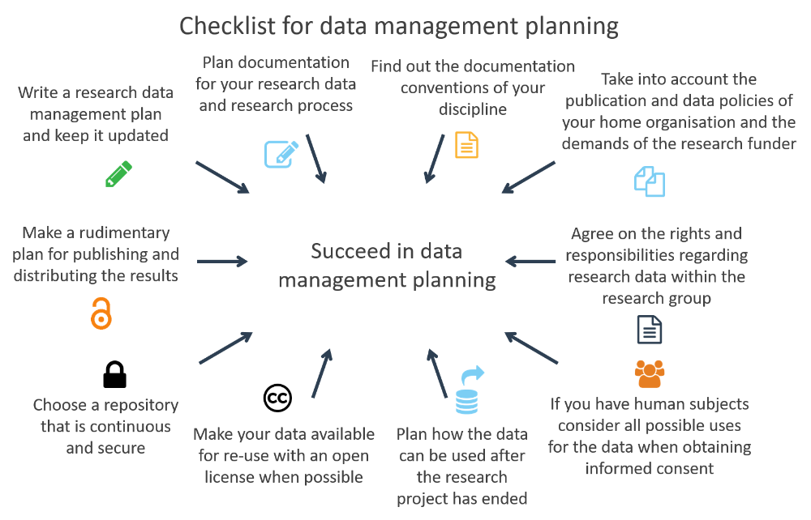

# Tips for Data Management

## Overview

Good research data management (RDM) is the basis of successful research. RDM covers the whole life-cycle of data from data creation or collecting, to managing and organizing data during the project, publishing and digital preservation after the active phase of a project. Its purpose is to ensure the reproducibility of research, which is the fundamental prerequisite of all scientific research. Good data management throughout the data life-cycle is crucial for facilitating data sharing and ensuring the sustainability and accessibility of data in the long-term and therefore their re-use for future science.

!!! note "FAIR principles"
    According to the [FAIR principles](https://www.go-fair.org/fair-principles/), the data should be 
    
    - Findable
    - Accessible
    - Interoperable
    - Re-usable
    
    [Get to know the principles with this video](https://youtu.be/K-kEvfaUJdA)
   
   
## Best practices

Below are some guidelines for good data management practices. By browsing the data management pages, you can find instructions for example for 
choosing data formats, licensing, persistent identifiers and handling sensitive data.

License: CC BY 4.0
 
### Maintain a data management plan

Make a clear plan for managing your data. A data management plan (DMP for short) is a document that describes how you will treat your data during a project and what happens with the data after the project ends. It should cover all stages of data life cycle from discovery, collection, organization, use, to data sharing and preservation. Most funding agencies require a data management plan when funding has been granted, and the DMP should be seen as a quality assurance tool that helps to ensure the reproducibility of your research as well as the interoperability and reusability of the data.

### Keep raw data raw

Data should be kept in its raw form whenever possible to enable transparency and facilitate reanalysis. It also assists in combining multiple data sources. It might be worthwhile to provide both unprocessed and processed versions of your data, with either code or explanations for deriving the latter.

### Create analysis-friendly data

To take full advantage of data, it should be structured in a way that makes use, interpretation and analysis easy. Considering what data you will need to use, when and how, helps you in creating analysis-friendly data, for you and potentially for others. One possible structure stores each variable as a column, each observation as a row and each type of observational unit as a table.

### Perform quality control

Data, just like other research outputs, should undergo some level of quality control. Quality control makes it easier to analyse your own data and is vital if you intend to share your data with others. You can start with some basic sanity checks, e.g. verifying there are no non-numeric values in otherwise numeric data and checking consistency in the units of measurement and naming schemes.

### Use standard, open data formats

Every researcher has their own favorite tools for storing and analysing data. To make your data easy to use it is best to store it in a standard and open [file format](metadata-and-documentation.md#files-and-file-formats) which can be used by various software and remains accessible over time (e.g. CSV, XML). These types of data formats are also good candidates for the digital preservation of data.

### Use good variable names and null values

Be consistent when naming variables and record enough information in order to make the definitions of both the variables and their values clear. Follow the practices within your research community for naming variables e.g. using full taxonomic names. Many datasets also contain missing or empty data values which should be carefully marked (e.g. NaN) so they are distinguishable from true zeros.

### Document your data processing

Remember to record and report how your research data is analysed and processed. This is essential for both reproducibility and assessment of research quality. Lack of good [data documentation](metadata-and-documentation.md#data-documentation-also-called-detailed-descriptive-metadata-or-data-level-metadata) often leads to data loss. To keep [data and documentation well-organized](metadata-and-documentation.md#data-organization) you should also have a version control (manual or automatic) system in use. 

### Reproducibility

Reproducibility is an important part of providing evidence of the correctness of research results. Other researchers should be able to inspect the workflow and evaluate all of the steps that have been taken during the analysis and repeat them. Reproducibility is defined as the possibility to obtain consistent results using the same data and code as the original study (computational reproducibility). Replicability means obtaining consistent results across studies aimed at answering the same scientific question using new data or other new computational methods. In this case new data is collected or created. [Documenting and sharing](metadata-and-documentation.md#versioning) research software and workflows are crucial elements of reproducibility.

### Provide metadata

[Metadata](metadata-and-documentation.md#metadata-types) is contextual information about the data and its provenance, necessary for interpreting the data. Providing metadata enables you, and others interested in extending your work, to return to it later. Providing comprehensive metadata according to your discipline's conventions makes your data discoverable and reusable.

### Get identifiers for your data

Data used in research and publications should be uniquely identifiable. Make sure the data repository you use provides your data with a [persistent identifier](publishing-datasets.md#persistent-identifiers) (e.g. DOI, URN). Use your dataset's identifier when sharing it and using it so it collects data citations for you.

### Take care of storage

[Deposit your data](publishing-datasets.md#where-to-host-and-publish-datasets) in a well-established repository provided by a trusted party to ensure that your data is safely stored. Take note of the data policy of your organization and the requirements from funding bodies and journals. Consider where other researchers in your community are storing their data, what services the repositories provide and what needs you have in terms of e.g. storage quota and of data openness.

### Open your data

Data sharing is increasingly required by funding agencies and journals as it benefits the scientific community at large. It is also beneficial for data collectors as it is associated with increased visibility, collaboration and credit. You should consider sharing your data so that others can access and cite it. Equip your data with an established [license](publishing-datasets.md#licensing-rights) (e.g. Creative Commons licenses) so the others know what they can and cannot do with the data.

!!! note "Additional readings and resources on data management"
    - [Data management checklist](https://www.fairdata.fi/en/why-fairdata/data-management-checklist/) on the [Fairdata.fi](http://fairdata.fi/) website
    - The Finnish Social Science Data Archive's [Data Management Guidelines](http://www.fsd.uta.fi/aineistonhallinta/en/)
    - The Academy of Finland [Open Science pages](https://www.aka.fi/en/research-funding/responsible-science/open-science/)
    - The ELIXIR Research Data Management Kit, [RDMkit](https://rdmkit.elixir-europe.org/), is an online guide containing good data management practices throughout the data life cycle
    - [FAIRsharing.org](https://fairsharing.org/) A curated, informative and educational resource on data and metadata standards, interrelated to databases and data policies.
    - [CSC's videos on Research Data Management](https://video.csc.fi/playlist/details/0_xtsuml9w)  

## Budgeting Research Data Management

The processes of data management may incur costs. Researchers should plan to address these costs and the allocation of resources in the early planning phases of the project. The majority of funders accept data management as a legitimate cost that can and should be accounted for in the project budget.

Estimate the resources needed to manage, share and preserve the data. Consider the additional computational facilities and resources that need to be accessed.

Budgeting and costing for your project is often dependent upon institutional resources, services, and policies. Remember to consult your organisation’s data support office.

!!! note "Examples of possible data management costs"
    
    - Will there be costs involved in storing the data? Will you need additional server space or tailored solutions?
    - Are you planning to use commercial services for example for anonymising data, transcribing audio material, or using an electronic laboratory notebook?
    - Will you need additional paid help for organising and documenting data; are your data files, sheets etc. stored in uniform format and clearly named and well organised and understandable? Higher costs will apply if organising data has been neglected during the project. 
    - When you archive and open data, will there be costs involved?

Read more about [CSC free-of-charge use cases and pricing](https://research.csc.fi/pricing-and-resources).

## How to manage sensitive data

The EU General Data Protection Regulation (GDPR) outlines the principles on sensitive data processing, without giving exact technical details on how to process sensitive data. You can learn about sensitive data more from [CSC's definition of sensitive data](https://research.csc.fi/en/definition-of-sensitive-data). At this point only certain basic rules regarding sensitive personal data are highlighted.

  1. Minimize the data. This means that you should only process the data that is absolutely needed. 
  2. Anonymize or pseudonymizse the data whenever possible. 
  3. Encrypt the data.
  4. Destroy the data you do not need. 

Remember to identify and name a
  - **Data Controller** (e.g. the Principal Investigator alone or together with another person or legal entity), who determines the means and procedures for processing the data, meaning that they control how data is processed and for what purposes.
  - **Data Processor**, who processes the data on behalf of the controller. 

!!! note "Additional information on sensitive data management"
    - [CSC's Sensitive Data Services for Research](https://research.csc.fi/sensitive-data)
    - [Managing sensitive data](https://research.csc.fi/en/managing-sensitive-data)
    - [User Guide for Sensitive Data Services for Research](../sensitive-data/index.md)
    - [Tools for client side encryption for Allas](../Allas/allas_encryption.md)

<iframe allow="autoplay; encrypted-media" allowfullscreen="" frameborder="0" height="315" srcdoc="https://www.youtube.com/embed/29XmiG5Zj0s" title="Webinar: What are the policies and possibilities for managing your sensitive data?" width="560"></iframe>

**Sources for this best practice review**

Goodman, A., Pepe, A., Blocker, et. al. (2014). Ten Simple Rules for the Care and Feeding of Scientific Data. PLoS Computational Biology, 10(4), e1003542. [http://doi.org/10.1371/journal.pcbi.1003542](http://doi.org/10.1371/journal.pcbi.1003542)

Griffin PC, Khadake J, LeMay KS et al. Best practice data life cycle approaches for the life sciences [version 2; peer review: 2 approved]. F1000Research 2018, 6:1618 [https://doi.org/10.12688/f1000research.12344.2](https://doi.org/10.12688/f1000research.12344.2)

Hart, E. M., Barmby, P., LeBauer, D., et al. (2016). Ten Simple Rules for Digital Data Storage. PLoS Computational Biology, 12(10), e1005097. [http://doi.org/10.1371/journal.pcbi.1005097](http://doi.org/10.1371/journal.pcbi.1005097)

Wilkinson, M., Dumontier, M., Aalbersberg, I. et al. The FAIR Guiding Principles for scientific data management and stewardship. Sci Data 3, 160018 (2016). [https://doi.org/10.1038/sdata.2016.18](https://doi.org/10.1038/sdata.2016.18)

Wilson, G., Bryan, J., Cranston, K., Kitzes, J., Nederbragt, L., & Teal, T. K. (2017). Good enough practices in scientific computing. PLoS Computational Biology, 13(6), e1005510. [http://doi.org/10.1371/journal.pcbi.1005510](http://doi.org/10.1371/journal.pcbi.1005510)
