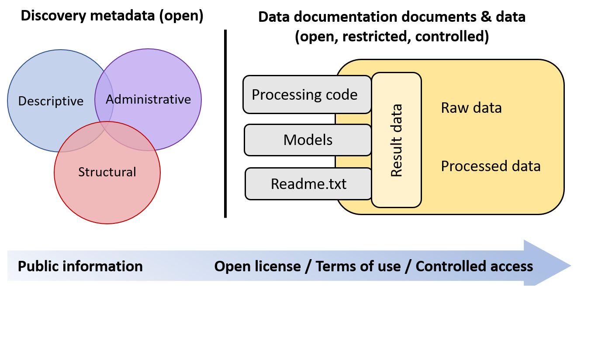

# Metadata and Data Documentation {#metadata-and-data-documentation}

## Yleiskatsaus {#overview}

Metatiedot ja datan dokumentaatio ovat kontekstuaalista tietoa datasta ja sen alkuperästä, jotka ovat tarpeellisia datan tulkintaan. Tarjoamalla kattavat metatiedot ja dokumentoimalla datan elinkaaren oman tieteenalan käytäntöjen mukaisesti teet datastasi ymmärrettävää, löydettävää ja uudelleenkäytettävää.

**Metatiedot**, tieto datasta, voivat tarkoittaa monia asioita, ja yllä kuvatut asiakirjat, jotka selittävät miten dataa pitää tulkita, voidaan myös lukea metatiedoiksi. Näillä sivuilla käytämme kuitenkin termiä metatiedot tarkoittaen **löytämisen metatietoja** (discovery metadata), eli datan ‘etikettiä’, jota tarvitaan, kun data julkaistaan ja jaetaan.

**Datan dokumentaatio** tarkoittaa tiedon luomista, joka mahdollistaa datan oikean ja itsenäisen tulkinnan. Se koostuu tiedostoista, jotka selittävät miten data on luotu tai digitoitu, miten dataa tulisi tulkita, sen rakenteen sekä mahdolliset muutokset dataan. Näitä tietoja kutsutaan myös *datan tason* dokumentaatioksi tai jopa metatiedoksi, koska ne ovat tietoa datasta. Datan dokumentointi tulisi nähdä parhaana käytäntönä datanhallinnassa ja se on myös olennaista datan säilyvyyden varmistamiseksi. Aina kun dataa käytetään, tarvitaan riittävästi kontekstuaalista tietoa, jotta datan tulkinta olisi oikea ja itsenäinen.

## Metatietotyypit {#metadata-types}

Metatiedot ovat tietoa itse datasta, esimerkiksi missä, milloin, miksi ja miten data on kerätty, käsitelty ja tulkittu. Metatieto voi sisältää myös tietoja kokeista, analyysimenetelmistä ja tutkimuksen kontekstista.

Lisenssi: CC BY 4.0

### Löytämisen metatiedot {#discovery-metadata}

Löytämisen metatiedot voivat olla kolmea tyyppiä: Kuvailevat, Hallinnolliset ja Rakenteelliset.

***Kuvailevat metatiedot***

Aineiston kuvailevat metatiedot voidaan jakaa kahteen alakategoriaan:

**1) ydintason metatiedot** *tai tutkimustason metatiedot* (löytämistä ja tunnistamista varten — hakuun ja viittaamiseen), jotka sisältävät:

 * pysyvän tunnisteen, jota käytetään aineistoon viitatessa tai uudelleenkäyttöä raportoidessa
 * yleisiä tietoja aineistosta (otsikko, tieteenala, avainsanat, sisällön kattavuus, muuttujat)
 * tietoja toimijoista (tekijät, avustajat, julkaisija, jakelija)
 * tietoja saatavuudesta (latauslinkki tai tiedot käyttöoikeuksista ja oikeuslausumista)
 * tietoa elinkaaritapahtumista ja niihin liittyvistä toimijoista (alkuperä)
 * teknisiä tietoja, kuten tarkistussumma, koko, tiedostomuoto, mediatyyppi

**2) datan dokumentaatio (myös nimellä *yksityiskohtaiset kuvailevat metatiedot* tai datan tason metatiedot)** (muuttujakonfiguraatiot, työnkulut, käsittelykoodi jne. — arvioinnin ja uudelleenkäytön mahdollistamiseksi). Lisätietoja yksityiskohtaisesta kuvailevasta metatiedosta kohdassa [Datan dokumentaatio](#data-documentation-also-called-detailed-descriptive-metadata-or-data-level-metadata).

***Hallinnolliset metatiedot***

Hallinnolliset metatiedot sisältävät tietoa aineiston käyttöoikeuksista. Tämä tarkoittaa tietoa lisenssistä, rajoitustyypistä ja syystä (eettinen, juridinen jne.), embargo-ajasta, omistajasta, yhteystietoja uudelleenkäytölle, sekä siitä, miten voi hakea käyttöoikeutta ja pääsyä aineistoon.

Muita hallinnollisten metatietojen kategorioita ovat tekniset metatiedot (tiedostotyypit jne., tietoja tiedostojen esittämistä varten) sekä säilytyksen metatiedot.

***Rakenteelliset metatiedot***

Rakenteelliset metatiedot kuvaavat, miten aineisto on sisäisesti järjestetty ja miten se liittyy muihin aineistoihin (versioiden hallinta jne.). Joillain tieteenaloilla data julkaistaan ja jaetaan yhteisön hyväksymien standardien ja skeemojen mukaisesti, jotka ovat muodollinen ja koneellisesti tulkittava tapa ilmaista rakenteelliset metatiedot. Skeemoja käytetään tieteellisen alan, rakenteen, suhteiden, kenttämerkintöjen ja parametritason standardien ilmaisemiseen koko aineistolle. Skeema mahdollistaa datan jakamisen, yhdistämisen tai siirtämisen tietojärjestelmien välillä ilman, että datan merkitys tai rakenne katoaa (eli data on yhteentoimivaa). Tekniset standardit ja skeemat eivät yksin riitä, vaan semanttisen yhteentoimivuuden varmistaminen eri aineistojen välillä edellyttää julkaistujen semanttisten artefaktien käyttöä ja viittaamista niihin.

!!! note "Huom!"

    Voit käyttää [Qvain – Tutkimusaineiston metatietotyökalua](https://www.fairdata.fi/en/qvain/) luodaksesi ydintason, hallinnolliset ja rakenteelliset metatiedot omaan aineistoosi.

    Se julkaistaan [Etsin – Tutkimusaineistohakupalvelussa](https://www.fairdata.fi/en/services/etsin/).

### Datan dokumentaatio (myös nimellä *yksityiskohtaiset kuvailevat metatiedot* tai datan tason metatiedot) {#data-documentation-also-called-detailed-descriptive-metadata-or-data-level-metadata}

Jos sinulla on ylimääräisiä metatietoja, jotka eivät mahdu datarekisteriin, voit lisätä aineistoon mukaan erillisiä tiedostoja, kuten koodikirjat tai asetustiedostot. Nämä metatiedot voivat olla myös sisällytettynä datatiedostoihin. Muista kuitenkin, että tämä voi tehdä datan löytämisestä vaikeampaa. Jos lisäät ylimääräisiä metatietoja:

1. Käytä metatietostandardeja, jos mahdollista: Tietovarastot usein vaativat tietyn metatietostandardin käyttöä; *rakenteisia formaatteja, joissa käytetään tiettyjä sanastoja tai ontologioita datan kuvaamiseen.* Tarkista, onko tieteenalalla/yhteisöllä tai tietovarastolla olemassa tietty metatietoskeema tai -standardi (eli suosituimmat metatietoelementtien joukko), jota voit käyttää. Tieteenalakohtaisia standardeja löytyy [Digital Curation Centre -sivustolta](http://www.dcc.ac.uk/resources/metadata-standards).
    - Osa tutkimuslaitteista luo metatiedot valmiiksi vakiomuodossa. Valitse standardi, joka on yhteensopiva muun ohjelmiston kanssa, jos mahdollista.
2. Käytä erillisiä metatiedostoja tai metatietoja, jotka on sisällytetty dataan, asetustiedostoihin, lisenssiasetuksiin, koodikirjoihin ja muihin tietoihin, jotka ovat tärkeitä aineiston toistettavuuden ja uudelleenkäytön kannalta.
    - Readme-tiedosto(t), jotka tarjoavat tietoa datatiedostoista, jotta niitä voi tulkita oikein
    - Dictionaari / koodikirja, joka selittää aineiston muuttujat ja aineistossa käytetyt koodit

Mieti myös tiedostojen nimeämiskäytäntöä, kansiorakennetta ja **versionhallintaa**. Lisää tästä kohdassa [Datan organisointi](#data-organization).

!!! note "Datan dokumentaation voi tehdä esimerkiksi:"
    - (alakohtaiset) metatieto- ja datastandardit
    - sähköiset laboratoriopäiväkirjat
    - sanastot ja sanakirjat
    - readme-tiedostot

    ja kaikki nämä auttavat selventämään, mitä projektin data on ja mitä se tarkoittaa.

## Semanttinen yhteentoimivuus ja koneellisesti luettava tieto {#semantic-interoperability-and-machine-readability}

**Ohjatut sanastot, tesaurukset ja ontologiat** ovat kaikki niin kutsuttuja semanttisia artefakteja, jotka ovat tietomalleja koneille. Kun datastandardi ja -skeema ilmaisevat datan rakenteen (aineiston eri elementtien suhteet), semanttiset artefaktit tekevät sisällön merkityksestä yksiselitteistä ja ‘koneen ymmärrettävää’ (machine actionable). Esimerkiksi kasveja koskevaa dataa tulkitessa ihmisille on selvää, että kyse on elävistä organismeista eikä voimalaitoksista, mutta tietokone ei osaa erottaa näitä pelkän kontekstin perusteella. Siksi dataan tulisi liittää tai viitata julkisesti saatavilla olevaan sanastoon, joka ohjeistaa konetta tulkitsemaan aineiston sisältöä ja muuttujien arvojen merkitystä (esim. ovatko "Degrees"-sarakkeen luvut Fahrenheitejä vai Celsius-asteita). Lisäksi koneelle on tärkeää ilmaista, tarkoittaako tyhjä kenttä, NULL tai nolla nollarvoa, vai onko tieto puuttuva. Tämä voi olla ratkaisevaa analyysien ja tulosten kannalta, mikäli dataa (väärin)tulkitaan jatkokäytössä tai yhdistettäessä.

!!! note "Linkkejä ohjattuihin sanastoihin, tesauruksiin ja ontologioihin"
    - [Suomalainen Ontologia- ja Sanastopalvelu (Finto.fi)](https://finto.fi/en/)
    - [Suomen Lajiluettelo (Laji.fi)](https://laji.fi/en/taxon)
    - [Basic Register of Thesauri, Ontologies & Classifications (BARTOC)](https://bartoc.org/)
    - [CESSDA Vocabulary Service](https://vocabularies.cessda.eu/)
    - [Linked Open Vocabularies (LOV)](https://lov.linkeddata.es/dataset/lov)
    - [The Open Biological and Biomedical Ontology (OBO) Foundry](https://obofoundry.org/)
    - [Repository of biomedical ontologies (BioPortal)](https://bioportal.bioontology.org/)
    - [NERC Vocabulary Server (NVS)](https://vocab.nerc.ac.uk/)
    - [Research Vocabulary Australia](https://vocabs.ardc.edu.au/)
    - [Marine Metadata Interoperability Ontology Registry and Repository (MMI ORR)](https://mmisw.org/)
    - [Industrial Ontologies Foundry (IOF)](https://www.industrialontologies.org/)

<iframe allow="autoplay; encrypted-media" allowfullscreen="" frameborder="0" height="315" srcdoc="https://www.youtube.com/embed/f9m4montnF0" title="Elements of FAIR - Interoperability" width="560"></iframe>

## Datan organisointi {#data-organization}

Hyvän datanhallinnan kannalta on tärkeää huolehtia myös datan organisoinnista. Tämä sisältää esimerkiksi huolellisen tiedostojen nimeämisen, selkeän kansiorakenteen, helposti saatavilla olevat tiedostomuodot sekä versionhallinnan.

Hyvä käytäntö on luoda selkeä **tiedostojen nimeämisjärjestelmä** heti projektin alussa ja käyttää samaa järjestelmää yhdessä tutkimusryhmän kanssa. Näin voit helposti tunnistaa, mitä tiedosto sisältää jo pelkästään nimen avulla. Vinkkejä datan ja kansioiden organisointiin löytyy alla sekä [RDMKit Data Organisation -sivulta](https://rdmkit.elixir-europe.org/data_organisation.html).

Tutkimusalallasi voi olla myös omia ohjeita datan organisointiin. Esimerkiksi Brain Imaging Data Structure (BIDS) on aivokuvaustieteilijöiden kehittämä ja määrittää tiedostomuodot, nimeämissäännöt ja järjestelyt kansioihin.

### Versiointi {#versioning}

Jotta data pysyy hyvin järjestettynä, on suositeltavaa käyttää **versionhallintajärjestelmää**. Tämän voi toteuttaa käsin, lisäämällä tiedoston nimeen juoksevan numeron _(_v03)_, tai automaattisesti, mikä on suositeltavampi tapa. Automaattista versionhallintaa voi tehdä ohjelmistoilla kuten [Git](https://git-scm.com/), [GitHub](https://github.com/) tai [GitLab](https://gitlab.com/gitlab-org/gitlab) (oppilaitoksellasi saattaa olla oma integroitu ratkaisu), tai hyödyntää pilvitallennusratkaisuja, jotka yleensä tarjoavat automaattisen tiedostojen versionoinnin. Lisää vinkkejä organisointiin löytyy [ELIXIR Research Data Management Kitistä (RDMkit)](https://rdmkit.elixir-europe.org/).

Kun luot uusia versioita tiedostoista, on tärkeää **säilyttää alkuperäinen raakadata**. Data olisi hyvä pitää mahdollisimman muuttumattomana läpinäkyvyyden ja uudelleenanalyysin mahdollistamiseksi. Tämä myös helpottaa useista lähteistä tulevien aineistojen yhdistämistä ja mahdollistaa datan uusiokäyttöä. Julkaisun yhteydessä voi olla perusteltua tarjota sekä käsittelemätön että käsitelty versio datasta, sekä koodi tai selitys käsittelyn kulusta. Joissain tapauksissa on mahdollista julkaista aineisto analysointi- ja käsittelykoodin kanssa ‘ajettavana julkaisuna’, jolla voidaan osoittaa tieteellisen prosessin toistettavuus. Ajettava julkaisu on siis dynaaminen ohjelmakokonaisuus, joka yhdistää tekstin, raakadatan ja analyysissa käytetyn koodin, ja jota lukija voi itse kokeilla.

!!! note "Lisätietoa toistettavuudesta ja ajettavista tutkimusjulkaisuista:"
    - [What is an executable paper?](https://sozmethode.hypotheses.org/1045)

### Tiedostot ja tiedostomuodot {#files-and-file-formats}

Kaikki digitaalinen tieto on jäsenneltyä dataa. **Tiedostomuoto** on standardoitu tapa tallentaa tietoa tietokoneelle. **Avoin formaatti** on tiedostomuoto, jonka määritelmä on julkisesti saatavilla, yleensä standardointiorganisaation ylläpitämä ja **vapaasti kenen tahansa käytettävissä ja toteutettavissa**. Suljetut muodot taas ovat liikesalaisuuksia. Esimerkiksi monet kaupalliset ohjelmistot tai laitteet tuottavat dataa, jota ei voi lukea ilman saman palveluntarjoajan työkaluja. Kun tutkimusdataa organisoidaan, tallennetaan ja julkaistaan, on tärkeää luoda selkeitä ja johdonmukaisia kokonaisuuksia, jotka on helppo löytää ja käyttää uudelleen. Tämä onnistuu käyttämällä avoimia tiedostomuotoja, joita voi avata myös yleisesti käytetyillä avoimilla työkaluilla.

**Datasi organisointi**

- Lajittele ja luokittele tietosi
    - Esimerkiksi, älä sekoita eri tyyppisiä tietoja samaan Excel-sarakkeeseen: aineistojen yhdistäminen on yleensä helpompaa kuin huonosti rakennetun datan purkaminen myöhemmin
- Harkitse aineiston yksikköjakoa (tiedostokoko) ja metatietoja
- Valitse tiedostomuodot, yksiköt, koodit jne. ja ole johdonmukainen
    - Suosi yleisiä tiedostomuotoja, mieluiten avoimia
    - Löydät suositeltuja tiedostomuotoja mm. digitaalisessa säilyttämisessä käytettävistä ohjeista. Jos käytät muuta kuin suositeltua muotoa, huomioi, että sinun pitää liittää formaatin tekninen dokumentaatio aineistoon
- Kirjoita koodikirja ja dokumentti. Readme-tiedostoja suositellaan.
- Huomioi tiedon ymmärrettävyys
- Ole tarkkana dataa järjestellessä, muotoillessa, lajitellessa tai kopioidessa
- Vältä tilapäis- ja piilotiedostojen sisällyttämistä aineistoon varsinaisten datatiedostojen kanssa
- Luo prosessi datan laadun ja täydellisyyden tarkistamiseksi
- Dokumentoi, mitkä kopiot ovat alkuperäisiä (master) ja mitkä muita versioita
- Suunnittele huolella etenkin, jos data on arkaluonteista/anonymisoitavaa
- Huomioi tietoturva ja käyttöoikeudet
- Suunnittele ja sopikaa, mitkä datasetin versiot arkistoidaan ja/tai julkaistaan
- Mieti toistettavuutta ja datan viittaamista

**Tiedostot ja kansiot: rakenne ja nimeäminen**

Käytä hetki aikaa suunnitellaksesi sekä tiedostojen että kansioiden rakenteen ja nimeämisen.

- Luo ja sovi nimikäytännöistä ja ole johdonmukainen
- Järjestä tiedostot kansioihin ja alikansioihin, älä säilytä kaikkea yhdessä kansiossa
    - Vältä hyvin syviä kansiorakenteita, koska ne voivat olla hankalia käyttää
- Jos data liittyy aikaan, käytä aikaperusteista kansiorakennetta, esim. VVVV-KK-PP
- Käytä tiedostoille ja kansioille kuvaavia, yksilöllisiä nimiä
- Pidä nimet mahdollisimman lyhyinä, mutta merkityksellisinä (yleensä enintään 25 merkkiä)
- Päivämäärät muodossa VVVV-KK-PP auttavat järjestämään ja hakemaan tiedostoja
- Vältä erikoismerkkejä kuten % & / \ : ; * . ? < > ^! " () sekä skandinaavisia kirjaimia
- Käytä kolmen numeron sarjoja (tai neljä, jos aineisto on laaja) eli 001, 002…….201, 202
- Käytä alaviivaa (_) välilyöntien sijaan
- Jos käytät henkilönimeä, anna ensin sukunimi ja sitten etunimi
    - Muista olla erityisen huolellinen henkilötietojen kanssa tiedostoja tai kansioita nimetessäsi
- Ilmoita versionumero käyttäen 'V' tai 'version' ja numeroa (pienet muutokset voi ilmaista lisänumeroilla)

!!! note "Lisälukemista"
    - [The UK Data Service: Format your data](https://www.ukdataservice.ac.uk/manage-data/format)
    - [RDMkit: Data Organisation](https://rdmkit.elixir-europe.org/data_organisation.html#what-is-the-best-way-to-name-a-file)

<iframe allow="autoplay; encrypted-media" allowfullscreen="" frameborder="0" height="315" srcdoc="https://www.youtube.com/embed/Xkqkg1oiUOQ" title="Manage well and get preserved – 6. Managing files and file naming" width="560"></iframe>