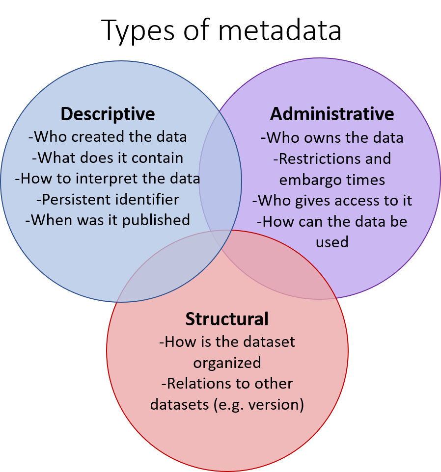

# Metadata and data documentation

## Overview

Metadata and data documentation are the contextual information about the data and its provenance, necessary for interpreting it. Providing comprehensive metadata and documenting the data lifecycle according to your discipline's conventions makes your data understandable, discoverable, and reusable. 

**Metadata**, data about data, can have multiple meanings and the documents described above that explain how data should be interpreted can also be called metadata. However, in these pages we use the term metadata referring to **discovery metadata**, the "label" of your data, which is needed when data is published and shared. 

**Data documentation** means creating information, which enables interpretations of the data correctly and independently. It consists of files that explain how data were created or digitized, how the data should be interpreted, its structure, and how the data has been modified. This information can also be called *data-level* documentation or even metadata as it is information about data. Documenting data should be considered as best practice when managing data, and it is also essential for data preservation. Whenever data are used sufficient contextual information is required to interpret the data correctly and independently. Data documentation can be done by using (domain specific) metadata and data standards, electronic laboratory notebooks, dictionaries, vocabularies and readme-files, which all take part in explaining what the project data is and what it means.

## Metadata types

Metadata is information regarding the data, for example, where, when, why, and how the data were collected, processed and interpreted. Metadata may also contain details about experiments, analytical methods, and research context.

Metadata is a broad term and it includes a variety of descriptive information about a dataset.

1. Descriptive metadata enables discovery, reuse and correct interpretation. It can also contain information about the data level documentation that is available with the data.
2. Administrative metadata defines who owns and who can access the data, and who has the right to manage it and how it can be used.
3. Structural metadata describes how data sets were produced, structured and for instance what software are needed.
 

License: CC BY 4.0
 
### Discovery metadata

**Descriptive metadata** of a dataset can be divided into two subcategories: **1) core metadata** *or study level metadata* (for discovery and identification - for search and citation) and **2) detailed descriptive metadata** *or data level metadata* (variables configurations, work-flows, processing code etc. - for enabling assessment and reuse) → see "Data documentation" chapter below

***Core metadata* includes**

 * a persistent identifier to be used when citing the dataset or reporting re-use
 * general information about the dataset (title, field of science, keywords, content coverage, variables)
 * information about agents (creators, contributors, publisher, distributor)
 * information about access (download link or access information, rights statements and licenses)
 * information about lifecycle events and related entities (provenance)
 * technical information like checksum, size, file format, media type
 
You can use [Qvain - Research Dataset Metadata Tool](https://www.fairdata.fi/en/qvain/), to create core metadata for your dataset. It will be published in [Etsin - Research Data Finder](https://www.fairdata.fi/en/services/etsin/).

***Administrative metadata***

Administrative metadata includes information about rights of the dataset. This means information about license, type of restriction and reason for it (ethical, legal etc.), embargo time, owner of the rights, contact for reuse as well as how to apply for use permit and access.

Other categories of administrative metadata include technical metadata (file types etc. information needed for rendering files) and preservation metadata.

***Structural metadata***

Structural metadata describes how the dataset is organised internally and how does it relate to other datasets (managing versions etc.). In some disciplines data are published and shared with community endorsed standards and schemas, which are a formal and machine actionable way of expressing the structural metadata. Schemas are used to express the scientific domain, structure, relationships, field labels, and parameter-level standards for the dataset as a whole. A schema enables data to be shared, merged or transferred between information systems without losing the meaning or structure of the data (ie. data are interoperable). In addition to implementing technical standards and schemas, securing semantic interoperability between different data requires using and referring to published sematic artefacts.

### Data documentation (also called *detailed descriptive metadata* or data-level metadata)###

It is important that you create relevant metadata for reuse and future credit. If you have additional metadata that does not fit in the data catalogue, additional metadata and **documentation** like code books or configuration files can be added to the dataset as separate files. This metadata can also be innate within the data files. Remember that this can make the data more hard to find. If you add extra metadata:

1. Use metadata standards if possible: Repositories often require the use of a specific metadata standard; *structured formats that use specific vocabularies or ontologies in describing the data*. Check whether a discipline/community or repository based metadata schema or standard (i.e., preferred sets of metadata elements) exists that can be adopted. Discipline-specific standards can be found from the [Digital Curation Centre website](http://www.dcc.ac.uk/resources/metadata-standards).
    - Some research instruments create standardised metadata formats automatically. Choose a standard which is compatible with other software, if possible.
2. Use separate metadata files or metadata included in the data files, configuration files, license deeds, code books and other data or information that is important for replication and reuse of the data.
    - Readme file(s) providing information about data files to ensure correct interpretation
    - Data dictionary / Code book explaining variables in the data and gathering codes used in a dataset.

Also think about your file naming conventions, directory structure and **version control**. Read more from Files and file formats.

## Semantic interoperability##

**Controlled vocabularies, thesauri, and ontologies** are all so called semantic artefacts, which are machine readable models of knowledge. They facilitate the extraction and representation of knowledge within data sets using annotations or assertions. When a data standard and schema express the data structure (relations of different elements in the data), semantic artefacts make the meaning of the content unambiguous and  "understandable" to a machine (machine actionable). For example, when you collect data about plants it may be obvious to other human readers, that the data is about living organisms and not about power plants and other factories, but a computer can't distinguish the difference by interpreting the meaning from the context as humans can. For this purpose, data should be accompanied with a vocabulary that tells a machine how to interpret the data in the context, and also what values in the variables are. It is also important to let the machine know whether an empty field means zero value, or if the data is simply missing. It can be crucial to the analyses and results if data is (mis)interpreted in different ways when reusing or merging datasets.

## Data organization##

Important part of good data management is also taking care of data organization. This includes for example thoughtful file naming, clear folder structure, accessible file formats and explicit version control.

It is a good practice to make a clear **file naming system** from the start of your project and for example use the same system together with your research team. This helps you as well as your colleagues to understand what files contain from the name. Read tips for organizing your data and naming files and folders from [CSC Files and File Formats page](https://research.csc.fi/files-and-file-formats) or from [RDMKit Data Organization page](https://rdmkit.elixir-europe.org/data_organisation.html). 

Your research field might also have instructions and guidelines for organizing data. For example Brain Imaging Data Structure (BIDS) has been created by the scientific community of brain researchers, and it defines the file formats, file naming rules and rules to organize the data in directories.

To keep data well organized you should have a **version control system** in use. This can either be manual, where you incorporate a running number to the end of a file name _(_v03)_, or automatic, which is the preferred way. Automatic version control can be done with software such as [Git](https://git-scm.com/), [GitHub](https://github.com/) or [GitLab](https://gitlab.com/gitlab-org/gitlab) (your institution might offer an integrated solution) or use cloud storing solutions, which usually provide automatic file versioning. More tips on data organization can be found in [the ELIXIR Research Data Management Kit (RDMkit)](https://rdmkit.elixir-europe.org/).

When making new versions of data files, it is important to **keep a copy of the original raw data**. Data should be kept in its raw form whenever possible to enable transparency and facilitate reanalysis. It also assists in combining multiple data sources and re-purposing the data use. Also, when sharing the data it might be worthwhile to provide both unprocessed and processed versions of your data, with either code or explanations for deriving the latter. In some cases it is even possible to publish the data with the processing and analyses code as an executable paper in order to prove that the scientific process is reproducible. In other words executable papers are dynamic pieces of software that combine text, raw data, and the code used for the analysis, and that a reader can interact with. 

## Data types##
TODO: → belongs to Publishing?

When choosing what to archive and/or publish, it is good to switch viewpoints, and consider what the data (re)user sees. How far back is the reader of your article able to follow the process towards the raw data, before it is no longer possible to reproduce the original process? In many cases it is not possible to get back to the raw data, but if the data documentation, automation, saving of logs and code, and their version management are practiced from the start it is possible to secure as much transparency as possible. If it is possible (this is highly discipline specific) it might be good to publish both raw data and processed data with the documentation.

TODO: KUVA!

Also consider what is actually the data product that you will publish with your scientific article. It may help to categorise the data already when you start. Raw data, is the data that you collect and/or digitize for your study or other data captured and repurposed from various sources. The readily available digital data, may be operational (red) data from a data source which is published for some other purpose in a highly dynamic format. **Operational data** may not necessarily be citable or quality controlled at the source. For reuse data can be captured from operational source or it can be already collected and published as (cumulative/) **generic research data** (green). The generic research data are versioned, documented and quality controlled and they should be possible to cite. What you publish as a result from your research is a stable data product ie. **Research dataset publication** (blue) that consists of (if possible) the raw data with the documentation describing the process that has lead to the results.   

TODO: KUVA!

## Files and file formats##

TODO: Mitä tälle tapahtuu? Huom tähän viitataan ylhäällä!

=> nykyinen https://research.csc.fi/files-and-file-formats => olisi syytä käydä läpi tästä uudesta näkökulmasta

All digital information is structured data. When organising your research data it is important to create coherent and intelligible entities that are easy to access and reuse.

## More reading##

[The UK Data Service: Format your data](https://www.ukdataservice.ac.uk/manage-data/format)
