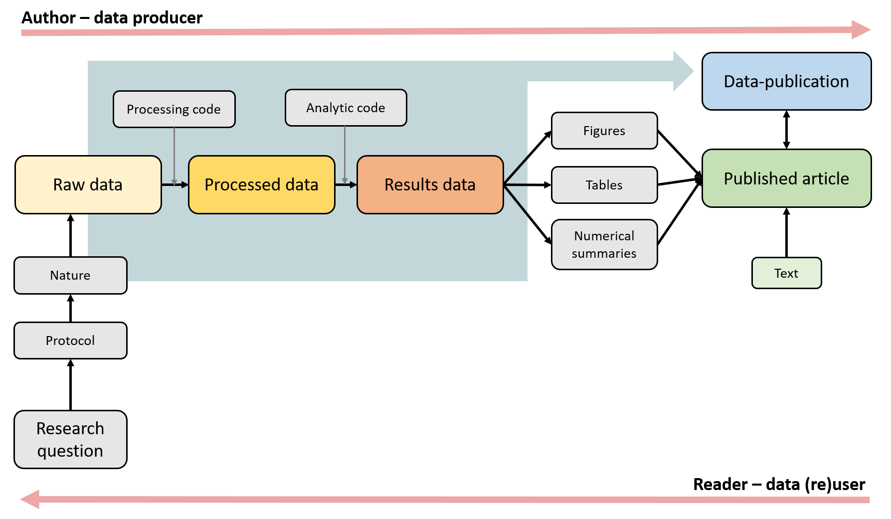
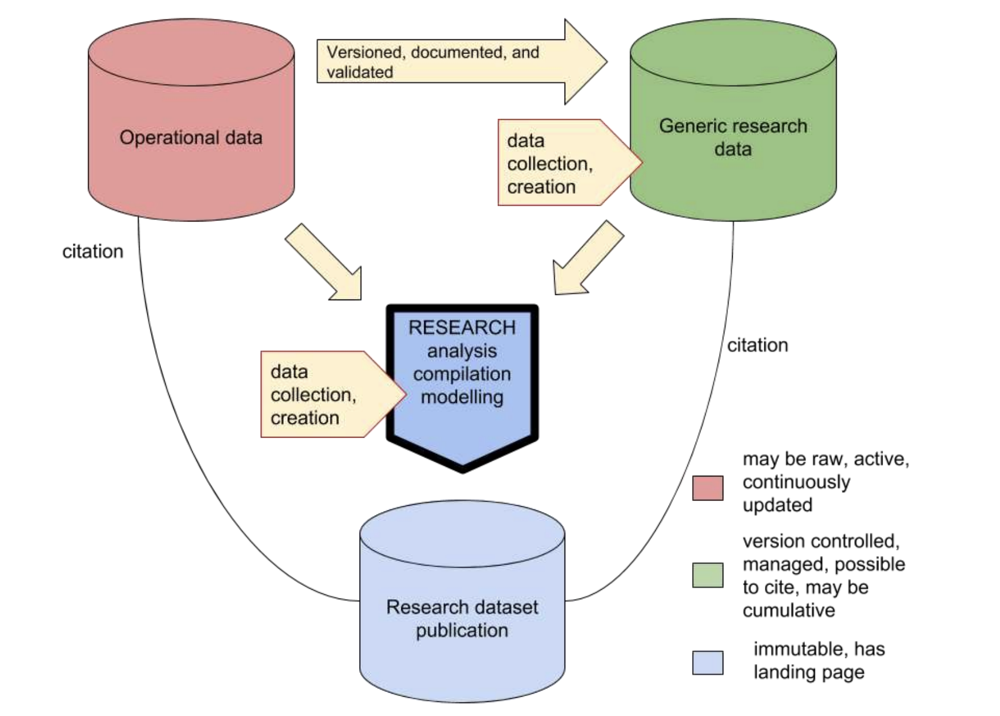
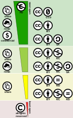

# Publishing Datasets

## Overview

Often dataset oriented work produces new datasets, either as primary outcomes or possible as supporting material to primary results, such as scientific publications. When publishing datasets, the focus should be on enabling new work to be carried on them at some undefined point in the future. Publishing should be based on commonly accepted standards and with good metadata, as datasets might be used in contexts that are completely different from the project that produced them. However, often the most important future user for datasets is the original author, so the effort spent on publishing data properly is quickly paid back.

## Where to host and publish datasets

Services listed below are Finnish or produced in collaboration with CSC, and they are free-of-charge for end users. In addition, there are multiple recommended repositories available. You can search for suitable options at [Re3data](https://www.re3data.org/), the Registry of Research Data Repositories, with detailed information about nearly 3 000 data repositories in different academic disciplines . 

If possible, use discipline specific repositories for your data. We recommend contacting your home organisation's data support for more guidance in opening research data.

[CSC's tools for publishing datasets](https://research.csc.fi/en/service-catalog#open)

[How to publish your dataset with Fairdata](https://www.fairdata.fi/en/user-guides/fairdata-quick-guide/)

[EUDAT Services](https://www.eudat.eu/)

[How to make spatial data available in CSC's computing environment](https://research.csc.fi/en/gis_data_in_csc_computing_env)

[Example case 1: Sharing data during research project, publish FAIR when ready](https://research.csc.fi/example-case-1)

[Example case 2: Data lifecycle at CSC – from collection to preservation](https://research.csc.fi/example-case-2)

## Data types

When choosing what to archive and/or publish, it is good to switch viewpoints, and consider what the data (re)user sees. How far back is the reader of your article able to follow the process towards the raw data, before it is no longer possible to reproduce the original process? In many cases it is not possible to get back to the raw data, but if the data documentation, the automation, the saving of logs and code, and their version management are practised from the start it is possible to secure as much transparency as possible. If it is possible (this is highly discipline specific) it might be good to publish both raw data and processed data with the documentation.

License: CC BY 4.0

Also consider what is the actual data product that you will publish with your scientific article. It may help to categorize the data already when you start. Raw data is the data that you collect and/or digitize for your study or other data captured and repurposed from various sources. The readily available digital data may be operational (red) data from a data source, which is published for some other purpose in a highly dynamic format. **Operational data** may not necessarily be citable or quality controlled at the source. For reuse data can be captured from operational source or it can already be collected and published as (cumulative/) **generic research data** (green). The generic research data are versioned, documented and quality controlled, and they should be possible to cite. What you publish as a result from your research is a stable data product i.e. **Research dataset publication** (blue) that consists of (if possible) the raw data with the documentation describing the process that has lead to the results.   

License: CC BY 4.0

## Persistent identifiers

Persistent identifiers offer managed ways to link and tag digital information. By using identifiers like DOI or URN when you publish or cite data, the linking is protected despite changes in names or organization. Identifiers are globally unique, which means that you can be sure you have the correct dataset at hand or that you get credit for your publications.

The more persistent identifiers you can include in your work flows, the better and easier is your information management. Do not hesitate to contact the research data services or library in your own organization for further help. 

!!! note "Additional readings"
    - [Support for Persistent Identifiers at CSC](https://wiki.eduuni.fi/x/9ZRYH)
    - [Cite Your Data - DataCite](https://datacite.org/cite-your-data.html)
    - [Digital Object Identifier (DOI)](https://www.doi.org/)
    - [ORCID - researcher identifier](https://researcheridentifier.fi/)
    - [Digital Preservation Handbook](https://www.dpconline.org/handbook/technical-solutions-and-tools/persistent-identifiers) by Digital Preservation Coalition
    - [ANDS Persistent Identifiers Expert Level Guide](https://www.ands.org.au/guides/persistent-identifiers-expert)

<iframe allow="autoplay; encrypted-media" allowfullscreen="" frameborder="0" height="315" srcdoc="https://www.youtube.com/embed/_4cZVli_xiU" title="Manage well and get preserved – 3. Persistent identifiers" width="560"></iframe>

## Licensing & rights

Today, it is possible to put data produced in previous research into more diverse use in new research, thus eliminating the need to collect data, to come up with new methods, or to write code from scratch.

When using data produced by others, their terms of use must be taken into consideration. The terms of use are usually defined in a license, such as an open [Creative Commons](https://creativecommons.org/licenses/) license. Data can be completely open for use or its use may be subject to certain restrictions, which are normally due to the sensitivity of information, business secrets, or agreements signed by researchers. As a general rule, you can use data in accordance with its terms of use.

The terms of use for a dataset are always determined by the person producing it or a person to whom the producer has transferred the rights to that dataset ([Copyright Act 404/1961](http://www.finlex.fi/en/laki/kaannokset/1961/en19610404.pdf)). If necessary, you can contact the owner of the data in order to clarify any uncertainty regarding its use.

### How to license your own data?

When making data available, it is recommended that licenses are used. This allows you to for example retain the copyright while allowing others to copy, distribute, and make use of your data. [Creative Commons licenses](https://creativecommons.org/licenses/) (CC BY) are widely used for licensing. Creative commons license spectrum between public domain (on top in the picture below) and all rights reserved (bottom). Left side in the picture indicates the use cases allowed, right side the license components.

License: CC BY 4.0

!!! note "Try it yourself!"
    [License Chooser](https://creativecommons.org/choose/) by Creative Commons.
    
    **CC BY 4.0 license** for your data allows the use of your data but require that the author is mentioned. 
    
    You can also give your data **CC0 license**. It means that you give full rights to others for using the data. 

## Access restrictions

Publishing your data doesn’t necessarily mean that your datasets must be available to anyone and everyone. If you have concerns that releasing your data openly could cause harm to someone or something, or have other negative consequences, you can choose to apply specific restrictions on how people can gain access to your data. Usually, the options are to:

1. **allow anyone** to download the files attached to your dataset (Open),
1. allow anyone to download the files attached to your dataset **from a certain date onwards** (Embargo),
1. allow anyone to **apply for access** to download the files attached to your dataset (Mediated), or
1. **not allow** anyone to download the files attached to your dataset at all (Restricted).  

Whichever option is selected does not affect the visibility of the dataset’s descriptive metadata, meaning that even if access to data is restricted, descriptive information about the published dataset is displayed in the publishing platform. Any restriction needs however to be specified and contact information made available and kept up to date.

