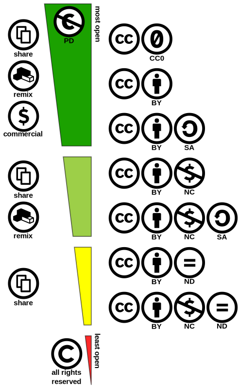

# Publishing datasets

## Overview

Often dataset oriented work produces new datasets, either as primary outcomes or possible as supporting material to primary results, such as scientific publications. When publishing datasets, the focus should be on enabling new work to be carried on them at some undefined point in future. Publishing should be based on commonly accepted standards and definitions of good metadata, as datasets might be used in contexts that are completely different from the project that produced them. However, often the most important future user for datasets is the original author, so that the effort spent on publishing data properly is often quickly paid back.

## Tools to host and publish data

[CSC's tools for hosting and storing data](https://research.csc.fi/en/service-catalog#store)

[How to publish your dataset with Fairdata](https://www.fairdata.fi/en/user-guides/fairdata-quick-guide/)

[Using Allas to host a data set for a research project](../Allas/allas_project_example.md)

[Example case 1: Sharing data during research project, publish FAIR when ready](https://research.csc.fi/example-case-1)

[Example case 2: Data lifecycle at CSC – from collection to preservation](https://research.csc.fi/example-case-2)

[How to make dataset available in CSC's computing environment](https://research.csc.fi/en/gis_data_in_csc_computing_env)

## Data types

When choosing what to archive and/or publish, it is good to switch viewpoints, and consider what the data (re)user sees. How far back is the reader of your article able to follow the process towards the raw data, before it is no longer possible to reproduce the original process? In many cases it is not possible to get back to the raw data, but if the data documentation, automation, saving of logs and code, and their version management are practiced from the start it is possible to secure as much transparency as possible. If it is possible (this is highly discipline specific) it might be good to publish both raw data and processed data with the documentation.

License: CC BY 4.0

Also consider what is actually the data product that you will publish with your scientific article. It may help to categorise the data already when you start. Raw data, is the data that you collect and/or digitize for your study or other data captured and repurposed from various sources. The readily available digital data, may be operational (red) data from a data source which is published for some other purpose in a highly dynamic format. **Operational data** may not necessarily be citable or quality controlled at the source. For reuse data can be captured from operational source or it can be already collected and published as (cumulative/) **generic research data** (green). The generic research data are versioned, documented and quality controlled and they should be possible to cite. What you publish as a result from your research is a stable data product ie. **Research dataset publication** (blue) that consists of (if possible) the raw data with the documentation describing the process that has lead to the results.   

License: CC BY 4.0

## Persistent identifiers

Persistent identifiers offer managed ways to link and tag digital information. By using identifiers like DOI or ORCID when you publish or cite data, the linking is protected despite changes in names or organisation. Identifiers are globally unique, which means that you can be sure you have the correct dataset at your hands or that you get credit for your publications.

You can read more about the researcher and contributor id [ORCID](https://researcheridentifier.fi/) and about guidelines for [data citation](https://www.fcrd.fi/). Do not hesitate to contact the research data services or library in your own organisation for further help. The more persistent identifiers you can include in your work flows, the better and easier is your information management.

!!! note "Additional readings"
    - [Support for Persistent Identifiers at CSC](https://research.csc.fi/support-for-persistent-identifiers)
    - [Digital Object Identifier (DOI)](https://www.doi.org/)
    - [ORCID - researcher identifier](https://researcheridentifier.fi/)
    - [Digital Preservation Handbook](https://www.dpconline.org/handbook/technical-solutions-and-tools/persistent-identifiers) by Digital Preservation Coalition
    - [ANDS Persistent Identifiers Expert Level Guide](https://www.ands.org.au/guides/persistent-identifiers-expert)

## Licensing & rights

Today, it is possible to use data produced in previous research to be put to more diverse use in new research, thus eliminating the need to collect data, to come up with new methods, or to write code from scratch.

When using data produced by others, their terms of use must be taken into consideration. The terms of use are usually defined in a license, such as an open [Creative Commons](https://creativecommons.org/licenses/) license. Data can be completely free to use or its use may be subject to certain restrictions, which are normally due to the sensitivity of information, business secrets, or agreements signed by researchers. As a general rule, you can use data in accordance with its terms of use.

The terms of use for a dataset are always determined by the person producing it or a person to whom the producer has transferred the rights to that dataset ([Copyright Act 404/1961](http://www.finlex.fi/en/laki/kaannokset/1961/en19610404.pdf)). The easiest way for the owner of a dataset to determine the terms of use is with a licence. The terms of use can range from completely free for use to being subject to a variety of restrictions. If necessary, you can contact the owner of the data in order to clarify any uncertainty regarding its use.

### How to license your own data?

When making data available, it is recommended that licenses are used. It allows you to specify the degree of publicity and user rights for your data. [Creative Commons licenses](https://creativecommons.org/licenses/) (CC BY) are widely used for licensing. 

!!! note "Try it out!"
    [License Chooser](https://creativecommons.org/choose/) by Creative Commons.
    
    **CC BY 4.0 license** for your data allows the use of your data but require that the author is mentioned. 
    
    You can also give your data **CC0 license**. It means that you give full rights to others for using the data. 

## Access control

TODO: Kirjoita teksti!

## Preservation

Digital preservation refers to the reliable preservation of digital information for several decades or even centuries. Hardware, software, and file formats will become outdated, while the information must be preserved. Reliable digital preservation requires active monitoring of information integrity and anticipation of various risks. Metadata, which describes for example the information content, provenance information and how the content can be used, has a key role in this.

The [National Digital Preservation Services](http://digitalpreservation.fi/en) for research data ensures the availability and preservation of digital research resources. Here you find more information about [becoming a partner organisation with the Digital Preservation Service for Research Data](https://www.fairdata.fi/en/dps-organisations/).

Learn more about preservation of research data in this video.

<iframe width="280" height="155" srcdoc="https://www.youtube.com/watch?v=arJ5jJP_eOM" frameborder="0" allow="accelerometer; autoplay; encrypted-media; gyroscope; picture-in-picture" allowfullscreen></iframe> 

