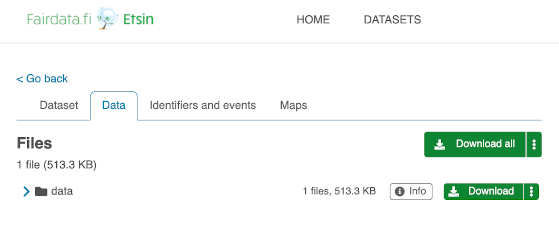

# Tiedonsiirto Allaksen ja IDA:n välillä Puhtin kautta {#copying-data-between-allas-and-ida-via-puhti}

## Tiedonsiirto Allaksesta IDA:an Puhtin kautta {#copying-data-from-allas-to-ida-via-puhti}

Jotta voit siirtää dataa Allaksesta IDA:an tämän ohjeen mukaisesti, tulee sinun kuulua projektiin, jossa IDA- ja Puhti-palvelut ovat käytössä. Allaksen puolella tarvitset vähintään lukuoikeudet dataan. Sinun täytyy joko kuulua projektiin, jolla on Allas-palvelu käytössä, tai tiedon täytyy olla ladattavissa Allaksessa. Huomaa, että projektien ei tarvitse olla samoja Allaksessa, Puhtissa ja IDA:ssa.

Lyhyesti, seuraa näitä neljää vaihetta:

1. Lataa data Allaksesta Puhtin scratch-levylle
2. Järjestä data uudelleen scratch-levyllä
3. Lataa data IDA:an
4. Puhdista Puhtin scratch-levy

!!! Huom
    IDA:ssa oleva data tulee kuvata tutkimusaineistoksi Fairdata-palveluissa.
    [Lisätietoja saat täältä](https://www.fairdata.fi/en/about-fairdata/benefits/).

### Vaihe 1. Lataa data Allaksesta Puhtin scratchille {#step-1-download-the-data-from-allas-to-puhti-scratch}

Puhtin scratch-levyaluetta suositellaan, sillä se on oletuksena huomattavasti suurempi kuin muut alueet, esim. käyttäjän kotihakemisto. Voit myös pyytää suurempaa scratch-kiintiötä, mikäli oletus ei riitä. Puhtissa käytettävissä olevat levyalueet ja niiden käyttöasteen näet komennolla:

```bash
csc-workspaces
```

Lisätietoja Puhtin levyalueista löydät sivulta
[Supercomputer disk areas](../../computing/disk.md).

Esimerkiksi, luo uusi hakemisto `copydir` datalle projektin `project_2000013` scratch-alueelle (korvaa omalla projekti-ID:lläsi):

```bash
mkdir /scratch/project_2000013/copydir
```

Lataa data Allaksesta tähän uuteen hakemistoon. Käytä samaa protokollaa kuin alkuperäisessä datan latauksessa Allakseen. Jos data ladattiin komentorivityökaluilla, käytä mielellään myös samaa komentorivityökalua. Lisätietoja Puhtin Allas-työkaluista löytyy sivulta
[Allaksen käyttö CSC:n laskentaympäristössä ja muilla Linux-alustoilla](../Allas/accessing_allas.md#accessing-allas-in-the-csc-computing-environment-and-other-linux-platforms).

Esimerkkitapauksessamme data ladattiin alun perin Allakseen a-komennolla, joten käyttäjä käyttää `a-get`-komentoa datan lataamiseen:

```bash
module load allas
allas-conf
cd /scratch/project_2000013/copydir
a-get 2000013-wrk-bucket/working_data.tar.zst
```

`a-get`-komento lataa ja purkaa datan `copydir`-hakemistoon.

### Vaihe 2. Järjestä data uudelleen scratchilla {#step-2-rearrange-the-data-on-scratch}

Tämä on tärkeä vaihe, kun siirrät dataa Allaksesta IDA:an. Tallenna vain sellaista dataa, joka on merkityksellistä ja jonka haluat kuvata tutkimusaineistoksi Fairdata-palveluissa. Lisäksi kannattaa jo tässä vaiheessa miettiä, millainen hakemistorakenne sopisi aineistoille ja järjestää data Puhtin hakemistoon sen mukaisesti. Huomaa, että IDA:ssa et voi jäädyttää (eli muuttaa pysyväksi tutkimusdataksi) yli 5000 tiedostoa kerralla. Hyvänä nyrkkisääntönä siis kannattaa pitää maksimissaan tuo määrä tiedostoja yhdessä hakemistossa.

Jos jokin tiedosto kuuluu useampaan aineistoon, älä tee siitä kopioita – IDA:ssa tiedosto voi kuulua useampaan aineistoon.

Esimerkissämme projektiryhmä päättää luoda kaksi erillistä aineistoa, joten data järjestellään kahteen hakemistoon, `experiment_a` ja `survey_2021`.

### Vaihe 3. Lataa data IDA:an {#step-3-upload-the-data-to-ida}

Tallenna vain data, joka on tarkoituksenmukaista kuvata Fairdata-palveluiden aineistoiksi. Lisäksi datan tulisi olla jo järjestetty sopivaan hakemistorakenteeseen.

Voit ladata datan IDA:n komentorivityökalulla, jonka syntaksi on:

```bash
ida upload <target_in_ida> <local_file>
```

Esimerkissämme ladataan molemmat hakemistot (`experiment_a` ja `survey_2021`) IDA-projektiin 2000002:

```bash
module load ida
cd /scratch/project_2000013/copydir
ida upload -p 2000002 experiment_a experiment_a
ida upload -p 2000002 survey_2021 survey_2021
```

Lisää esimerkkejä löydät
[IDA-komentorivityökalun GitHub-repositoriosta](https://github.com/CSCfi/ida2-command-line-tools#examples).

Jos käyttäjä on jo konfiguroinut IDA-työkalun, komento käyttää tätä konfiguraatiota. Muuten komentoa suoritettaessa ohjelma kysyy käyttäjän IDA-tunnuksen ja -salasanan.
[Yksityiskohtaiset ohjeet täällä](../ida/using_ida.md#configuring-and-using-ida-in-csc-supercomputers).

### Vaihe 4. Puhdista Puhtin scratch {#step-4-clean-the-puhti-scratch}

Jos et enää tarvitse dataa Puhtissa sen lataamisen jälkeen IDA:an, poista se Puhtin scratch-alueelta, jotta levytilaa vapautuu.

## Tiedonsiirto IDA:sta Allakseen Puhtin kautta {#copying-data-from-ida-to-allas-via-puhti}

Jotta voit siirtää dataa IDA:sta Allakseen tämän ohjeen mukaisesti, tulee sinun kuulua projektiin, jossa Allas- ja Puhti-palvelut ovat käytössä. IDA:n puolella tulee joko kuulua projektiin, jolla on IDA-palvelu, tai datan täytyy olla julkisesti ladattavissa. Huomaa, että projektien ei tarvitse olla samoja Allaksessa, Puhtissa ja IDA:ssa.

Lyhyesti, seuraa näitä neljää vaihetta:

1. Lataa data IDA:sta Puhtin scratch-levylle
2. Järjestä data tarvittaessa uudelleen scratch-levyllä
3. Lataa data Allakseen
4. Puhdista Puhtin scratch-levy

### Vaihe 1. Lataa data IDA:sta Puhtin scratchille {#step-1-download-the-data-from-ida-to-puhti-scratch}

Puhtin scratch-levyaluetta suositellaan, sillä se on oletuksena huomattavasti suurempi kuin muut alueet, esim. käyttäjän kotihakemisto. Voit pyytää suurempaa scratch-kiintiötä, jos oletus ei riitä. Lisätietoja Puhtin levyalueista saat sivulta
[Supercomputer disk areas](../../computing/disk.md).

Esimerkiksi, luo uusi hakemisto `xferdir` datalle projektin `project_2000012` scratch-alueelle (korvaa omalla projekti-ID:lläsi):

```bash
mkdir /scratch/project_2000012/xferdir
```

Jos lataettava data IDA:sta on projektissa, johon käyttäjä kuuluu, datan lataaminen onnistuu IDA-komentorivityökalulla:

```bash
ida download <target_in_ida> <local_file>
```

Esimerkissämme, jos data on IDA:ssa hakemistossa `testi` projektissa 2000001, suoritetaan Puhtissa latauskomennot:

```bash
module load ida
cd /scratch/project_2000012/xferdir
ida download -p 2000001 testi testi.zip
```

`ida download` -komennon viimeinen argumentti on Puhtissa tiedolle annettava tiedostonimi. Jos tässä tapauksessa ladataan hakemisto, se ladataan zip-pakettina. Jos käyttäjä on aiemmin käyttänyt ja konfiguroinut IDA-työkalun, lataus käyttää tätä konfiguraatiota. Muussa tapauksessa ohjelma kysyy käyttäjän tunnuksen ja salasanan.
[Yksityiskohtaiset ohjeet täällä](../ida/using_ida.md#configuring-and-using-ida-in-csc-supercomputers).

Jos ladattava data IDA:sta on julkaistu avoin aineisto ja näkyvissä Fairdata Etsimessä, lataaminen vaatii kaksi vaihetta; latauskomennon paikantamisen ja kopioinnin Etsimestä sekä sitten aineiston lataamisen. Etsimen latauspainikkeessa on vaihtoehto näyttää latauskomennot muutamille komentorivityökaluille.

Jatkaaksemme esimerkillä, käyttäjä valitsee ladattavan aineiston hakemiston Etsimessä. Hetken kuluttua zip-paketti on valmis, ja Etsimessä näkyy latauspainike:



Käyttäjä klikkaa latauspainikkeen vaihtoehtovalikkoa nähdäkseen komentorivivaihtoehdot:


Käyttäjä voi esimerkiksi kopioida `curl`-komennon ja suorittaa sen Puhtissa:

```bash
cd /scratch/project_2000012/xferdir
curl -fOJ "https://ida191.csc.fi:4430/download?token=18f6e5b7edae4f12a8a654ea22d57aa9.PA0p5PMqnzvgcXAU0Lw9SuVcyoQGgV8Ugnk3GEppU0b4UUhGWRLP8FRHB2MvyUTjPA0p5PMqnzvgcXAU0Lw9SuVcyoQGgV8Ugnk3GEppU0b4UUhGWRLP8FRHB2MvyUTjPA0p5PMqnzvgcXAU0Lw9SuVcyoQGgV8Ugnk3G_e3668097e34d437484e15d53624e7905=76679a7a-367c-474f-9e8c-c3869a106e2f_ehr3hd76&package=76679a7a-367c-474f-9e8c-c3869a106e2f_ehr3hd76.zip"
```

### Vaihe 2. Järjestä data tarvittaessa uudelleen scratchilla {#step-2-rearrange-the-data-on-scratch-if-necessary}

Jos haluat järjestellä tai poistaa osan datasta, voit tehdä sen scratch-levyllä ennen kuin lataat sen Allakseen.

Jatkaen esimerkkiä, kun data on ladattu muodossa `testi.zip` (tai `76679a7a-367c-474f-9e8c-c3869a106e2f_ehr3hd76.zip` avoimen aineiston tapauksessa) projektin scratch-alueelle, paketti voidaan purkaa unzip-komennolla:

```bash
cd /scratch/project_2000012/xferdir
unzip testi.zip
```

### Vaihe 3. Lataa data Allakseen {#step-3-upload-the-data-to-allas}

Helpoin tapa ladata data Allakseen on käyttää `a-put`-komentoa. `a-put` lataa hakemiston yhtenä arkistotiedostona Allakseen. Työhakemistossa tulee olla tarpeeksi tilaa arkistopaketin luomista varten, joten komento kannattaa suorittaa scratch-levyalueella. Komennon perusmuoto on:

```bash
a-put <directory_or_file>
```

Lisätietoja Allaksen työkaluista Puhtissa saat sivulta
[Allaksen käyttö CSC:n laskentaympäristössä ja muilla Linux-alustoilla](../Allas/accessing_allas.md#accessing-allas-in-the-csc-computing-environment-and-other-linux-platforms).

Esimerkissämme, jos purettu data on hakemistossa nimeltä `experiment_data`, se voidaan ladata Allakseen komennolla `a-put`:

```bash
module load allas
allas-conf
cd /scratch/project_2000012/xferdir
a-put experiment_data
```

### Vaihe 4. Puhdista Puhtin scratch {#step-4-clean-the-puhti-scratch}

Jos et enää tarvitse dataa Puhtissa Allakseen lataamisen jälkeen, poista se Puhtin scratch-alueelta, jotta levytilaa vapautuu.