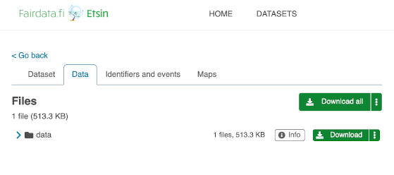
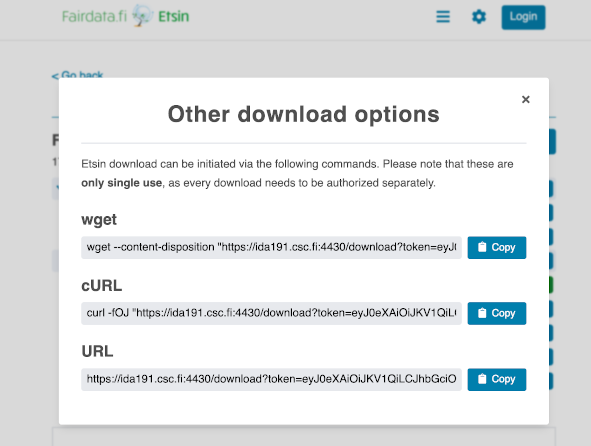

# Copying data between Allas and IDA via Puhti

## Copying data from Allas to IDA via Puhti

In order to be able to copy data from Allas to IDA with this procedure, you
need to be a member of a project which has IDA and Puhti services in use. On
the Allas side, you need at least read access to the data. You either need to
be a member of a project which has Allas service in use, or the data in
question needs to be available for downloading in Allas. Note that the projects
in Allas, Puhti and IDA do not need to be the same.

In short, there are four steps to follow:

1. Download the data from Allas to Puhti scratch disk
2. Rearrange the data on the scratch disk
3. Upload the data to IDA
4. Clean the Puhti scratch disk

!!! Note
    Data in IDA is required to be described as research datasets with Fairdata
    services.
    [See more information here](https://www.fairdata.fi/en/about-fairdata/benefits/).

### Step 1. Download the data from Allas to Puhti scratch

Scratch disk area in Puhti is recommended as it is by default much larger than
other areas, e.g. user's home folder. Also, you can request even larger scratch
quota if the default is not enough. On Puhti, you can show the available disk
areas and their usage with command:

```bash
csc-workspaces
```

For more details about Puhti disk areas, see
[Supercomputer disk areas](../../computing/disk.md).

For example, create a new directory `copydir` for the data under the scratch
area of `project_2000013` (replace this with your own project ID):

```bash
mkdir /scratch/project_2000013/copydir
```

Download the data from Allas to that new directory. You should use the same
protocol as was used to originally upload the data to Allas. If the data was
uploaded with command-line tools, preferably also use the same command-line
tool. More information about the Allas tools on Puhti is available at
[Accessing Allas in the CSC computing environment and other Linux platforms](../Allas/accessing_allas.md#accessing-allas-in-the-csc-computing-environment-and-other-linux-platforms).

In our example case the data was originally uploaded to Allas with a-commands,
so the user uses `a-get` to download the data:

```bash
module load allas
allas-conf
cd /scratch/project_2000013/copydir
a-get 2000013-wrk-bucket/working_data.tar.zst
```

`a-get` command downloads the data and extracts it into the `copydir`
directory.

### Step 2. Rearrange the data on scratch

This is an important step when copying data from Allas to IDA. You should only
copy data that is important enough to be described as a dataset in Fairdata
services. Also, it makes the rest of the procedure easier to think at this
point what kind of a directory structure would be good for the datasets and
arrange the data in the Puhti directory to follow that structure. Note that in
IDA you can't freeze (turn stable research data to an immutable state) more
than 5000 files at once. So, as a rule of thumb, you should have at most that
amount of files in one directory.

In case you will include some files in more than one dataset, do not make
duplicate files – IDA files may belong to multiple datasets.

In our example case, the project decides that it makes sense to have two
distinct datasets, so the data is rearranged into two directories,
`experiment_a` and `survey_2021`.

### Step 3. Upload the data to IDA

You should only copy data that is important enough to be described as datasets
in Fairdata services. Also, you should have the data already rearranged into a
directory structure that would be good for the datasets.

You can upload the data using the IDA command-line tool, which uses the syntax:

```bash
ida upload <target_in_ida> <local_file>
```

Continuing our example, uploading both directories (`experiment_a` and
`survey_2021`) to IDA project 2000002:

```bash
module load ida
cd /scratch/project_2000013/copydir
ida upload -p 2000002 experiment_a experiment_a
ida upload -p 2000002 survey_2021 survey_2021
```

More examples can be found in the
[GitHub repository of the IDA command-line tool](https://github.com/CSCfi/ida2-command-line-tools#examples).

If the user has already configured the IDA command-line tool, then the upload
command uses that configuration. If not, then the upload command asks the user
for their username and password in IDA.
[See detailed instructions here](../ida/using_ida.md#configuring-and-using-ida-in-csc-supercomputers).

### Step 4. Clean the Puhti scratch

If you do not need to continue working with the data on Puhti after uploading
it to IDA, remove it from the scratch disk area of Puhti to free up disk space.

## Copying data from IDA to Allas via Puhti

In order to copy data from IDA to Allas with this procedure, you need to be a
member of a project that has Allas and Puhti services in use. On the IDA side,
you either need to be a member of a project which has IDA service in use, or
the data in question needs to be publicly available for downloading. Note that
the projects in Allas, Puhti and IDA do not need to be the same.

In short, there are four steps to follow:

1. Download the data from IDA to Puhti scratch disk
2. Rearrange the data on the scratch disk, if necessary
3. Upload the data to Allas
4. Clean the Puhti scratch disk

### Step 1. Download the data from IDA to Puhti scratch

Scratch disk area in Puhti is recommended as it is by default much larger than
other areas, e.g. user's home folder. Also, you can request even larger scratch
quota if the default is not enough. For more details about Puhti disk areas,
see [Supercomputer disk areas](../../computing/disk.md).

For example, create a new directory `xferdir` for the data under the scratch
area of `project_2000012` (replace this with your own project ID):

```bash
mkdir /scratch/project_2000012/xferdir
```

If the data to be downloaded from IDA is in a project the user belongs to, then
downloading the data from IDA can be done with the IDA command-line tool:

```bash
ida download <target_in_ida> <local_file>
```

Continuing our example, if the data in IDA is in a directory `testi` of project
2000001, the download commands to run on Puhti are:

```bash
module load ida
cd /scratch/project_2000012/xferdir
ida download -p 2000001 testi testi.zip
```

The last argument of the `ida download` command is the file name given to the
data on Puhti. As in this case a directory is downloaded, it will be downloaded
as a zip package. If the user has used and configured the IDA command-line
tool previously, then the download command uses that configuration. If not,
then the upload command asks the user for their username and password in IDA.
[See detailed instructions here](../ida/using_ida.md#configuring-and-using-ida-in-csc-supercomputers).

If the data to be downloaded from IDA is a published open dataset visible in
Fairdata Etsin, then downloading it requires two steps; locating and copying
the download command in Etsin, and then downloading the dataset. The download
button in Etsin has an option to show download commands for a few command-line
tools.

Again continuing our example, the user selects a dataset directory for
downloading in Etsin. After a while, the zip package is ready, and Etsin shows
the download button:



User clicks the option menu of the download button to see the command-line
options:



The user could then, for example, copy the `curl` command and run it on Puhti:

```bash
cd /scratch/project_2000012/xferdir
curl -fOJ "https://ida191.csc.fi:4430/download?token=18f6e5b7edae4f12a8a654ea22d57aa9.PA0p5PMqnzvgcXAU0Lw9SuVcyoQGgV8Ugnk3GEppU0b4UUhGWRLP8FRHB2MvyUTjPA0p5PMqnzvgcXAU0Lw9SuVcyoQGgV8Ugnk3GEppU0b4UUhGWRLP8FRHB2MvyUTjPA0p5PMqnzvgcXAU0Lw9SuVcyoQGgV8Ugnk3G_e3668097e34d437484e15d53624e7905=76679a7a-367c-474f-9e8c-c3869a106e2f_ehr3hd76&package=76679a7a-367c-474f-9e8c-c3869a106e2f_ehr3hd76.zip"
```

### Step 2. Rearrange the data on scratch, if necessary

In case you would like to rearrange the data or remove parts of it, you can do
it on the scratch disk before you upload it to Allas.

Continuing our example, once the data is downloaded as `testi.zip` (or
`76679a7a-367c-474f-9e8c-c3869a106e2f_ehr3hd76.zip` in case of an open dataset)
in the project's scratch area, the package can simply be extracted with unzip:

```bash
cd /scratch/project_2000012/xferdir
unzip testi.zip
```

### Step 3. Upload the data to Allas

The easiest way to upload the data to Allas is using the `a-put` command.
`a-put` uploads a directory as one archived object to Allas. It needs enough
space in the working directory to create the archive to upload, so the current
working directory should be on the scratch disk. The basic syntax of the
`a-put` command is:

```bash
a-put <directory_or_file>
```

More information about the Allas tools on Puhti is available at
[Accessing Allas in the CSC computing environment and other Linux platforms](../Allas/accessing_allas.md#accessing-allas-in-the-csc-computing-environment-and-other-linux-platforms).

Continuing our example, assuming the unzipped data to be uploaded to Allas is
in a directory `experiment_data`, it can be uploaded with `a-put` as:

```bash
module load allas
allas-conf
cd /scratch/project_2000012/xferdir
a-put experiment_data
```

### Step 4. Clean the Puhti scratch

If you do not need to continue working with the data on Puhti after uploading
it to Allas, remove it from the scratch disk area of Puhti to free up disk
space.
