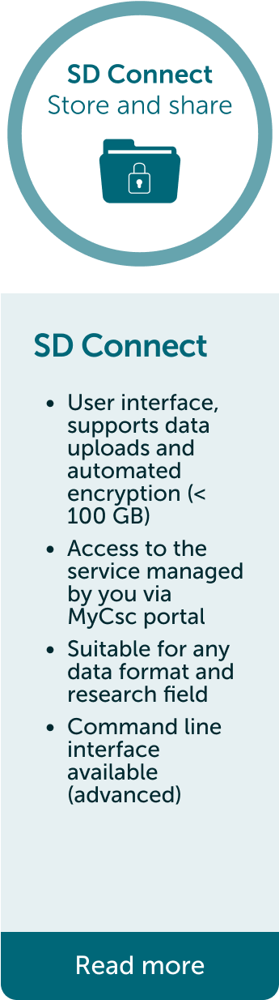

# Choose a service
## Sensitive data services for research data processing
For data that is originally produced for your research (or primary use). 

  
  
  
  

## Services for secondary use data
Data is for secondary use when it is collected from public register to be used for example in research. There are specific regulations for processing of secondary use data.
