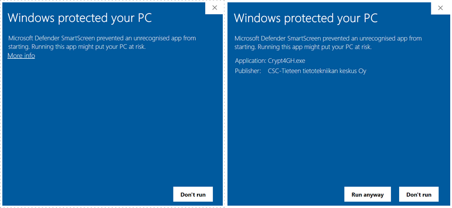

# Data encryption for data sharing

## Before you start

### Sensitive data needs to be encrypted before upload

According to CSC policies and [general terms of use](https://research.csc.fi/general-terms-of-use), sensitive data always
needs to be encrypted when uploaded or stored in CSC services. Sensitive data needs to be encrypted even if, for example,
downloaded from public repositories. The encryption requirement applies to the SD Connect service too.
Automatic encryption during data upload has not been implemented to SD Connect yet. Because of this, at the moment,
you must encrypt all the sensitive data on your local environment before you start to upload it to SD Connect.
Data that is not sensitive, can be uploaded without encryption.


### Crypt4GH based encryption

There are many valid methods to encrypt your data. In this document we focus on [Crypt4GH](https://crypt4gh.readthedocs.io/en/latest/) as that
is the default encryption tool in the **CSC Sensitive Data Services**. Crypt4GH was originally designed to encrypt and share human genetic data according to the
Global Alliance for Genomics and Health (GA4GH) standard, but it can be used to encrypt any type of data.

Crypt4GH uses **asymmetric encryption**, an encryption method that is based on two interlinked encryption keys:

   1) a **public key**, is used for encryption but it can't decrypt the encrypted data. You can share your public encryption key with your collaborators
   (e.g. multiple data owners, sequencing facilities etc), they can encrypt the data with your public key and only you will be then able to decrypt the
   data with your own secret key.
   
   2) a **secret key**, (private key) is used for decrypting a file that is encrypted with the corresponding public key. This key should not be made available to other users and normally it is password protected to ensure that it remains secret.


* **When using CSC Sensitive Data Services for analyzing sensitive data you have two possibilities:**

1) you can encrypt the data with the workflow described earlier in the [SD Connect guide](./sd_connect.md). With this workflow, you will encrypt a copy of your data using the _CSC Sensitive Data public encryption key_ (using the Crypt4GH user interfaces or programmatically). In this way, the data is automatically decrypted with **CSC Sensitive Data Services secret key"** when it is imported to SD Desktop. This key is hosted securely by the SD Services and users never need to do the decryption themselves. Futher, the data can't be decrypted in any other environment.
 

2) you can encrypt the data with one or several public keys. In this case, when imported in SD Desktop, you need to decrypt the data there manually. Note that in this case you need to have a corresponding secret key in SD Desktop. In practice this means that you have to encrypt your private key using the option 1 above and upload it to SD Desktop through SD Connect.


* **When using SD Connect to safely share (or transfer) data with your collaborators, you need to plan data encryption in advance, as you need to encrypt the data with your collaborator's public encryption key for them to be able to decrypt the data**. Using Crypt4GH CLI, it is possible to encrypt data with multiple public encryption keys. Thus, for example, the same dataset can be safely shared with multiple colleagues or collaborators.


!!! Note
    Files that have been encrypted only with the _CSC Sensitive Data Services public key_, can't be used in any other services as the corresponding secret key is             available only in the SD services environment. If you wish to encrypt your data for some other service, you should do another
    encrypted file that uses other public keys.


## Crypt4GH graphical user interface GUI

CSC developed a simple graphical user interface (GUI) that will allow you to generate your permanent encryption keys, to encrypt data with your permanent keys or with your collaborator public key and decrypt data using Crypt4GH.

1. You can download the user interface specific to your operating system from the [GitHub repository](https://github.com/CSCfi/crypt4gh-gui/releases):  

   - [Windows](https://kannu.csc.fi/s/iDiNR5HdwtFrXCY)
   - [Mac](https://kannu.csc.fi/s/88MFCb4wNRt2mwb)
   - [Linux](https://kannu.csc.fi/s/NAgiSeS8mFXKnC4)

1. Verify,  that the program has been digitally signed by CSC - IT Center for Science.  
1. After the download, you can find the Crypt4GH application in your download folder.


.

 
1. When you open the application you might encounter an error message. In this case, click on _More info_ and verify that the publisher is CSC-IT Center for Science (or in Finnish CSC-Tieteen tietotekniikan keskus Oy) and then click on _Run anyway_.


  


Next you can follow these steps:

### Step 1: Generate your encryption keys

1. Open the application and    click on _Generate Keys_ (on the top right corner).
1. The tool will open a new window and ask you to add a password (_Private Key Passphrase_). This password will be associated with your private key. Set a strong password.
1. When you click on _OK_, the tool will generate a key pair:

   - a private key (nsurname_crypt4gh.key)
   - a public key (nsurname_crypt4gh.pub)

1. The keys/file names will be displayed in the Activity Log with the following message:

````
Key pair has been generated, your private key will be auto-loaded the next time you launch this tool:
Private key: name_surname.crypt4gh.key
Public key: name_surname.crypt4gh.pub
All the fields must be filled before file encryption will be started
````

The keys will be generated and saved in the same folder in which the Application was downloaded.


!!! Note
If you lose or forget your private key password you will be unable to decrypt the files. Do not share your private key or your password. Do not share your private key publicly.


!!! Note
    The Crypt4GH application will automatically load your private key the next time you will access it /open it.
    You don’t need to generate new key pairs each time you open the application.

## Step 2: Prepare your files

With Crypt4GH GUI it is possible to encrypt only one file at the time.

* If you need to encrypt **multiple files**, save them in one directory/folder and zip the folder (right click on the folder and click on _Send to_, next select _Compressed (zipped) folder_).
* If you need to encrypt **large datasets**, check the instructions on how to programmatically encrypt files with Crypt4GH.


### Step 3: Load the encryption keys

1. Click on _Load My Private Key_ button.
1. Select your private key (name_surname.crypt4gh.key).
1. Click on _Open_. If the upload is successful, the tool will show the current path in the title bar.
1. Next, click on _Load Their Public Key_ button and select your public key (name_surname.crypt4gh.pub) or your collaborator public key if you need to share the encrypted data. 
1. Click on _Open_.


 
### Step 4: Upload and encrypt the file /zipped folder

1. Click on _Select File_ and choose the file or zipped folder that you wish to encrypt.
1. Click on _Open_ and on _Encrypt File_.
1. The tool will ask the password for your personal private key and once you click on _OK_ the encryption process will begin.
1. If the encryption is successful the file/zipped folder extension will end with *.c4gh* and  the Activity Log will display the following message:

````
Encrypting....

Encryption has finished.

Encrypted file: C:/users/samesurname/exampledirectory/examplefile.c4gh
````

Currently, Crypt4GH application is not provided with a progress bar. If the file/zipped folder contains a big dataset, the encryption process can last for up to minutes.


### Step 5: Data decryption
  
 
1. Access your secure computing environment in SD Desktop. 
1. Next, open Crypt4GH and click on _load Your Private Key_.  
1. Click on _load Their private Key_ and upload your public key
1. Click on _Select File_ and upload the file/zipped folder you want to decrypt.
1. Click on _Open_.
1. Next click on _Decrypt File_.
1. The tool will ask you to write the password of the private key, press _ok_. The file will be decrypted in the same location as the original file.

If you don't select your public key, the activity log will display the following (the decryption will be executed anyway):

````

Sender public key has not been set, authenticity will not be verified.
````

If your decryption runs successfully, the activity log will display the following:

````
Decrypting.....

Decryption has finished

Decrypted file: C:/users/samesurname/exampledirectory/examplefile
````


## Crypt4GH Command Line Interface (CLI)

For documentation and more information you can check [Crypt4GH](https://github.com/EGA-archive/crypt4gh.git)

In this example, first we generate your permanent key pair ( a private key password protected and a public key that can be shared with collaborators). Next, we encrypt a file with  your public key (_my_key.pub_) and your collaborators public key (_her_key.pub_). 
 
 

**Python 3.6+ required** to use the Crypt4GH encryption utility.
To install Python: https://www.python.org/downloads/release/python-3810/

 
 ### Step 1: Install the latest version of Crypt4GH encryption tool
 
In this example, first we generate your permanent key pair ( a private key password protected and a public key that can be shared with collaborators). Next, we encrypt a file with your public key and the public key of your collaborator. In this way, the collaborator will be able to decrypt the file in her safe environment using her own secret key.
 
 
 To install Crypt4GH you can choose one of the following options:
 
````
$ pip install crypt4gh     
````

or if you prefer the latest sources from GitHub:

```
pip install -r crypt4gh/requirements.txt
pip install ./crypt4gh
```

or

```
pip install git+https://github.com/EGA-archive/crypt4gh.git
```

The usual -h flag shows you the different options that the tool accepts:

```
$ crypt4gh -h

Utility for the cryptographic GA4GH standard, reading from stdin and outputting to stdout.

Usage:
   {PROG} [-hv] [--log <file>] encrypt [--sk <path>] --recipient_pk <path> [--recipient_pk <path>]... [--range <start-end>]
   {PROG} [-hv] [--log <file>] decrypt [--sk <path>] [--sender_pk <path>] [--range <start-end>]
   {PROG} [-hv] [--log <file>] rearrange [--sk <path>] --range <start-end>
   {PROG} [-hv] [--log <file>] reencrypt [--sk <path>] --recipient_pk <path> [--recipient_pk <path>]... [--trim]

Options:
   -h, --help             Prints this help and exit
   -v, --version          Prints the version and exits
   --log <file>           Path to the logger file (in YML format)
   --sk <keyfile>         Curve25519-based Private key.
                          When encrypting, if neither the private key nor C4GH_SECRET_KEY are specified, we generate a new key
   --recipient_pk <path>  Recipient's Curve25519-based Public key
   --sender_pk <path>     Peer's Curve25519-based Public key to verify provenance (akin to signature)
   --range <start-end>    Byte-range either as  <start-end> or just <start> (Start included, End excluded)
   -t, --trim             Keep only header packets that you can decrypt

Environment variables:
   C4GH_LOG         If defined, it will be used as the default logger
   C4GH_SECRET_KEY  If defined, it will be used as the default secret key (ie --sk ${C4GH_SECRET_KEY})
```


### Step 2: Generate a permanent public-private keypair


```
$ crypt4gh-keygen --sk my_key.sec --pk my_key.pub
```

where:

* _ sk my_key.sec_ is your private secrete (sk) key and

* _ pk my_key.pub_ is your public key (pk).

When keys are generated the tool will then ask you to assign a password for your private key. Use a strong password.

```
Passphrase for my_key.sec:
```


### Step 3: Encrypt the file or directory


In this example we are using your public key and the recipients public keys to encrypt a file containing a dog image ( _dog.jpg_).

```
$ crypt4gh encrypt --recipient_pk my_key.pub --recipient_pk her_key.pub < dog.jpg > dog.jpg.c4gh
```

The command above creates an encrypted file _dog.jpg.c4gh_ that can be decrypted only using a secret key matching one of the two publick keys used.


### Step 4: Data Decryption

If you did not use Sensitive Data services public key you need to decrypt the data in SD Desktop. 
Firtst make sure that you have your secret key available in the SD Desktop. (Import it through SD Conncect if needed.)

```
$ crypt4gh -h
```

Next input your private key (_sk .sec_) and add the file that you want to decrypt (_ < dog.jpg.c4gh >_):

```
$ crypt4gh decrypt --sk exaple-your-name.sec < dog.jpg.c4gh > dog.jpg
```

The tool will ask you to input your private key password:

```
Passphrase for example-your-name.sec:
```

And the output the decrypted file to your current directory

```
dog.jpg
```


