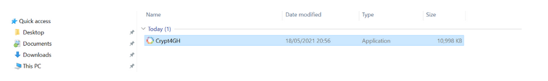
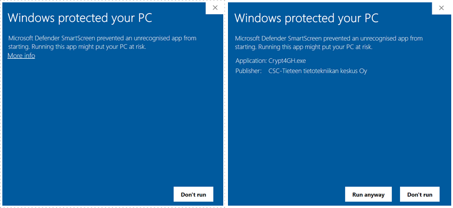
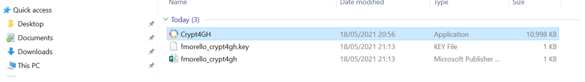
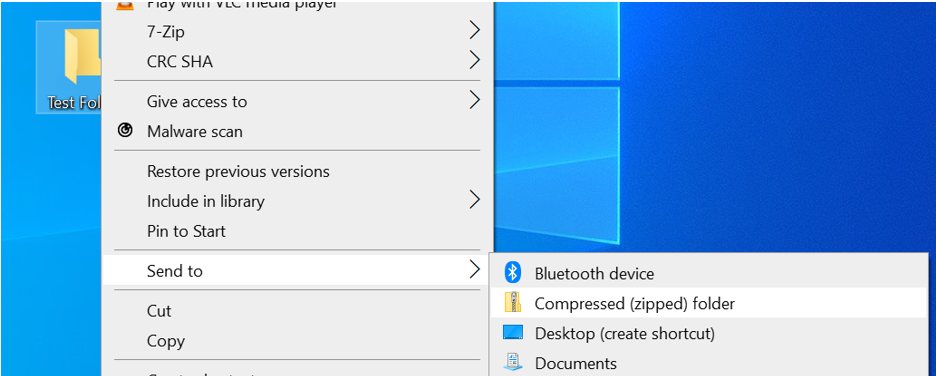
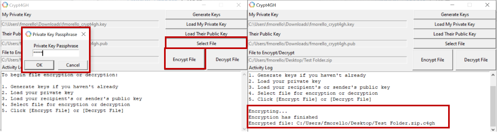
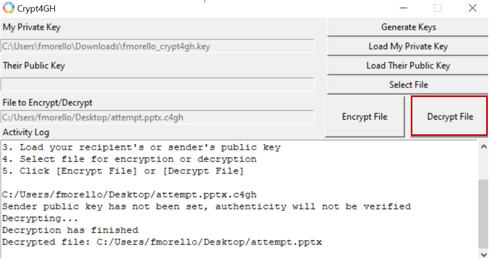

# Data encryption for data sharing

## Before you start

### Sensitive data needs to be encrypted before upload

According to CSC policies and [general terms of use](https://research.csc.fi/general-terms-of-use), sensitive data always needs to be encrypted when uploaded or stored in CSC services. Sensitive data needs to be encrypted even if, for example, downloaded from public repositories. The encryption requirement applies to the SD Connect service too. Automatic encryption during data upload has not been implemented to SD Connect yet. Because of this, at the moment, you must encrypt all the sensitive data on your local environment before you start uploading it to SD Connect. Data that is not sensitive can be uploaded without encryption.

### Crypt4GH based encryption

Crypt4GH was originally designed to encrypt and share human genetic data according to the [Global Alliance for Genomics and Health](https://www.ga4gh.org/) (GA4GH) standard, but it can be used to encrypt any type of data.

Crypt4GH uses _asymmetric encryption_, an encryption method that is based on two interlinked encryption keys:

   1) A **public key** is used for encryption but it can't decrypt the encrypted data. You can share your public key with others, e.g. your collaborators and they will then be able encrypt data with your public key. Only you will be able to decrypt the data with your own secret key.

   2) A **secret key** (also called a private key) is used for decrypting a file that has been encrypted with the corresponding public key. This key should not be made available anyone else except you, and it should password protected to ensure that it remains secret.

**When using CSC Sensitive Data Services for analyzing sensitive data you have two possibilities for encryption:**

   1) You can encrypt the data with the workflow described earlier in the SD Connect guide. With this workflow, you will encrypt a copy of your data using CSC Sensitive Data public key. In this way, when you import the data to SD Desktop, they will be decrypted in an automated manner in your own private computing environment. The data are automatically decrypted with **CSC Sensitive Data Services secret key**. This key is hosted securely by the SD Services and users never need to do the decryption themselves.

   2) You can encrypt the data with your own key pair. In this case, when imported to SD Desktop, the data needs to be decrypted manually.

**When using SD Connect to safely share (or transfer) data with your collaborators, you need to plan data encryption in advance, as you need to encrypt the data with your collaborator's public encryption key for them to be able to decrypt the data**. Using Crypt4GH CLI, it is possible to encrypt data with multiple public encryption keys. Thus, for example, the same dataset can be safely shared with multiple colleagues or collaborators.

!!! Note
    Files that have been encrypted with the _CSC Sensitive Data Services public key_, can't be used in any other services as the corresponding secret key is available only to the SD services environment. If you wish to encrypt your data for some other service, you should create another encrypted file that uses other public keys.

## Crypt4GH graphical user interface

CSC has developed a simple graphical user interface (GUI) which will allow you to generate your encryption keys, encrypt your data, and to decrypt data using Crypt4GH.

### Step 1: Install the Crypt4GH encryption GUI tool

Download the version specific to your operating system from the [GitHub repository](https://github.com/CSCfi/crypt4gh-gui/releases):  

- [Windows](https://kannu.csc.fi/s/iDiNR5HdwtFrXCY)
- [Mac](https://kannu.csc.fi/s/88MFCb4wNRt2mwb)
- [Linux](https://kannu.csc.fi/s/NAgiSeS8mFXKnC4)

Please check that the tool has been digitally signed by CSC - IT Center for Science. After the download, you can find the Crypt4GH application in your downloads folder.

.

When you open the application for the first time you might encounter an error message. In this case, click on _More info_ and verify that the publisher is CSC-IT Center for Science (or in Finnish CSC-Tieteen tietotekniikan keskus Oy) and then click on _Run anyway_.



### Step 2: Generate your encryption keys

1. Open the application and click on _Generate Keys_ (on the top right corner).
1. The tool will open a new window and ask you to insert a password (_Private Key Passphrase_). This password will be associated with your private key. Please, use a strong password!
1. When you click on _OK_, the tool will generate a key pair consisting of a private key (username_crypt4gh.key) and a public key (username_crypt4gh.pub).
1. The keys/file names will be displayed in the Activity Log with the following message:

```
Key pair has been generated, your private key will be auto-loaded the next time you launch this tool:
Private key: username_crypt4gh.key
Public key: username_crypt4gh.pub
All the fields must be filled before file encryption will be started
```



The keys will be generated and saved to the same folder in which the application resides.

!!! Note
    If you lose or forget your private key, or the password to it, you will be unable to decrypt the files. Do not share your private key or your password.

!!! Note
    You need to create your keys only once and use them for all your encryption needs but you can of course choose to generate separate keys for encryption as you wish.

### Step 3: Prepare your files

With Crypt4GH GUI it is possible to encrypt only one file at the time.

- If you need to encrypt **multiple files**, save them in one directory/folder and zip the folder (right click on the folder and click on _Send to_, next select _Compressed (zipped) folder_).
- If you need to encrypt **large datasets**, check the instructions on how to programmatically encrypt files with Crypt4GH.



### Step 4: Load the encryption keys

The Crypt4GH GUI require that you define a _secret key_ and _public key_ for encryption. The actual encryption is done with the public key and the secret key is used only for signing the encrypted file. The encryption signature can be later on used to verify, who has created the encrypted file. Due to this the secret and public keys are not always from the same key pair. If you will use the encrypted data yourself, then you should use your own secret and public keys, but if you are encrypting the data for some one else, then you should use your private key and the receivers public key. 

1. Click on _Load My Private Key_ button.
1. Select your private key (username_crypt4gh.key).
1. Click on _Open_. If the upload is successful, the tool will show the current path in the title bar.
1. Next, click on _Load Their Public Key_ button and select your public key (usernmae_crypt4gh.pub), or your collaborator public key if you need to share the encrypted data.
1. Click on _Open_.


### Step 5: Upload and encrypt the file/zipped folder

1. Click on _Select File_ and choose the file or the zipped folder that you wish to encrypt.
1. Click on _Open_ and _Encrypt File_.
1. The tool will ask the password for your personal private key and once you click on _OK_ the encryption process will begin.
1. If the encryption is successful the file/zipped folder extension will end with *.c4gh* and the Activity Log will display the following message:

```
Encrypting....

Encryption has finished.

Encrypted file: C:/users/samesurname/exampledirectory/examplefile.c4gh
```

Currently, the Crypt4GH GUI application is not provided with a progress bar. If the file/zipped folder contains a big dataset, the encryption process can last for several minutes depending on your computer's speed.



### Step 6: Data decryption

1. Access your secure computing environment in SD Desktop.
1. Next, open Crypt4GH and click on _load Your Private Key_.  
1. Click on _load Their public Key_ and upload the public key of the user, who has done the encryption. 
1. Click on _Select File_ and upload the file/zipped folder you want to decrypt.
1. Click on _Open_.
1. Next click on _Decrypt File_.
1. The tool will ask you to write the password of the private key, press _ok_. The file will be decrypted in the same location as the original file.

In the decryption process, the private key must match the public key that was used to encrypt the data.
In case of decryption, the public key is not mandatory, but if you have the public key of person who has encrypted the file
then you can use it to verify the encryption signature. If you don't select a public key, the activity log will display the following (the decryption will be executed anyway):

```
Sender public key has not been set, authenticity will not be verified.
```

If your decryption runs successfully, the activity log will display the following:

```
Decrypting.....

Decryption has finished

Decrypted file: C:/users/samesurname/exampledirectory/examplefile
```



## Crypt4GH command line interface (CLI)

For documentation and more information you can check the [Crypt4GH Encryption Utility](https://github.com/EGA-archive/crypt4gh.git) page.

In this example, we first generate your key pair (a password protected private key and a public key that can be shared with collaborators). Next, we encrypt a file with your private key and the public keys of two different collaborators (research group A and research group B).

**Python 3.6+ is required** to use the Crypt4GH encryption utility. If you need help installing Python, please follow [these instructions](https://www.python.org/downloads/release/python-3810/).

### Step 1: Install the Crypt4GH encryption CLI tool

You can install Crypt4GH directly with pip tool:

```bash
pip install crypt4gh     
```

or, if you prefer the latest sources from GitHub:

```bash
pip install -r crypt4gh/requirements.txt
pip install ./crypt4gh
```

or even:

```bash
pip install git+https://github.com/EGA-archive/crypt4gh.git
```

The usual `-h` flag shows you the different options that the tool accepts:

```bash
$ crypt4gh -h

Utility for the cryptographic GA4GH standard, reading from stdin and outputting to stdout.

Usage:
   {PROG} [-hv] [--log <file>] encrypt [--sk <path>] --recipient_pk <path> [--recipient_pk <path>]... [--range <start-end>]
   {PROG} [-hv] [--log <file>] decrypt [--sk <path>] [--sender_pk <path>] [--range <start-end>]
   {PROG} [-hv] [--log <file>] rearrange [--sk <path>] --range <start-end>
   {PROG} [-hv] [--log <file>] reencrypt [--sk <path>] --recipient_pk <path> [--recipient_pk <path>]... [--trim]

Options:
   -h, --help             Prints this help and exit
   -v, --version          Prints the version and exits
   --log <file>           Path to the logger file (in YML format)
   --sk <keyfile>         Curve25519-based Private key.
                          When encrypting, if neither the private key nor C4GH_SECRET_KEY are specified, we generate a new key
   --recipient_pk <path>  Recipient's Curve25519-based Public key
   --sender_pk <path>     Peer's Curve25519-based Public key to verify provenance (akin to signature)
   --range <start-end>    Byte-range either as  <start-end> or just <start> (Start included, End excluded)
   -t, --trim             Keep only header packets that you can decrypt

Environment variables:
   C4GH_LOG         If defined, it will be used as the default logger
   C4GH_SECRET_KEY  If defined, it will be used as the default secret key (ie --sk ${C4GH_SECRET_KEY})
```

You may notice that crypt4gh uses `--sk` option for the private key. This might seem odd but apparently crypt4gh uses term _secure key_ for private key, hence `sk`, and consequently `pk` refers to public key instead of the private key.

### Step 2: Generate your public-private keypair

You use `crypt4gh-keygen` command to create your private and public keys:

```bash
$ crypt4gh-keygen --sk mykey.sec --pk mykey.pub
Generating public/private Crypt4GH key pair.
Enter passphrase for meykey.sec (empty for no passphrase): 
Enter passphrase for mykey.sec (again): 
Your private key has been saved in mykey.sec
Your public key has been saved in mykey.pub
```

where `--sk mykey.sec` is your private (secret, sk) key and `--pk mykey.pub` is your public key (pk). The tool will ask you to enter a password (passphrase) for your private key. For security reasons the password is not shown when you type it so the tool will ask you to enter it a second time to make sure you made no typing errors (or, you make the same errors twice…). Please, use a strong password!

!!! Note
    If you lose or forget your private key, or the password to it, you will be unable to decrypt the files. Do not share your private key or your password.

!!! Note
    You need to create your keys only once and use them for all your encryption needs but you can of course choose to generate separate keys for encryption as you wish.

### Step 3: Encrypt a file

To ecrypt files you will need 1) your private and public keys, and 2) your recipients' public keys. As stated before, in this example we are sharing the data with two recipients (research groups A and B) and hence, we have received their public keys somehow (e.g. via email). To encrypt a file you use `crypt4gh encrypt` command:

```bash
$ crypt4gh encrypt --sk mykey.sec --recipient_pk groupA.pub --recipient_pk groupB.pub <dog.jpg >dog.jpg.c4gh
Passphrase for mykey.sec: 
```

where `--sk mykey.sec` is your private key, `--recipient_pk groupA.pub` is the research group A's public key, and `--recipient_pk groupB.pub` is the research group B's public key. The `crypt4gh` command uses only standard input (stdin) and standard output (stdout) so you must use shell redirections: `<` denotes an input file and `>` and denotes an output file, hence `<dog.jpg` reads in a file called _dog.jpg_ and `>dog.jpg.c4gh` writes out an encrypted file named _dog.jpg.c4gh`.

The command will ask you to enter the password (passphrase) of your private key. For security reasons the password is not displayed when you type it.

!!! Note
    If you want to be able to decrypt the file yourself you must add your own public key also as a recipient.

### Step 4: Decrypt a file

To decypt a file you will need a private key which corresponds to one of the public keys used in encryption phase. Let's assume in our example that the research group A is decrypting a file you've sent them. To decrypt a file you use `crypt4gh decrypt` command:

```bash
crypt4gh decrypt --sk groupA.sec <dog.jpg.c4gh >dog.jpg
Passphrase for groupA.sec: 
```

where `--sk groupA.sec` is a corresponding private key to one of the public keys used in the encryption. The `crypt4gh` command uses only standard input (stdin) and standard output (stdout) so you must use shell redirections: `<` denotes an input file and `>` and denotes an output file, hence `<dog.jpg.c4gh` reads in an ecrypted file called _dog.jpg.c4gh_ and `>dog.jpg` writes out a decrypted file named _dog.jpg_.

The command will ask you to enter the password (passphrase) of your private key. For security reasons the password is not displayed when you type it.

!!! Note
    In case you are decrypting the file in SD Desktop and the CSC Sensitive Data public key has been used in encryption, decryption will be done automatically and you do not need to specify any decryption keys.
    
  # Troubleshooting
  | Problem               |                                                                                       | Possible Solution                                                                                                                                                                                                                                                                                                                                                            |
|-----------------------|---------------------------------------------------------------------------------------|------------------------------------------------------------------------------------------------------------------------------------------------------------------------------------------------------------------------------------------------------------------------------------------------------------------------------------------------------------------------------|
| Decryption            | I cannot decrypt the data I downloaded from CSC services.                             | You can decrypt the data only if you have used your own public key for the encryption. If you used a CSC Sensitive Data Services public for the encryption, the data can be decrypted only in SD Desktop. In that case, the decryption is automatic. If you used your collaborator’s public key to encrypt the data, only they can decrypt the data with their private key.  |
| Encryption            | Encryption takes a long time.                                                         | For large files and datasets, the encryption can take up to a few minutes.                                                                                                                                                                                                                                                                                                   |
| Folder encryption     | I can not select the folder I want to encrypt with Crypt4GH graphical user interface. | It is not possible to encrypt an entire folder, just single files                                                                                                                                                                                                                                                                                                            |
| Password              | I cannot remember the password of my personal private key.                            | If you lose or forget your private key, or the password to it, you will be unable to decrypt the files.  The same applies if you have lost your private key.                                                                                                                                                                                                                 |
| Public encryption key | I am not able to add more than one public encryption key during data encryption       | With the Crypt4GH GUI, the encryption is possible only with one public key. If you want to add multiple public keys, use the Crypt4GH command line interface.                                                                                                                                                                                                                |
    
    
    
