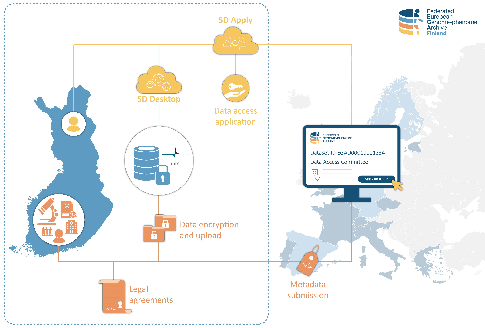

# Federated European Genome-phenome Archive (FEGA)

Federated European Genome-phenome Archive (FEGA) is a service for storing and sharing human genetic and phenotypic data consented for research. The service is based on a European network of local repositories. CSC hosts Finnish FEGA. 

You can use FEGA either to submit or apply access to biomedical datasets. The service allows you to store sensitive research data under controlled access in Finland. At the same time, the public study information (metadata) is made internationally available in central [European Genome-phenome Archive](https://ega-archive.org/studies) (EGA). Each dataset is associated with a Data Access Committee (DAC), which evaluates data access applications and can grant or deny data access for re-use. If the application is approved, the applicant can directly access and analyse the sensitive data in a secure and private cloud workspace using CSC Sensitive Data Services for research. 

The following is a step-by-step guide to Finnish FEGA that illustrates:

- **[Data access application](https://github.com/CSCfi/csc-user-guide/blob/wip-at-fega/docs/data/sensitive-data/federatedega.md#data-access-application)**
    - [For Data Applicants](https://github.com/CSCfi/csc-user-guide/edit/wip-at-fega/docs/data/sensitive-data/federatedega.md#for-data-applicants)
    - [For Data Access Committee](https://github.com/CSCfi/csc-user-guide/edit/wip-at-fega/docs/data/sensitive-data/federatedega.md#for-data-access-committee-dac)
- **[Data submission](https://github.com/CSCfi/csc-user-guide/edit/wip-at-fega/docs/data/sensitive-data/federatedega.md#data-submission)**

!!! note
    For more information, check Federated EGA [service description](https://research.csc.fi/-/fega) in CSC service catalog and [CSC sensitive Data Services for research webpage](https://research.csc.fi/sensitive-data-services-for-research).

## Useful terminology

- **Central EGA**. Central European Genome-phenome Archive. When submitting data to FEGA, the metadata is made internationally available in central EGA. 

- **Data Access Committee (DAC)**. Individual or group of individuals who are controllers for a dataset stored at FEGA and are responsible for approving and rejecting access requests to that dataset.

- **Data Applicant**. Individual who applies access to sensitive data or metadata that has been stored at FEGA.

- **Data Submitter**. Individual who uploads data, metadata, and other information to FEGA for re-use under controlled access. The data submitter represents data owner organisation during the submission process.

- **Finnish FEGA**. A national repository for biomedical data consented for research. CSC hosts Finnish FEGA. The research data uploaded to Finnish FEGA will remain under controlled access in Finland.

