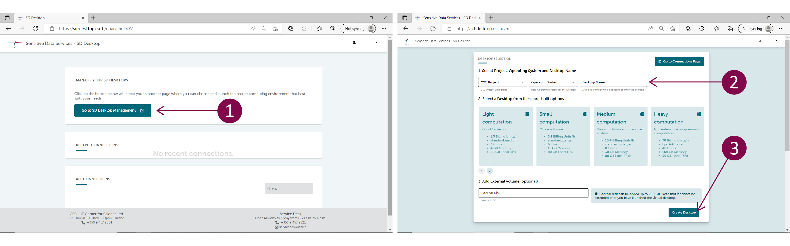
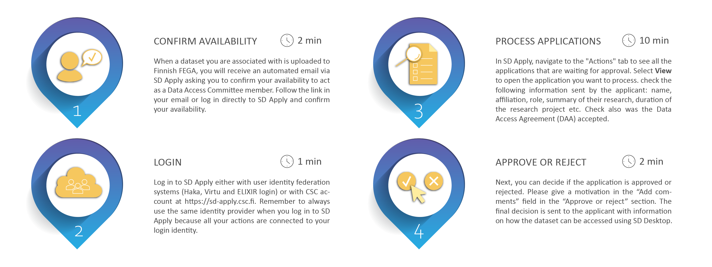

# Federated European Genome-phenome Archive (FEGA)

Federated European Genome-phenome Archive (FEGA) is a service for storing and sharing human genetic and phenotypic data consented for research. The service is based on a European network of local repositories. CSC hosts Finnish FEGA. 

You can use FEGA either to submit or apply access to biomedical datasets. The service allows you to store sensitive research data under controlled access in Finland. At the same time, the public study information (metadata) is made internationally available in central [European Genome-phenome Archive](https://ega-archive.org/studies) (EGA). Each dataset is associated with a Data Access Committee (DAC), which evaluates data access applications and can grant or deny data access for re-use. If the application is approved, the applicant can directly access and analyse the sensitive data in a secure and private cloud workspace using CSC Sensitive Data Services for research. 

!!! note
    For more information, check Federated EGA [service description](https://research.csc.fi/-/fega) in CSC service catalog and [CSC sensitive Data Services for research webpage](https://research.csc.fi/sensitive-data-services-for-research).

The following is a step-by-step guide to Finnish FEGA that illustrates:

- **[Data access application](https://github.com/CSCfi/csc-user-guide/blob/wip-at-fega/docs/data/sensitive-data/federatedega.md#data-access-application)**
    - [For Data Applicants](https://github.com/CSCfi/csc-user-guide/edit/wip-at-fega/docs/data/sensitive-data/federatedega.md#for-data-applicants)
    - [For Data Access Committee](https://github.com/CSCfi/csc-user-guide/edit/wip-at-fega/docs/data/sensitive-data/federatedega.md#for-data-access-committee-dac)
- **[Data submission](https://github.com/CSCfi/csc-user-guide/edit/wip-at-fega/docs/data/sensitive-data/federatedega.md#data-submission)**

## Useful terminology

- **Central EGA**. Central European Genome-phenome Archive. When submitting data to FEGA, the metadata is made internationally available in central EGA. 

- **Data Access Committee (DAC)**. Individual or group of individuals who are controllers for a dataset stored at FEGA and are responsible for approving and rejecting access requests to that dataset.

- **Data Applicant**. Individual who applies access to sensitive data or metadata that has been stored at FEGA.

- **Data Submitter**. Individual who uploads data, metadata, and other information to FEGA for re-use under controlled access. The data submitter represents data owner organisation during the submission process.

- **Finnish FEGA**. A national repository for biomedical data consented for research. CSC hosts Finnish FEGA. The research data uploaded to Finnish FEGA will remain under controlled access in Finland.

## Data access application

### For Data Applicants

[](images/fega/fega_application_overview.png)

1.    To access a specific dataset hosted in Finnish FEGA, navigate to the [EGA webpage](https://ega-archive.org/studies) and search for a particular study, dataset, or DAC using the search field at the top of the page. Then, in the Study view, click on the Dataset ID (EGADNNNN). In the Dataset view, under “Who controls access to this dataset”, click on the link that allows you to access the application form using SD Apply. SD Apply is a service for applying access rights to sensitive datasets stored at CSC. For more information about SD Apply and the application process, please check [SD Apply user guide](https://docs.csc.fi/data/sensitive-data/sd-apply/).

2.    Log in to SD Apply either with user identity federation systems (Haka, Virtu and ELIXIR login) or with CSC account. Remember to always use the same identity provider when you log in to SD Apply because all your actions are connected to your login identity.

3.    Follow the instructions on the application form and fill in the required fields (State, Applicants, Resources, Terms of use and Application). To submit your application, select *Send application* under Actions.  
[](images/fega/apply_application.png)
4.    After you have sent the application, it will be forwarded to the Data Access Committee, which evaluates it and grants the access rights. You can follow the approval process and read the possible comments from the "Events" section of the application. In addition, you can find all your applications and see their state from the "Applications" tab.

5.    Once your application has been approved, you will receive a notification and further instructions via email. You can now access the data in SD Desktop, a private cloud computing environment part of CSC Sensitive Data Services for research. For more information about SD Desktop, check [SD Desktop user guide](https://docs.csc.fi/data/sensitive-data/sd_desktop/). Login to SD Desktop is possible using CSC account, Haka or ELIXIR login. Use the same user account you have used for SD Apply login. After entering your username and passworod, you need to verify your identity (or Multi factor Authentication, MFA) by entering the verification code provided via a mobile application.  
[](images/fega/desktop_login.png)
6.    Once you sign in to your virtual Desktop, you can access the data using Data Gateway application. Open the application on your Desktop and select SD Apply. Add your CSC credentials. Click on *Login* and next click on *Continue*. In the new window, at the end of the page, click on *Create Data Gateway*. The application will create a new folder called Projects accessible from your Desktop or programmatically. To access the data, click on *Open folder*.  
[](images/fega/desktop_launch.png)
7.    Once your analysis is completed, you can export the results from the computing environment. After that, the data access will be revoked. To get access to the same dataset, you need to start a new application process.

!!! note
    If you are a new CSC user, please check these instructions on CSC [accounts](https://docs.csc.fi/accounts/) and [multi-factor authentication](https://docs.csc.fi/accounts/mfa/). Check also the [SD Desktop user guide](https://docs.csc.fi/data/sensitive-data/sd_desktop/) and [CSC Sensitive Data Services for Research webpage](https://research.csc.fi/sensitive-data-services-for-research) for more information.  

### For Data Access Committee (DAC)

[](images/fega/fega_dac_overview.png)

Data Access Committee (DAC) is established during the data submission process and all the communication between DAC and the data applicant is managed using SD Apply. Each DAC is linked to a specific dataset present in the SD Apply catalogue. DAC members can process data access applications separately, thus only one DAC member needs to approve or reject the application. The SD Apply user interface guides you during the data access revision process. For more information about SD Apply and the data approval process, please check [SD Apply user guide](https://docs.csc.fi/data/sensitive-data/sd-apply/).

1. When a dataset you are associated with is uploaded to Finnish FEGA, you will receive an automated email via SD Apply asking you to confirm your availability to act as a Data Access Committee member. Follow the link in your email or log in directly to SD Apply at <https://sd-apply.csc.fi/> and confirm your availability. 
 
2. As a DAC member you receive an email notification via SD Apply, when an applicant applies for data access. Log into SD Apply with your Haka or ELIXIR account. 

3. In SD Apply, under “Actions”, check the following information sent by the applicant: name, affiliation, role, summary of their research, duration of the research project etc. Check also was the Data Access Agreement (DAA) accepted. You can ask for more information from the applicant if necessary.

4. Next, you can decide if the application is approved or rejected. Please give a motivation in the “Add comments” field in the “Approve or reject” section. The final decision is sent to the applicant with information on how the dataset can be accessed using SD Desktop.

!!! note
    Every action is recorded in SD Apply (e.g. previous applications from the same applicant are available).

## Data submission
### Submission process overview 
[](images/fega/fega_submission_overview.png)

### Step 1: Application form
Submission to the FEGA service starts with authorization of a person(s) that will represent data owner organization during the submission process. The FEGA service will provide customer support only to the named person(s).

To begin the submission process, please fill in the [application form](https://docs.csc.fi/data/sensitive-data/fega-application.docx) with contact information, details about the data submission type and information about the data controller. Send the filled form via email to servicedesk@csc.fi (subject: Federated EGA). You will receive further instructions.

!!! note
    
    - Data submission might take up to a month or more. Therefore, please get in touch with us well in advance (before submitting your manuscript to a scientific journal). In this way, we can offer proper support and guide you during the entire process.
    
    - Please use the same email thread throughout the whole submission process.
    
### Step 2: Legal agreements 
Each user must provide a series of legal agreements to confirm that they have the authority and permission to deposit data in FEGA. Download the necessary documentation below and share the agreements concerning the data controller with the legal service of your home organisation. Please note that your organisation may already have some required agreements in place with CSC. We will provide support if additional agreements are needed. Send the finalised documents via email to servicedesk@csc.fi by replying to the previous email of the CSC helpdesk. 

!!! note
    The required legal documents state the roles of a data processor and a data controller, which are defined in the General Data Protection Regulation (GDPR). CSC acts always as a data processor. In most research projects, the data controller is an academic organisation or other legal entity. The ownership of the data does not change by using this service.

Here’s a list of the required documents:

- **[Data Processing Agreement](https://research.csc.fi/data-processing-agreement)** (DPA). A data processing agreement (DPA) is a contract between the data controller and the data processor. It regulates the particularities of data processing – such as its scope and purpose – as well as the rights and duties between the controller and the processor. 

- **[CSC General terms of use](https://research.csc.fi/general-terms-of-use)**.

- **[Description of the data processing activities](https://docs.csc.fi/data/sensitive-data/data-processing-form.docx)**.

- **Data Protection Impact Assessment (DPIA)**. In case you need to draft a DPIA, you can find the technical and organisational security measures for the protection of sensitive data in CSC Sensitive Data Services available for download [here](https://docs.csc.fi/data/sensitive-data/technical-organisational-sec-measures.pdf).

- **Names and contact information of the Data Access Committee**.
<br/><br/>

**Data Access Agreement (DAA)**. In addition to the legal documents listed above, you should provide a DAA via SD Apply. The DAA is a contract between the Data Access Committee ([DAC](https://ega-archive.org/submission/data_access_committee)) and an applicant. The DAA includes all the policies regulating data re-use (e.g. data use, publication, download, or access) and it will be linked to each submitted dataset. For more info and examples, please check [DAC and policy documentation](https://ega-archive.org/submission/dac/documentation) and [Data Use Conditions](https://ega-archive.org/data-use-conditions) on EGA webpage. 

1. To provide the DAA, log in to SD Apply at <https://sd-apply.csc.fi/>. SD Apply is a service for applying access rights to sensitive datasets stored at CSC. For more information about SD Apply, please check [SD Apply user guide](https://docs.csc.fi/data/sensitive-data/sd-apply/). Login is possible either with user identity federation systems (Haka, Virtu and ELIXIR login) or with CSC account. 

2. 


### Step 3: Credentials
Once the legal agreements between the data controller and CSC are finalised, you can request the central EGA credentials by sending an email to the central EGA helpdesk at helpdesk@ega-archive.org. You will receive the credentials via email. 

!!! note
    Central EGA credentials, including a username (format: ega-box-NNN) and a password, are required for the encryption and data upload to Finnish FEGA and for the metadata submission to the submitter portal of central EGA.
    
### Step 4: Data formats
Before uploading the data to FEGA, you must prepare the datasets and verify the data formats. Some examples of the accepted formats are listed below.

!!! note
    A dataset is usually defined as a set of files belonging to the same experiment and data type. One study can be linked to multiple datasets. Your study may include both sensitive (e.g. human genetic or phenotypic information) and non-sensitive data (e.g. viral sequences, metabolites). Only the sensitive data can be submitted to FEGA. The non-sensitive data can be published openly in appropriate repositories. In this case, the sample accessions generated at the repository should be referenced in the FEGA submission.
    
**Sensitive Data**:

- **sequence data**: CRAM, BAM, FASTQ, VCF formats

- **array data**: Data from all types of array-based technologies, such as genotypes, gene expression, methylations etc. is accepted. Central EGA also recommends submitting raw data (IDATs, CELs, final reports) and any analysis files.

- **metagenomics**: EGA has adopted the suite of [Minimum Information about any (x) Sequence (MIxS)](https://press3.mcs.anl.gov/gensc/projects/mixs-gsc-project/) standards to describe data of this type.

- **phenotypic information**: No specific format. Where possible, we recommend using the Experimental Factor Ontologies. To search for the correct ontology terms and to describe your phenotypic data, check the [Ontology Lookup Service (OLS)](https://www.ebi.ac.uk/ols/ontologies/efo) developed by EMBL-EBI.

- **linking files**: If non-sensitive datasets belonging to the same study have been submitted to a specific repository, the samples can be linked to sensitive information submitted to FEGA for the same sample. The datasets should have different anonymised sample IDs in each archive. The IDs obtained in the appropriate archive can then be referenced in the FEGA submission. For example, the sample ID can be linked in an additional .txt file that can be added to one of the sensitive datasets above.

**Non-sensitive data**:

Non-sensitive data (or open data) needs to be submitted in appropriate archives. For example, sequences to the ENA [European Nucleotide Archive](https://www.ebi.ac.uk/ena/browser/home), variants to EVA [European Variation Archive](https://www.ebi.ac.uk/eva/), array-based to [ArrayExpress – functional genomics data](https://www.ebi.ac.uk/arrayexpress/), phenotypes to [BioSamples](https://www.ebi.ac.uk/biosamples/) and GWAS summary statistics to the [GWAS Catalog](https://www.ebi.ac.uk/gwas/).

!!! note
    For more information about data types and formats, check [Central EGA webpage](https://ega-archive.org/submission/sequence) or contact us at servicedesk@csc.fi (subject: Federated EGA).

### Step 5: Data encryption and upload 
Next, you can upload the data to Finnish FEGA. Each file uploaded to Finnish FEGA needs to be encrypted. 

!!! note
    The data is encrypted with a FEGA public encryption key using crypt4gh, a tool designed to encrypt and share human genetic data according to the Global Alliance for Genomics and Health (GA4GH) standard.
    
You can carry out the encryption and upload steps using:

- **Fi-FEGA upload application**. The Fi-FEGA upload application (graphical user interface) can be used to encrypt and upload files or folders automatically to Finnish FEGA.

or

- **Command-line interface**. Data encryption with crypt4gh CLI and data upload with sftp CLI. If you prefer to use the command-line interface, you can find information on the encryption and upload step below. 

#### Fi-FEGA upload application

1. You can download the Fi-FEGA upload application specific to your operating system from the GitHub repository: Linux, Mac or Windows. After downloading and unzipping the file, you can find the application in your download folder. When you open the application, you might encounter an error message. In this case, click on *More info* and verify that the publisher is CSC-IT Center for Science (or in Finnish: CSC-Tieteen tietotekniikan keskus Oy) and click on *Run anyway*. 

2. Next, download the Finnish FEGA public encryption key. 

3. Open the upload application and click on *Load recipient public key*. This opens a file browser that you can use to select the Finnish FEGA public encryption key (example_ega.key). Next, click on *Open*.

4. Click on *Select file to upload* or *Select directory to upload* to upload a single file or an entire folder. 

5. Next, you need to fill in the SFTP (or secure connection) credentials, which correspond to your Central EGA account username. In SFTP Username, write your EGA username (ega-box-NNN). In SFTP Server, write the following: test.sd.csc.fi:9002. Loading an SFPT key is not required for data uploads to FEGA.

6. Click on *Encrypt and upload files*. The tool will ask the SFTP Passphrase, which corresponds to your Central EGA account password. After clicking on OK, the application will start the data encryption and upload. 

7. The application is not provided with a progress bar. Data encryption and upload can take minutes or up to several hours, depending on the size of the dataset. Data upload is successfully finished when the activity log in the application visualises the following message: Disconnecting SFPT. SFPT has been disconnected.

8. Please inform the Finnish FEGA helpdesk via email (servicedesk@csc.fi) when you have completed the data encryption and upload to Finnish FEGA. You will receive further instructions for the metadata submission.

[](images/fega/fega_upload.png)

#### Command line interface
**Data encryption with crypt4gh CLI**:

1.	Python 3.6+ is required to use the Crypt4GH encryption utility. If you need help with installing Python, please follow [these instructions](https://www.python.org/downloads/release/python-3810/).

2.	Open a terminal and install Crypt4GH directly with pip tool:
```
pip install crypt4gh
```

3.	To encrypt a file with the Finnish FEGA public encryption key use ```crypt4gh encrypt``` command:
 
```
$ crypt4gh encrypt  --recipient_pk finnishfega.pub < example_file.txt > example_file.txt.c4gh
```

Where the syntax *--recipient_pk* defines the public key used to encrypt the data. In this case, Finnish FEGA public key *example_file.txt.c4gh* defines the input file and output encrypted file. 

**Data upload with sfpt CLI (default in Linux and Mac OS)**:

Open a terminal and transfer the encrypted files or directory with the following syntax, where ega_user is the EGA credentials username ega-box-8903:

```
sftp -o UserKnownHostsFile=/dev/null -o StrictHostKeyChecking=no -P 9002 <ega_user>@test.sd.csc.fi
```

Please inform the Finnish FEGA helpdesk via email (servicedesk@csc.fi) when you have completed the data encryption and upload to Finnish FEGA. You will receive further instructions for the metadata submission.

### Step 6: Metadata submission

Next, you can describe all the information related to your study, i.e. metadata, using the central [EGA submitter portal](https://test.ega-archive.org/submitter-portal/) or [programmatically](https://ega-archive.org/submission/sequence/programmatic_submissions). The public metadata will be published on the EGA website to facilitate data discovery and re-use.

Log in to the submitter portal using the EGA credentials (username: ega-box-NNN and password). Specific guidance on EGA submitter portal can be found on EGA website: [user guide and video tutorials](https://ega-archive.org/submission/tools/submitter-portal).

Using the submitter portal, you can register the following metadata objects:

- **Study**. Information about the sequencing study.

- **Samples**. Information about the sequencing samples.

- **Experiments**. Information about the sequencing methods, protocols, and machines.

- **Runs**. Samples, experiments, and files are linked through runs. Appropriate objects for FASTQ and BAM/CRAM submissions.

- **Analysis**. References the analysis (BAM) files. Associated with samples and study. Analysis should be only be used for BAM/BAI pair, VCF and phenotype linkage to samples. The analysis is an EGA specific metadata object that links Samples, to Files.

- **DAC**. Contains information about the Data Access Committee (DAC).

- **Policy**. Contains the Data Access Agreement (DAA). Associated with DAC.

- **Dataset**. Contains the collection of runs/analysis data files to be subject to controlled access. Associated with Policy.

After data release, each of these objects will be assigned with a permanent identifier or unique accession number.

!!! note
    
    - Study, Samples, DAC, and Policy metadata can all be registered before uploading files, while run and analysis objects cannot be registered until at least 24 hours after the files have been uploaded to Finnish FEGA.
    
    - If you are performing array-based submission(s), the submitter portal should only be used to register the Study, Samples, Data Access Committee (DAC), and Policy metadata objects. In contrast, the other metadata objects need to be registered using an excel template.

#### Dataset application link
After uploading the data to Finnish FEGA, you will receive a dataset application link for each dataset via email from the CSC helpdesk. The dataset application links must be added to each metadata submission in EGA submitter portal. In order to add the dataset application link to the submission, you must register a new Policy metadata object for each dataset. Create a policy and select the checkbox “The policy has an url.” under the Policy field. Write the dataset application link in the popping up “Policy URL” textbox.

!!! note
    If someone wants to apply access to your dataset stored in Finnish FEGA, they must click the dataset application link on the EGA website. The link will direct the user to the application form in SD Apply. SD Apply is a service for applying access rights to sensitive datasets stored at CSC.
    
### Step 7: Data release
To finalise your submission, write to servicedesk@csc.fi to confirm that the submission can be released and add the following information from the submitter portal:

- Name of the submission (as on the submitter portal)

- Study Accession number (EGAS)

- Dataset Accession number (EGAD)

- Appropriate Data Use Ontology codes (DUO). You can find more information in Data Use Conditions on EGA webpage. 

CSC helpdesk and central EGA helpdesk will work together to complete the release process. You will receive confirmation of successful submission and accessions suitable for publication, grants, etc. from the CSC helpdesk.
