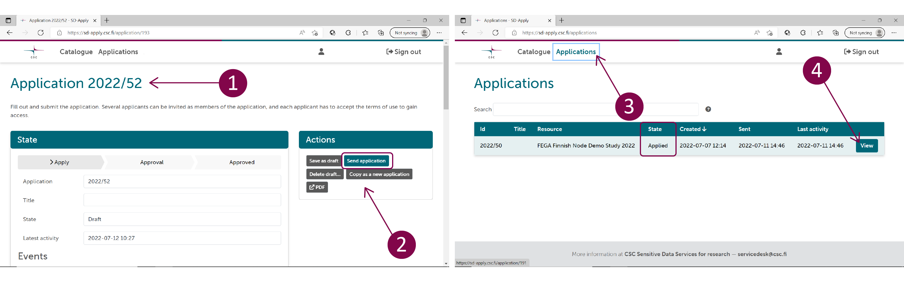

# Federated European Genome-phenome Archive (FEGA)

Federated European Genome-phenome Archive (FEGA) is a service for storing and sharing human genetic and phenotypic data consented for research. The service is based on a European network of local repositories. CSC hosts Finnish FEGA. 

You can use FEGA either to submit or apply access to biomedical datasets. The service allows you to store sensitive research data under controlled access in Finland. At the same time, the public study information (metadata) is made internationally available in central [European Genome-phenome Archive](https://ega-archive.org/studies) (EGA). Each dataset is associated with a Data Access Committee (DAC), which evaluates data access applications and can grant or deny data access for re-use. If the application is approved, the applicant can directly access and analyse the sensitive data in a secure and private cloud workspace using CSC Sensitive Data Services for research. 

The following is a step-by-step guide to Finnish FEGA that illustrates:

- **[Data access application](https://github.com/CSCfi/csc-user-guide/blob/wip-at-fega/docs/data/sensitive-data/federatedega.md#data-access-application)**
    - [For Data Applicants](https://github.com/CSCfi/csc-user-guide/edit/wip-at-fega/docs/data/sensitive-data/federatedega.md#for-data-applicants)
    - [For Data Access Committee](https://github.com/CSCfi/csc-user-guide/edit/wip-at-fega/docs/data/sensitive-data/federatedega.md#for-data-access-committee-dac)
- **[Data submission](https://github.com/CSCfi/csc-user-guide/edit/wip-at-fega/docs/data/sensitive-data/federatedega.md#data-submission)**

!!! note
    For more information, check Federated EGA [service description](https://research.csc.fi/-/fega) in CSC service catalog and [CSC sensitive Data Services for research webpage](https://research.csc.fi/sensitive-data-services-for-research).

## Useful terminology

- **Central EGA**. Central European Genome-phenome Archive. When submitting data to FEGA, the metadata is made internationally available in central EGA. 

- **Data Access Committee (DAC)**. Individual or group of individuals who are controllers for a dataset stored at FEGA and are responsible for approving and rejecting access requests to that dataset.

- **Data Applicant**. Individual who applies access to sensitive data or metadata that has been stored at FEGA.

- **Data Submitter**. Individual who uploads data, metadata, and other information to FEGA for re-use under controlled access. The data submitter represents data owner organisation during the submission process.

- **Finnish FEGA**. A national repository for biomedical data consented for research. CSC hosts Finnish FEGA. The research data uploaded to Finnish FEGA will remain under controlled access in Finland.

## Data access application

### For Data Applicants

1.    To access a specific dataset hosted in Finnish FEGA, navigate to the [EGA webpage](https://ega-archive.org/studies) and search for a particular study, dataset, or DAC using the search field at the top of the page. Then, in the Study view, click on the Dataset ID (EGADNNNN). In the Dataset view, under “Who controls access to this dataset”, click on the link that allows you to access the application form using SD Apply. SD Apply is a service for applying access rights to sensitive datasets stored at CSC. For more information about SD Apply and the application process, please check [SD Apply user guide](https://docs.csc.fi/data/sensitive-data/sd-apply/).

2.    Log in to SD Apply either with user identity federation systems (Haka, Virtu and ELIXIR login) or with CSC account. Remember to always use the same identity provider when you log in to SD Apply because all your actions are connected to your login identity.

3.    Follow the instructions on the application form and fill in the required fields (State, Applicants, Resources, Terms of use and Application). To submit your application, select *Send application* under Actions.  

4.    After you have sent the application, it will be forwarded to the Data Access Committee, which evaluates it and grants the access rights. You can follow the approval process and read the possible comments from the "Events" section of the application. In addition, you can find all your applications and see their state from the "Applications" tab.

5.    Once your application has been approved, you will receive a notification and further instructions via email. You can now access the data in SD Desktop, a private cloud computing environment part of CSC Sensitive Data Services for research. For more information about SD Desktop, check [SD Desktop user guide](https://docs.csc.fi/data/sensitive-data/sd_desktop/). Login to SD Desktop is possible using CSC account, Haka or ELIXIR login. Use the same user account you have used for SD Apply login. After entering your username and passworod, you need to verify your identity (or Multi factor Authentication, MFA) by entering the verification code provided via a mobile application.  

6.    Once you sign in to your virtual Desktop, you can access the data using Data Gateway application. Open the application on your Desktop and select SD Apply. Add your CSC credentials. Click on *Login* and next click on *Continue*. In the new window, at the end of the page, click on *Create Data Gateway*. The application will create a new folder called Projects accessible from your Desktop or programmatically. To access the data, click on *Open folder*.  

7.    Once your analysis is completed, you can export the results from the computing environment. After that, the data access will be revoked. To get access to the same dataset, you need to start a new application process.

!!! note
    If you are a new CSC user, please check these instructions on CSC [accounts](https://docs.csc.fi/accounts/) and [multi-factor authentication](https://docs.csc.fi/accounts/mfa/). Check also the [SD Desktop user guide](https://docs.csc.fi/data/sensitive-data/sd_desktop/) and [CSC Sensitive Data Services for Research webpage](https://research.csc.fi/sensitive-data-services-for-research) for more information.  

### For Data Access Committee (DAC)

Data Access Committee (DAC) is established during the data submission process and all the communication between DAC and the data applicant is managed using SD Apply. Each DAC is linked to a specific dataset present in the SD Apply catalogue. DAC members can process data access applications separately, thus only one DAC member needs to approve or reject the application. The SD Apply user interface guides you during the data access revision process. For more information about SD Apply and the data approval process, please check [SD Apply user guide](https://docs.csc.fi/data/sensitive-data/sd-apply/).

1. When a dataset you are associated with is uploaded to Finnish FEGA, you will receive an automated email via SD Apply asking you to confirm your availability to act as a Data Access Committee member. Follow the link in your email or log in directly to SD Apply at <https://sd-apply.csc.fi/> and confirm your availability. 
 
2. As a DAC member you receive an email notification via SD Apply, when an applicant applies for data access. Log into SD Apply with your Haka or ELIXIR account. 

3. In SD Apply, under “Actions”, check the following information sent by the applicant: name, affiliation, role, summary of their research, duration of the research project etc. Check also was the Data Access Agreement (DAA) accepted. You can ask for more information from the applicant if necessary.

4. Next, you can decide if the application is approved or rejected. Please give a motivation in the “Add comments” field in the “Approve or reject” section. The final decision is sent to the applicant with information on how the dataset can be accessed using SD Desktop.

!!! note
    Every action is recorded in SD Apply (e.g. previous applications from the same applicant are available).

