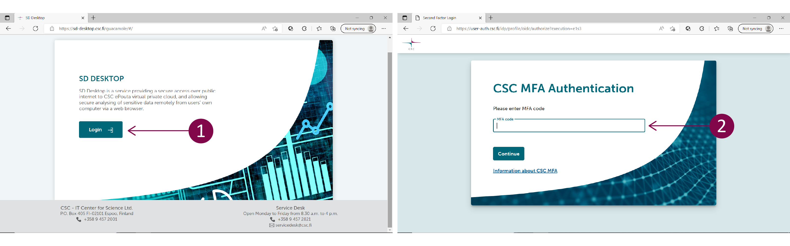

# Data access application

<iframe width="280" height="155" srcdoc="https://www.youtube.com/embed/pR0DQo11g0U" title="YouTube video player" frameborder="0" allow="accelerometer; autoplay; clipboard-write; encrypted-media; gyroscope; picture-in-picture" allowfullscreen></iframe>

## Application process overview

## Step 1: Apply for access
To access a specific dataset hosted in Finnish FEGA, navigate to the [EGA webpage](https://ega-archive.org/studies) and search for a particular study, dataset, or DAC using the search field at the top of the page. Then, in the Study view, click on the Dataset ID (EGADNNNN). In the Dataset view, under “Who controls access to this dataset”, click on the link that allows you to access the application form using SD Apply. SD Apply is a service for applying access rights to sensitive datasets stored at CSC. For more information about SD Apply and the application process, please check [SD Apply user guide](./sd-apply.md).

!!! note
    In the EGA webpage, you can also find datasets that are hosted outside Finland, in central EGA or other FEGA nodes. However, this workflow is specific for datasets that are hosted in Finnish FEGA. 

## Step 2: Log in to SD Apply
Log in to SD Apply either with user identity federation systems (Haka, Virtu and ELIXIR login) or with CSC account. Remember to always use the same identity provider when you log in to SD Apply because all your actions are connected to your login identity.

## Step 3: Submit the application
Follow the instructions on the application form and fill in the required fields (State, Applicants, Resources, Terms of use and Application). To submit your application, select *Send application* under Actions.  

## Step 4: Wait for approval
After you have sent the application, it will be forwarded to the Data Access Committee, which evaluates it and grants the access rights. You can follow the approval process and read the possible comments from the "Events" section of the application. In addition, you can find all your applications and see their state from the "Applications" tab.

## Step 5: Set up your Desktop
Once your application has been approved, you will receive a notification and further instructions via email. You can now access the data in SD Desktop, a private cloud computing environment part of CSC Sensitive Data Services for research. For more information about SD Desktop, check [SD Desktop user guide](./sd_desktop.md). Login to SD Desktop is possible using CSC account, Haka or ELIXIR login. Use the same user account you have used for SD Apply login. After entering your username and passworod, you need to verify your identity (or Multi factor Authentication, MFA) by entering the verification code provided via a mobile application.  

## Step 6: Access the data
Once you sign in to your virtual Desktop, you can access the data using Data Gateway application. Open the application on your Desktop and select SD Apply. Add your CSC credentials. Click on *Login* and next click on *Continue*. In the new window, at the end of the page, click on *Create Data Gateway*. The application will create a new folder called Projects accessible from your Desktop or programmatically. To access the data, click on *Open folder*.  

## Step 7: Export the results
Once your analysis is completed, you can export the results from the computing environment. After that, the data access will be revoked. To get access to the same dataset, you need to start a new application process.

!!! note
    If you are a new CSC user, please check these instructions on CSC [accounts](../../accounts/index.md) and [multi-factor authentication](../../accounts/mfa.md). Check also the [SD Desktop user guide](./sd_desktop.md) and [CSC Sensitive Data Services for Research webpage](https://research.csc.fi/sensitive-data-services-for-research) for more information.  

