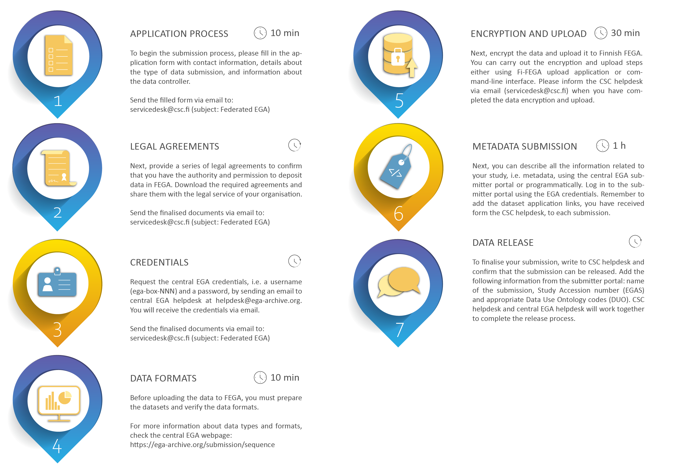
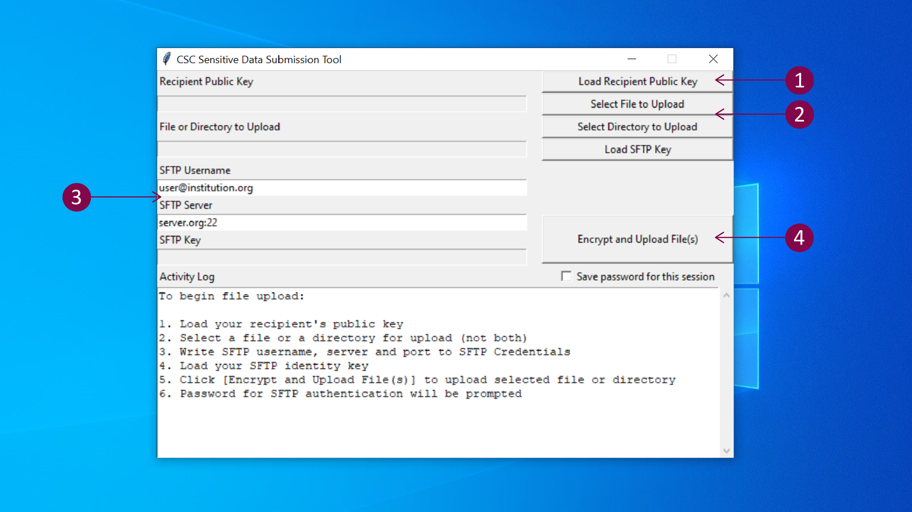

# Data submission

Below, you will find step-by-step instructions for uploading, describing, and publishing biomedical data via the Finnish Federated EGA. Please be aware that this process can be lengthy (anywhere between one to four months), but we will support you at every step. Requests will be processed in the order they are received. 

!!! Note
    Before you begin, it's crucial to ensure that a service agreement specific to the Federated EGA service is in place between CSC (as data processor) and your home organization (or data controller). Please make sure, before starting to submit any data, that all the legal agreements are in place. You can do so by contacting [CSC Service Desk](../../support/contact.md) (subject: sensitive data) or your home organization's legal services.

## Submission process overview 
[](images/fega/fega_submission_overview.png)

## Step 1: General information of the submission

Submission to the Finnish Federated EGA service starts with contacting the Finnish FEGA helpdesk and providing the general information of the submission.

To begin the submission process, please fill in the [general information form](./fega-general-information.docx) with contact information, details about the data submission type and information about the data controller, or provide the same information in an email message. Send the required information via email to [CSC Service Desk](../../support/contact.md) (subject: Federated EGA). You will receive further instructions.

!!! note

    - This workflow is specific for submitting datasets to Finnish FEGA. Central EGA and other FEGA nodes have different data submission processes.
    
    - Data submission might take up to a month or more. Therefore, please get in touch with us well in advance (before submitting your manuscript to a scientific journal). In this way, we can offer proper support and guide you during the entire process.
    
    - Please use the same email thread throughout the whole submission process.
    
## Step 2: Legal agreements 

Data deposition to the Finnish Federated EGA requires a series of legal agreements: a Service Agreement for Federated EGA and a data Access Agreement. The required legal documents state the roles of a data processor and a data controller, which are defined in the General Data Protection Regulation (GDPR). CSC acts as a data processor, while in most research projects, the data controller is an academic organization or other legal entity. The ownership of the data does not change by using this service. Storing data in the service is not covered by the [free-of-charge](https://research.csc.fi/free-of-charge-use-cases) use cases, more information in the [pricing document](./federated-ega-pricing.pdf).

* **Service agreement for Federated EGA**: your organization (or data controller) must have a specific service agreement with CSC (data processor) before accessing the Finnish Federated EGA service. This service agreement includes the Data Processing Agreement (DPA), which outlines the specifics of data processing, such as its scope and purpose, as well as the rights and duties between the controller and the processor. Your organization's legal service will assist you in outlining these necessary agreements. If more support is needed, please contact us at [CSC Service Desk](../../support/contact.md) (subject: Federated EGA) and provide the contact information for your organization's legal representative.

* **Data Access Agreement**: The Data Access Agreement (DAA) is a contract between the Data Access Committee (DAC) and an applicant seeking access to the data for reuse. Through the DAA, you can define conditions and restrictions for data reuse, including policies governing data use, publication, download, and access. Each submitted dataset will be linked to this agreement (refer to Step 6: Data Access Committee and Policy Registration below). The DAA might also include a data transfer agreement, necessary when researchers from non-EU/non-EEA regions access the data via SD Desktop. For further information, please contact your home organization's legal services. You can find an example template [here](https://ega-archive.org/assets/files/Example_DAA.doc).


<iframe width="280" height="155" srcdoc="https://www.youtube.com/embed/XXOph-0wacc?si=9NWFpr-LjF_d4f2W" title="YouTube video player" frameborder="0" allow="accelerometer; autoplay; clipboard-write; encrypted-media; gyroscope; picture-in-picture" allowfullscreen></iframe>


!!! Note
    Please be aware that your organization might already have the necessary agreements in place with CSC, or templates for Data Access Agreements available. We are here to provide support if additional information is required (subject: Federated EGA). 


## Step 3: Credentials

Once the legal agreements between the data controller and CSC are finalized, you can register on the [EGA webpage](https://ega-archive.org/register/) to create central EGA credentials. You will receive an activation link via email after your registration has been approved by central EGA. After activating your credentials, contact [CSC Service Desk](../../support/contact.md) in order to be added as a Finnish FEGA submitter.

!!! note
    Central EGA credentials, including a username (usually this is your email address) and a password, are required for the encryption and data upload to Finnish FEGA and for metadata submission with the submitter portal.

## Step 4: Data formats
Before uploading the data to FEGA, you must prepare the datasets and verify the data formats. Some examples of the accepted formats are listed below.

!!! note
    A dataset is usually defined as a set of files belonging to the same experiment and data type. One study can be linked to multiple datasets. Your study may include both sensitive (e.g. human genetic or phenotypic information) and non-sensitive data (e.g. viral sequences, metabolites). Only the sensitive data can be submitted to FEGA. The non-sensitive data can be published openly in appropriate repositories. In this case, the sample accessions generated at the repository should be referenced in the FEGA submission.
    
**Sensitive Data**:

- **sequence data**: CRAM, BAM, FASTQ, VCF formats

- **array data**: Data from all types of array-based technologies, such as genotypes, gene expression, methylations etc. is accepted. Central EGA also recommends submitting raw data (IDATs, CELs, final reports) and any analysis files.

- **metagenomics**: EGA has adopted the suite of [Minimum Information about any (x) Sequence (MIxS)](https://www.gensc.org/pages/projects/mixs-gsc-project.html) standards to describe data of this type.

- **phenotypic information**: No specific format. Where possible, we recommend using the Experimental Factor Ontologies. To search for the correct ontology terms and to describe your phenotypic data, check the [Ontology Lookup Service (OLS)](https://www.ebi.ac.uk/ols/ontologies/efo) developed by EMBL-EBI.

- **linking files**: If non-sensitive datasets belonging to the same study have been submitted to a specific repository, the samples can be linked to sensitive information submitted to FEGA for the same sample. The datasets should have different anonymised sample IDs in each archive. The IDs obtained in the appropriate archive can then be referenced in the FEGA submission. For example, the sample ID can be linked in an additional `.txt` file that can be added to one of the sensitive datasets above.

**Non-sensitive data**:

Non-sensitive data (or open data) needs to be submitted in appropriate archives. For example, sequences to the ENA [European Nucleotide Archive](https://www.ebi.ac.uk/ena/browser/home), variants to EVA [European Variation Archive](https://www.ebi.ac.uk/eva/), array-based to [ArrayExpress – functional genomics data](https://www.ebi.ac.uk/arrayexpress/), phenotypes to [BioSamples](https://www.ebi.ac.uk/biosamples/) and GWAS summary statistics to the [GWAS Catalog](https://www.ebi.ac.uk/gwas/).

!!! note
    For more information about data types and formats, check [Central EGA webpage](https://ega-archive.org/submission/sequence) or contact us at [CSC Service Desk](../../support/contact.md) (subject: Federated EGA).

## Step 5: Data encryption and upload 
Next, you can upload the data to Finnish FEGA. Each file uploaded to Finnish FEGA needs to be encrypted. 

!!! note
    The data is encrypted with a FEGA public encryption key using crypt4gh, a tool designed to encrypt and share human genetic data according to the Global Alliance for Genomics and Health (GA4GH) standard.
    
You can carry out the encryption and upload steps using:

- **Option 1 - Fi-FEGA upload application**. The Fi-FEGA upload application (graphical user interface, GUI) can be used to encrypt and upload files or folders automatically to Finnish FEGA.

or

- **Option 2 - Command-line interface**. Data encryption with crypt4gh CLI and data upload with sftp CLI. If you prefer to use the command-line interface, you can find information on the encryption and upload steps below. 

### Option 1 - Fi-FEGA upload application

1. You can download the Fi-FEGA upload application specific to your operating system from the [GitHub repository](https://github.com/CSCfi/sda-uploader/releases): Linux, Mac or Windows (release v0.7.0), select from the sdagui options. After downloading and unzipping the file, you can find the application in your download folder. When you open the application, you might encounter an error message. In this case, click on *More info* and verify that the publisher is CSC-IT Center for Science (or in Finnish: CSC-Tieteen tietotekniikan keskus Oy) and click on *Run anyway*. 

2. Next, download the [Finnish FEGA public encryption key](https://a3s.fi/fega-public-keys/fega-pubkey-c4gh.pub). 

3. Open the upload application and click on *Load recipient public key*. This opens a file browser that you can use to select the Finnish FEGA public encryption key (`fega-pubkey-c4gh.pub`). Next, click on *Open*.

4. Click on *Select file to upload* or *Select directory to upload* to upload a single file or an entire folder. 

5. Next, you need to fill in the SFTP (or secure connection) credentials, which correspond to your Central EGA account username. In SFTP Username, write your EGA username (usually this is your email address). In SFTP Server, write the following: `admin.sd.csc.fi:50529`. Loading an SFTP key is not required for data uploads to FEGA.

6. Click on *Encrypt and upload files*. The tool will ask the SFTP Passphrase, which corresponds to your Central EGA account password. After clicking on OK, the application will start the data encryption and upload. 

7. The application is not provided with a progress bar. Data encryption and upload can take minutes or up to several hours, depending on the size of the dataset. Data upload is successfully finished when the activity log in the application visualises the following message: Disconnecting SFTP. SFTP has been disconnected.

8. Please inform the Finnish FEGA helpdesk via email ([CSC Service Desk](../../support/contact.md)) when you have completed the data encryption and upload to Finnish FEGA. You will receive further instructions for the metadata submission.

[](images/fega/fega_upload.png)

### Option 2 - Command line interface
**Data encryption with crypt4gh CLI**:

1.	Python 3.6+ is required to use the Crypt4GH encryption utility. If you need help with installing Python, please follow [these instructions](https://www.python.org/downloads/release/python-3810/).

2.	Open a terminal and install Crypt4GH directly with pip tool:

    ```
    pip install crypt4gh
    ```

3.	To encrypt a file with the [Finnish FEGA public encryption key](https://a3s.fi/fega-public-keys/fega-pubkey-c4gh.pub) use ```crypt4gh encrypt``` command:

    ```
    $ crypt4gh encrypt  --recipient_pk fega-pubkey-c4gh.pub < example_file.txt > example_file.txt.c4gh
    ```

    Where the syntax `--recipient_pk` defines the public key used to encrypt the data. In this case, Finnish FEGA public key. `example_file.txt` defines the input file and `example_file.txt.c4gh` output encrypted file. 

**Data upload with SFTP CLI (default in Linux and MacOS)**:

1. Open a terminal and open the SFTP connection with the following syntax, where `ega_user` is the EGA credentials username (usually this is your email address):

    ```
    sftp -o UserKnownHostsFile=/dev/null -o StrictHostKeyChecking=no -P 50529 ega_user@admin.sd.csc.fi
    ```

    For the password, use your Central EGA account password.

2. Transfer the encrypted files or directory with the *put* command, when you are connected to sftp.

    ```
    sftp> put example_file.txt.c4gh
    ```

    Data upload can take minutes or up to several hours, depending on the size of the dataset.

3. Wait for the process to be completed before closing the connection. When the process is complete, you should see the files in the [submitter portal](https://submission.finland.ega-archive.org/) by going to Files from the menu. After you have confirmed that the process has completed, you can close the SFTP connection with `exit` command. It is important to disconnect when you have finished the upload.

4. Please inform the Finnish FEGA helpdesk via email ([CSC Service Desk](../../support/contact.md)) when you have completed the data encryption and upload to Finnish FEGA. You will receive further instructions for the metadata submission.

## Step 6: Data Access Committee and Policy registration

Data Access Committee (DAC) and Policy are created by CSC service desk separately from other metadata. DAC and policy must be finalised before they can be added to the metadata submission.

To register DAC and Policy for your dataset, contact [CSC Service Desk](../../support/contact.md). For registration, you will need

1. names and email addresses of all the Data Access Committee members;
2. Data Access Agreement;
3. other necessary information defining the conditions of data reuse, e.g. DUO codes; and
4. data application link for each dataset (provided by CSC helpdesk).

### Dataset application link

After uploading the data to Finnish FEGA, you will receive a dataset application link for each dataset via email from the CSC Service Desk.

!!! note
    If someone wants to apply access to your dataset stored in Finnish FEGA, they must click the dataset application link on the EGA website. The link will direct the user to the application form in SD Apply. SD Apply is a service for applying access rights to sensitive datasets stored at CSC. There is a separate [guide](./fega-application.md) for applying data access.

## Step 7: Metadata submission

Next, you can describe all the information related to your study, non-sensitive public metadata, using the [Finnish FEGA submitter portal](https://submission.finland.ega-archive.org/) or programmatically. The public metadata will be published on the EGA website to facilitate data discovery and re-use.

You can get an introduction to the submitter portal from the video below or by taking the tour available in the portal by clicking the yellow book icon in the top right corner while you are logged in.


<iframe width="280" height="155" srcdoc="https://www.youtube.com/embed/eDTNIE8Ex0g?si=QJlYwfAGERAHN-e9" title="YouTube video player" frameborder="0" allow="accelerometer; autoplay; clipboard-write; encrypted-media; gyroscope; picture-in-picture" allowfullscreen></iframe>

Log in to the submitter portal using the EGA credentials (username: usually your email address, and password).

Using the submitter portal, you can register the following metadata objects:

- **Study**. Information about the sequencing study.

- **Samples**. Information about the sequencing samples. You can also do a batch upload for samples.

- **Experiments**. Information about the sequencing methods, protocols, and machines.

- **Runs**. Samples, experiments, and files are linked through runs. Appropriate objects for FASTQ and BAM/CRAM submissions. You can also do a batch upload for runs.

- **Analysis**. References the analysis (BAM) files. Associated with samples and study. Analysis should be only be used for BAM/BAI pair, VCF and phenotype linkage to samples. The analysis is an EGA specific metadata object that links Samples, to Files.

- **Dataset**. Contains the collection of runs/analysis data files to be subject to controlled access. Associated with Policy, which is created by CSC helpdesk.

After data release, each of these objects will be assigned with a permanent identifier or unique accession number.

!!! note
    
    - **Data Access Committee (DAC)** and **Policy** need to be created by CSC helpdesk before they can be added to the metadata in the submitter portal. DAC is always associated with a Policy, and by selecting a Policy for a dataset in the metadata submitter portal, you also select the DAC linked to that specific Policy.
    
    - **Study**, **Samples**, and **Experiment** metadata can be registered before uploading files, while **Run** and **Analysis** objects cannot be registered before the files have been uploaded to Finnish FEGA. You can choose **Policy** for your submission only after you have registered all the other metadata, when you are registering **Dataset** metadata.
    
    - If you are performing *array-based submission(s)*, the submitter portal should only be used to register the Study, Samples, and Dataset metadata objects. In contrast, the other metadata objects need to be registered using an excel template.
    
## Step 8: Data release
To finalize your submission, write to [CSC Service Desk](../../support/contact.md) to confirm that the submission can be released and add the following information from the submitter portal:

- Name of the submission (as on the submitter portal)

- Study Accession number (EGAS)

- Dataset Accession number (EGAD)

- Appropriate Data Use Ontology codes (DUO). You can find more information in Data Use Conditions on [EGA webpage](https://ega-archive.org/access/data-access-committee/data-use-ontology/). 

CSC helpdesk will complete the release process. You will receive confirmation of successful submission and accessions suitable for publication, grants, etc. from the CSC helpdesk.
