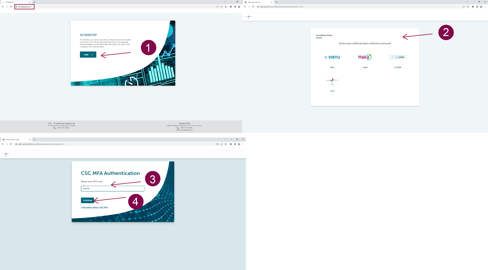

# Accessing SD Desktop with a Findata permit

**[Instructions in Finnish (PDF)](https://a3s.fi/docs-files/sensitive-data/PDF_instructions/SD_toisiolaki_Findata.pdf){ target="_blank" }**

Accessing secondary use health or social data from public registries requires a permit from the **Findata** authority. You can apply for the data permit by logging in to Findata’s e-service. Instructions for applying for the data permit can be found on [Findata's website](https://findata.fi/en/permits/){ target="_blank" }.

After acquiring the permit, you can start the service access process with CSC. Next, we will walk you through the steps that need to be completed in order to access the dataset on SD Desktop.

!!! Note
    * [SD Connect](sd_connect.md), a service used for storing sensitive research data, is **not accessible for registry data processing**. It is not possible to directly import any additional data, script, or software into the virtual desktop. 
    * If you need software that is not available on the SD Desktop by default, please contact [Service Desk](../../support/contact.md) (*Subject: Sensitive Data, Secondary use*) well in advance - even before applying for a data permit.

*Please note that you can create a test project and test regular SD Desktop independently, to make sure that SD Desktop is suitable for your needs. [Instructions how to access regular SD Desktop](sd-use-case-new-user-project-manager.md).*

## Get access to SD Desktop for secondary use

1. [Create a CSC account](#1-create-a-csc-account)
2. [Create new CSC project](#2-create-new-csc-project)
3. [Fill GDPR document](#3-fill-gdpr-document)
4. [Contact CSC service desk](#4-contact-csc-service-desk)
5. CSC adds members to your project, please wait
6. CSC activates SD Desktop for your project, please wait
7. [Accept SD Desktop terms of use](#7-accept-sd-desktop-terms-of-use)
8. [Activate MFA Authentication](#8-activate-mfa-authentication)
9. [CSC project is ready](#9-your-csc-project-is-ready)
10. [Log into SD Desktop](#10-log-into-sd-desktop)
11. [Access the data with SD Desktop](#11-access-the-data-with-sd-desktop)

### 1. Create a CSC account
**Assignment for whole team:**

- **Go to [MyCSC portal](https://my.csc.fi){ target="_blank" }**
- Log in with Haka. Select your home organization and log in to their identity service. [How to get an account without Haka](../../accounts/how-to-create-new-user-account.md#getting-an-account-without-haka-or-virtu). 
- Fill in your information on the Sign up page.
- Set your password using 12 characters or more, containing both upper and lowercase letters and at least one number. No special characters are allowed.
 - You will receive your CSC user account confirmation via email.

### 2. Create new CSC project
**Assignment for team manager only:**

- Go to ”Projects” page (left side menu or a hamburger menu at the top right corner).
- On the top of the page choose **”New project”**.
- Fill in the project name and project description. You can edit these later if needed.
- Choose the Project category to be **“Findata”**.
- Fill all required fields. Read and accept the terms of use.
- Click **“Create a project”**.

### 3. Fill GDPR document
**Assignment for team manager only:**

- Since your project handles personal data, you need to fill the GDPR document i.e. *Description of processing activity* -form.
- The document appears when you create a new project. You can edit this document later.
- Your home organization is the **data controller**. [Read more about the roles and GDPR](../../support/faq/sensitive-data-legal.md#what-are-the-roles-of-csc-and-its-service-users-under-gdpr).

### 4. Contact CSC service desk
**Assignment for team manager only:**

- Send email to **sensitivedata-support@csc.fi**, subject: *Sensitive Data, Secondary use*.
- Write your project number to the email (e.g. *project_1234567*).
- Attach a copy of your **data permit** to the email.
- Write down a list of your research teams email addresses. Please use same emails that they created the CSC-account with.
- Put your research team as cc.

!!! Note ""
    ### 5. CSC adds members to your project
    - Please wait that Sensitive Data Support -team ads your research team to your project
    - Note! All team members must have a [CSC-account](#1-create-a-csc-account), so they can become project members.

!!! Note ""
    ### 6. CSC activates SD Desktop -service for your project
    - Please wait that Sensitive Data Support -team activates SD Desktop -service for your project.
    - You will receive an email notification, when everything is ready.

### 7. Accept SD Desktop terms of use
**Assignment for whole team:**

- If you haven't accept the terms of use before, please go to MyCSC - navigate to the project view - see left side **Service** list - click SD Desktop and **accept the terms of use**.
- Please note that every team member must accept the SD Desktop terms of use.

### 8. Activate MFA Authentication
**Assignment for whole team:**

- You need to activate MFA (multi-factor authentication) to be able to log in the Sensitive Data services. [More about multi-factor authentication](../../accounts/mfa.md). *If your multi-factor authentication is already enabled, you can move to step 9.*
- Before activating MFA you need to have some authentication application in your mobile, for example Google Authenticator or Microsoft Authenticator.
- Go to the **Profile** page (Left side menu or top right hamburger menu).
- Enable Multi-Factor Authentication by clicking **“Activate”**.
- This will create a QR code which you can read with your authentication application (for example Google Authenticator).
- You authentication application will provide a verification code which you can now write to MyCSC **“Verification code”** field and click **“Verify”**.

### 9. Your CSC project is ready!
- Write down your project number, you might need it later (e.g. *project_1234567*).
- Now you can log out from MyCSC and move on to [SD Desktop](#10-log-into-sd-desktop).
___

### 10. Log into SD Desktop
1. Go to login page: **[https://sd-desktop.csc.fi](https://sd-desktop.csc.fi){ target="_blank" }**.
2. Log in with MyCSC-credentials or Haka. Enter your username and password.
3. You need to verify your identity with a second verification step (i.e. Multi-factor Authentication, MFA). Enter the verification code provided via your MFA mobile application (e.g. Google Authenticator)
4. Press *Continue*.

### 11. Access the data with SD Desktop
Register data provided by Findata can be accessed on your **virtual desktop** using the **Data Gateway** application. Access is limited to the permit duration specified in the data permit.

1. [Create virtual desktop](sd-desktop-secondary-create.md)
2. [Access virtual desktop](sd-desktop-secondary-access.md)
3. [Access data with virtual desktop using Data Gateway](sd-desktop-secondary-access.md#accessing-data-using-data-gateway)
* [Manage virtual desktop](sd-desktop-secondary-manage.md)

