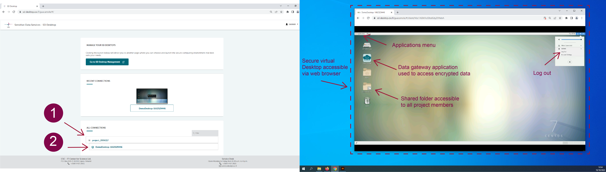

# Sensitive Data (SD) Desktop

Once you have access to the service, you can launch your virtual computer, choosing between **four pre-built options** (Light, Small, Medium or Heavy computing). This operation can be carried out with a few simple steps and does not require any technical expertise. 

Next, the services will start your virtual Desktop (or, in technical terms: launch a virtual machine) and create a secure connection between CSC and your browser. After launch, your virtual Desktop will be directly available for use every time you log in to the service. Moreover, the running Desktop will consume *billing units* (or resources) from your CSC project until it is deleted.

Each CSC project supports the launch of *up to three* virtual Desktops. In addition, each Desktop supports the simultaneous connection of 10 project members. Thus, if you have collaborators as project members in the same CSC project, they will also be able to connect to a virtual Desktop and access the data authorised for your project. Furthermore, all the Desktops are provided with the same software (pre-installed and managed by CSC).


## Setting up a Virtual Desktop

To start your virtual Desktop, log in to the services at [sd-desktop.csc.fi](sd-desktop.csc.fi) and click on **Go to SD Desktop Management page**.

Here you can specify several parameters:
 * **Select your CSC project.**
 * **Choose the operating system.** Currently the only possible operating system is Linux CentOS 7 but in the future, there will be other options too.
 * **Assign a name for your virtual Desktop.** It is good practice to assign a descriptive name for a Desktop so that all project members can easily identify it later on.
 * Choose one of the **virtual Desktop pre-built options** (Light, Small, Medium or Heavy computing), based on your computing and memory needs. The default disk (or storage) space for all Desktops is 80 GB. You can extend your Desktop disk space by selecting option: *add an external disk*. You can add up to 200 GB.

!!! Note 
    You can't extend the disk space after you have launched the virtual Desktop. Additional disk space later on can be requested writing at servicedesk@csc.fi (subject: Sensitive data);

When all the settings are done, press the **Launch Desktop** button. The launch operation is entirely automated and can take **up to 30 minutes**. If you try to access the virtual Desktop and see a black screen, come back later.


## Pre-built Virtual Desktop Options

#### Light Computation
 * Technical specifications: **Core: 3; memory 4 GB; Root disk: 80 GB; Correspondent Pouta Flavour: standard.medium; Billing Units: 1.3 units/h.**
 * This option is ideal for testing the services (for example, test how to start a Desktop, check out how it looks and which applications are available).
 * You can compare this Desktop to a laptop with limited capacities, which probably freezes when you open too much software or more than three colleagues connect to it simultaneously. For this reason, we advise you to start this type of Desktop only for testing purposes and delete it when the testing is completed.
#### Small Computation
 * Technical specifications: **Core: 6; memory 15 GB; Root disk: 80 GB; Correspondent Pouta Flavour: standar.xlarge; Billing Units: 5.2 units/h.**
 * This option is ideal for analysing sensitive data using office software (for example: similar to simple statistical analysis, watching videos, listening to audio files, working on text files).
 * You can compare this Desktop to your working laptop.
#### Medium Computation
 * Technical specifications: **Core: 8; memory 30 GB; Root disk: 80 GB; Correspondent Pouta Flavour: standar.xxlarge; Billing Units: 10.4 units/h.**
 * This option is ideal for running complex statistical or genome analysis.
 * You can compare this Desktop to a powerful laptop provided by your IT unit.
#### Heavy Computation
 * Technical specifications: **Core: 32; memory 116 GiB; Root disk: 80 GB; Correspondent Pouta Flavour: hpc.5.32core; Billing Units: 52 units/h.**
 * This option is ideal for running non-interactive programmatic analysis (for example, machine learning) that require heavy computation.
 * Please do not choose this option for simple analysis, as it consumes much resources.

[](images/desktop/desktop_creation.png)

!!! Note
    If you don't know the best Desktop option for your needs, please contact us at servicedesk@csc.fi (email subject: Sensitive Data).


## Working with your virtual Desktop

Once your private virtual computer (Desktop) is launched, each CSC project member can securely access it from their browser at any time.

When you log in to SD Desktop **Homepage**, you will be able to access your virtual Desktop in:

* **Recent connections**, by clicking on the image of your Desktop (visible only if you recently accessed it)
* **All connections** if you click on + you can see all the connections associated with each project (e.g. project_NNNNN_NNNN). If you click on the connection ID you will also access your Desktop.

When you open the connection, a virtual computing environment (Linux Centos operating system) will open into your browser. When you access the virtual Desktop for the first time, you will see the getting started panel, from which you can, for example, adjust the screen resolution.

You can work with this virtual Desktop like in a standard computing environment. From the *Applications* menu bar (top left corner) you can access several pre-installed programs. Examples include Open Office, image viewing applications, video and audio players, Jupiter Notebook etc. You can also open a terminal and use Linux from the command line. To start using R-Studio please check the following paragraph.

**Security-related features of the audited SD Desktop include:**

* the computing environment is **isolated from the internet**. You can, for example, open a Firefox web browser, but you are not able to access any site on the internet. You will also not be able to access any repositories directly.
* the copy-paste function from your computer/laptop to the browser visualizing your virtual Desktop is entirely disabled for security reasons. You can anyhow use this function inside your browser.

**You can close your connection to your virtual Desktop in two ways:**

1. **Log out** from your Desktop (in the workspace view, top right corner of the browser, select your *username* and *log out*). This will close all applications in your virtual Desktop and disconnect the work session. You will be able to access the virtual Desktop at any time after logging in to the services.
2. If you started a data analysis programmatically (you are running a script) you can close the browser window. This doesn't interfere with the processes running. Thus, when you reconnect to your Desktop, you have all your tools and interfaces still open and can continue working. However, remember to log out from the Desktop once the analysis is finished. If you leave more than ten connections open, you will be unable to re-access the services.

!!! Note
    **Never use the lock or reboot buttons** in SD Desktop as you will not be able to connect to the Desktop again after that.

[](images/desktop/desktop-access.png)


## Accessing Data Using Data Gateway

Once you sign in to your virtual Desktop, you can access the data by following these steps:

1. Open **Data Gateway** (you can find the application on your desktop);
2. Select SD Apply;
3. Click on **Continue**;
4. In the new window, under the second step, click on **Create**. The application will create a new folder called **Projects** accessible from your Desktop or programmatically through the terminal.
5. Click on **Open folder**.
6. The files have been encrypted using the sensitive data public encryption key, and you will be able to access their content in *read-only mode*. The current streaming speed can be up to 50 MB/s.

!!! Note
    The Projects folder is **available only when the Data Gateway application is open**. If you close or disconnect the application, you will not be able to access the data stored in the data service unless you previously made a full copy of it inside your Desktop. Thus, Data Gateway needs to be open and connected during data processing in streaming mode.

[](images/desktop/desktop-register-gateway.png)

### If You Need to Edit the Files/data

 * Access the files of interest in the Project folder using **Data Gateway**;
 * Select all the necessary files from the Project folder, make a **copy** and save it in the virtual Desktop **home directory** (the files will be visible only from your browser) or in the **shared folder** (in this case, the files will be accessible also by all the CSC project members).

[](images/desktop/desktop-gateway-import.png)


## Default Programs Available on the Desktop and Software Customisation

Each virtual Desktop is pre-built and contains a limited set of default open-source software (listed below). The virtual Desktop is isolated from the internet and **importing of software is restricted**, as required by the data permit authority. Thus, users cannot directly import software/scripts or other files in their virtual Desktop when working with secondary use data. 

If you need a specific program that is not pre-installed, it is recommended to contact us at servicedesk@csc.fi, **before applying for the data permit.** In this way, we can figure out if it is possible to customise your virtual Desktop. If the program is compatible with the computing environment, you need to specify in your permit application the list of additional software, which will be provided directly by Findata.

### Pre-installed Software:
* CentOS7 (Operating system)
* Emacs (Text editor)
* htLib (A library)
* LibreOffice (An open-source alternative to Microsoft Office)
* miniconda (Installer for conda, a bootstrap version of Anaconda)
* minimap2 (A sequence alignment program)
* pigz (A compression tool for files)
* pyro.ai (A tool for deep probabilistic modeling)
* Python
* R + R studio
* SAMtools (Programs for interacting with high-throughput sequencing data)
* nextflow (A workflow orchestrator)
* Go (Programming language)

### Scientific software
**Python 3.7.9** including following packages:
 * Beautiful Soup, Bokeh, CatBoost, crypt4gh, Distributed Keras, Elephas, ELI5, Gensim, HTTPX, Keras, LightGBM, Matplotlib, NLTK, NumPy, pandas, Plotly, pydot, pyfuse3, PyTorch, QRcode, Scikit-learn, SciPy, Scrapy, Seaborn, spaCy, Statsmodels, TensorFlow, Trio, XGBoost.

**R / RStudio Server** with the following properties:
 * Installation matching the `r-env-singularity/4.0.5` module on Puhti (R 4.0.5 + RStudio Server 1.4.1106, Bioconductor 3.12)
 * 1000+ pre-installed R packages
 * Intel® oneAPI Math Kernel Library (oneMKL)
 * GIS software (PROJ, GDAL, SAGA)
 * CUDA drivers
 * TensorFlow (used with R TensorFlow back-end)
 * R + RStudio Server versions matched with Puhti r-env-singularity module (R 4.0.5 + RStudio Server 1.4.1106, MRAN, Bioconductor 3.12)

### RStudio on SD Desktop

To access RStudio in SD Desktop, open the terminal from the *Applications* tab in your virtual Desktop and launch RStudio with:

```text
start-rstudio-server
```

This will return a URL and a service-specific password:

```
RStudio Server - Sensitive Data Desktop Edition
---------------------------------------------------------------------------------------
Copy/Paste this URL into Firefox:

http://localhost:8787/

-----------------------------------------------------------------------------------------
Enter these at the RStudio Server sign-in screen
----------------------------------------------------------------------------------------
Username: accountname  Password: Example23241232
----------------------------------------------------------------------------------------
To stop RStudio Server: Ctrl+C
```

Next:
 * **paste** the URL in Firefox
 * after a few seconds, you can **input the username and password** (given by the terminal) and access the server.

!!! Note
    When using RStudio, you need to save your data in **Shared-directory** if your colleagues need to work on the same files.


[](images/desktop/desktop-rstudio.png)


## Limitations to SD Desktop

To comply with the regulation, SD Desktop for secondary use is **completely isolated from the internet and other services**. You can, for example, open a Firefox web browser, but you are not able to access any site on the internet.

**The import of data and software is restricted in SD Desktop**. You cannot import any data or software yourself for security reasons. If you are working with a dataset for which you have received a permit from Findata, the only way to access the data for analysis is by utilizing a specific application called **Data Gateway**. 

**Data export from SD Desktop is also restricted**. Only *non-sensitive* results can be exported from the workspace, and those can only be exported by the CSC project manager. Instructions for exporting your results are provided in the next paragraph.

Encrypted files will be **visible in read-only mode**. This solution allows you to process large amounts of data without storing any copy on your virtual Desktop. However, this means that the files cannot be edited in SD Desktop.

Lastly, we are not yet providing a virtual Desktop with Windows or Linux Ubuntu operating systems, or with GPUs. However, we are working on it, and you can find more information on the future developments of the services on our webpage.


## Data Export from the Desktop

Your virtual Desktop is completely isolated from the internet and other services for information security reasons. Only the CSC project manager can export non-sensitive results from the secure workspace.

In order to export the results at the end of your analysis, you need to:

 * Make sure your results **do not contain any sensitive data**;
 * Collect all the results into a same folder and name it as **Results**;
 * Place the Results folder into the **shared-directory** on your Desktop;
 * **Send a request to servicedesk@csc.fi** to export your results.
 * All the content in the “Results” folder will be exported to the data permit authority, and it will be available for you after their scrutiny. During the export, you will not be able to access your virtual Desktop. All the project members have to be removed from the CSC project for the duration of the data export. Afterwards, you will be invited back to the CSC project, if your project is still ongoing.

[](images/desktop/desktop-register-exp.png)


## Deleting Your Virtual Desktop

### Deleting a Desktop

At the end of your analysis, you can delete your virtual desktop, including the external volume and all files saved in it. You cannot undo this action:

 1. On SD Desktop Homepage (sd-desktop.csc.fi), click on **Go to SD Desktop Management**.
 2. Under *Available desktops* select the correct virtual desktop. On the right side, click on **Options** and on **Delete Desktop**.

[](images/desktop/desktop-deleting.png)

!!! Note
    The desktop **should not be deleted before all the results have been exported.** Please contact all the project members before deleting a virtual desktop. With this action, you will delete the entire workspace, including all files saved in the virtual desktop or external volume by other project members.

### End of Data Access and Data Deletion Policies

Access to the data will be denied after the data permit expires. If you want to continue accessing the data after the original validity period ends, you need to send an *amendment application* to Findata to extend the validity of the permit.

When the data permit has expired, all the members will be removed from the CSC project, and you cannot access your virtual Desktop anymore. This also means that **all your results must be exported before the end of the validity period**. Both the project and the data will be deleted according to CSC’s data retention policy (see [General Terms of Use for CSC's Services for Research and Education](https://research.csc.fi/general-terms-of-use)) and agreement with the users. As a default, **inactive projects and all their data will be deleted after 90 days** in accordance with the regulations.

If you are still waiting for a decision about your amendment application when the original permit expires, please contact our service desk (servicedesk@csc.fi) in order to save your CSC project and data for later use. We cannot grant access to the Desktop without a valid data permit.

## Troubleshooting

Find solutions to common problems in the [Troubleshooting](https://docs.csc.fi/data/sensitive-data/sd_desktop/#troubleshooting) paragraph. If you still have questions, do not hesitate to contact our service desk at servicedesk@csc.fi.
