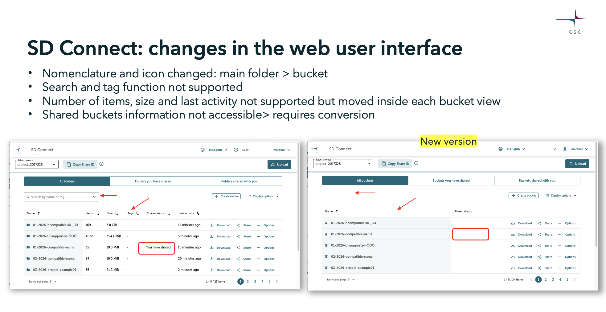
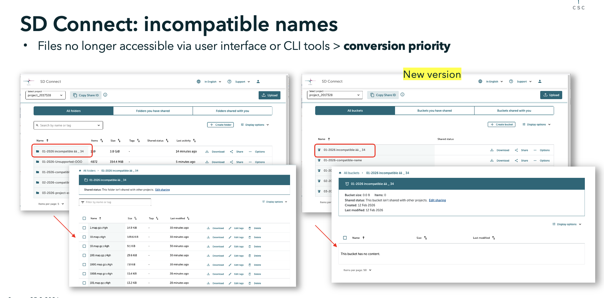
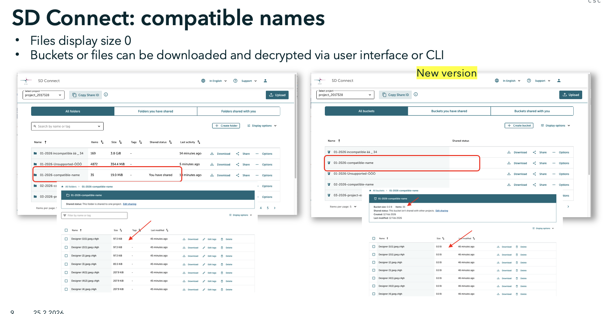

# SD Connect: release page

This page summarizes the major releases of SD Connect, highlighting improvements in usability, security, automation and backward compatibility. The service includes a web user interface and command-line tools. 

Version shortcuts:

[SD Connect v3.0.0 Upcoming ](#sd-connect-v300)

[SD Connect v2.0.0 Currently in use](#sd-connect-v200-currently-in-use)

[SD Connect v1.0.0 Discontinued](#sd-connect-v100-discontinued)

## SD Connect v3.0.0 

Upcoming, in testing phase. 

!!! Note
    More detailed documentation, support materials, guidance and webvinars will be published closer to the official release.

## Overview

Major upgrade required because of a technical change: transition from the Swift protocol to a new based on S3‑compatible technology. CSC’s current storage system will stop supporting the old upload and download method by the end of 2026. This SD Connect version improves long term stability but is not fully backward compatible, this might require file conversion. 
Later on, all data will also need to be migrated to a new storage solution that CSC will deploy by the end of 2026 called Allas 2. 

## Key features and changes

- **Web user interface**: search function removed, tag function removed, last activity removed, number of objects in a folder and folder size removed from the main view but available inside the main folder, sorting removed. In this version, the main folder is renamed as a bucket. Only Chrome currently supported. Uploading folders inside a bucket not yet supported.

- **Command Line tools**: SD Lock-unlock V3.0.0 provides same functionalities but the updated version needs to be installed locally. SD Lock-unlock V2 will no longer be functional. 

- **New bucket/ main folder naming restrictions**: Supported: 3–63 characters, lowercase letters/numbers/hyphens, must start & end with letter/number. Not supported: upper case, special characters, underscore. Note: this does not affect folders or files stored inside the bucket. 

- **Technical changes**: the underlying storage protocol is transitioning from OpenStack Swift to the Amazon S3 API standard. This is a significant technical change that affects how data is uploaded, stored and accessed inside the service via web user interface and commandl line tools. While the new S3‑based backend improves long‑term stability and infrastructure compatibility, it also affects backward compatibility, meaning that some older files or bucket names may need to be converted to function properly.

- **SD Connect conversion tool**: A simple graphical user interface and command‑line tool is available to help convert files uploaded using SD Connect v1–2 to the new version. The tool:converts incompatible bucket names to a supported format by renaming them. Restores correct file sizes. Restores sharing permissions so that shared folders become visible and usable again

- **Backward compatibility**: Files uploaded with a previous version of the service may not be temporarily accessible unless they are converted to the new file format using the SD Connect conversion tool provided by CSC.

Buckets with incompatible names: Data stored in buckets with unsupported names will not be accessible after the upgrade. Users must run the conversion tool to rename the bucket, convert the files to the new format, and restore access.

Buckets with compatible names: Data will remain accessible. However, some files may temporarily appear with a file size of “0” in the user interface. Running the conversion tool will correct the metadata and display the proper file sizes. This step is recommended but can be postponed until the full migration to the new storage solution at the end of 2026.

Shared buckets: Shared buckets will no longer appear in the web interface after the transition. Running the conversion tool will restore the visibility of sharing permissions.

## **Feature comparison table**

| **Feature**                           | **SD Connect V3 (new)**                                                                                                                                                                               | **SD Connect v2.0.0 (discontinued)**                                                                                           |
| ------------------------------------- | ---------------------------------------------------------------------------------------------------------------------------------------------------------------------------------------------------------------------- | ------------------------------------------------------------------------------------------------------------------------------ |
| **Service access via MyCSC**          | No changes.                                                                                 |  Requires CSC account and project, SD Connect service access, and multi‑factor authentication enabled on your CSC account.                                       |
| **User interface**                    | Search function removed; tags removed; terminology updated (main folder now called *bucket*); bucket size and number of files no longer displayed on the homepage; sorting no longer supported; Firefox not supported. | —                                                                                                                              |
| **Automated encryption and upload**   | No changes. Bucket‑naming restrictions apply.                                                                                                                                                                          | Upload via user interface supports files up to 100 GB; larger files can be uploaded automatically using the command‑line tool. |
| **Automated decryption and download** | No changes. Backward compatibility issues may occur due to bucket‑naming restrictions.                                                                                                                                 | Available for folders or single files for all project members.                                                                 |
| **Key management**                    | No changes.                                                                                                                                                                                                            | Automatically handled by the service.                                                                                          |
| **Folder sharing**                    | No changes. Some backward compatibility issues may occur; sharing may need to be converted or recreated.                                                                                                               | Supports three types of data sharing: data transfer, collection, or collaborative analysis on SD Desktop.                      |
| **Command‑line utility tool**         | Users must install the updated tool, **SD Lock‑unlock v3**, as the previous version will no longer be functional.                                                                                                      | **SD Lock/Unlock** provides automated key management; requires a temporary token.                                              |
| **Backward compatibility**            | Files uploaded with previous versions may be temporarily inaccessible until converted to the new format, or they may appear with an incorrect file size.                                                               | —                                                                                                                              |

## Visual comparison: old vs. new

## SD Connect v2.0.0 Currently in use

Major upgrade: user interface released October 2024, Command Line tools released February 2025

## Overview

SD Connect v2.0.0 introduces a significantly improved user experience with a redesigned web user interface, automated encryption features and expanded sharing workflows.

## Key features

- **Service access via MyCSC**: requires CSC account, CSC project membership, SD Connect service access and MFA.

- **Web user interface**: redesigned, modern layout based on direct user feedback (Google Chrome and Firfox supported). Improved upload and dowload perfomance: upload through UI supports files up to 100 GB. Larger files can be uploaded  and encrypted automatically via command line. Available for both folders and single files for all project members. Advanced folder sharing: for data transfer, collaboration and read only via SD Desktop. Prevents unnecessary copies of data.

- **Automated encryption, decryption and key management**: fully automated key management during encryption and decryption provided by the service, via web user interface and command line tools. 

- **Encrypted upload policy**: uploading unencrypted files is no longer possible; all uploads are encrypted automatically.

- **Command line tool improvements**: the new command line tools, SD Lock/Un-lock, now supports automated key management using temporary tokens, automate encryption and decryption. 

- **Backward compatibility**: files uploaded with the service via user inetrface before 7 Oct 2024 will not be automatically decrypted. Files size may appear incorrect. 

## Feature comparison table

| Feature | SD Connect v2.0.0  (currently in use)| SD Connect v1.0.0 (discontinued) |
|---------|----------------|----------------------------------------|
|Service access via [MyCSC](https://my.csc.fi)|Requires CSC account and project, SD Connect service access and multi-factor authentication enabled on your CSC account|Requires CSC account and project and Allas service access|
|User interface|Redesigned based on user feedback|Standard interface|
|Automated encryption and upload|Upload via user interfaces supports files up to 100 GB, larger files can be automatically uploaded during upload via command line|Limited to files < 1 GB|
|Automated decryption and download|Available for folders or single files for all project members|Not available|
|Key management|Automatically provided by the service|Not available|
|Uploading encrypted files|Not allowed; all files are encrypted during upload|Optional; unencrypted files could be uploaded|
|Folder sharing|Supports 3 different type of data sharing: for data transfer, collection or collaborative analysis on SD Desktop (without the possibility of downloading extra copies of the files)|Sharing was supported only via manual encryption and decryption|
|Command-line utility tool|SD Lock/Un-lock provide automated key management, this requires temporary token access|Available but required manual encryption and did not support automated key management|
|Bacward compatibility|Files uploaded with before October 7, 2024 are downloadable but can not be decrypoted automatically; size may be incorrect| |

## SD Connect v1.0.0 Discontinued

Original release June 2021 

## Overview
The original version introduced the foundational storage and encryption concept, requiring more manual steps for secure handling of data. It has since been replaced by the new SD Connect.

## Key features 

- **Service access**: Required CSC account, CSC project and Allas service access.

- **User interface**: basic interface for file operations. Uploads with automated encryotion restricted to files under 1 GB. Download: manual decryotion required. Optional encryption: users could choose to upload unencrypted files.Sharing required manual encryption/decryption workflows.

- **Key management**:users needed to manage their own encryption keys.

- **Command‑Line tool**: required full manual encryption; no automated key management.

