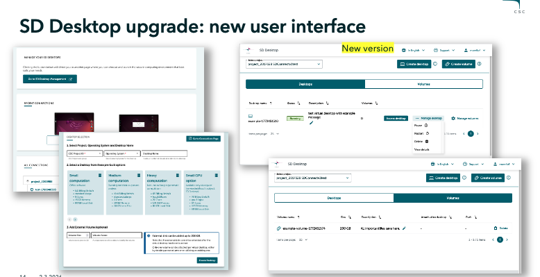
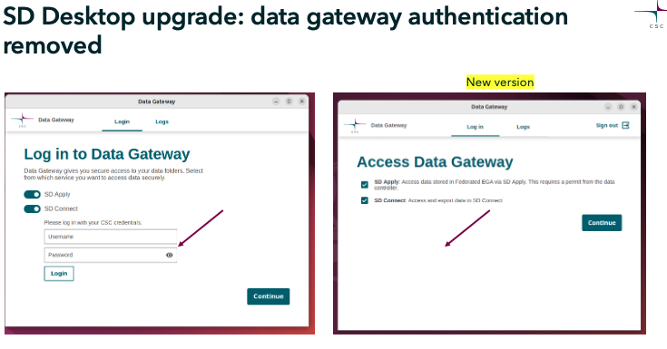

# SD Desktop: releases

This page summarizes the major releases of SD Desktop, highlighting improvements in usability, security, automation and backward compatibility. 

Version shortcuts:

- [SD Desktop v3.0.0 Upcoming ](#sd-desktop-v300)

## SD Desktop v3.0.0 

Upcoming, in testing phase.

## Overview

SD Desktop v3 introduces a completely redesigned interface that is more intuitive, easier to use, and developed in close collaboration with users. This version focuses on improving usability, flexibility in volumes management and authomation. 

!!! Note
    More detailed documentation, support materials, guidance and webvinars will be published closer to the official release.

## Key features and changes

- **Redesigned user interface**: The entire interface has been rebuilt with a more modern and intuitive layout, improving navigation and simplifying common tasks. The redesign is based on extensive user feedback.

- **Attach and detach volumes on running virtual desktops**: Users can now attach or detach storage volumes without stopping or restarting the virtual desktop. This allows real‑time adjustments to storage needs and improves workflow continuity.

- **Support for multiple volumes on the same virtual desktop**: A single virtual desktop can now use multiple volumes simultaneously.

- **New Data Gateway functions**: Data export formt the virtual desktop now offers automated encrypted. Additionally, accessing the gateway no longer requires manual entry of a username or password, making the process more streamlined and secure.

- **Backward compatibility**: Existing virtual desktops will continue to work, but import/export may be interrupted. Users can either:

- create a new virtual desktop and move the old volume to it, this option enables all new SD Desktop v3 features.

- import the new Data Gateway into the current desktop: import/export works, but attaching new or multiple volumes will not be available.

## Feature comparison table: 

| **Feature**                    | **SD Desktop v3 (new, upcoming)**                                                                                     | **SD Desktop v1 (current)**                                                             |
| ------------------------------ | ----------------------------------------------------------------------------------------------------------- | --------------------------------------------------------------------------------------- |
| **Access via MyCSC portal**    | No changes.                               |         Access via <https://my.csc.fi> with CSC account, project, and MFA.                                                                     |
| **User interface**             | Completely redesigned interface, more intuitive and user‑friendly, built with user feedback.                | Older interface with limited usability and less intuitive workflow.                     |
| **Virtual machine management** | Attach/detach volumes while the virtual desktop is running; support for multiple volumes; updated workflow. | Volume can only be added during creation pahse; only one volume supported       |
| **Volume management**          | Multiple volumes supported on a single VM; real‑time attach/detach operations.                              | Single volume per VM                                |
| **Data Gateway application**   | automated encryption during export, no username/password needed, improved performance.                  |  manual credentials required, no automated encryption during export. |

## Visual comparison: old vs. new

