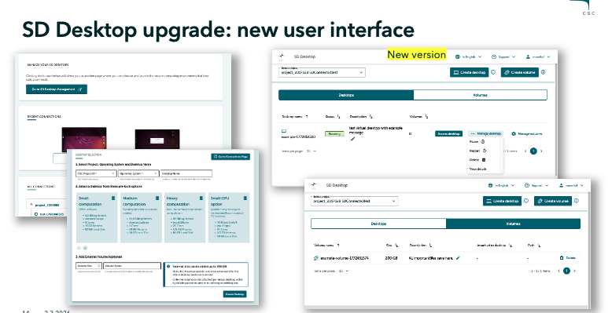
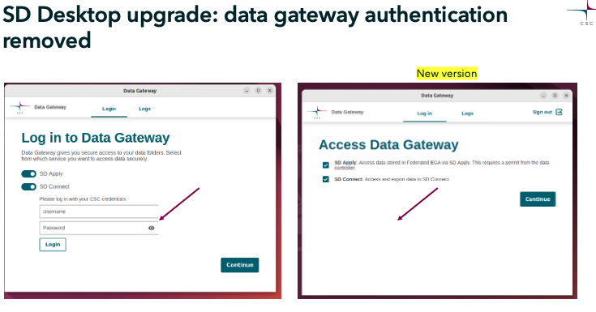

# SD Desktop: releases

This page summarizes the major releases of SD Desktop, highlighting improvements in usability, security, automation and backward compatibility. 

Version shortcuts:

- [SD Desktop v3.0.0 Upcoming ](#sd-desktop-v300)

## SD Desktop v3.0.0 

Available from September 28, 2026. 

### Overview

SD Desktop v3 introduces a completely redesigned user interface that is more intuitive, easier to use, and developed in close collaboration with users. This version focuses on improving usability, increasing flexibility in volume management, and enhancing automation.

## Key new features

**Redesigned user interface**: the interface has been rebuilt with a more modern and intuitive layout, improving navigation and simplifying common tasks. The redesign is based on extensive user feedback.

**Flexible volume creation**: volumes can now be created at any time, not only during virtual desktop creation. Users can choose between volumes of 200-500 GB and 1 TB.

**Enhanced volume management**: users can now attach or detach storage volumes from running virtual desktop. This enables real-time adjustments to storage needs and improves workflow continuity. A single virtual desktop can use multiple volumes simultaneously. However, the same external volume cannot be attached to multiple virtual desktops at the same time.

**Enhanced Data Gateway functionality**: Data export from the virtual desktop now includes automated encryption, allowing multiple files, folders, and subfolders to be exported in a single operation. In addition, accessing the Data Gateway no longer requires manual entry of a username and password.

**Updated operating system**: based on Ubuntu 24 and includes pre-installed container platforms such as Apptainer and Podman.

**Resource alerts**: Users can now receive alerts when a virtual desktop is running low on resources, enabling corrective action before the desktop becomes unresponsive.

**Backward compatibility**: existing virtual desktops will continue to work, but import and export functionality may be affected after the upgrade. Users can choose one of the following options:

- Create a new virtual desktop and move the existing volume to it. This option provides access to all SD Desktop v3 features.

- Install the new Data Gateway application on the existing virtual desktop. This restores import and export functionality, but features such as using multiple volumes simultaneously will not be available.

## Feature comparison table: 

| **Feature**                    | **SD Desktop v3 (new, upcoming)**                                                                                     | **SD Desktop v1 (current)**                                                             |
| ------------------------------ | ----------------------------------------------------------------------------------------------------------- | --------------------------------------------------------------------------------------- |
| **Access via MyCSC portal**    | No changes.                               |         Access via <https://my.csc.fi> with CSC account, project, and MFA.                                                                     |
| **User interface**             | Completely redesigned interface, more intuitive and user‑friendly, built with user feedback.                | Older interface with limited usability and less intuitive workflow.                     |
| **Volume management**          | Multiple volumes supported on a single VM; Attach/detach volumes while the virtual desktop is running.                              | Single volume per VM                                |
| **Data Gateway application**   | automated encryption during export, no username/password needed, improved performance.                  |  manual credentials required, no automated encryption during export. |

## Visual comparison: old vs. new

