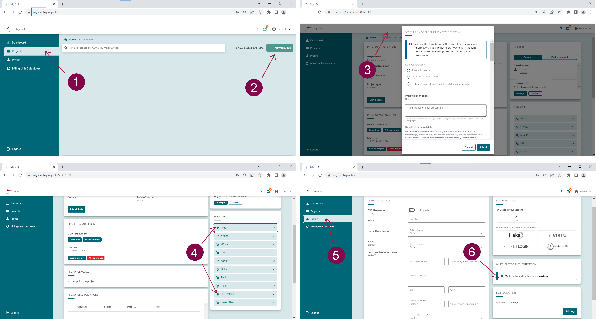
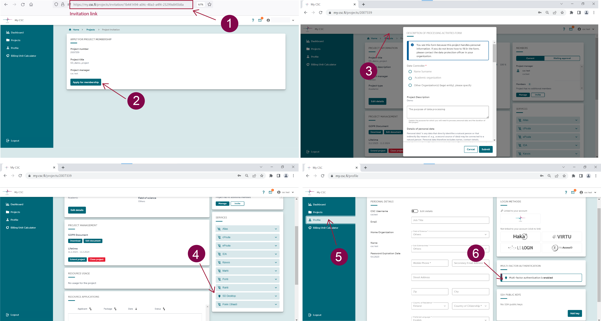

# Accessing Sensitive Data (SD) services for research
  
CSC's Sensitive Data (SD) services are available to researchers and students affiliated with Finnish higher education institutions (universities, universities of applied sciences) or a state research institute and their international collaborators.

!!! Note
    The legal basis for data processing determines which service component you can access and use. For example, you can directly manage research data access, uploads, or data export using SD Connect and SD Desktop. In contrast, access to register data via SD Desktop is operated by CSC's helpdesk, based on the data permit issued by the Fidata authority and in compliance with Finnish regulations. 

Below you can find more information on the steps required to access the services:

* for processing research data;
* for processing register data under the Act on Secondary Use;
* storage space (or quota) availability and resource (or billing units) consumption.

You can browse the guide using the navigation bar on the right side of this page or the search function.
 
 

## Processing sensitive research data
 	 
  
To access SD Connect and SD Desktop for storing, sharing or analysing sensitive research data:

1. Create a [CSC account](../../accounts/how-to-create-new-user-account.md) by logging in at the [MyCSC portal](https://my.csc.fi).

2. Create or join a CSC project and add project members.

3. Fill in the _Description of processing activities form_ and accept _CSC's Data Processing Agreement_.

4. All project members should add service access to Allas (to use SD Connect) and SD Desktop, accepting the terms of use. 

5. All project members should activate their account's additional security verification (or Multi-factor Authentication) by scanning the QR code with a mobile application (e.g. Google Authenticator).

6. Apply for billing units or disk quota.

For video tutorials and further guidance, check the [Accounts](../../accounts/index.md) section at the beginning of this manual.

Once you have completed these steps, you can log in with identity federation systems (Haka, Virtu, CSC Login, or LSLogin) at:

* [https://sd-connect.csc.fi](https://sd-connect.csc.fi) 	 
  
* [https://sd-desktop.csc.fi](https://sd-desktop.csc.fi)	 
  

with any modern web-browser (Note: private browsing is not supported using Firefox).

## Processing register data under the Act on Secondary Use

Analysing register data differs from the process mentioned above. In this case, CSC's helpdesk manages users' access to the SD Desktop computing environment in compliance with the Finnish Act on the Secondary Use of Health and Social data and the Findata Authority's Regulation.

Register data can only be provided by the Fidata Authority and accessed via the SD Desktop service. For more information about data provided by single registers, contact us at: servicedesk@csc.fi.

!!! Note
    Register data processing is subject to several limitations. Therefore, we recommend contacting us at servicedesk@csc.fi (subject: Sensitive data) before applying for a data permit to verify if the service matches your needs. 

To access and analyse register data via the SD Desktop service:

 1. Create a [CSC account](../../accounts/how-to-create-new-user-account.md) by logging in at the [MyCSC portal](https://my.csc.fi) with your Haka or Virtu account. Additional steps might be necessary to verify your identity. If your organization is not a Haka or Virtu federation member, contact us at servicedesk@csc.fi.

2. Next, apply for a CSC project by writing to servicedesk@csc.fi (subject: Sensitive data) providing: - a copy of the data permit issued by the Findata authority; - a short description of your research project (name and research field are sufficient); - a list of all the project members, added in cc to the email (please use only organizational email addresses).
  
3. Each project member should activate the account's additional security verification (or Multi-factor Authentication) by scanning the QR code provided under _My profile_ in the MyCSC portal. For further instructions, see the [MFA paragraph](../../accounts/mfa.md) under the Account section;

4. Each project member should join the CSC project via the invitation link provided by the service desk and wait for approval;
  
 	
5. Fill in the [description of data processing activities](../../accounts/when-your-project-handles-personal-data.md) form;	 
  
 	 
6. All project members should approve [the terms and conditions of SD Desktop service](../../accounts/how-to-add-service-access-for-project.md#member);	 
  
 	 
For specific guidance regarding these steps, see the [Accounts](../../accounts/index.md) section at the beginning of this manual.	 

  
 	 
## Default storage space and billing units consumption

Using SD Connect and SD Desktop is free of charge for research purposes, according to [CSC's general terms of use](https://research.csc.fi/free-of-charge-use-cases). However, CSC's services consume resources: 

* billing units (BUs) for their use;

* and quota for storage space allocation.

**A new CSC project includes about 10,000 billing units.** With the calculator below, you can determine how many billing units your CSC project will consume and apply for more resources.

**SD Connect**: when you apply for a new CSC project, the default quota (or storage space) for SD Connect/Allas is 10 TB, which can be increased up to 200 TB if needed. If your project requires additional storage space, contact us for support at servicedesk@csc.fi (subject: Sensitive data). 

Storing data in SD Connect/Allas consumes billing units. The rate is: 

* 1 billing unit/TB.

i.e. 1 TB of data stored in Allas consumes 24 billing units daily and 8760 billing units per year.

**SD Desktop**: the default disk space (or storage space) in SD Desktop is 80 GB and can be increased up to 280 GB by adding an external volume during virtual desktop creation. If you need additional storage space for data analysis, contact us for support at servicedesk@csc.fi (subject: Sensitive data). 

Analysing data in SD Desktop consumes billing units based on the type of virtual desktop you are using. The rate is:

* Light computation: 1.3 billing units/hour;

* Small computation: 5.2 billing units/hour;

* Medium computation: 10.4 billing units/hour;

* Heavy computation: 52 billing units/hour.

For more information, see the specific sections: 

* [applying for billing units](../../accounts/how-to-apply-for-billing-units.md) 

* and [increasing quotas](../../accounts/how-to-increase-disk-quotas.md).

### Billing unit calculator

<iframe srcdoc="https://my.csc.fi/buc" style="width: 100%; height: 1300px; border: 0"></iframe>

