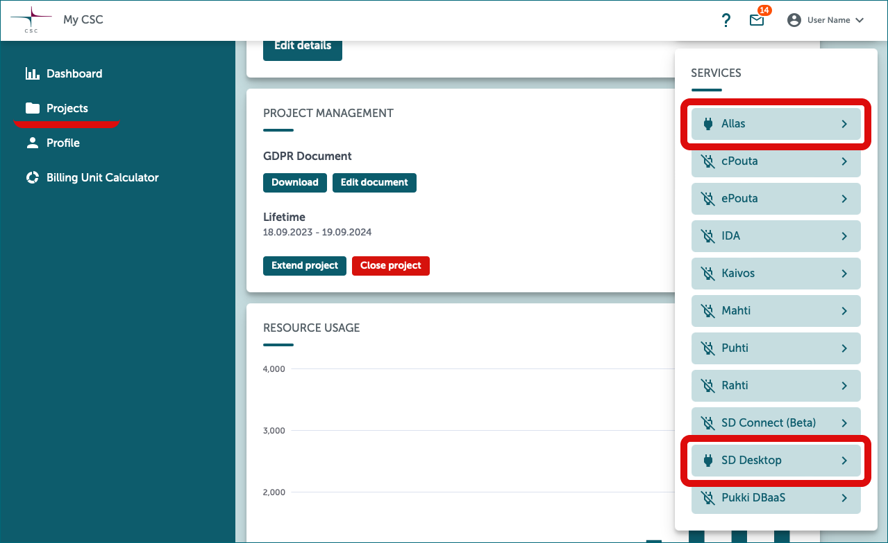
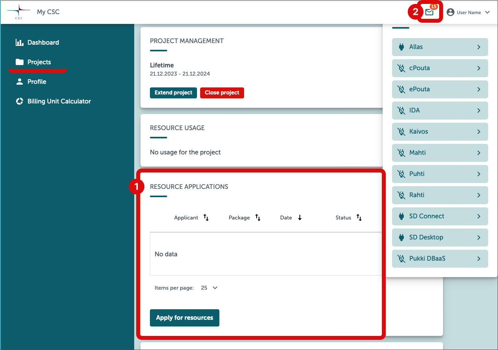
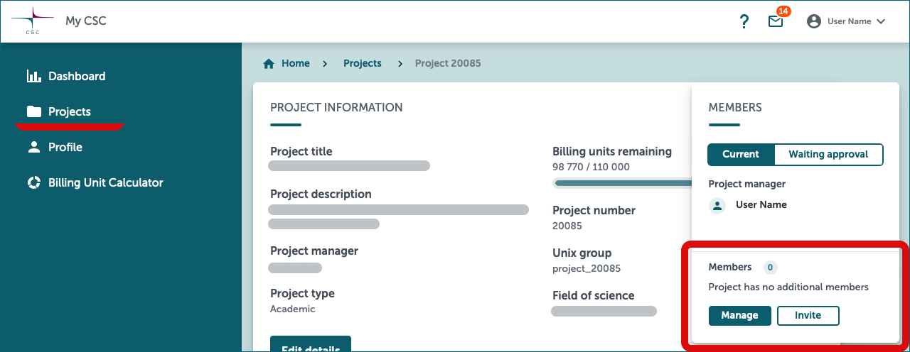

# Start here: Accessing Sensitive Data services 
  
In this section, discover how to access Sensitive Data (SD) services for the firs time. Learn to manage your project's billing unit consumption, storage space, project members and what happens to your data upon project closure.

Contents:

 * [Access SD Connect and SD Desktop for the first time](#access-sd-connect-and-sd-desktop-for-the-first-time)
    * [Step by step tutorial for project manager](#step-by-step-tutorial-for-project-manager)
    * [Step by step tutorial for project member](#step-by-step-tutorial-for-project-member)
 * [Project resources and storage space](#project-resources-and-storage-space)
 * [Closing the project](#closing-the-project)
 * [Billing units calculator](#billing-unit-calculator)

## Access SD Connect and SD Desktop for the first time

Before logging into SD Desktop or SD Desktop for the first time, you must do some preparations in [MyCSC -portal](https://my.csc.fi){ target="_blank" }. There you have to create a CSC account, activate MFA Authentication, be part of some CSC project and activate SD Connect and SD Desktop to that project. Only after those steps you can use SD Connect and SD Desktop.

### Step by step tutorial for project manager

The person who creates the project in MyCSC, is the project manager. Project manager can manage project members, project's lifetime, storage space and resources (i.e. billing units). Only the project manager can export data from SD Desktop. You can change project manager by contacting [Service desk](../../support/contact.md).

!!! note
    **Keep project manager's CSC account active.** Otherwise the project will be [closed](#closing-the-project). You can keep CSC account active by changing password once a year and keep user information such as email address up to date.

    You can manage your user information and project members in [MyCSC](https://my.csc.fi){ target="_blank" }.

=== "1. CSC account"
    !!! info-label

        Project manager

    #### 1. Create a CSC account
    
    - **Log in to [MyCSC portal](https://my.csc.fi){ target="_blank" }**
    - Log in with Virtu or Haka depending on which federation your home organization is a member of. Select your home organization and log in to their identity service. How to get an account without Haka or Virtu. 
    - Fill in your information on the Sign up page.
    - Set your password using 12 characters or more, containing both upper and lowercase letters and at least one number. No special characters are allowed.
    - You will receive your CSC user account information via email.

=== "2. Project"
    !!! info-label

        Project manager

    #### 2. Create new CSC project

    - Go to ”Projects” -page (left side menu or a hamburger menu at the top right corner).
    - On the top of the page choose ”New project”
    - Fill in the project name and project description. You can edit these later if needed.
    - Choose the Project category to be “Academic” (if you are a researcher and a member of Finnish higher education institution)
    - Fill all required fields. Read and accept the terms of use.
    - Click “Create a project”.
    - 

=== "3. GDPR document"
    !!! info-label

        Project manager

    #### 3. Fill the GDPR document

    - You are now at the project page.
    - Since your project handles personal data, you need to fill the GDPR document i.e. Personal data handling form.
    - 

=== "4. Services"
    !!! info-label

        Project manager

    #### 4. Activate SD Services for your project
    - Services are listed to the right column.
    - Select service: SD Connect, SD Desktop.
    - Read and accept the terms of use and click “add service”.
    - 

=== "5. Resources"
    !!! info-label

        Project manager

    #### 5. Apply billing units for your project
    - All Sensitive Data Services consumes billing units. More about billing units.
    - All new academic CSC projects are initially granted 10 000 BUs, so you can get started. However, you should estimate how many BU’s your project will consume during 1 year and apply more if needed.
    - Use the billing unit calculator for estimating your BU consumption.
    - Apply more billing units by filling the Resource application (screenshot)
    - 

=== "6. MFA"
    !!! info-label

        Project manager

    #### 6. Activate MFA Authentication
    - You need to activate MFA (multi-factor authentication), to be able to log in the Sensitive Data services. More about multi-factor authentication.
    - Before activating MFA you need to have some authentication application in your mobile, for example Google Authenticator or Microsoft Authenticator.
    - Go to the Profile -page (Left side menu or top right hamburger menu).
    - Enable Multi-Factor Authentication clicking “Activate” (Screenshot).
    - This will create a QR code, that you can read with your authentication application (for example Google Authenticator).
    - You authentication application will provide a verification code, that you can now write to MyCSC “Verification code” -field and click “Verify”.
    - 

=== "7. Members"
    !!! info-label

        Project manager

    #### 7. If you have a research team, add them to be your project members
    - Select the correct project (Left side menu or hamburger menu)
    - Add members from the right hand column (Screenshot)
    - You can add members from your own organization by clicking “Manage”.
    - Or you can create an invitation link by clicking “Invite” and send that with email to who ever you wish. - The receiver can apply a membership for your project by clicking the link. After that  you still have to approve them in MyCSC.
    - You project members must also create a MyCSC user account, activate the MFA and approve the terms of use of the services you have activated (SD Connect, SD Desktop)
    - 

=== "8. Use services"
    !!! info-label

        Project manager

    #### 8. Start using the SD Services
    - Now all the preparations are already and you can start to use SD Connect and SD Desktop.
----

### Step by step tutorial for project member

Project member is a person, who joins to existing CSC project. All project members have equal access permissions to the project files. **SD Connect:** project members can upload, download and delete project files same way as project manager. **SD Desktop:** project members can upload data and analyze it, but they can not export anything from SD Desktop. Only the project manager can export data from SD Desktop.

=== "1. CSC account"
    !!! info-label

        Project member

    #### 1. Create a CSC account
    
    - **Log in to [MyCSC portal](https://my.csc.fi){ target="_blank" }**
    - Log in with Virtu or Haka depending on which federation your home organization is a member of. Select your home organization and log in to their identity service. How to get an account without Haka or Virtu. 
    - Fill in your information on the Sign up page.
    - Set your password using 12 characters or more, containing both upper and lowercase letters and at least one number. No special characters are allowed.
    - You will receive your CSC user account information via email.

=== "2. Project"
    !!! info-label

        Project member

    #### 2. Join to CSC project
    - Project manager has either add you as a member automatically or sent you an invitation link to join their project.
    - Option A: Project manager has added your email to the project and you are a member of the project automatically. You have received a notification trough email and you can see the project when you log in to MyCSC.
    - Option B: Project manager has sent you an invitation link through email. You have to click the link and apply for membership to the project. After the application the project manager can approve you to the project.

    - 

=== "3. Services"
    !!! info-label

        Project member

    #### 3. Accept SD Services terms of use
    - The project manager has added services to the project already. You as a project members has to accept the terms of use, so you can use the services.
    - 

=== "4. MFA"
    !!! info-label

        Project member

    #### 4. Activate MFA Authentication
    - You need to activate MFA (multi-factor authentication), to be able to log in the Sensitive Data services. More about multi-factor authentication.
    - Before activating MFA you need to have some authentication application in your mobile, for example Google Authenticator or Microsoft Authenticator.
    - Go to the Profile -page (Left side menu or top right hamburger menu).
    - Enable Multi-Factor Authentication clicking “Activate” (Screenshot).
    - This will create a QR code, that you can read with your authentication application (for example Google Authenticator).
    - You authentication application will provide a verification code, that you can now write to MyCSC “Verification code” -field and click “Verify”.
    - 

=== "5. Use services"
    !!! info-label

        Project member

    #### 5. Start using the SD Services
    - Now all the preparations are already and you can start to use SD Connect and SD Desktop.
---

## Project resources and storage space

The use of CSC services is measured with **billing units (BUs)**. Every project consumes billing units, even if they are free of charge. Sensitive Data services are free of charge for research purposes. [Read more about free use cases from research.csc.fi](https://research.csc.fi/free-of-charge-use-cases){ target="_blank" }.

When you start a new project, you should plan ahead for your CSC project's resource usage. This includes considering the amount of storage space (i.e. quota) and billing units consumption while using the services. When you start a new project with CSC, you receive 10,000 billing units by default. This is enough for small testing. You can apply more billing units trough MyCSC resource application. Read more: [applying for billing units](../../accounts/how-to-apply-for-billing-units.md) and [increasing quotas](../../accounts/how-to-increase-disk-quotas.md).

* **[Billing unit calculator](#billing-unit-calculator)** will help you to estimate how many BUs your CSC project will require. You can find SD Desktop from the calculator, when you move to right with the arrows.

### SD Connect billing units and storage space

SD Connect stores data to [Allas](../Allas/index.md). Default storage space for SD Connect/Allas is 10 TB, which you can expand up to 200 TB as needed. If you need even more storage capacity, please contact [service desk](../../support/contact.md) (subject: Sensitive data). 

Storing data in SD Connect/Allas consumes billing units at a rate of **1 billing unit per TB per hour**. This means that storing 1 TB of data in SD Connect/Allas consumes 24 billing units daily and 8760 billing units annually.

### SD Desktop billing units and storage space

By default, the disk space in SD Desktop is 80 GB, and you have the option to increase it to 280 GB by adding an external volume during the creation of a virtual desktop. If you need more storage for data analysis, please contact [service desk](../../support/contact.md) (subject: Sensitive Data).
Analyzing data in SD Desktop consumes billing units based on the type of virtual desktop used. The rates are as follows:

* Small computation: 5.2 billing units per hour
* Medium computation: 10.4 billing units per hour
* Heavy computation: 52 billing units per hour

### What happens if your project runs out of billing units?

Once all the billing units for your CSC project have been used up, **your access to the SD Desktop service will be restricted**. This means that all virtual desktops currently running will automatically be paused, and you won't be able to access their content. However, **your data remains unaffected and will not be deleted**, even in cases where the total billing units reach zero or enter negative values.

* You get a notification via email when your billing units have been consumed.
  
#### How to regain access to your virtual desktop

 Apply billing units and unpause your virtual desktop:

1. [Apply for more billing units](../../accounts/how-to-apply-for-billing-units.md) for your project. This will give you a positive balance to continue using the service.

1. Log in to [SD Desktop](https://sd-desktop.csc.fi){ target="_blank" }.

1. On the SD Desktop homepage, click on ***Go To SD Desktop Management***.

1. Under ***Available desktops*** select the correct virtual desktop, and in the same row, on the right side, click on ***Resume***.

!!! Note
    Restarting a paused desktop is possible only for [active CSC projects](../../accounts/how-to-manage-your-project.md) with available billing units.

## Closing the project

Defautl lifetime for the project is **one year**. [Project manager](#project-manager) can extend project's lifetime or close the project in [MyCSC](https://my.csc.fi){ target="_blank" }. If project lifetime ends, it will be closed automatically. You'll receive an email notification when your project is about to expire, so please keep your contact information up to date in MyCSC.

[More about project closure](../../accounts/how-to-manage-your-project.md#project-closure)

### What happens to your data after the CSC project expires or is closed

* **Services will be disabled**: SD Connect and SD Desktop services will be disabled, and you won't be able to access them anymore.

* **Data will be deleted after 90 days**: Any data stored within SD Connect or SD Desktop, including files, virtual desktops, and volumes, will be permanently removed after 90 days from the project's closure. This measure is in place to ensure the secure handling of your data, aligning with CSC's policies.

!!! Note ""
    Please note that all **content within the services will be permanently deleted 90 days** after the project is closed. Once deleted, it cannot be restored or recovered.

## Billing unit calculator

<iframe srcdoc="https://my.csc.fi/buc" style="width: 100%; height: 1300px; border: 0"></iframe>

