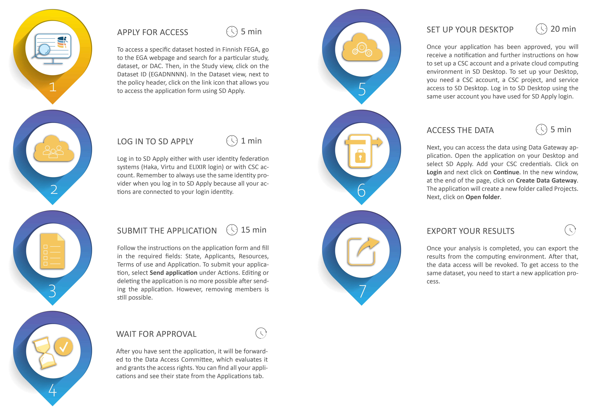

# Data access for Data Applicant

## Application process overview

<iframe width="280" height="155" srcdoc="https://www.youtube.com/embed/pR0DQo11g0U" title="YouTube video player" frameborder="0" allow="accelerometer; autoplay; clipboard-write; encrypted-media; gyroscope; picture-in-picture" allowfullscreen></iframe>

<iframe width="280" height="155" srcdoc="https://www.youtube.com/embed/LFkq2quFq_4" title="YouTube video player" frameborder="0" allow="accelerometer; autoplay; clipboard-write; encrypted-media; gyroscope; picture-in-picture" allowfullscreen></iframe>

## Application process overview

## Step 1: Apply for access
To access a specific dataset hosted in Finnish FEGA, navigate to the [EGA webpage](https://ega-archive.org/studies) and search for a particular study, dataset, or DAC using the search field at the top of the page. Then, in the Study view, click on the Dataset ID (EGADNNNN). In the Dataset view, under “Who controls access to this dataset”, click on the link that allows you to access the application form using SD Apply. SD Apply is a service for applying access rights to sensitive datasets stored at CSC. 

!!! note
    In the EGA webpage, you can also find datasets that are hosted outside Finland, in central EGA or other FEGA nodes. However, this workflow is specific for datasets that are hosted in Finnish FEGA. 

## Step 2: Login to SD Apply

Log in to [SD Apply](https://sd-apply.csc.fi) is possible with either user identity federation systems (Haka, Virtu and ELIXIR login) or with CSC account. The interface is compatible with all modern web browsers.

!!! note
    Always use the same identity provider when you log in to SD Apply because all your actions are connected to your login identity.

## Step 3: Fill application

After login, you will access the SD Apply "Catalogue" page. On this page, you can search for a specific dataset and start the application process. 

Start a new application by clicking on *Add to cart* next to the name of the dataset. You can select multiple datasets, and they will all appear in your cart under the "Catalogue" title. By clicking on *Apply*, you will be redirected to the application form.

## Step 4: Submit the application

Follow the instructions on the application form and fill in the required fields:

- **State**: Contains basic details like title and state of your application.

- **Applicants**: Everyone who processes or has direct or indirect access to the data is considered as a research group member and must be named in the Applicants field. 

    - Members can be added, changed, or removed without re-applying. 
    - You can invite other people to join the data access application by selecting Invite member and providing their names and email addresses. They will then get an invitation email. By following the invitation link, they can log in to SD Apply and accept the terms of use and Data Access Agreement. 
    - When the application is approved, all members of the application will be granted access to the same dataset(s).

- **Resources**: Shows all the datasets you are applying for.

- **Terms of use**: Lists the licenses for data access and re-use (e.g., Data Access Agreement). Click **Accept terms of use** to access.

- **Application**: Access to a dataset is granted for a single, designated purpose only. Add the necessary information about your research: research/study name, research plan abstract, Data access start date and Data access end date.

To submit your application, select **Send application** under **Actions** (top right). 

 - After sending, you can't edit or delete the application, but you can still remove members. 
 - To use it as a template for a new application, select **Copy as new application** under **Actions** (top right). Attachments from the old application will also be copied.

## Step 5: Wait for approval

After you have sent the application, it will be forwarded to the Data Access Committee, which evaluates it and grants the access rights.

During the approval process, the Data Access Committee can:

- approve or reject your application.

- return the application asking for additional information.

- close your application and cancel the application process.

- add comments to your application.

You can follow the approval process and read the possible comments from the "Events" section of the application. In addition, you can find all your applications and see their state from the "Applications" tab:

- **Draft**. Your application is still a draft and cannot be seen by the Data Access Committee. You can continue working on your application or delete it entirely from the system.

- **Submitted**. The application has been sent to the Data Access Committee and cannot be edited anymore unless specifically requested.

- **Approved**. The application has been approved, and you have been granted access rights.

- **Rejected**. To see why your application was rejected, navigate the application and select View. Data Access Committee comments will be shown in the Events section.

- **Returned**. If the data owner needs additional information regarding your application, they can return your application to you. To edit the application, follow the link in the email or log in to SD Apply, navigate to the application, and select *View*. You can see the comments of the Data Access Committee in the Events section. Then, make the changes and select *Send application*.

- **Revoked**. Your Application, and thus your access rights, have been revoked by the Data Access Committee.

You will receive an email notification whenever the state of your application changes.

## Step 6: Access data

Once your application has been approved, you will receive a notification and further instructions via email. You can now access the data in SD Desktop, a private cloud computing environment. 

* [Access SD Desktop](./sd-access.md)

## Step 7: Access the data

Once you sign in to your virtual desktop, you can access the data using Data Gateway application. Follow these steps:

* [Create virtual desktop](./sd-desktop-create.md)
* [Import data to virtual desktop](./sd-desktop-access.md)
* [Working with virtual desktop](./sd-desktop-working.md)

## Step 8: Export your results

Once your analysis is completed, you can export the results from the computing environment. After that, the data access will be revoked. To get access to the same dataset, you need to start a new application process. Follow these steps:

* [Export data from virtual deskotop](./sd-access.md)