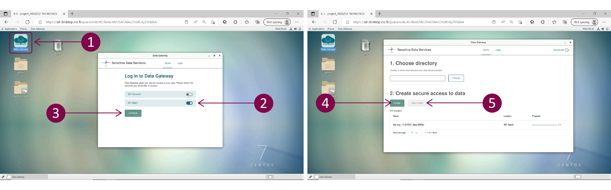

# Data access for Data Applicant

## Application process overview

## Step 1: Login

<iframe width="280" height="155" srcdoc="https://www.youtube.com/embed/LFkq2quFq_4" title="YouTube video player" frameborder="0" allow="accelerometer; autoplay; clipboard-write; encrypted-media; gyroscope; picture-in-picture" allowfullscreen></iframe>

Log in to [SD Apply](https://sd-apply.csc.fi) is possible with either user identity federation systems (Haka, Virtu and ELIXIR login) or with CSC account. The interface is compatible with all modern web browsers.

!!! note
    Always use the same identity provider when you log in to SD Apply because all your actions are connected to your login identity.

## Step 2: Apply for access

After login, you will access the SD Apply "Catalogue" page. On this page, you can search for a specific dataset and start the application process. Start a new application by clicking on *Add to cart* next to the name of the dataset. You can select multiple datasets, and they will all appear in your cart under the "Catalogue" title. By clicking on *Apply*, you will be redirected to the application form.

## Step 3: Submit the application

Follow the instructions on the application form and fill in the required fields:

- **State**. Contains basic details like title and state of your application.

- **Applicants**. Everyone who processes or has direct or indirect access to the data is considered as a research group member and must be named in the Applicants field. Members can be added, changed, or removed without re-applying. You can invite other people to join the data access application by selecting Invite member and providing their names and email addresses. They will then get an invitation email. By following the invitation link, they can log in to SD Apply and accept the terms of use and Data Access Agreement. When the application is approved, all members of the application will be granted access to the same dataset(s).

- **Resources**. Shows all the datasets you are applying for

- **Terms of use**. Lists all the licenses defining the terms and conditions for data access and re-use (e.g. Data Access Agreement). To access, click on Accept terms of use.

- **Application**. Access to a dataset is granted for a single, designated purpose only. Add the necessary information about your research: research/study name, research plan abstract, Data access start date and Data access end date.

To submit your application, select *Send application* under Actions. Unfortunately, editing or deleting the application is no more possible after sending the application. However, removing members is still possible. If you want to use the application as a template for a new application, select *Copy as new application*. Note that the attachments (e.g. research plan) of your old application will also be copied.

## Step 4: Wait for approval

After you have sent the application, it will be forwarded to the Data Access Committee, which evaluates it and grants the access rights.

During the approval process, the Data Access Committee can:

- approve or reject your application.

- return the application asking for additional information.

- close your application and cancel the application process.

- add comments to your application.

You can follow the approval process and read the possible comments from the "Events" section of the application. In addition, you can find all your applications and see their state from the "Applications" tab:

- **Draft**. Your application is still a draft and cannot be seen by the Data Access Committee. You can continue working on your application or delete it entirely from the system.

- **Submitted**. The application has been sent to the Data Access Committee and cannot be edited anymore unless specifically requested.

- **Approved**. The application has been approved, and you have been granted access rights.

- **Rejected**. To see why your application was rejected, navigate the application and select View. Data Access Committee comments will be shown in the Events section.

- **Returned**. If the data owner needs additional information regarding your application, they can return your application to you. To edit the application, follow the link in the email or log in to SD Apply, navigate to the application, and select *View*. You can see the comments of the Data Access Committee in the Events section. Then, make the changes and select *Send application*.

- **Revoked**. Your Application, and thus your access rights, have been revoked by the Data Access Committee.

You will receive an email notification whenever the state of your application changes.

## Step 5: Set up your Desktop

Once your application has been approved, you will receive a notification and further instructions via email. You can now access the data in SD Desktop, a private cloud computing environment. To set up your workspace, you need a CSC account, a CSC project, and service access to SD Desktop. When logging in to SD Desktop, use the same user account/identity provider (CSC account, Haka, or ELXIR login) you have used for SD Apply log in. Next, enter the authentication code received via the mobile app. If you are a new CSC user, check these instructions on [accounts](../../accounts/index.md) and [multi-factor authentication](../../accounts/mfa.md).

!!! note
    If you are a new CSC user, please check these instructions on CSC [accounts](../../accounts/index.md). Check also the [SD Desktop user guide](./sd_desktop.md) and [CSC Sensitive Data Services for Research webpage](https://research.csc.fi/sensitive-data-services-for-research) for more information. 

## Step 6: Access the data

Once you sign in to your virtual Desktop, you can access the data using Data Gateway application. Follow these steps:

1. Open Data Gateway. You can find the application on your Desktop.

2. Select SD Apply.

3. Add your CSC credentials.

4. Click on *Login* and next click on *Continue*.

5. In the new window, at the end of the page, click on *Create*. The application will create a new folder called Projects accessible from your Desktop or programmatically the terminal. Next, click on *Open folder*.

!!! note

    The Projects folder is available only when the Data Gateway application is open. If you sign out from the application, you will not access the data stored in other Sensitive Data services unless you previously made a full copy of it inside your Desktop. Thus, Data Gateway needs to be open during data processing in streaming mode.

## Step 7: Export your results

Once your analysis is completed, you can export the results from the computing environment. After that, the data access will be revoked. To get access to the same dataset, you need to start a new application process.
