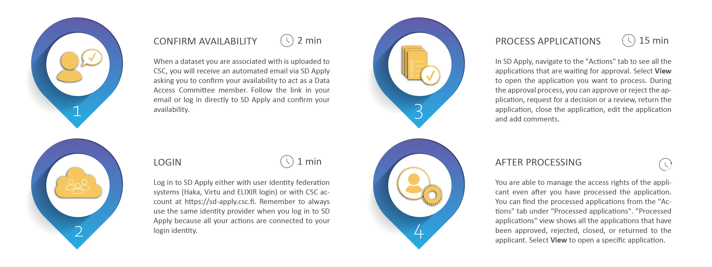

# Data approval for Data Access Committee (DAC)

The Data Access Committee (DAC) is responsible for processing data access applications and managing access rights to different datasets. In practice, the DAC can approve or reject applications and revoke access rights in case of misuse. All the communication between the DAC and the data applicant is managed using SD Apply. Each DAC is linked to a specific dataset present in the SD Apply catalogue. DAC members can process data access applications separately, thus only one DAC member needs to approve or reject the application. The SD Apply user interface guides you during the data access revision process.

## DAC process overview

## Step 1: Confirm availability

The Data Access Committee is established during the data submission process. When a dataset you are associated with is uploaded to CSC, you will receive an automated email via SD Apply asking you to confirm your availability to act as a Data Access Committee member. Follow the link in your email or log in directly to [SD Apply](https://sd-apply.csc.fi) and confirm your availability. 

## Step 2: Login

As a DAC member, you receive email notifications each time when an applicant applies for data access to the dataset you are associated with.

To start processing applications, follow the link in your email or log in directly to [SD Apply](https://sd-apply.csc.fi/). Login to SD Apply is possible either with user identity federation systems (Haka, Virtu and ELIXIR login) or with CSC account. Use the identity provider your organisation/institution recommends.

!!! note
    Always use the same identity provider when you log in to SD Apply because all your actions are connected to your login identity.

## Step 3: Process the application

In SD Apply, navigate to the "Actions" tab to see all the applications that are waiting for approval. Select *View* to open the application you want to process. You do not have to follow any specific order when you process the applications. The approval process is fully dynamic.

### Approve or reject the application

You can approve or reject the application right away if the applicant has provided all the needed information. Select *Approve or reject application* under "Actions". If you reject an application, we recommend telling the applicant why the application was rejected by writing a comment.

The applicant will receive an email notification about the decision. Once you approve or reject the application, the decision is final. You cannot edit it later. If the applicant has added members to their application, the members will get access rights too when the application is approved, if they have accepted the terms of use. Any member not having accepted the terms of use by that time will get access rights after they log in to SD Apply and accept the terms of use.

!!! note
    If the owner of the dataset has removed the dataset that applicant is applying for access, SD Apply will give a warning, but you can still process the application. However, if the dataset has been removed, you cannot approve or reject the application.
    
### Request for a decision or a review

Depending on the practices of your organisation, it might be necessary to request a decision on the application or request someone to review the application. To request for a decision or a review, choose *Request review* or *Request decision* under "Actions" and locate the user in the drop-down list or use the search function. You can add one or more users. 

The requested user will receive an email notification about a review or a decision request. You can still approve or reject the application even if the requested user has not reviewed the application. You will receive an email after a decision or a review has been made. See “Email notifications” if you want to know when you will receive notifications.

### Return the application to the applicant

If the application is missing some information, you can return it to the applicant. Write a comment on the application or attach a file of the changes you want the applicant to make. Select *Return to applicant* under "Actions" to return the application.

The applicant will receive an email notification about a returned application. They can resubmit the application after editing it. Resubmitted applications will show up in the "Actions" tab. The changes the applicant has made will show as highlighted on the application form.

### Close the application

You can close the application at any stage of the process by selecting *Close application*. Closing means that the application process is cancelled and that the application cannot be modified or opened again. Write a comment on the comment field to explain why did you close the application.

We recommend closing the application, if it is somehow inappropriate. Deleting applications is not possible because we want to always provide a full history of the application process. You can find closed applications in the "Actions" tab under "Processed applications".

### Edit the application

You can also edit applications by the following ways:

- **Change the licenses**. The applicant will receive an email notification about the change in terms of use and has to accept the new licenses before they will be granted access rights.

- **Add or remove members**. If you do not want to grant access to all members in the application, you can remove additional members. Adding members is also possible.

- **Change the applicant**. You can change the applicant to another member of the application. This can be useful if, for example, the original applicant has left the applying organisation.

- **Change the resources of the application**. If the applicant is applying for access rights to multiple datasets, and you do not want to grant access to all of them, you can remove some of the datasets. It is also possible to add new resources if they can be applied for using the same application form. These will show as available in the drop-down list.

!!! note
    You can comment on the application throughout the application process by selecting *Remark* and choosing if you want to show the comment to the applicant or not. Applicants will receive a notification about new public comments. Sometimes it is useful for the applicant to see the comments so that they know how the approval process is proceeding. Note that the applicant cannot respond to the comments.

## Step 4: After processing the application

You are able to manage the access rights of the applicant even after you have processed the application. You can find the processed applications from the "Actions" tab under "Processed applications". "Processed applications" view shows all the applications that have been approved, rejected, closed, or returned to the applicant. Select *View* to open a specific application.

### Close the application

Closing the application cancels the access rights of the applicant and other application members. When the applicant and the application members do not need the access rights anymore, for example because their research period has ended, you can cancel their access rights by selecting *Close application*.

### Revoke access rights

If the applicant has been granted access rights, but they misuse them, you can revoke the rights by selecting *Revoke entitlement*. Revoking will add the applicant and all the application members to a blacklist. This means that if any of them tries to apply for access rights to the same dataset again, SD Apply will warn the application handlers. The owner of the dataset can edit the blacklist. You can find the blacklist from the "Administration" tab.

## Email notifications

You will receive email notifications about the actions of other SD Apply users. A Data Access Committee has often more than one member. Therefore, all the DAC members who have been assigned to a certain dataset, receive an email notification when one of the DAC members has processed an application.

You can see and edit your email address from the "Settings" tab in the top right corner of the page.

You will be notified when another handler has:

- commented an application.

- returned the application to the applicant.

- approved an application.

- rejected an application.

- closed an application.

- revoked the access rights of the applicant.

You will also receive notifications when an applicant has submitted or resubmitted an application.
