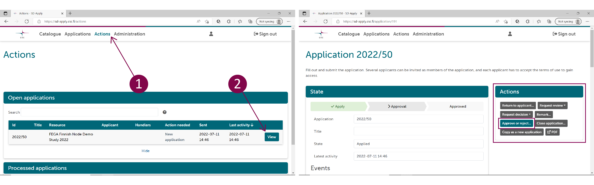

# Data approval for Data Access Committee (DAC)

Data Access Committee (DAC) is established during the FEGA data submission process. After the service agreement between CSC and the data controller is in place, the data controller will designate the DAC members in the SD Apply service. The DAC is responsible for processing data access applications and managing access rights to different datasets. All the communication between DAC and the data applicant is managed using SD Apply. Each DAC is associated with specific datasets in the SD Apply catalogue. DAC members can process data access applications independently, thus only one DAC member needs to approve or reject the application. 

Please note that these are general instructions for how to use SD Apply service as a DAC member. Instructions on how to process the applications should be provided by your home organisation or the data controller.
 
## Step 1: Login

When you have been designated as a DAC member for a dataset that is uploaded to Finnish FEGA, the data controller should ask you to login to SD Apply. You will receive email notifications from SD Apply, when an applicant applies for data access.  

Login to [SD Apply](https://sd-apply.csc.fi/) by using your identity provider (Haka, Virtu and ELIXIR login) or with CSC account credentials.

!!! note Always use the same identity provider (e.g. Haka, Virtu) when you log in to SD Apply because all your actions are connected to your login identity.

## Step 2: Process applications

In SD Apply, navigate to the "Actions" tab to see all the applications that are waiting for your approval. Select *View* to open the application you want to process. 

On the application page, you can check 

- **Applicants field**: Shows the applicant's and possible additional research group members' name and affiliation by clicking show more. All research group members should be added to the application. 
- **Terms of use**: Shows the terms of use and agreements (e.g. Data Access Agreement) the applicant and research group members have accepted. The applicant cannot send the application without accepting the terms of use. The added members will not get access to the data before they have accepted the terms of use.
- **Resources**: Shows the dataset the applicant is applying access to.
- **Application**: Application form has all the information applicant has provided. This could include summary of their research, duration of the research project etc. depending on what information the data controller requires applicant to provide.

### Return the application to the applicant

If the application is missing necessary information, you can return it back to the applicant. Write a comment on the application or attach a file of the changes you want the applicant to make. Select *Return to applicant* under "Actions" to return the application. Note that the applicants are not able to respond to the comment.  

The applicant will receive an email notification about a returned application. They can resubmit the application after editing it. Resubmitted applications will show up in the "Actions" tab. The changes the applicant has made will show as highlighted on the application form.

### Request a decision or a review

Only one DAC member needs to process (approve or reject) the application. Depending on the practices of your organisation, it might be needed to request a decision on the application or request an additional person to review the application. To request for a decision or a review, choose *Request review* or *Request decision* under "Actions" and locate the user in the drop-down list or use the search function. You can add one or more users. 

The requested user will receive an email notification about a review or a decision request. You can still approve or reject the application even if the requested user has not reviewed the application. You will receive an email after a decision or a review has been made. 

### Close the application

You can close the application at any stage of the process by selecting *Close application*. Closing means that the application process is cancelled and that the application cannot be modified or opened again. Write a comment on the comment field to explain why did you close the application. Deleting applications is not possible because we want to always provide a full history of the application process. You can find closed applications in the "Actions" tab under "Processed applications".

### Edit the application

You can also edit applications by the following ways:

- **Add terms of use**. The applicant will receive an email notification about the change in terms of use and has to accept the added policies before they will be granted access rights.

- **Add or remove members**. If you do not want to grant access to all members in the application, you can remove additional members. Adding members is also possible.

- **Change the applicant**. You can change the applicant to another member of the application. This can be useful if, for example, the original applicant has left the applying organisation.

- **Change the resources of the application**. If the applicant is applying for access rights to multiple datasets, and you do not want to grant access to all of them, you can remove some of the datasets. It is also possible to add new resources if they have the same DAC. These will show as available in the drop-down list.

!!! note
    You can comment on the application throughout the application process by selecting *Remark* and choosing if you want to show the comment to the applicant or not. Applicants will receive a notification about new public comments. Sometimes it is useful for the applicant to see the comments so that they know how the approval process is proceeding. Note that the applicant cannot respond to the comments.

## Step 3: Approve or reject 
When you have all the necessary information, you can grant or deny access to the data by selecting *Approve or reject application* under "Actions". Please give a motivation for the decision in the "Add comments" field. You can also define a date when the access rights will be automatically cancelled so that data access does not have to be manually discontinued. Once you approve or reject the application, the decision is final. You cannot edit it later.

The final decision is sent to the applicant with information on how the dataset can be accessed using SD Desktop. If you grant access rights to the dataset, the applicant will be able to access the data in SD Desktop automatically. If the applicant has added members to their application, the members will get access rights too when the application is approved, if they have accepted the terms of use. Any member not having accepted the terms of use by that time will get access rights after they log in to SD Apply and accept the terms of use.

!!! note
    Every action is recorded in SD Apply (e.g. previous applications from the same applicant are available).

## Step 3: After processing the application

You are able to manage the access rights of the applicant even after you have processed the application. You can find the processed applications from the "Actions" tab under "Processed applications". "Processed applications" view shows all the applications that have been approved, rejected, closed, or returned to the applicant. Select *View* to open a specific application.

### Close the application

Closing the application cancels the access rights of the applicant and other application members. When the applicant and the application members do not need the access rights anymore, for example because their research period has ended, you can cancel their access rights by selecting *Close application*.

### Revoke access rights

If the applicant has been granted access rights, but they misuse them, you can revoke the rights by selecting *Revoke entitlement*. 

## Support

If you have questions about using SD Apply, please contact [CSC Service Desk](../../support/contact.md) (subject: SD Apply).  

If you have questions regarding the applications or the datasets, please contact the data controller.
