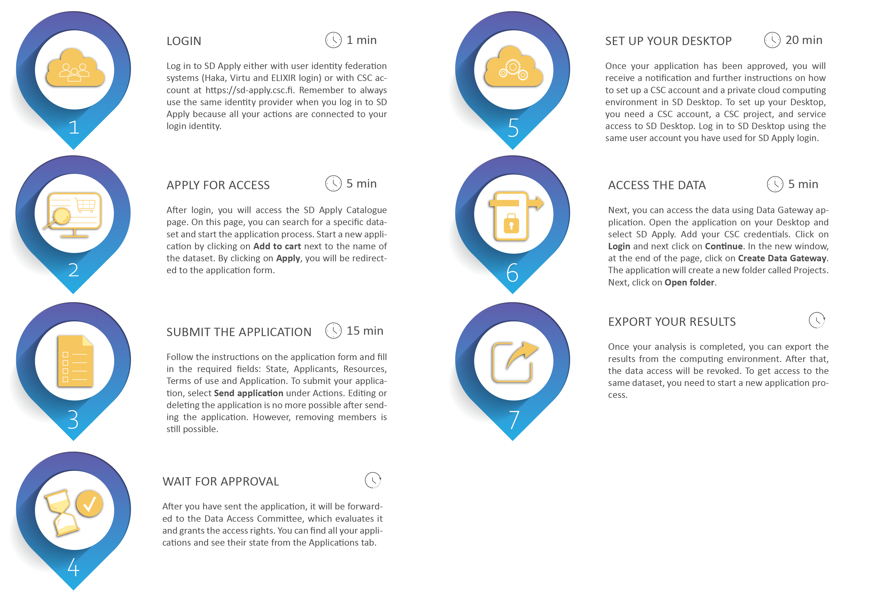
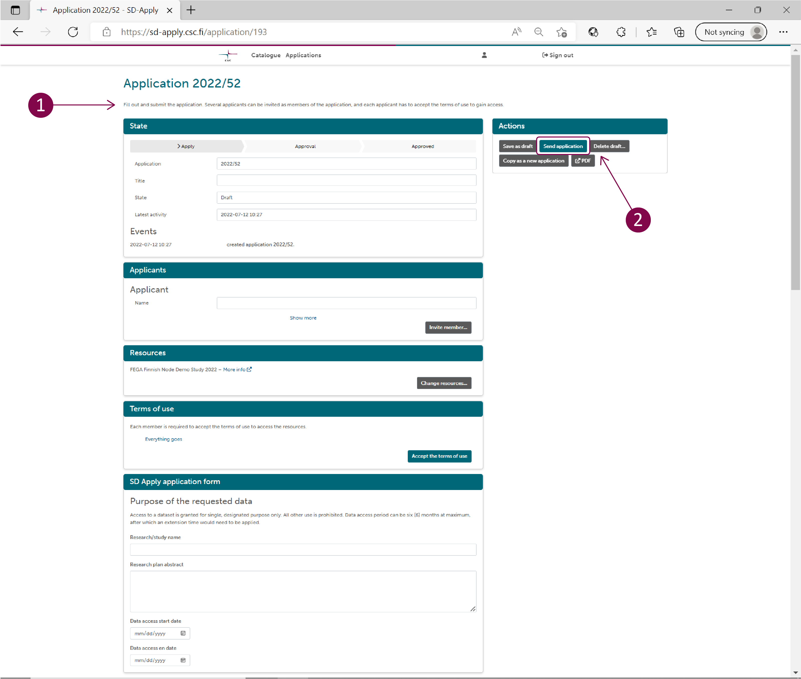
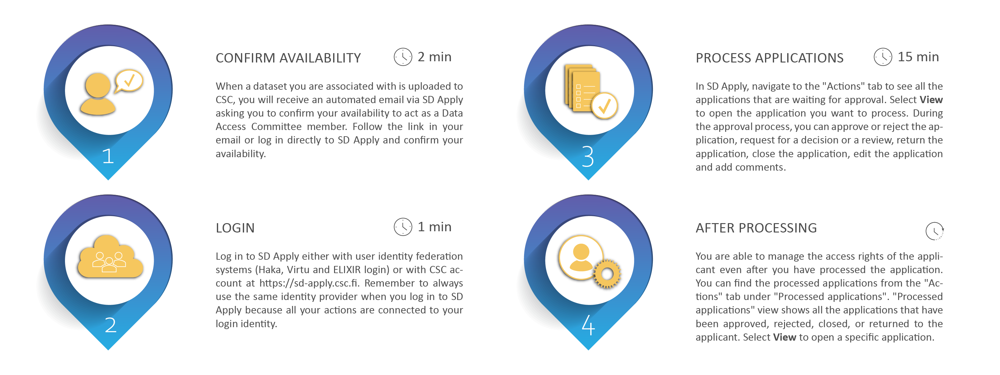

# SD Apply
Sensitive Data Apply (SD Apply) is a service for applying access rights to sensitive datasets stored at CSC. In practice, it is a simple web user interface that guides you during the application process.

Each sensitive dataset that is published under controlled access is associated with a Data Access Committee (DAC). The DAC is a body of one or more named individuals who are responsible for granting data access to external applicants (or requesters) based on specific policies. SD Apply facilitates the communication between a data applicant and the DAC by automating the application process, ensuring the availability of the necessary information and providing a record of the application history. Once the application has been reviewed and approved, the data applicant can directly analyse the datasets in SD Desktop – a cloud computing environment part of [CSC Sensitive Data Services for research](https://research.csc.fi/sensitive-data-services-for-research).

The following is a step-by-step guide to SD Apply that illustrates: 

- **[Data access for Data Applicant](https://github.com/CSCfi/csc-user-guide/edit/wip-at-fega/docs/data/sensitive-data/sd-apply.md#data-access-for-data-applicant)**
- **[Data approval for Data Access Committee (DAC)](https://github.com/CSCfi/csc-user-guide/edit/wip-at-fega/docs/data/sensitive-data/sd-apply.md#data-approval-for-data-access-committee-dac)**

## Data access for Data Applicant
### Application process overview

### Step 1: Login
Log in to SD Apply is possible with either user identity federation systems (Haka, Virtu and ELIXIR login) or with CSC account at <https://sd-apply.csc.fi>. The interface is compatible with all modern web browsers.

!!! note
    Always use the same identity provider when you log in to SD Apply because all your actions are connected to your login identity.

### Step 2: Apply for access
After login, you will access the SD Apply "Catalogue" page. On this page, you can search for a specific dataset and start the application process. Start a new application by clicking on *Add to cart* next to the name of the dataset. You can select multiple datasets, and they will all appear in your cart under the "Catalogue" title. By clicking on *Apply*, you will be redirected to the application form.

### Step 3: Submit the application
Follow the instructions on the application form and fill in the required fields:

- **State**. Contains basic details like title and state of your application.

- **Applicants**. Everyone who processes or has direct or indirect access to the data is considered as a research group member and must be named in the Applicants field. Members can be added, changed, or removed without re-applying. You can invite other people to join the data access application by selecting Invite member and providing their names and email addresses. They will then get an invitation email. By following the invitation link, they can log in to SD Apply and accept the terms of use and Data Access Agreement. When the application is approved, all members of the application will be granted access to the same dataset(s).

- **Resources**. Shows all the datasets you are applying for

- **Terms of use**. Lists all the licenses defining the terms and conditions for data access and re-use (e.g. Data Access Agreement). To access, click on Accept terms of use.

- **Application**. Access to a dataset is granted for a single, designated purpose only. Add the necessary information about your research: research/study name, research plan abstract, Data access start date and Data access end date.

To submit your application, select *Send application* under Actions. Unfortunately, editing or deleting the application is no more possible after sending the application. However, removing members is still possible. If you want to use the application as a template for a new application, select *Copy as new application*. Note that the attachments (e.g. research plan) of your old application will also be copied.

### Step 4: Wait for approval
After you have sent the application, it will be forwarded to the Data Access Committee, which evaluates it and grants the access rights.

During the approval process, the Data Access Committee can:

- approve or reject your application.

- return the application asking for additional information.

- close your application and cancel the application process.

- add comments to your application.

You can follow the approval process and read the possible comments from the "Events" section of the application. In addition, you can find all your applications and see their state from the "Applications" tab:

- **Draft**. Your application is still a draft and cannot be seen by the Data Access Committee. You can continue working on your application or delete it entirely from the system.

- **Submitted**. The application has been sent to the Data Access Committee and cannot be edited anymore unless specifically requested.

- **Approved**. The application has been approved, and you have been granted access rights.

- **Rejected**. To see why your application was rejected, navigate the application and select View. Data Access Committee comments will be shown in the Events section.

- **Returned**. If the data owner needs additional information regarding your application, they can return your application to you. To edit the application, follow the link in the email or log in to SD Apply, navigate to the application, and select *View*. You can see the comments of the Data Access Committee in the Events section. Then, make the changes and select *Send application*.

- **Revoked**. Your Application, and thus your access rights, have been revoked by the Data Access Committee.

You will receive an email notification whenever the state of your application changes.

### Step 5: Set up your Desktop
Once your application has been approved, you will receive a notification and further instructions via email. You can now access the data in SD Desktop, a private cloud computing environment. To set up your workspace, you need a CSC account, a CSC project, and service access to SD Desktop. When logging in to SD Desktop, use the same user account/identity provider (CSC account, Haka, or ELXIR login) you have used for SD Apply log in. Next, enter the authentication code received via the mobile app. If you are a new CSC user, check these instructions on [accounts](https://docs.csc.fi/accounts/) and [multi-factor authentication](https://docs.csc.fi/accounts/mfa/).

!!! note
    If you are a new CSC user, please check these instructions on CSC [accounts](https://docs.csc.fi/accounts/). Check also the [SD Desktop user guide](https://docs.csc.fi/data/sensitive-data/sd_desktop/) and [CSC Sensitive Data Services for Research webpage](https://research.csc.fi/sensitive-data-services-for-research) for more information. 

### Step 6: Access the data 

Once you sign in to your virtual Desktop, you can access the data using Data Gateway application. Follow these steps:

1. Open Data Gateway. You can find the application on your Desktop.

2. Select SD Apply.

3. Add your CSC credentials.

4. Click on *Login* and next click on *Continue*.

5. In the new window, at the end of the page, click on *Create Data Gateway*. The application will create a new folder called Projects accessible from your Desktop or programmatically the terminal. Next, click on Open folder.

!!! note

    The Projects folder is available only when the Data Gateway application is open. If you sign out from the application, you will not access the data stored in other Sensitive Data services unless you previously made a full copy of it inside your Desktop. Thus, Data Gateway needs to be open during data processing in streaming mode.

### Step 7: Export your results
Once your analysis is completed, you can export the results from the computing environment. After that, the data access will be revoked. To get access to the same dataset, you need to start a new application process.

## Data approval for Data Access Committee (DAC)
The Data Access Committee (DAC) is responsible for processing data access applications and managing access rights to different datasets. In practice, the DAC can approve or reject applications and revoke access rights in case of misuse. All the communication between the DAC and the data applicant is managed using SD Apply. Each DAC is linked to a specific dataset present in the SD Apply catalogue. DAC members can process data access applications separately, thus only one DAC member needs to approve or reject the application. The SD Apply user interface guides you during the data access revision process.

### DAC process overview

### Step 1: Confirm availability

The Data Access Committee is established during the data submission process. When a dataset you are associated with is uploaded to CSC, you will receive an automated email via SD Apply asking you to confirm your availability to act as a Data Access Committee member. Follow the link in your email or log in directly to SD Apply at https://sd-apply.csc.fi/ and confirm your availability. 

### Step 2: Login
As a DAC member, you receive email notifications each time when an applicant applies for data access to the dataset you are associated with.

To start processing applications, follow the link in your email or log in directly to SD Apply at <https://sd-apply.csc.fi/>. Login to SD Apply is possible either with user identity federation systems (Haka, Virtu and ELIXIR login) or with CSC account. Use the identity provider your organisation/institution recommends.

!!! note
    Always use the same identity provider when you log in to SD Apply because all your actions are connected to your login identity.

### Step 3: Process the application
In SD Apply, navigate to the "Actions" tab to see all the applications that are waiting for approval. Select *View* to open the application you want to process. You do not have to follow any specific order when you process the applications. The approval process is fully dynamic.

[.png)](images/apply/apply_dac(1).png)
[.png)](images/apply/apply_dac(2).png)

#### Approve or reject the application
You can approve or reject the application right away if the applicant has provided all the needed information. Select *Approve or reject application* under "Actions". If you reject an application, we recommend telling the applicant why the application was rejected by writing a comment.

The applicant will receive an email notification about the decision. Once you approve or reject the application, the decision is final. You cannot edit it later. If the applicant has added members to their application, the members will get access rights too when the application is approved, if they have accepted the terms of use. Any member not having accepted the terms of use by that time will get access rights after they log in to SD Apply and accept the terms of use.

!!! note
    If the owner of the dataset has removed the dataset that applicant is applying for access, SD Apply will give a warning, but you can still process the application. However, if the dataset has been removed, you cannot approve or reject the application.
    
#### Request for a decision or a review
Depending on the practices of your organisation, it might be necessary to request a decision on the application or request someone to review the application. To request for a decision or a review, choose *Request review* or *Request decision* under "Actions" and locate the user in the drop-down list or use the search function. You can add one or more users. 

The requested user will receive an email notification about a review or a decision request. You can still approve or reject the application even if the requested user has not reviewed the application. You will receive an email after a decision or a review has been made. See “Email notifications” if you want to know when you will receive notifications.

#### Return the application to the applicant
If the application is missing some information, you can return it to the applicant. Write a comment on the application or attach a file of the changes you want the applicant to make. Select *Return to applicant* under "Actions" to return the application.

The applicant will receive an email notification about a returned application. They can resubmit the application after editing it. Resubmitted applications will show up in the "Actions" tab. The changes the applicant has made will show as highlighted on the application form.

#### Close the application
You can close the application at any stage of the process by selecting *Close application*. Closing means that the application process is cancelled and that the application cannot be modified or opened again. Write a comment on the comment field to explain why did you close the application.

We recommend closing the application, if it is somehow inappropriate. Deleting applications is not possible because we want to always provide a full history of the application process. You can find closed applications in the "Actions" tab under "Processed applications".

#### Edit the application

You can also edit applications by the following ways:

- **Change the licenses**. The applicant will receive an email notification about the change in terms of use and has to accept the new licenses before they will be granted access rights.

- **Add or remove members**. If you do not want to grant access to all members in the application, you can remove additional members. Adding members is also possible.

- **Change the applicant**. You can change the applicant to another member of the application. This can be useful if, for example, the original applicant has left the applying organisation.

- **Change the resources of the application**. If the applicant is applying for access rights to multiple datasets and you do not want to grant access to all of them, you can remove some of the datasets. It is also possible to add new resources if they can be applied for using the same application form. These will show as available in the drop-down list.

!!! note
    You can comment on the application throughout the application process by selecting *Remark* and choosing if you want to show the comment to the applicant or not. Applicants will receive a notification about new public comments. Sometimes it is useful for the applicant to see the comments so that they know how the approval process is proceeding. Note that the applicant cannot respond to the comments.

### Step 4: After processing the application
You are able to manage the access rights of the applicant even after you have processed the application. You can find the processed applications from the "Actions" tab under "Processed applications". "Processed applications" view shows all the applications that have been approved, rejected, closed, or returned to the applicant. Select *View* to open a specific application.

#### Close the application
Closing the application cancels the access rights of the applicant and other application members. When the applicant and the application members do not need the access rights anymore, for example because their research period has ended, you can cancel their access rights by selecting *Close application*.

#### Revoke access rights
If the applicant has been granted access rights but they misuse them, you can revoke the rights by selecting *Revoke entitlement*. Revoking will add the applicant and all the application members to a blacklist. This means that if any of them tries to apply for access rights to the same dataset again, SD Apply will warn the application handlers. The owner of the dataset can edit the blacklist. You can find the blacklist from the "Administration" tab. 

### Email notifications
You will receive email notifications about the actions of other SD Apply users. A Data Access Committee has often more than one member. Therefore, all the DAC members who have been assigned to a certain dataset, receive an email notification when one of the DAC members has processed an application.

You can see and edit your email address from the "Settings" tab in the top right corner of the page.

You will be notified when another handler has:

- commented an application.

- returned the application to the applicant.

- approved an application.

- rejected an application.

- closed an application.

- revoked the access rights of the applicant.

You will also receive notifications when an applicant has submitted or resubmitted an application.

### Best practices
- Aim to respond to all initial requests within two weeks.

- Check that the user will be using the data within terms of consent, by asking them to sign up to the terms within the DAA.

- Check for an Institutional email address for the applicant.

- Look for evidence of the applicant being “appropriately qualified/bona fide” for use of the data e.g. PubMed search, Research Gate, LinkedIn etc.

- Check the affiliated organisation is real and that they are still working there.

- In the event that a negative decision is made we would expect that this decision be promptly communicated to the applicant and supported by the terms of the Data Access Policy that the requestor has not or cannot meet

