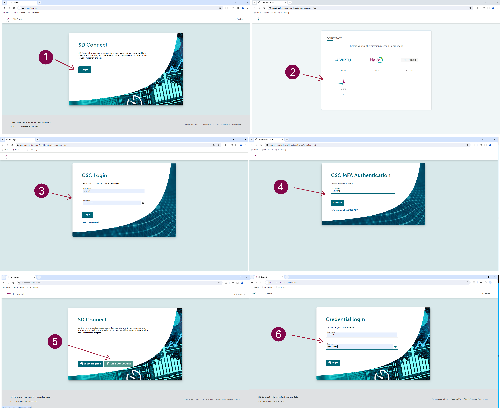

# SD Connect (Beta)

The updated SD Connect user interface offers automated file encryption and decryption (up to 100 GB) along with key management. Additionally, three levels of sharing permissions are accessible across CSC projects. Files and subfolers uploaded via this user inerface will be encrypted and accessible for dowload and decrption to all CSC project members. 

This version is in Open Beta, occasional service interruptions may occur. Please use this version for testing scenarios and avoid relying on it for storing critical data until it transitions to a stable release. Please, provide feedback at servicedesk@csc.fi (subject: Sensitive Data) to contribute to service improvement. Thank you for your cooperation.

Content:

## Service access via MyCSC

To access SD Connect (Beta) for storing, sharing or analyzing sensitive research data:

1. Create a [CSC account](../../accounts/how-to-create-new-user-account.md) by logging in at the [MyCSC portal](https://my.csc.fi).

2. Create or join a CSC project and add project members.

3. Fill in the _Description of processing activities form_ and accept _CSC's Data Processing Agreement_.  

4. All project members need to apply for service access to SD Connect (Beta) by agreeing to the terms of use. Note: SD Connect is based the Allas cloud storage solution, therefore Allas is also automatically activated and visible as an active service. 

5. All project members should activate their account's additional security verification (or Multi-factor Authentication) by scanning the QR code with a mobile application (e.g. Google Authenticator).  For further instructions see the [MFA paragraph](../../accounts/mfa.md), under the Account section on the CSC user guide;

6. Apply for billing units or disk quota.

For further guidance, check the [Accounts](../../accounts/index.md) section at the beginning of this manual.

## Login

Due to an ongoing technical challenges, double login is required to access the service. We apologise for the complexity of this process. Please following these steps:

1. Navigate to https://sd-connect.sd.csc.fi  We suggest to use Google Chrome or Firefox for optimal service performance. Please, clear browser history and cookies if you have accessed the service before. 
   
3. Choose your login method (CSC Login, HAKA) and click on *Login*. In the new page, enter your username and password, and clcik on *Login*.
   
5. Verify your identity with the temporary code (Multi-factor authentication); click on *Continue*.
   
7. You might now encounter an additional page stating that your account needs to go through identity verification. Please press on *Proceed* to continue at the bottom of the message.
   
9. You will now be redirected one more time to the login page. Here, please select again the login method (HAKA or CSC Login) and press on *Login*. In the new page, add again your username and password and press on *Login*. After this final step, you should be able to access the service. Please, clear browser history and cookies if errors occur.

## Data uplaod 

To automatically upload and encrypt files with SD Connect to a new destination folder, follow these steps:

1. **Select CSC Project**: Go to the SD Connect browser page and choose the relevant CSC project in the top left corner.

2. **Start a new upload**: Click the *Upload* button in the top right corner.
   
3. **Create a new folder**: In the new window, name the destination folder for your files. Please note that folder names cannot be modified after creation. Folder names must be unique across all existing folders in all projects in SD Connect and Allas (the cloud storage solution based on which SD Connect is developed). If you can't create a new folder, another project may already use the name you desire. To avoid this situation, it is good practice to include project-specific identifiers (e.g., project ID number or acronym) in the folder name. Avoid spaces and special characters; use Latin alphabets (a-z), numbers (0-9), dash (-), underscore (_), and dot (.). Remember, all folder names are public; please do not include any confidential information.

4. **Select files to be uploaded**: Click the *Select Files* button to open a browser window and choose files for upload. If you want to upload folders, drag and drop them into the window.

5. **Start upload**: Click the *Upload* button to initiate automatic encryption and upload. Notifications about the upload status will be displayed and visible until the upload is completed. The notification also includes a link to the destination folder.

Once the upload is finished, encrypted files are accessible for download or for analysis, editing, or annotation via the SD Desktop. To add files to an existing destination folder, simply access the folder (double-click on the correct folder) and click on *Upload*. The subsequent window will showcase the folder name, allowing you to proceed by clicking on *Select Files*.

!!! Note
    All members within the same CSC project can download decrypted data stored in SD Connect (Beta). However, this capability can be limited by sharing files in read-only mode. Please check the following paragraph for more details.

**Addittional considerations:**

* SD Connect offers automated encryption/description and key management for all file types and formats (> 100GB). Uploading large or numerous files may take several hours, depending on the internet speed. Note that ongoing uploads will be automatically stopped after 8 hours.

* SD Connect user interface visualises the destination folders where your encrypted data is stored. Think of the destination folder like a virtual box on the internet where you keep your digital files—like photos or documents. You can not chnage the destination folder name and you can't edit files directly through the user interface, but editing is only possible after downloading on your laptop or by accessing the files and making a copy via SD Desktop.

* Planning how to organise your files in SD Connect destintion folders is a crucial step for efficient data management. Carefully consider storing the files based on projects, themes, or logical structures to enhance accessibility and streamline workflow. A well-thought-out folder structure also facilitates collaboration when sharing access with others. If you have questions or need assistance, don't hesitate to contact our service desk (servicedesk@csc.fi, subject: sensitive data). 

## Data downlaod

!!! Note
    All members within the same CSC project have access and can download decrypted data stored in SD Connect (Beta).

### To download the entire folder content:

1. **Select CSC project**: Navigate to the SD Connect browser page and choose the relevant CSC project in the top left corner.

2. **Locate the correct folder**: In the *All folders* tab, find the correct folder and on the same row (right-side), click on *Download*. The download duration for large files can vary based on the internet connection, and the specific browser being used may necessitate different actions:

2.1 Google Chrome: A new window will open, prompting you to choose where to save the folder. Once the download starts, two files will be visible: folder.tar and folder.tar.srswap. Do not attempt to open folders until the name.tar.srswap is no longer visible. Decrypted files or subfolers will be accessible inside the folder.tar.

2.2 Firefox: If you see the message *Firefox prevented this site from opening a pop-up window*, click on *Options* and *Allow pop-ups for sd.connect.sd.csc.fi*. The download will automatically start. Avoid opening the folder until the download is completed. Decrypted files  or subfolders will be accessible inside the folder.tar.

### To download a single file:

1. **Select CSC project**: Navigate to the SD Connect browser page and choose the relevant CSC project in the top left corner.

2. **Locate the file**: In the *All folders* tab, double click on the folder to visualize the content. Locate the file, and on the same row (right-side), click on *Download*. The download duration for large files can vary based on the internet connection, and the specific browser being used may necessitate different actions:

2.1 Google Chrome: A new window will open, prompting you to choose where to save the file. The download will automatically start, and the decrypted file will be available.

2.2 Firefox: If you see the message *Firefox prevented this site from opening a pop-up window*, click on Options and *Allow pop-ups for sd.connect.sd.csc.fi*. The download will automatically start, and the decrypted file will be available.

!!! Note
    You can only download one file at a time. The file selection option (available on the right-side of the window) is available only for deleting files.

# Data sharing

!!! Note
    When transferring personal data **outside EU** under the General Data Protection Regulation (GDPR) it's crucial to adhere to requirements ensuring privacy and individual rights. Please verify that the destination country or recipient organization offers an adequate level of data protection, as determined by the European Commission. For more information, [click here](https://commission.europa.eu/law/law-topic/data-protection/international-dimension-data-protection/adequacy-decisions_en). In the absence of an adequacy decision, alternative safeguards are necessary. Kindly consult your organization's legal office for guidance. Addittionally, CSC as the data processor needs to maintain accurate records of processing activities. Please contact us at servidesk@csc.fi (subject:sensitive data) to report international data transfers (this also includes **adding collaboratos affiliated to an internation organziation as a member of a CSC project**). 

With SD Connect, you can  share folders across different CSC projects. To initiate the sharing process, you'll need the Share ID—a 32-digit code associated with the target CSC project.  The recipient can copy the Share ID from the user interface and provide it to you via email. You can share a folder with multiple CSC projects by entering their respective Share IDs in the dedicated window.

The sharing functionality includes three distinct permission levels for various purposes: read-only access, data transfer, and data collection. Below example scenarios demonstrate how the different permission levels in SD Connect can be applied based on specific collaboration requirements and data-sharing needs. Find the detailed steps for each option below. 

### Read only-access

Use case axample: A research team (Recipient project B) needs access to specific data for reference and analysis, but the data owner (Project A) wants to restrict their ability download a copy of the data directly. Project A shares the data folder with read-only access using SD Connect (Beta), ensuring that Project B members can view and analyze the information via SD Desktop, without dwoloading a copy of the original data.

To provide read-only access to ancrypted sensitive data using the SD service, please follow these steps:

1. **Create a CSC project (referred to as Project A)**: enable service access for SD Connect (Beta). However, do not add any project members.

2. **Create a second CSC project (referred to as Recipient Project B)**: enable service access for both SD Connect (Beta) and SD Desktop, and add the project members.

3. **Select CSC project**: Navigate to the SD Connect browser page and choose  CSC project A in the top left corner.

4. **Share folder**: Log in to SD Connect (Beta), locate the designated folder, and click on *Share*. In the new window, input the Share ID of *Recipient Project B* and select the permission level: *Share via SD Desktop only*. Click on *Share* to proceed.

Now, all the content within the folder is visible within Project B and accessible only through SD Desktop. Project members can access and analyze the shared folder content via the virtual desktop. However, they cannot export or download files, as all data exports are managed directly by the project manager.

Please contact us at servicedesk@csc.fi to discuss this option before proceeding. 

### Data transfer

Use case example: A project team (Project A) has valuable datasets that another team (Recipient project B) needs for analysis. Project A shares the relevant data folder with the Recipient Project with *make a copy* permission, granting them the ability to make a copy. This allows the Recipient Project members to dowload a copy of data, ensuring they have their own working copy for analysis without affecting the original dataset.

To transfer encrypted files to another CSC project please follow these steps:

1. **Select CSC project**: Navigate to the SD Connect browser page and choose the relevant CSC project in the top left corner.

2. **Share folder**: In the *All folders* tab, find the correct folder and on the same row (right-side), click on *Share*. In the new window, input the Share ID of  recipient project and select the permission level: *make a copy*. Click on *Share* to proceed.

Now, all the content within the folder is visible within to the recipient CSC projects. All project members can  copy, download, and decrypt the folder's content through SD Connect. Additionally, they can access it via SD Desktop for analysis. 

  
### Data Collection

Use case example: A collaborative research effort involves multiple projects (Project A and Recipient project B). Project A owns a central data workspace  and wants to allow members from the Recipient project B to upload additional files to a specific folder. By sharing the folder with *Manage* permissions, members from both projects can collaboratively add, modify, and access files within the shared folder, facilitating data collection efforts.

To allow another CSC project memebrs to add files to one of your projects folder, for example to callect data,  follow these steps:

1. **Select CSC project**: Navigate to the SD Connect browser page and choose the relevant CSC project in the top left corner.

2. **Share folder**: In the *All folders* tab, find the correct folder and on the same row (right-side), click on *Share*. In the new window, input the Share ID of the recipient project and select the permission level: *manage*. Click on *Share* to proceed.

Now, all the content within the folder is visible within to the recipient CSC projects. Project members can copy, download, and decrypt the folder's content. They can also upload or delete files within the shared folder, accessible to both projects. The folder's content remains accessible via SD Desktop.

## Deleting encrypted files

## Comparison between service

| Feature                                             | SD Connect                            | SD Connect (Beta)                              |
|-----------------------------------------------------|---------------------------------------|------------------------------------------------|
| Automated encryption and upload via browser          | Limited to small files (>1GB)         | Available for files up to 100 GB               |
| Automated decryption during download via browser    | Not available                         | Available for downloading entire folders or single files. |
| Key management                                      | Not available                        | Provided automatically by the service |    
| Possibility to upload and store unencrypted files| Available as optional  |Not available, all files and subfolders are encrypted during upload|
| Command line utility tool                           | Automated encryption and key management not available | In test pahse                                       |

