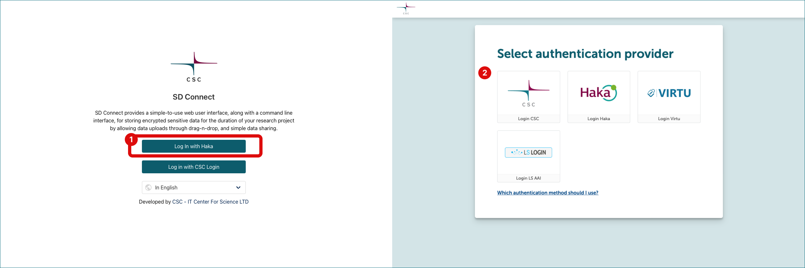

# Login to SD Connect

## Prerequisites
* [Access SD Connect and SD Desktop for the first time](sd-access.md#access-sd-connect-and-sd-desktop-for-the-first-time)

## Step by step

1. Login page: **[https://sd-connect.csc.fi](https://sd-connect.csc.fi){ target="_blank" }**.
2. **Authentication:** Login to SD Desktop is possible with identity federation systems (Haka, Virtu, CSCLogin or LSLogin).

!!! Note
    The interface is compatible with all modern web browsers but does not support Firefox private browsing (incognito mode).

