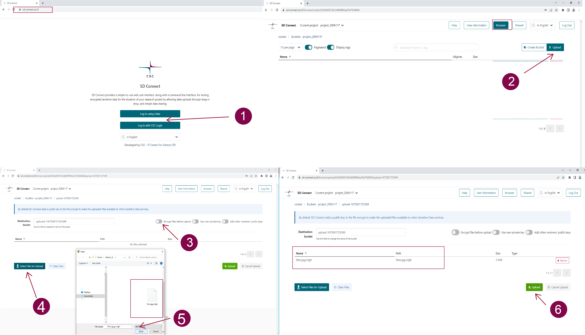

# Uploading and encrypting data

Your data is always automatically encrypted when you upload data to SD Connect. 

To upload and encrypt files with SD Connect to a new folder, follow these steps:

1) Log in and select the correct CSC project in the top left corner.

2) Click Upload button in the top right corner.

3) In the new window, name the destination folder for your files. 

   !!! info "Folder names"
       
         - Folder names must be unique across all existing folders in all projects in SD Connect and Allas (the cloud storage solution based on which SD Connect is developed). If you can't create a new folder, another project may already use the name you have chosen. To avoid this situation, it is good practice to include project-specific identifiers (e.g., project ID number or acronym) in the folder name.
         - Avoid spaces and special characters; use Latin alphabets (a-z), numbers (0-9), dash (-), underscore (_), and dot (.). Remember, all folder names are public; please do not include any confidential information.
         - Folder names can't be modified afterwards.

5) Click Select Files button to open a browser window and choose files for upload. If you want to upload folders, drag and drop them into the window. Click Upload button to start automatic encryption. Notification about status of upload will appear and be visible until the upload is completed. Notification also includes a link to the destination folder.

3) Once the upload is finished, the encrypted files are accessible for download via SD Connect or for analysis, editing, or annotation via SD Desktop.

To upload files to an existing folder, simply access the correct folder (by double-click) and then click Upload button. In the new window proceed to select files for upload.

Note

All members within the same CSC project can download and decrypt data stored in SD Connect. However, this capability can be limited by sharing files in read-only mode. Please check the following paragraph for more details.

Additional considerations:

SD Connect offers automated encryption/description and key management for all file types and formats (> 100GB). Uploading large or numerous files may take several hours, depending on the internet speed. Note that ongoing uploads will be automatically stopped after 8 hours.

SD Connect user interface visualises the destination folders where your encrypted data is stored. Think of the destination folder like a virtual box on the internet where you keep your digital files—like photos or documents. You cannot change the destination folder name and you can't edit files directly through the user interface, but editing is only possible after downloading on your laptop or by accessing the files and making a copy via SD Desktop.

Planning how to organise your files in SD Connect destination folders is a crucial step for efficient data management. Carefully consider storing the files based on projects, themes, or logical structures to enhance accessibility and streamline workflow. A well-thought-out folder structure also facilitates collaboration when sharing access with others. If you have questions or need assistance, don't hesitate to contact our service desk (servicedesk@csc.fi, subject: sensitive data).
## Sensitive data encryption and upload for analysis (up to 100 GB) 

As the workflow described above is still being developed, files up to 100 GB can be encrypted with an additional step with an application called Crypt4GH. Encrypted files can then be uploaded to CSC using SD Connect (via a web browser) and directly analysed using SD Desktop. This method is suitable for any file type and format. 

!!! Note
    With this workflow, it is possible to encrypt only single files. If you have any questions or the instructions below need clarification (e.g. encryption of multiple files), don't hesitate to contact us at servicedesk@csc.fi (subject: Sensitive Data). We also provide step-by-step guidance online (e.g. via Zoom). 

The necessary steps for encryption with Cryp4GH application and upload with SD Connect are the following: 

1. First, download the encryption application specific to your operating system from the [GitHub repository](https://github.com/CSCfi/crypt4gh-gui):

      * [Mac](https://github.com/CSCfi/crypt4gh-gui/releases/download/v1.3.0/crypt4gh-gui-python3.10-macos-amd64.zip)

      * [Windows](https://github.com/CSCfi/crypt4gh-gui/releases/download/v1.3.0/crypt4gh-gui-python3.10-windows-amd64.zip)

      * [Linux](https://github.com/CSCfi/crypt4gh-gui/releases/download/v1.3.0/crypt4gh-gui-python3.10-linux-amd64.zip)

2. After downloading and unzipping the Crypt4GH application, you can find it in your download folder. When you open it, you might encounter an error message. In this case, click on _More info_ and verify that the publisher is CSC-IT Center for Science (or in Finnish CSC-Tieteen tietotekniikan keskus Oy) and click on _Run anyway_.

3. Open the Crypt4GH application and press _Select File_. This will allow you to access a small browser that you can use to select the File that needs to be encrypted.  

4. Click on _Open_. The file name will be displayed under _File to encrypt_. Next, press on _Encrypt_.

5. The Cryot4GH application will create an encrypted file in the same folder as the original file, with the extension being `.c4gh`. For example, encrypting the file `my_data1.csv` will produce a new, encrypted file named `my_data.csv.c4gh`. Unfortunately, the Cryp4GH application does not provide a progress bar, and the encryption process can last up to several minutes.

6. Now, you can upload the encrypted file (or a folder containing encrypted data) to SD Connect using the drag-and-drop function.

7. Next, you will be redirected to a new page. Here deselect the option: _Encrypt file before Upload._

8. Next, you can specify the bucket name to which the data should be uploaded. If you don't fill in a specific name, the user interface will automatically create a bucket named: `upload-nnn` (where `nnn` is replaced with a 13-digit number based on creation time). Note that it is not possible to rename buckets.
If you create a new bucket, use the following suggestions to name it. Bucket names must be unique across all existing buckets in all projects in SD-Connect and Allas. If you can't create a new bucket, some other projects may already use the name you want to use. To avoid this situation, it is good practice to include project-specific identifiers (e.g. project ID number or acronym) in the bucket names. Avoid using spaces and special characters in bucket names. Preferred characters are Latin alphabets (`a-z`), numbers (`0-9`), dash (`-`), underscore (`_`), and dot (`.`). SD Connect can also support other characters, but they may cause problems in other interfaces. All bucket names are public, so please do not include any confidential information in the bucket names.

9. Next, click on _Upload_. A progress bar will visualize the upload's status. Once the process is completed, you can return to the SD Connect browser window, open the bucket and visualize the encrypted file, here named `.c4hg`.

