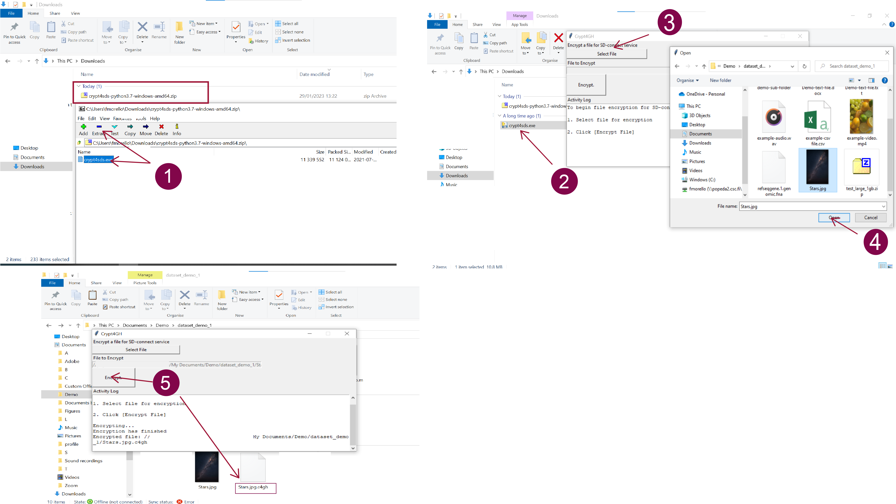

# Sensitive data encryption and upload for analysis (less than 1 GB) 

<iframe width="280" height="155" srcdoc="https://www.youtube.com/embed/yAKtGs6FkMc" title="YouTube video player" frameborder="0" allow="accelerometer; autoplay; clipboard-write; encrypted-media; gyroscope; picture-in-picture" allowfullscreen></iframe>

With SD Connect, you can encrypt and upload files or folders from your web browser (<1GB). Each file will be encrypted with the default automated option, uploaded, and safely stored in SD Connect and can be directly analyzed using SD Desktop. Please view the following paragraph for guidance on encrypting and uploading larger files. 

Automated encryption via SD Connect is suitable for any file type and format. However, uploading large files might take several hours, depending on the internet connection. Data upload will be interrupted after 8 hours. 

The necessary steps to automatically upload and encrypt small files are the following: 

1. From the SD Connect browser page, select the correct CSC project.
 
2. To upload folders, drag and drop them to the browser or click the _upload_ icon.

3. You will be redirected to a new page displaying the default encryption options. 

4. You can specify the bucket's name to which the data should be uploaded. If you don't fill in a specific term, the user interface will automatically create a bucket named: `upload-nnn` (where `nnn` is replaced with a 13-digit number based on creation time). Note that it is not possible to rename buckets.

5. If you create a new bucket, use the following suggestions to name it:

      * Bucket names must be unique across all existing buckets in all projects in SD-Connect and Allas. If you can't create a new bucket, some other project may already use the name you would like to use. To avoid this situation, it is good practice to include project-specific identifiers (e.g., project ID number or acronym) in the bucket names.  
    
     * Avoid using spaces and special characters in bucket names. Preferred characters are Latin alphabets (`a-z`), numbers (`0-9`), dash (`-`), underscore (`_`), and dot (`.`). SD Connect can also support other characters, but they may cause problems in other interfaces.

     * All bucket names are public, so please do not include any confidential information in the bucket names

6. Clicking on the icon _Select files for Upload_, you will open a browser window in which you can select and add more files. 

7.  Next, click on _Encrypt and Upload_: each file will be automatically encrypted and uploaded to the bucket in SD Connect. The upload bar will display the state of data encryption and upload. 

8. Once the process is completed, you can return to the SD Connect browser page by clicking on _Browser_. The encrypted files will be displayed in the correct bucket, in a default folder called DATA, and each encrypted file will have the extension `.c4gh`. 

9. Encrypted files are now available for data analysis, editing or annotation via the SD Desktop service. 

!!! Note
    Due to a technical issue, buckets containing encrypted files might look empty (white) after data upload. This problem can be solved by clearing the browser cookies. 

## Sensitive data encryption and upload for analysis (up to 100 GB) 

As the workflow described above is still being developed, files up to 100 GB can be encrypted with an additional step with an application called Crypt4GH. Encrypted files can then be uploaded to CSC using SD Connect (via a web browser) and directly analysed using SD Desktop. This method is suitable for any file type and format. 

!!! Note
    With this workflow, it is possible to encrypt only single files. If you have any questions or the instructions below need clarification (e.g. encryption of multiple files), don't hesitate to contact us at servicedesk@csc.fi (subject: Sensitive Data). We also provide step-by-step guidance online (e.g. via Zoom). 

The necessary steps for encryption with Cryp4GH application and upload with SD Connect are the following: 

1. First, download the encryption application specific to your operating system from the [GitHub repository](https://github.com/CSCfi/crypt4gh-gui):

      * [Mac](https://github.com/CSCfi/crypt4gh-gui/releases/download/v1.3.0/crypt4gh-gui-python3.10-macos-amd64.zip)

      * [Windows](https://github.com/CSCfi/crypt4gh-gui/releases/download/v1.3.0/crypt4gh-gui-python3.10-windows-amd64.zip)

      * [Linux](https://github.com/CSCfi/crypt4gh-gui/releases/download/v1.3.0/crypt4gh-gui-python3.10-linux-amd64.zip)

2. After downloading and unzipping the Crypt4GH application, you can find it in your download folder. When you open it, you might encounter an error message. In this case, click on _More info_ and verify that the publisher is CSC-IT Center for Science (or in Finnish CSC-Tieteen tietotekniikan keskus Oy) and click on _Run anyway_.

3. Open the Crypt4GH application and press _Select File_. This will allow you to access a small browser that you can use to select the File that needs to be encrypted.  

4. Click on _Open_. The file name will be displayed under _File to encrypt_. Next, press on _Encrypt_.

5. The Cryot4GH application will create an encrypted file in the same folder as the original file, with the extension being `.c4gh`. For example, encrypting the file `my_data1.csv` will produce a new, encrypted file named `my_data.csv.c4gh`. Unfortunately, the Cryp4GH application does not provide a progress bar, and the encryption process can last up to several minutes.

6. Now, you can upload the encrypted file (or a folder containing encrypted data) to SD Connect using the drag-and-drop function.

7. Next, you will be redirected to a new page. Here deselect the option: _Encrypt file before Upload._

8. Next, you can specify the bucket name to which the data should be uploaded. If you don't fill in a specific name, the user interface will automatically create a bucket named: `upload-nnn` (where `nnn` is replaced with a 13-digit number based on creation time). Note that it is not possible to rename buckets.
If you create a new bucket, use the following suggestions to name it. Bucket names must be unique across all existing buckets in all projects in SD-Connect and Allas. If you can't create a new bucket, some other projects may already use the name you want to use. To avoid this situation, it is good practice to include project-specific identifiers (e.g. project ID number or acronym) in the bucket names. Avoid using spaces and special characters in bucket names. Preferred characters are Latin alphabets (`a-z`), numbers (`0-9`), dash (`-`), underscore (`_`), and dot (`.`). SD Connect can also support other characters, but they may cause problems in other interfaces. All bucket names are public, so please do not include any confidential information in the bucket names.

9. Next, click on _Upload_. A progress bar will visualize the upload's status. Once the process is completed, you can return to the SD Connect browser window, open the bucket and visualize the encrypted file, here named `.c4hg`.

