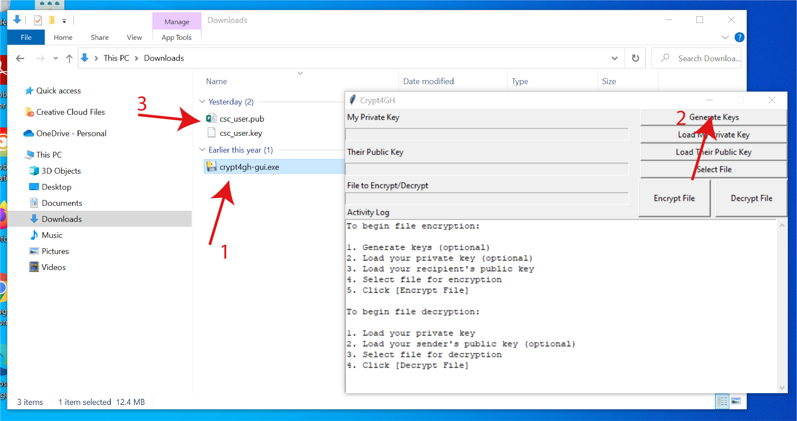
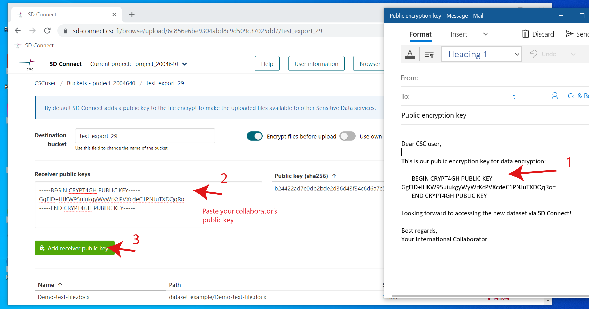

# Sensitive data encryption and upload for storage and sharing (less than 1 GB) 


<iframe width="280" height="155" srcdoc="https://www.youtube.com/embed/xpUF0ig-4MI" title="YouTube video player" frameborder="0" allow="accelerometer; autoplay; clipboard-write; encrypted-media; gyroscope; picture-in-picture" allowfullscreen></iframe>

<iframe width="280" height="155" srcdoc="https://www.youtube.com/embed/oQxz_0Mz5pU" frameborder="0" allow="accelerometer; autoplay; clipboard-write; encrypted-media; gyroscope; picture-in-picture" allowfullscreen></iframe>


Using the SD Connect, you can simultaneously encrypt your files with multiple encryption keys. In this manner, the files can be used for several purposes: data analysis with SD Desktop, data storage or data sharing with SD Connect.

 Below, we will illustrate how to generate your encryption key pair using an application called Crypt4GH and how your public encryption key (or your collaborator's public key) can then be used to encrypt files via a web browser using SD Connect. 

1. Install the Crypt4GH application. CSC has developed a simple application that will allow you to generate your encryption keys and decrypt files when necessary. 
Download the version specific to your operating system from the [GitHub repository](https://github.com/CSCfi/crypt4gh-gui/releases/tag/2024.06.0):

      * [Mac](https://github.com/CSCfi/crypt4gh-gui/releases/download/2024.06.0/crypt4gh-gui-python3.11-macos-amd64.zip)
      * [Windows](https://github.com/CSCfi/crypt4gh-gui/releases/download/2024.06.0/crypt4gh-gui-python3.11-windows-amd64.zip)
      * [Linux](https://github.com/CSCfi/crypt4gh-gui/releases/download/2024.06.0/crypt4gh-gui-python3.11-linux-amd64.zip)

    You might encounter an error message when you open the application for the first time. In this case, click on _More info_ and verify that the publisher is CSC-IT Center for Science (or Finnish CSC-Tieteen tietotekniikan keskus Oy) and then click on _Run anyway_.

2. Generate your encryption keys:

      * Open the Crypt4GH application and click on _Generate Keys_ (in the top right corner).
      * The tool will open a new window and ask you to insert a password (_Private Key Passphrase_). This password will be associated with your secret key. Please, use a strong password.
      * When you click on _OK_, the tool will generate a key pair consisting of a secret key (`username_crypt4gh.key`) and a public key (`username_crypt4gh.pub`).
      * The keys/file names will be displayed in the Activity Log with the following message:

    ```text
    Key pair has been generated, your private key will be auto-loaded the next time you launch this tool:
    Private key: username_crypt4gh.key
    Public key: username_crypt4gh.pub
    All the fields must be filled before file encryption will be started
    ```

    The keys will be generated and saved to the same folder in which the application resides.

    !!! Note
        * If you lose or forget your secret key or password, you will be unable to decrypt the files.
        * Do not share your secret key or your password.
        * You need to create your keys only once and use them for all your encryption needs, but you can choose to generate separate keys for encryption as you wish.

    

3. Upload folders and files to SD Connect using the drag and drop function. You can also use the upload icon in the SD Connect browser window to select and upload files.

4. Next, you will be redirected to a new window displaying the default encryption options.

5. Select the button: _Add other's receivers' public key_. A new window called _Receiver public keys_ will then appear on the left side. Here you can add multiple public encryption keys:

      * Open your public key using Notepad or another text file reader. Copy the public key, paste it into the appropriate window, and click on _Add receiver public key_.

      

      * Now, you will see the public key listed on the right side of the page.

      

      * If, for example, you plan to share your data with a collaborator, you can add a second public key. Let's assume that your collaborator shared their public key with you via email. First, copy and paste the public key into the _Receiver public keys_ window. Next, we click on _Add receiver key_. Now you can see two keys listed in the right window.

      

6. You can specify the bucket's name in which the data should be uploaded. If you don't fill in a specific term, the user interface will automatically create a bucket named with a 13-digit number based on creation time. Note that it is not possible to rename buckets.

7.  Next, click on _Encrypt and upload_: each file will be automatically encrypted and uploaded to the specified bucket in SD Connect. 

    

8. Once the process is completed, you can return to the SD Connect browser window. The encrypted files will be displayed in the correct bucket, in a default folder called _DATA_, and each encrypted file will have the extension `.c4gh`. 

The files are now encrypted with three encryption keys:

- With the default Sensitive Data services encryption key. Thus, you can access and analyze the data stored in SD Connect with the SD Desktop service (for further information, see SD Desktop user guide).

- With your public key. This allows you to download the data stored from SD Connect to, for example, different services and decrypt them using the correspondent secrete key. 

 - With your collaborator's public key. This allows sharing (or transferring) the data with your collaborator using SD Connect. Next, they will be able to download and decrypt the files in their secure computing environment using the correspondent secret key. 

This workflow allows managing only one copy of the data for different purposes.

!!! Note
    With this workflow is possible to encrypt only small files (up to 1GB). If you have any questions or the instructions above need clarification (e.g. encryption of larger files), don't hesitate to [contact us](../../support/contact.md) (subject: Sensitive Data). We also provide step-by-step support online (e.g. via Zoom).


## Data sharing 

SD Connect user interface provides a simple way of sharing buckets between different projects.

To share a bucket with another CSC project (and thus one of your colleagues or collaborators), you need to:

* know in advance the project identifier you want to share a bucket with (see above the _User Interface_ paragraph);

* in the browser page, click on the _share_ button next to the bucket's name;

Next:

1. In the _Browser_ page, next to the bucket name, click the _share_ icon

2. You will be redirected to the _Share the bucket_ page. Here you can select:

      * only _Grant read permission_ if you want your colleagues to be able to access the files and folder stored in the bucket, download them or access them via the SD Desktop service;

      * or _Grant write permissions_ if you want your colleague to be able to add files and folders to the shared bucket. If you select only this option, your colleague will be only able to add files to the bucket but not be able to see its content.

3. Under _Project Identifiers to share with_, you can add the identifiers corresponding to your collaborator's CSC project. It is possible to add multiple identifiers. 

4. Next, click on _Share_. If the operation is successful, you will be redirected to the _Share from the project_ view, where are listed all the buckets shared with other CSC projects. From the same page, it is possible to interrupt the sharing by clicking on _Revoke bucket access_.


## Data download and decryption

<iframe width="280" height="155" srcdoc="https://www.youtube.com/embed/SQJ8QEKV7BE" title="YouTube video player" frameborder="0" allow="accelerometer; autoplay; clipboard-write; encrypted-media; gyroscope; picture-in-picture" allowfullscreen></iframe>

You can easily download entire buckets or single encrypted files from the SD Connect _Browser page_ by clicking on _download_. 

Next, you can decrypt the data using the Crypt4GH application and your secret encryption key. Unfortunately, it is currently only possible to single files. However, we are working on adding this option and integrating it with the SD Connect user interface.

1. Open the Crypt4GH application and click on _load Your Private Key_.

2. Click on _Select File_ and upload the file you want to decrypt.

3. Click on _Open_.

4. Next, click on _Decrypt File_.

5. The tool will ask you to write the secret key's password. Press _ok_. 

The secret key must match the public key used to encrypt the data.
In the case of decryption, adding the public key is not mandatory, but if you have the public key of the person who has encrypted the file, you can use it to verify the encryption signature. If you don't select a public key, the activity log will display the following (the decryption will be executed anyway):

```
Sender public key has not been set, authenticity will not be verified.
```

If your decryption runs successfully, the activity log will display the following:

```
Decrypting.....

Decryption has finished

Decrypted file: C:/users/username/exampledirectory/examplefile
```


The decrypted file will no longer display the `.c4gh` extension and will be saved in the same folder from which the original file was uploaded.  
