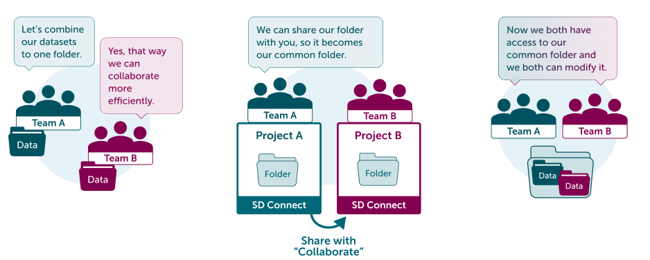

# How to use folder as your shared workspace with SD Connect

## Use case

You (Team A) and other team (Team B) are actively collaborating. You both want to upload data to the same folder and be able to modify folder content.

## Solution

In this case you can share your data folder to Team B with **Collaborate** -permission. That way both teams have equal rights to modify files inside the shared folder.

## Step by step tutorial

1. Ask from Team B for their Share ID [(Screenshot)](./images/connect/UseCase_ShareID.png){ target="_blank" }.
2. Log in to [SD Connect](./sd-connect-login.md).
3. Upload your data folder to SD Connect: [See upload instructions](./sd-connect-upload.md). Or create an empty folder by clicking "**Create folder**" ([screenshot](./images/connect/UseCase_CreateFolder.png){ target="_blank" }).
4. Click “**Share**” next to the folder you wish to share ([screenshot](./images/connect/UseCase_ShareButton.png){ target="_blank" }).
5. Add the project B’s **Share ID** to the field ([screenshot](./images/connect/UseCase_AddShareID.png){ target="_blank" }).
6. Select sharing permission: “**Collaborate**”. Click “**Share**” ([screenshot](./images/connect/UseCase_SelectPermission.png){ target="_blank" }).

Now all the content of the folder is accessible for both projects (project A and project B). All members in both projects can modify the content of the folder via SD Connect; Everyone can upload, download, copy and delete the content as they wish. They can also access it via SD Desktop for analysis.