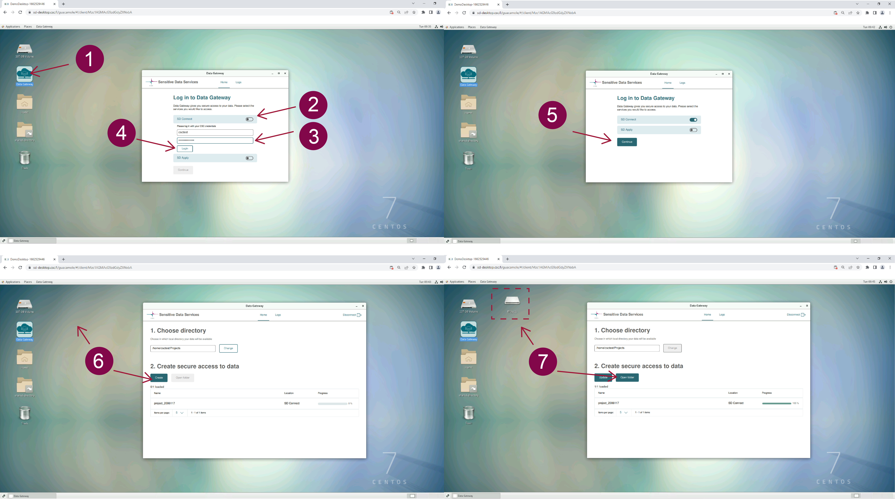
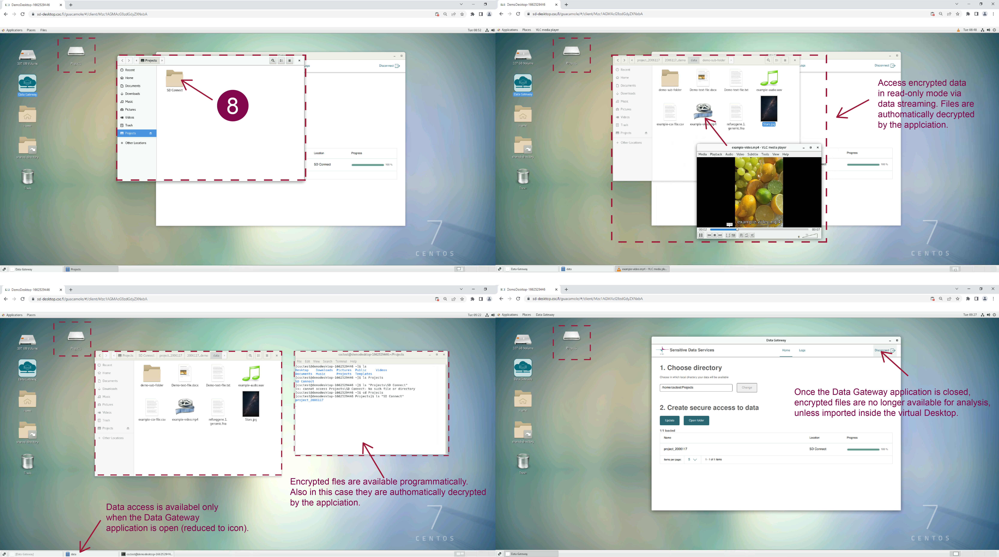

### Working with your virtual desktop

<iframe width="280" height="155" srcdoc="https://www.youtube.com/embed/EhuAYNLS90g" title="YouTube video player" frameborder="0" allow="accelerometer; autoplay; clipboard-write; encrypted-media; gyroscope; picture-in-picture" allowfullscreen></iframe>

Once a virtual desktop has been created, each CSC project member can securely access it from their browser.

When you log in to SD Desktop **Homepage**,  you will be able to access your virtual computing environment from:

* **Recent connections**. Click on your desktop's image (visible only if recently accessed).

* **All connections**. Click on + next to the CSC  project ID (e.g. project_NNNNN): this allows you to visualize and access all the desktops associated with the project (desktopname-NNNNNNNNNN) via a secure connection. 

When you open the connection, a virtual computing environment (Linux operating system) will open in your browser. If you are accessing the virtual desktop for the first time, you will see the panel getting started, from which you can, for example, adjust the screen resolution.

You can work with the desktop like in a standard computing environment, accessing several pre-installed programs from the applications menu bar (top left corner). Examples include Open Office, image viewing applications, video and audio players, Jupiter Notebook etc. You can also open a terminal and use Linux from the command line. For more information on accessing R-Studio, please check the paragraph below.

Security-related features of SD Desktop include:

1. The computing environment (visible from your browser) is isolated from the internet. So you can, for example, open a Firefox web browser but not access any site online. At this moment, you will also not be able to access any repositories directly.

2. You can access or import files into the computing environment only using the Data Gateway application (see below for more information);

3. Unencrypted files are not visible via the SD Desktop service. You can access and visualize only encrypted files (uploaded to CSC using SD Connect or encrypted programmatically with the service's public encryption key). 

4. The copy-paste function from your computer/laptop to the browser visualizing your secure desktop is entirely disabled for security reasons. However, you can use this function inside the virtual desktop.

5. Only files saved in the shared-directory or the external volume are accessible to all project members via the virtual desktop. 

You can close the connection to your virtual desktop in two ways:

1. _Log out_ from the desktop (in the workspace view, top right corner of the browser, select your _username_ and _log out_). This will close all applications and disconnect the work session. You can access the same desktop anytime after logging in to the services.

2. If you initiated an analysis programmatically (running a script), you can close the browser window. This doesn't interfere with the processes running. Thus, when you reconnect to your desktop, all your tools and interfaces are still open and you can continue working. However, log out from the desktop once the analysis is finished. If you leave more than ten connections open, you will be unable to re-access the services. 

!!! Note
    Each virtual desktop only supports ten simultaneous connections, for a total of 30 connections for each CSC project. You will be automatically logged out from the virtual desktop if a connection has been left accidentally active for two days.
 
 
 

## Accessing encrypted sensitive data within SD Desktop

As the virtual desktop is isolated from the internet, the only way to access data for analysis is by utilizing a specific application called _Data Gateway_.

This application will allow you to:
* Establish a secure connection with two other Sensitive Data Service components,
* Access and analyse encrypted files directly uploaded via SD Connect by any of the project members, and
* Reuse published data under controlled access via the Sensitive Data  (SD) Apply service.

Encrypted files are visible in *read-only mode* (similar to opening a pdf file or streaming a YouTube video). This solution allows you to process large amounts of data without storing additional copies on your virtual desktop. 

!!! Note
    In SD Desktop, you can access only encrypted files. Accessing unencrypted data or files encrypted only with your public encryption key will result in an error. 
   
### Accessing encrypted data stored in SD Connect using Data Gateway

<iframe width="280" height="155" srcdoc="https://www.youtube.com/embed/7iGQ7gWb-Pk" title="YouTube video player" frameborder="0" allow="accelerometer; autoplay; clipboard-write; encrypted-media; gyroscope; picture-in-picture" allowfullscreen></iframe>

You can access encrypted data stored in SD Connect by following these steps:

1. Open _Data Gateway_ (you can find the application on your desktop);

2. Select _SD Connect_;

3. Log in with your CSC credentials (Note: the copy/paste options are disabled for security reasons; thus, you need to type in your password);

4. Click on _Login_ and next click on _Continue_;

5. In the new window, under _Create secure access_ click on  _Create_. The application will create a secure connection with SD Connect, and a new folder called _Projects_  will be accessible from your desktop or programmatically from the terminal. Next, click on _Open folder_.

 
 

You can directly access all the files stored in SD Connect in read-only mode from the project folder. The application will automatically decrypt them. The current streaming speed is up to 50 MB/s. 

!!! Note 
    The _Projects_ folder is available only when the Data Gateway application is open. Thus, Data Gateway needs to be open during data processing in streaming mode.
    

 

### Importing data inside the desktop

If during the analysis phase you need to edit or annotate a file, you have to make a copy of it on your virtual desktop following these steps: 

 1. Access the files of interest in the _Project folder_ using _Data Gateway_;
 
 2. Select the files from the Project folder, make a copy and paste it in the virtual desktop _home directory_ (the files will be visible only from your browser) or in the _shared folder_ (in this case, the files will be accessible also by the other project members). 

The files are automatically decrypted by the Data Gateway application during the copy/paste process and are directly available for analysis or editing. 

 
!!! Note
    Your private workspace in SD Desktop is completely isolated from the internet for security reasons. However, you can use the procedure described above if you need to import specific scripts into your desktop (for example, from GitHub or other trusted repositories).
    
     
 

### Accessing published data for reuse via SD Apply

<iframe width="280" height="155" srcdoc="https://www.youtube.com/embed/1cF_NQV6vyk" title="YouTube video player" frameborder="0" allow="accelerometer; autoplay; clipboard-write; encrypted-media; gyroscope; picture-in-picture" allowfullscreen></iframe>

Data Gateway can also be used to access data published under controlled access via other Sensitive Data Service components. To access a specific dataset for reuse on your virtual desktop, you must first apply for it using _SD Apply_ service. When the data owner (or Data Access Committee) has granted you access, you can access the dataset in SD Desktop for a limited time.

You will encounter an error message if you still need to apply for access or if the access period has ended. 

 

!!! Note
    SD Apply is currently in the pilot phase. Don't hesitate to contact us at servidesk@csc.fi (subject: sensitive data) for more information.

