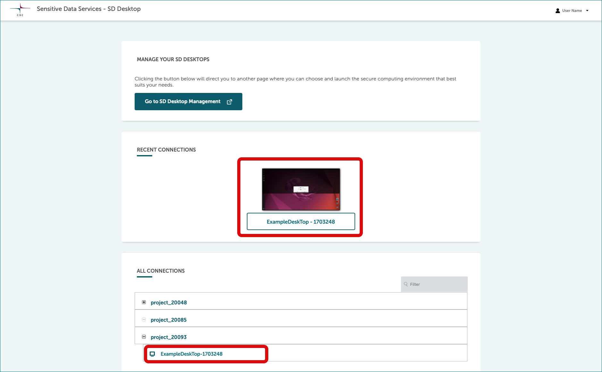
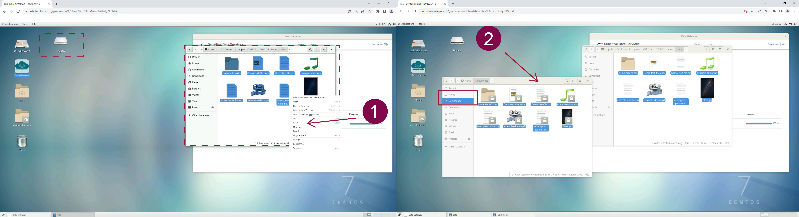

# Working with your virtual desktop

<iframe width="280" height="155" srcdoc="https://www.youtube.com/embed/EhuAYNLS90g" title="YouTube video player" frameborder="0" allow="accelerometer; autoplay; clipboard-write; encrypted-media; gyroscope; picture-in-picture" allowfullscreen></iframe>

Once a virtual desktop has been created, each CSC project member can access it via their browser and import files stored in SD Connect or SD Apply in teh secure enviroment. 

## Access virtual desktop

After [log in](./sd-desktop-login.md), you will see all your virtual desktops listed at the front page, under *All connections*. 

* **All connections**. Select project (e.g. `project_NNNNN`) and click the plus-sign. There you can see all desktops that belongs to this project (`desktopname-NNNNNNNNNN`). Access virtual desktop by clicking the name.
* **Recent connections**. Your recently used virtual desktops appear also here.

When you open the connection, a virtual computing environment will open in your browser. If you are accessing the virtual desktop for the first time, you will see the panel getting started, from which you can, for example, adjust the screen resolution.

## Accessing encrypted sensitive data within SD Desktop

As the virtual desktop is isolated from the internet, the only way to access data for analysis is by utilizing a specific application called _Data Gateway_.

This application will allow you to establish a secure connection with two other Sensitive Data Service components and:

* Access and analyze encrypted files directly uploaded via SD Connect by any of the project members
* Reuse published data under controlled access via the Sensitive Data (SD) Apply service.

Encrypted files are visible in read-only mode (similar to opening a PDF file or streaming a YouTube video). This solution allows you to process large amounts of data without storing additional copies on your virtual desktop. 

!!! Note
    In SD Desktop, **you can access only encrypted files.** Accessing unencrypted data or files encrypted only with your public encryption key will result in an error. 
   
### Accessing encrypted data stored in SD Connect using Data Gateway

<iframe width="280" height="155" srcdoc="https://www.youtube.com/embed/7iGQ7gWb-Pk" title="YouTube video player" frameborder="0" allow="accelerometer; autoplay; clipboard-write; encrypted-media; gyroscope; picture-in-picture" allowfullscreen></iframe>

You can access encrypted data stored in SD Connect by following these steps:

1. Open _Data Gateway_ (you can find the application on your desktop)

2. Select _SD Connect_

3. Add your CSC credentials (username and password). Note: we disabled the copy/paste options for security reasons; thus, you need to type in your password

4. Click on _Login_ and next click on _Continue_

5. In the new window, under _Create secure access_ click on _Create_. The application will create a secure connection with SD Connect, and a new folder called _Projects_ will be accessible from your desktop or programmatically from the terminal. Next, click on _Open folder_.

 
 

You can directly access all the files stored in SD Connect in read-only mode from the project folder. The application will automatically decrypt them. The current streaming speed can be up to 50 MB/s. 

!!! Note 
    The _Projects_ folder is available only when the Data Gateway application is open. Thus, Data Gateway needs to be open during data processing in streaming mode.
    

 

### Importing data inside the desktop

If during the analysis phase you need to edit or annotate files, you make a full copy of it on your virtual desktop following these steps: 

 1. Access the files of interest in the _Project folder_ using _Data Gateway_
 
 2. Select the files from the Project folder, make a copy and paste it in the virtual desktop home directory (the files will be visible only from your browser) or in the shared folder (in this case, the files will be accessible also by all the CSC project members). 

The files are automatically decrypted by the Data Gateway application during the copy/paste process and are directly available for analysis or editing. 

 
!!! Note
    Your private workspace in SD Desktop is completely isolated from the internet for security reasons. However, you can use the procedure described above if you need to import specific scripts into your desktop (for example, from GitHub or other trusted repositories).
    
     
 

### Accessing published data for reuse via SD Apply

<iframe width="280" height="155" srcdoc="https://www.youtube.com/embed/1cF_NQV6vyk" title="YouTube video player" frameborder="0" allow="accelerometer; autoplay; clipboard-write; encrypted-media; gyroscope; picture-in-picture" allowfullscreen></iframe>

Data Gateway can also be used to access data published under controlled access via other Sensitive Data Service components. To access a specific dataset for reuse on your virtual desktop, you must first apply for it using SD Apply service. When the data owner (or Data Access Committee) has granted you access, you can access the dataset in SD Desktop for a limited time.

You will encounter an error message if you still need to apply for access or if the access period has ended. 

 

SD Apply is currently in the pilot phase. Don't hesitate to [contact CSC Service Desk](../../support/contact.md) (subject: sensitive data) for more information.
