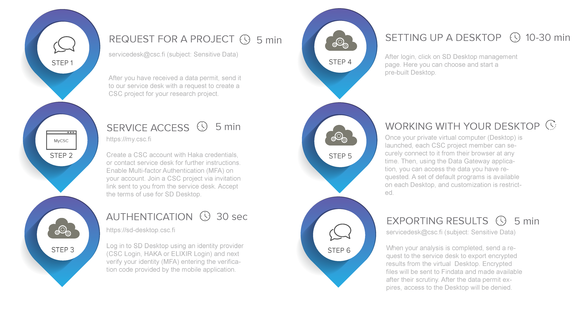

# Sensitive Data Desktop for secondary use of health and social data 

Sensitive Data (SD) Desktop is a registered environment for secondary use of health and social data (register data). Access to the service requires a permit from data controller which can be Findata or single register. SD Desktop is a web-user interface that allows you to manage (start, use, delete) a virtual computer (here called desktop, technically defined as a virtual machine) from your web browser. With the virtual desktop, you can access the authorised datasets. No previous knowledge of cloud computing or programming expertise is required to use the service.

Contents:

 * [Key features](./sd-desktop-audited.md#key-features)

 * [Limitations](./sd-desktop-audited.md#limitations)

 * [Before you start](./sd-desktop-audited.md#before-you-start) 
  
 * [Overview](./sd-desktop-audited.md#overview) 

    
## Key features

* Audited against Findata regulation.

* Accessible from any operating system (Mac, Linux or Windows) via web-browser (e.g., Google Chrome, Firefox) from the public internet (without the need of installing a client or using a VPN).

* Only the members of the same CSC project can access the same virtual Desktop.

* After login to SD Desktop, the user can start a pre-built computing environment (Linux OS), on-demand; available options offer the capability of doing simple statistical analysis to machine learning.

* To comply with the regulation, virtual Desktops for secondary use are completely isolated from the internet and other services: you can only access the data you have requested from the data controller;

* SD Desktop can be used to work with any type of data: text files, images, audio files, video, and genetic data. However, the virtual desktop includes [a limited set of pre-installed software](../../data/sensitive-data/sd-desktop-secondary-access.md#pre-installed-software) (open source). Only the permit authority can approve the use of additional software/files/scripts and import them into your virtual Desktop.

## Limitations

To comply with the regulation, SD Desktop for secondary use is **completely isolated from the internet and other services**. You can, for example, open a Firefox web browser, but you are not able to access any site on the internet.

**The import of data and software is restricted in SD Desktop**. You cannot import any data or software yourself for security reasons. If you are working with a dataset for which you have received a permit from the data controller, the only way to access the data for analysis is by utilizing a specific application called **Data Gateway**. 

**Data export from SD Desktop is also restricted**. Only *non-sensitive* results can be exported from the workspace, and those can only be exported by the CSC project manager. Instructions for exporting your results are provided in the next paragraph.

Encrypted files will be **visible in read-only mode**. This solution allows you to process large amounts of data without storing any copy on your virtual Desktop. However, this means that the files cannot be edited in SD Desktop.

Lastly, we are not yet providing a virtual Desktop with Windows operating system, or with GPUs. However, we are working on it, and you can find more information on the future developments of the services on our webpage.

## Before you start

* You need to have a data permit issued by Findata or single register before starting the service access process at CSC.

* All the members belonging to a specific CSC project can access the same computing virtual Desktop. Currently, it is possible to launch 3 virtual Desktops (or computing environment) for each CSC project. Each CSC project has its private Desktop, and each Desktop is isolated from other CSC projects or CSC accounts.

* Audited SD Desktop has few important limitations: the CSC project will be managed by the service desk and the data transfer will be restricted (including user’s own script and programs).

* After your data permit expires, you will no longer have access to your virtual Desktop. To continue working with the same project, you need to send an amendment application to the data controller. Otherwise, make sure to request to export all your results before the validity period of your data permit ends. The expired project and all the data will be deleted after 90 days according to CSC's data retention policy.

!!! Note
    We recommend you to **[contact CSC Service Desk](../../support/contact.md) well in advance**, even before applying for a data permit, if you need **software that is not available** on the Desktop as a default.

## Overview

