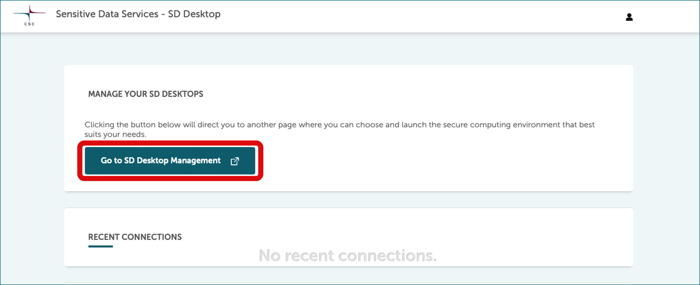
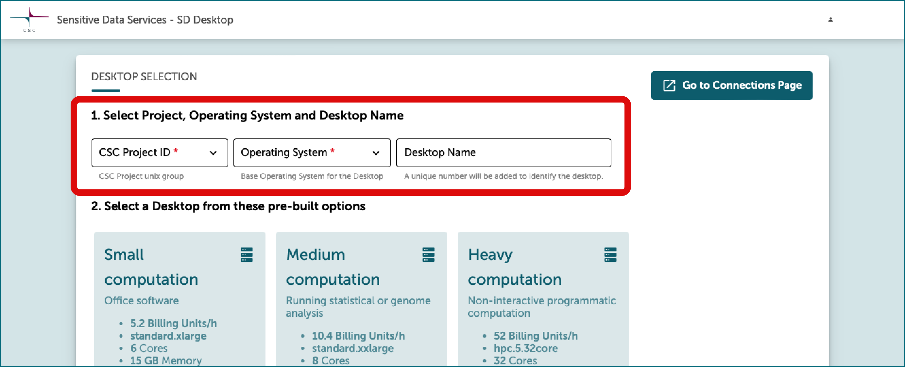
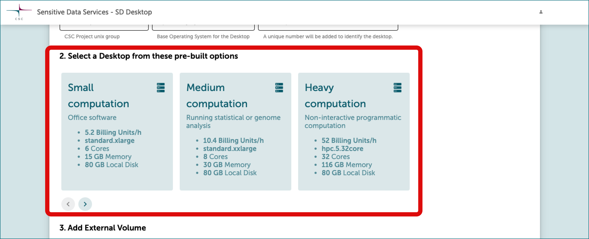
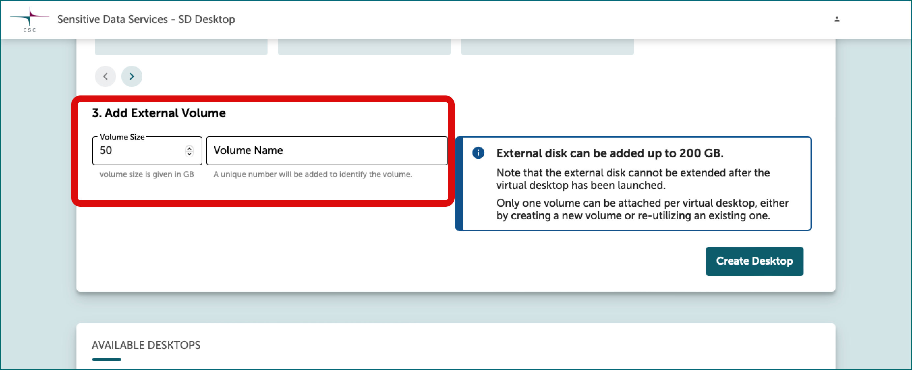
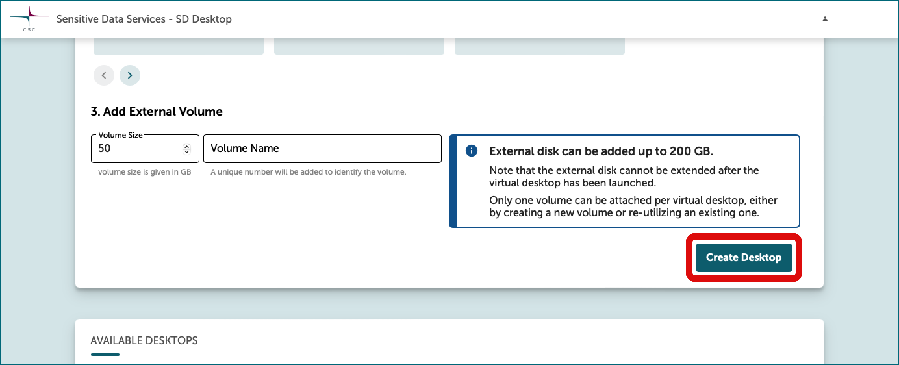

# Create virtual desktops

<iframe width="280" height="155" srcdoc="https://www.youtube.com/embed/t6xXKPTB6H0" title="YouTube video player" frameborder="0" allow="accelerometer; autoplay; clipboard-write; encrypted-media; gyroscope; picture-in-picture" allowfullscreen></iframe>

Creating a virtual desktop is easy and doesn't require technical expertise. 

* first [log in](./sd-desktop-login.md)
* click on *Go to SD Desktop Management* [(See screenshot)](images/desktop/SD-Desktop_GoToManagement.png){ target="_blank" }
* and follow these steps:

## 1. Specify desktop parameters
  
* Select your CSC project and operating system. We recommend to choose **Linux Ubuntu22**, since there will be no updates published for Linux CentOS7 after June 30, 2024 [(See screenshot)](images/desktop/SD-Desktop_SelectProject.png){ target="_blank" }.
  
* Give your desktop a name for easy identification, so that all project members can quickly identify it later on.

## 2. Choose a pre-built desktop options

Choose a pre-built option based on your needs: Small (for basic tasks), Medium (for complex analysis), or Heavy (for intensive tasks) [(See screenshot)](images/desktop/SD-Desktop_PreBuild.png){ target="_blank" }.

|  | Use  | Technical specifications | Correspondent Pouta Flavor | Billing Units consumption |
|-|-|-|-|-| 
|  **Small computation** | Ideal for analyzing sensitive data using office software (for example: similar to simple statistical analysis with Excel, watching videos, listening to audio files, and working on text files). You can compare this desktop to your laptop. | Core 6; Memory 15 GB; Root disk 80 GB; | standard.xlarge | 5.2 billing units/h|
|  **Medium computation**  | Ideal for running complex statistical or genome analysis (for example: using the command line to run specific scripts). You can compare this desktop to a powerful laptop provided by your organization's IT unit. | Core 8; Memory 30 GB; Root disk 80 GB | standard.xxlarge | 10.4 billing units/h |
| **Heavy computation**| Ideal for running non-interactive programmatic analysis (machine learning) that requires heavy computation. Please do not choose this option for simple analysis, as it consumes considerable resources. | Core 32; Memory 116 GB; Root disk 80 GB  | hpc.5.32core | 52 billing units/h |
| **Small GPU computation**| Running GPU-based computation - only available via **request** and only for testing purposes. *Please contact servicedesk@csc.fi, subject: Sensitive data*  | Core 14; Memory 117 GB; Root disk 80 GB; GPU 1  | gpu.1.1gpu | 120 billing units/h |
| **Medium GPU computation**| Running GPU-based computation - only available via **request** and only for testing purposes. *Please contact servicedesk@csc.fi, subject: Sensitive data*  | Core 20; Memory 180 GB; Root disk 80 GB; GPU 1; SSD Ephemeral Disk 1000 GB | gpu.2.1gpu | 200 billing units/h |

!!! note
    The two GPU options are available only for testing purposes. Before proceeding, contact [CSC Service Desk](../../support/contact.md), *(subject: Sensitive Data)* to ensure optimal use, as limited resources require careful planning.

## 3. Add an external volume

* Attach an external volume (virtual external hard drive) to your virtual desktop, extending default storage (80 GB) up to 200 GB. Choose *Volume size* (recommended: 50 GB for small computing, 100 GB for medium, 200 GB for heavy computation) and assign a name in the *Volume name* -field [(See screenshot)](images/desktop/SD-Desktop_Volume.png){ target="_blank" }.

* **It's advisable to save critical analyses or files on the volume, which can also serve as a backup if the virtual desktop becomes unresponsive.** Note that after the virtual desktop is created, disk space/volume extension requires contacting [CSC Service Desk](../../support/contact.md), *(subject: Sensitive Data)*. 

* **You can detach and attach a volume from your virtual desktop** on the SD Desktop Management page. This can be compared to connecting/disconnecting a hard drive to your laptop. This feature is available only on desktops created after February 2023. For additional details, refer to: [Managing volume and desktops](./sd-desktop-manage.md).

## 4. Desktop creation

* Finally, press on _Create desktop_. The operation is entirely automated and can take up to 30 minutes. If you try accessing the virtual desktop during this process, an error message will be displayed asking you to return later.

### Screenshots
=== "Go to SD Desktop Mangement"
    
=== "1. Desktop parameters"
    
=== "2. Pre-build desktop options"
    
=== "3. External volume"
    
=== "4. Create desktop"
    

## Important considerations

* Your virtual desktop is **accessible to all project members upon creation** and **consumes billing units** from your CSC project until [paused](./sd-desktop-manage.md#pausing-or-unpausing-a-virtual-desktop) or [deleted](./sd-desktop-manage.md#deleting-a-desktop). 

* Each CSC project supports up to 3 virtual desktops, with 10 project members allowed to connect simultaneously to each desktop.

* All desktops come with a set of pre-installed open-source software managed by CSC. [List of pre-installed softwares](./sd-desktop-software.md#default-software-selection-in-sd-desktop).

* **Delete or pause unused desktops**: Ensure to [delete](./sd-desktop-manage.md#deleting-a-desktop) or [pause](./sd-desktop-manage.md#pausing-or-unpausing-a-virtual-desktop) your desktop when not in use. Unused desktops trigger email notifications after 14 days of inactivity.

* Additional volume or disk space can only be requested by writing to [CSC Service Desk](../../support/contact.md) (subject: Sensitive data).
  
* **You can detach and attach a volume from your virtual desktop** on the SD Desktop Management page. This can be compared to connecting/disconnecting a hard drive to your laptop. This feature is available only on desktops created after February 2023. For additional details, refer to: [Managing volume and desktops](./sd-desktop-manage.md).

!!! info "Need assistance?"
    If you're uncertain about which desktop to choose or need support for your research, contact [CSC Service Desk](../../support/contact.md) with the subject "Sensitive data".

Read next:

* [How to work with your virtual desktop](./sd-desktop-access.md)
* [Which software is available for virtual desktop](./sd-desktop-software.md)
* [How to manage your virtual desktop (delete, pause, detach volume etc.)](./sd-desktop-manage.md)

