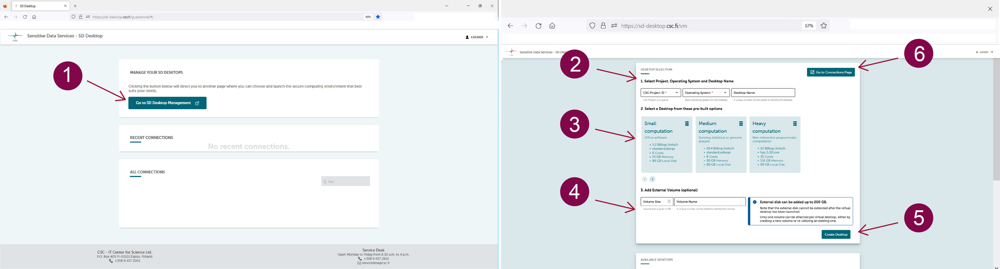

# Create virtual desktops

<iframe width="280" height="155" srcdoc="https://www.youtube.com/embed/t6xXKPTB6H0" title="YouTube video player" frameborder="0" allow="accelerometer; autoplay; clipboard-write; encrypted-media; gyroscope; picture-in-picture" allowfullscreen></iframe>

Creating a virtual desktop is easy and doesn't require technical expertise. Follow these steps:

1. Access the SD Desktop service, log in and go to the Connection page. Here, click on *Go To SD Desktop Management*.

2. **Specify desktop parameters**:
   
* Select your CSC project and operating system (Linux Ubuntu22 or Linux CentOS7). Give your desktop a name for easy identification, so that all project members can quickly identify it later on.

* Choose a pre-built option based on your needs: Small (for basic tasks), Medium (for complex analysis), or Heavy (for intensive tasks).

* External volume: You can attach an external volume (virtual external hard drive) to the virtual desktop extending the default storage (80 GB) up to 200 GB. You can add a new volume by selecting the  _Volume size_  and add a name in the field _Volume name_. **It is a good practice to save a copy of your analysis or important file on the volume that can also have a backup function in case the virtual desktop becomes unresponsive.** Note that disk space can't be extended after desktop creation. For additional storage or to manage volumes, contact us at servicedesk@csc.fi (subject: Sensitive data). Detaching or attaching a volume is akin to connecting or disconnecting a hard drive and is available for desktops created after February 2023. For details, refer to Managing volumes and desktops.

* If you need more storage space, you can add an external volume (a virtual external hard drive).  Each desktop's default disk (or storage) space is 80 GB, with this option, you can extend the disk space up to 200 GB.  You can add a new volume by selecting the  _Volume size_  and add a name in the field _Volume name_. **It is a good practice to save a copy of your analysis or important file on the volume that can also have a backup function in case the virtual desktop becomes unresponsive.** 

* Finally, press on _Create desktop_. The operation is entirely automated and can take up to 30 minutes. If you try accessing the virtual desktop during this process, an error message will be displayed asking you to return later.

**Pre-built desktop options**:

* **Small computation**. This option is ideal for analyzing sensitive data using office software (for example: similar to simple statistical analysis with Excel, watching videos, listening to audio files, and working on text files). You can compare this desktop to your laptop. Technical specifications: _Core:6; memory 15 GiB; Root disk: 80 GB; Correspondent Pouta Flavour: standard.xlarge; Billing Units: 5.2 units/h. 

* **Medium computation**. This option is ideal for running complex statistical or genome analysis (for example: using the command line to run specific scripts). You can compare this desktop to a powerful laptop provided by your organization's  IT unit. Technical specifications:_Core:8; memory 30 GiB; Root disk: 80 GB; Correspondent Pouta Flavour: standard.xxlarge; Billing Units: 10.4 units/h. 

* **Heavy computation**:  This option is ideal for running non-interactive programmatic analysis (machine learning) that requires heavy computation. Please do not choose this option for simple analysis, as it consumes considerable resources. Technical specifications: _Core:32; memory 116 GiB; Root disk: 80 GB; Correspondent Pouta Flavour: hpc.5.32core; Billing Units: 52 units/h.

**Important considerations**:

* Your virtual desktop is **accessible to all project members upon creation** and **consumes billing units** from your CSC project until paused or deleted.

* Each CSC project supports up to 3 virtual desktops, with 10 project members allowed to connect simultaneously to each desktop.

* All desktops come with a set of pre-installed open-source software managed by CSC. The complete and updated list can be found in the following paragraph. 

* **Delete or pause unused desktops**: Ensure to delete or pause your desktop when not in use. Unused desktops trigger email notifications after 14 days of inactivity.

* Additional volume or disk space can only be requested by writing to servicedesk@csc.fi (subject: Sensitive data).
  
* **You can detach and attach a volume from your virtual desktop**, from the SD Desktop Management page. This operation corresponds to connecting or disconnecting a hard drive to your laptop and is availale only on desktops created after February 2023. For more informations see: [Managing volume and desktops](./sd-desktop-manage.md).

**Need Assistance?** If you're uncertain about which desktop to choose or need support for your research, contact us at servicedesk@csc.fi with the subject "Sensitive data."

The following paragraphs will discuss how to work with your virtual desktop, which software is available, and how to customize your workspace.

