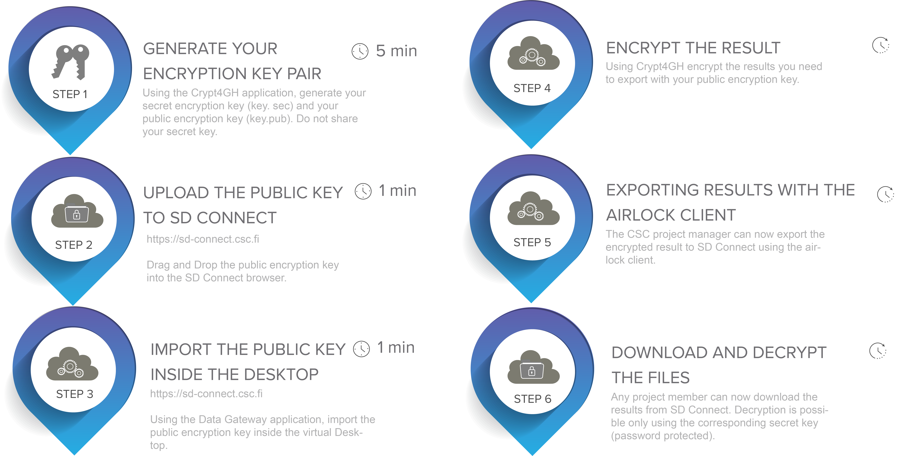

#  Export data from SD Desktop

Your virtual desktop is isolated from the internet for security reasons. Only the CSC project manager can export results or data from the secure workspace using the _Data Gateway_ application, currently available only programmatically. The results are exported to SD Connect, where they will be available for download to your computer. 


Below you can find step-by-step instructions to encrypt and export data from SD Desktop to SD Connect, where you can download and decrypt it. 

[](images/desktop/airlock.png)


1. Generate your encryption key pair (secret key and public key) with the Crypt4GH application (you can skip this paragraph if you already have a key pair).

      * Install the Crypt4GH application:

      CSC has developed a simple application that will allow you to generate your encryption keys and decrypt data when necessary. 
      Download the version specific to your operating system from the [GitHub repository](https://github.com/CSCfi/crypt4gh-gui):

      * [Mac](https://github.com/CSCfi/crypt4gh-gui/releases/download/v1.3.0/crypt4gh-gui-python3.10-macos-amd64.zip)
      * [Windows](https://github.com/CSCfi/crypt4gh-gui/releases/download/v1.3.0/crypt4gh-gui-python3.10-windows-amd64.zip)
      * [Linux](https://github.com/CSCfi/crypt4gh-gui/releases/download/v1.3.0/crypt4gh-gui-python3.10-linux-amd64.zip)

    Please check that the tool for Windows has been digitally signed by CSC - IT Center for Science. After the download, you can find the Crypt4GH application in your downloads folder.

    * When you open the application for the first time, you might encounter an error message. In this case, click on _More info_ and verify that the publisher is CSC-IT Center for Science (or in Finnish CSC-Tieteen tietotekniikan keskus Oy) and then click on _Run anyway_.

    * Generate your encryption keys:

        - Open the Crypt4GH application and click on _Generate Keys_ (in the top right corner).
        - The tool will open a new window and ask you to insert a password (_Private Key Passphrase_). This password will be associated with your secret key. Please, use a strong password.
        - When you click on _OK_, the tool will generate a key pair consisting of a secret key (`username_crypt4gh.key`) and a public key (`username_crypt4gh.pub`).
        - The keys/file names will be displayed in the Activity Log with the following message:

            ```
            Key pair has been generated, your private key will be auto-loaded the next time you launch this tool:
            Private key: username_crypt4gh.key
            Public key: username_crypt4gh.pub
            All the fields must be filled before file encryption will be started
            ```

            The keys will be generated and saved to the same folder in which the application resides.

        !!! Note
            * If you lose or forget your secret key, or the password, you will be unable to decrypt the files.
            * Do not share your secret key or your password.
            * You need to **create your keys only once** and use them for all your encryption needs, but you can of course, choose to generate separate keys for encryption as you wish.

2. Upload the public key to SD Connect. 

      * You can easily upload the public key to SD Connect via drag and drop. You will be **redirected to a new window displaying the default encryption options**. 
      * Next, you can specify the bucket's name to which the public encryption key should be uploaded. If you don't fill in a specific term, the user interface will automatically create a bucket named with a 13-digit number (based on creation time). 
      * Click on _Encrypt and upload_: the public key will be encrypted and uploaded to the bucket in SD Connect. Only encrypted files are visible and accessible via SD Desktop; thus, even your public encryption key must be encrypted during upload.

    

3. Import the public key inside the virtual desktop.

    Once the upload process is completed, you can access your virtual Desktop. Using the Data Gateway application, access the bucket with the public key. You can now import a copy of your public key inside the virtual Desktop (via copy/paste function). 

4. Encrypt the results.

    Open the terminal (right-click) and encrypt with your public key the files you want to export. Crypt4GH is already installed on each Desktop and accessible programmatically. 

    The syntax of the encryption command is:

    ```text
    crypt4gh encrypt --recipient_pk public-key < input > output
    ```

    Where `public-key` is your public key (`your-username.pub`), `input` is the file you want to export (`my_results.csv`), and `output` is the encrypted file (`my_results.csv.c4gh`)

    For example:

    ```text
    crypt4gh encrypt --recipient_pk your-username.pub < my_results.csv > my_results.csv.c4gh
    ```

5. Exporting the results from the private desktop.

    Once the results are encrypted, only the CSC project manager can export the files with the Airlock client. 

    Open the terminal (right-click) and type the following syntax:

    ```text
    airlock-client  <<username>> <<data_output_bucket>> <<filename>>
    ```

    Where `username` is your CSC account username, `data_output_bucket` is the name that you want to give to the bucket into which the results are exported. The airlock client will generate the bucket automatically in the same CSC project in which your Desktop is. `filename` is the name of the encrypted files that you want to export.

    For example:

    ```text
    airlock-client cscuser  analysis-2022  results-03.csv.c4gh
    ```

    Press enter and add your password. Note: if you try to upload an unencrypted file, the airlock client will automatically encrypt it with the Sensitive Data public key for security reasons and export it to SD Connect. Here, you will be able to download the file, but you will not be able to decrypt it.

    The fact that only project manager can export data from SD Desktop makes taking back-up copies of important files difficult for normal users. 
    If needed, the project manager can launch a back-up server process that normal users can utilize to do backups. For details, see:

    * [SD Desktop Back-up server tutorial](tutorials/backup_sd_desktop.md)

6. Download and decrypt the files.

    The exported file is now available in SD Connect/Allas. After downloading the file in your local environment, you can decrypt it with your secret encryption key, using the Crypt4GH application or programmatically. [See this page for specific guidance](./sd-connect-upload-for-storage-and-sharing.md#data-download-and-decryption).
    For more information and support, write to [CSC Service Desk](../../support/contact.md) (email subject Sensitive Data).
