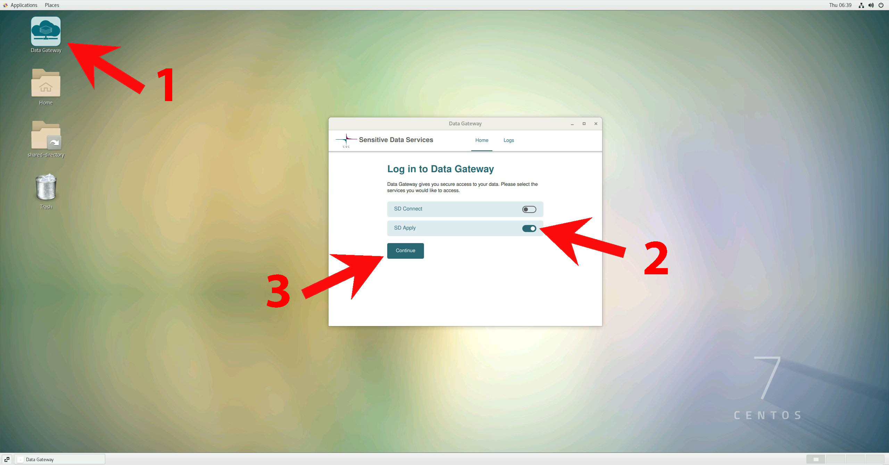

# SD Desktop Limited Edition (Sensitive Data Desktop Limited Edition)

SD Desktop Limited Edition has been audited against the Findata requirements and is a registered secondary use environment. It is designed to process sensitive secondary use data and provide a secure workspace for collaborative research projects using registry data. SD Desktop Limited Edition is a web-user interface that allows you to manage (start, use, delete) a virtual computer (here called Desktop, technically defined as virtual machine) from your web browser. With these virtual computers, you can access the dataset you have received a permit for from Findata. No previous knowledge of cloud computing or programming expertise are required to use the service.

In the following user guide, you can learn how to:

* apply for service access;
* set up your virtual Desktop;
* analyze data authorised by Findata;
* request to export non-sensitive results from the secure virtual Desktop.

## Key features

* Audited against Findata requirements.

* Accessible from any operating system (Mac, Linux or Windows) via web-browser (e.g., Google Chrome, Firefox) from the public internet (without the need of installing a client or using a VPN).

* Only the members of the same CSC project can access the same virtual Desktop.

* After login to SD Desktop, the user can start a pre-built computing environment (Linux OS), on-demand; available options offer the capability of doing simple statistical analysis to machine learning.

* Limited Edition virtual Desktops are completely isolated from the internet and other services: you can only access the data you have requested from Findata;

* SD Desktop Limited Edition can be used to work with any type of data: text files, images, audio files, video, and genetic data. However, the virtual Desktop includes [a limited set of pre-installed software](../../data/sensitive-data/sd_desktop.md#default-programs-available-on-sd-desktop) (open source). Only Findata can import additional programs to the Desktop.

## Before you start

* You need to have a data permit issued by Findata before starting the service access process at CSC.

* All the members belonging to a specific CSC project can access the same computing virtual Desktop. Currently, it is possible to launch 3 virtual Desktops (or computing environment) for each CSC project. Each CSC project has its private Desktop, and each Desktop is isolated from other CSC projects or CSC accounts.

* SD Desktop Limited Edition has few important limitations: the CSC project will be managed by the service desk and the data transfer will be restricted (including user’s own script and programs).

* After your data permit expires, you will no longer have access to your virtual Desktop. To continue working with the same project, you need to send an amendment application to Findata. Otherwise, make sure to request to export all your results before the validity period of your data permit ends. The expired project and all the data will be deleted after 90 days according to CSC's data retention policy.

!!! Note
    When you are planning to use SD Desktop Limited Edition, we recommend you to **contact us at servicedesk@csc.fi well in advance**, even before applying for a data permit from Findata, if you need **software that is not available** on the Desktop as a default.

## Overview

## Service access 

Access to SD Desktop Limited Edition is managed by CSC. When you are processing registry data (secondary use) in SD services you need to:

* request a CSC project from servicedesk@csc.fi (subject: Sensitive Data) and attach a copy of your **data permit** (see more instructions below);
* set up [a CSC account](../../accounts/how-to-create-new-user-account.md) using the [My CSC portal](https://my.csc.fi): log in with Haka, if you don't have Haka credentials you need to contact us at servicedesk@csc.fi in order to verify your identity ;
* **activate the additional security verification (or Multi-factor Authentication)** on your account scanning the QR code with a specific application (e.g. Google Authenticator). For further intruction see the [MFA paragraph](../../accounts/mfa.md), under the Account section on the CSC user guide;
* join a CSC project via an invitation link and wait for an approval from the service desk;
* fill in the [description of data processing activities](../../accounts/when-your-project-handles-personal-data.md) form;
* approve [the terms and conditions of SD Desktop service](../../accounts/how-to-add-service-access-for-project.md#member);

For specific guidance regarding these steps check the [Accounts](../../accounts/index.md) paragraph at the beginning of this user guide. Note that you always need to use your CSC username and password when you access data from your virtual Desktop. If you don't remember your CSC password, you can [reset it](../../accounts/how-to-change-password.md).

### Requesting a project for registry data

To start a service access process at CSC Sensitive Data services, you need to send a project request to us at servicedesk@csc.fi. Please **1)** attach a copy of your data permit to the request, **2)** describe shortly your research project (name and research field are enough) and **3)** add all the project members as a cc to the email (please use the organizational email addresses). We will respond to your request as soon as possible.

### Authentication

Login to SD Desktop Limited Edition is possible with identity federation systems (Haka, Virtu, CSC Login or LSLogin) at:

[**https://sd-desktop.csc.fi**](https://sd-desktop.csc.fi)

from any modern web-browser.

!!! Note
    In order to access the CSC project created for processing registry data, it is **necessary for project members to use Haka credentials** when creating a CSC account. If someone in the project doesn’t have Haka account, we need to verify their identity manually before they will be able to access the SD Desktop Limited Edition. For identity verification without Haka credentials, please contact our service desk (servicedesk@csc.fi).

After entering your username and password, you need to  **verify your identity** (or use Multi factor Authentication, MFA) by entering the verification **code** provided via mobile application. 

After entering the temporary code, **please press the Continue button**. Pressing Enter on your keyboard is currently causing an error that will re-directed to a stall request error page. We are working to fix this step. 

For specific guidance regarding the MFA activation on your CSC account, see the [MFA paragraph](../../accounts/mfa.md).

!!! Note
    LSLogin (LifeScience login, before known ELIXIR login) is available only after linking your CSC account to your LifeScience account (under your profile in MyCSC).

### Setting up a virtual Desktop
  
Once you have access to the service, you can launch your virtual computer (Desktop), choosing between four pre-built options. This operation can be carried out with a few simple steps and does not require any technical expertise. Next, the services will start your virtual Desktop (or, in technical terms: launch a virtual machine) and create a secure connection between CSC and your browser. After launch, your virtual Desktop will be directly available for use every time you log in to the service. Moreover, the running Desktop will consume billing units (or resources) from your CSC project until it is deleted.

Each CSC project supports the launch of 3 virtual Desktops. In addition, each Desktop supports the simultaneous connection of 10 project members. Thus, if you have colleagues/collaborators as project members in the same CSC project, they will also be able to connect to a virtual Desktop and access the data authorised for your project. Furthermore, all the Desktops are provided with the same software (pre-installed and managed by CSC). The complete and updated list can be found in [the user guide](../../data/sensitive-data/sd_desktop.md#default-programs-available-on-sd-desktop) under SD Desktop.

To start your virtual Desktop, log in to the services and in **Connection** page, click on **Go To SD Desktop Management page**. 

Here you can specify several parameters:

* **Select your CSC project**.

* **Choose the operating system**. Currently the only possible operating system is Linux CentOS 7 but in the future there will be other options too.

* **Assign a name for your virtual Desktop**. It is good practice to assign a descriptive name for a Desktop so that all project members can easily identify it later on.

* Choose one of the **virtual Desktop** pre-built options (Light, Small, Medium or Heavy computing), based on your computing and memory needs. The default disk (or storage) space for all Desktop is 80 GB. You can extend your Desktop disk space by selecting option: **add an external disk**. You can add up to 200 GB. Note: you can't extend the disk space after you have launched the virtual Desktop. Additional disk space later on can be required writing at servicedesk@csc.fi (subject: Sensitive data);

When all the settings are done, press the **Launch Desktop** button. The launch operation is entirely automated and can take **up to 30 minutes**. If you try to access the virtual Desktop and see a black screen, come back later. 

You can choose between **four different pre-built virtual Desktop options**:

*  **Light computation**. Techincal specifications: **Core:3; memory 4 GiB; Root disk: 80 GB; Correspondent Pouta Flavour: standard.medium; Billing Units: 1.3 units/h**. This option is ideal for testing the services (for example, test how to start a Desktop, check out how it looks and which applications are available). You can compare this Desktop to a laptop with limited capacities, which probably freezes when you open too much software or more than three colleagues connect to it simultaneously. For this reason, we advise you to start this type of Desktop only for testing purposes and delete it when the testing is completed. 

* **Small computation**. Techincal specifications: **Core:6; memory 15 GiB; Root disk: 80 GB; Correspondent Pouta Flavour: standar.xlarge; Billing Units: 5.2 units/h**. This option is ideal for analysing sensitive data using office software (for example: similar to simple statistical analysis, watching videos, listening to audio files, working on text files). You can compare this Desktop to your working laptop. 

* **Medium computation**. Techincal specifications:**Core:8; memory 30 GiB; Root disk: 80 GB; Correspondent Pouta Flavour: standar.xxlarge; Billing Units: 10.4 units/h**. This option is ideal for running complex statistical or genome analysis. You can compare this Desktop to a powerful laptop provided by your IT unit. 

* **Heavy computation**: Technical specifications: **Core:40; memory 168 GiB; Root disk: 80 GB; Correspondent Pouta Flavour: hpc4.40core; Billing Units: 78 units/h**. This option is ideal for running non-interactive programmatic analysis (for example, machine learning) that require heavy computation. Please do not choose this option for simple analysis, as it consumes much resources. 

!!! Note
        If you don't know the best Desktop option for your needs, please contact us at servicedesk@csc.fi (email subject: Sensitive Data). 

Unfortunately, we are not yet providing a virtual Desktop with GPUs or Windows, Linux Ubuntu operating systems. However, we are working on it, and you can find more information on the future developments of the services on our webpage. 

In the following paragraphs, we will discuss how to work with a virtual Desktop, which software is available and what limitations there are in the secondary use environment.

### Working with your virtual Desktop

Once your private virtual computer (Desktop) is launched, each CSC project member can securely access it from their browser at any time.

When you log in to SD Desktop **Homepage**,  you will be able to access your virtual Desktop in:

* **Recent connections**, clicking on the image of your Desktop (visible only if you recently accessed it)

* **All connections** if you click on + you can see all the connections associated with each project (e.g. project_NNNNN_NNNN). If you click on the connection ID you will also access your Desktop. 

When you open the connection, a virtual computing environment (Linux Centos operating system) will open into your browser. When you access the virtual Desktop for the first time, you will see the getting started panel, from which you can, for example, adjust the screen resolution.

You can work with this virtual Desktop like in a standard computing environment.  From the applications menu bar (top left corner) you can access several pre-installed programs. Examples include Open Office, image viewing applications, video and audio players, Jupiter Notebook etc. You can also open a terminal and use Linux from command line. To start using R-Studio please check [the paragraph](../../data/sensitive-data/sd_desktop.md#rstudio-in-sd-desktop) under SD Desktop.

Security-related features SD Desktop Limited Edition include:

* the computing environment (visible from your browser) is isolated from the internet. You can, for example, open a Firefox web browser, but you are not able to access any site on the internet. You will also not be able to access any repositories directly.

* you can access the data you have requested only using the Data Gateway application (see below for more information);

* the copy-paste function from your computer/laptop to the browser visualizing your virtual Desktop is entirely disabled for security reasons. You can anyhow use this function inside your browser.

You can close your connection to your virtual Desktop in two ways:

1.  _Log out_ from your Desktop (in the workspace view, top right corner of the browser, select your _username_ and _log out_). This will close all applications in your virtual Desktop and disconnect the work session. You will be able to access the virtual Desktop at any time after logging in to the services.

2. If you started a data analysis programmatically (you are running a script) you can close the browser window. This doesn't interfere with the processes running. Thus, when you reconnect to your Desktop, you have all your tools and interfaces still open and can continue working. However, remember to log out from the Desktop once the analysis is finished. If you leave more than ten connections open, you will be unable to re-access the services. 

!!! Note
    **Never use the lock or reboot buttons** in SD Desktop as you will not be able to connect to the Desktop again after that.
 
    

## Accessing sensitive registry data within SD Desktop Limited Edition

As the virtual Desktop is isolated from the internet, the only way to access data for analysis is by utilizing a specific application called _Data Gateway_. This application will allow you to access the dataset for which you have received a permit from Findata. Encrypted files will be **visible in read-only mode (similarly to opening a pdf file or streaming a YouTube video)**. This solution allows you to process large amounts of data without storing any copy on your virtual Desktop.

The data authorised by Findata can be accessed in your virtual Desktop via SD Apply in Data Gateway. After the CSC project has been set up for you, the data will be accessible in SD Desktop Limited Edition for the time period determined in the data permit. SD Connect (for storing data) is not available in SD Desktop Limited Edition, so the only way to import any data, script or software to the Desktop is through Findata.

### Accessing data using Data Gateway

Once you sign in to your virtual Desktop, you can access the data by following these steps:

* Open **Data Gateway** (you can find the application on your Desktop);

* select SD Apply;

* **Click on Continue**;

* In the new window, under the second step, click on **Create**. The application will create a new folder called **Projects** accessible from your Desktop or programmatically the terminal. Next, click on **Open folder**.

*   The files have been encrypted using the **sensitive data public encryption key**, and you will be able to access their content in read-only mode. The current streaming speed can be up to 50 MB/s.

!!! Note 
    The Projects folder is **available only when the Data Gateway application is open**. If you close or disconnect the application, you will not be able to access the data stored in the data service unless you previously made a full copy of it inside your Desktop. Thus, Data Gateway needs to be open and connected during data processing in streaming mode.

### Importing data inside the Desktop

**If you need to edit the files/data**:

 * access the files of interest in the Project folder **using Data Gateway**;
 
 *  Select all the necessary files from the Project folder, make a **copy** and save it in the virtual Desktop **home directory** (the files will be visible only from your browser) or in the **shared folder** (in this case, the files will be accessible also by all the CSC project members).

## Default programs available on SD Desktop Limited Edition and software customisation

Each virtual Desktop (or virtual computer) is pre-built and contains a limited set of default open-source software ([listed](../../data/sensitive-data/sd_desktop.md#default-programs-available-on-sd-desktop) under SD Desktop).

The virtual Desktop is isolated from the internet and importing of software is restricted, as is required by the data permit authority. Thus, users cannot install software to SD Desktop Limited Edition directly. If you need a specific program that is not pre-installed, it is recommended to contact us at servicedesk@csc.fi even before applying for the data permit to figure out if it is possible to install the program to the Desktop. If the program is compatible with the computing environment, then you need to send a request to Findata and ask them to import the program to your Desktop.

##  Data export from SD Desktop Limited Edition

Your virtual Desktop is completely isolated from the internet and other services for security reasons. Only CSC service desk can export non-sensitive results from the secure workspace.

In order to export the result at the end of your analysis, you need to:

* make sure your results don’t contain any sensitive data;

* collect all the results into a same folder and name it as **Results**;

* place the Results folder into the **shared-directory** on your Desktop;

* send a request to servicedesk@csc.fi to export your results.

All the content in the “Results” folder will be exported to the data permit authority, and it will be available for you after their scrutiny. During the export, you will not be able to access your virtual Desktop. All the project members have to be removed from the CSC project for the duration of the data export. Afterwards, you will be invited back to the CSC project, if your project is still ongoing.

## Deleting your virtual Desktop
  
At the end of your analysis, you can delete your virtual Desktop and all the files in it.

You can not undo this action:
  
* On SD Desktop Homepage, click on **Go To SD Desktop Management page**. 
* Here, under **Available instances** click on **Delete Desktop**. 

!!! Note
    The desktop **should not be deleted before all the results have been exported**. All the data present in the computing environment will be deleted, and it will not be possible to retrieve them. You will delete the entire virtual workspace, and your colleagues (or the other CCS project members) will lose their results and data imported to it. For this reason, please get in touch with all the project members and send a request to export all the results of your analysis from the virtual workspace, before deleting a virtual Desktop.

## End of data access and data deletion policies

Access to the data will be denied after the data permit expires. If you want to continue accessing the data after the original validity period ends, you need to send an amendment application to Findata to extend the validity of the permit.

When the data permit has expired, all the members will be removed from the CSC project and you cannot access your virtual Desktop anymore. This also means that **all your results must be exported before the end of the validity period**. Both the project and the data will be deleted according to CSC’s data retention policy (see [General Terms of Use for CSC's Services for Research and Education](https://research.csc.fi/general-terms-of-use)) and agreement with the users. As a default, **inactive projects and all their data will be deleted after 90 days** in accordance with the regulations.

If you are still waiting for a decision about your amendment application when the original permit expires, please contact our service desk (servicedesk@csc.fi) in order to save your CSC project and data for later use. We cannot grant access to the Desktop without a valid data permit. 

## Troubleshooting

Find solutions to common problems in the [Troubleshooting paragraph](../../data/sensitive-data/sd_desktop.md#troubleshooting) under SD Desktop.
