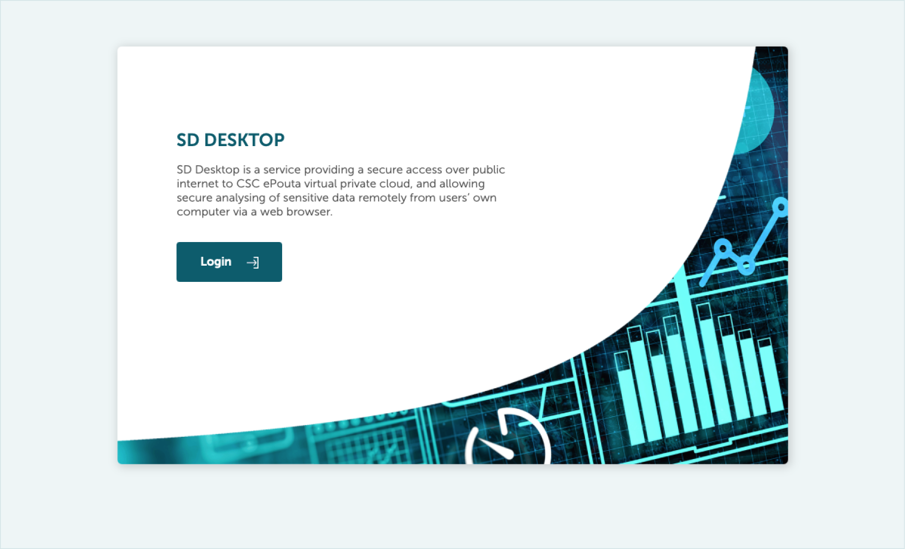
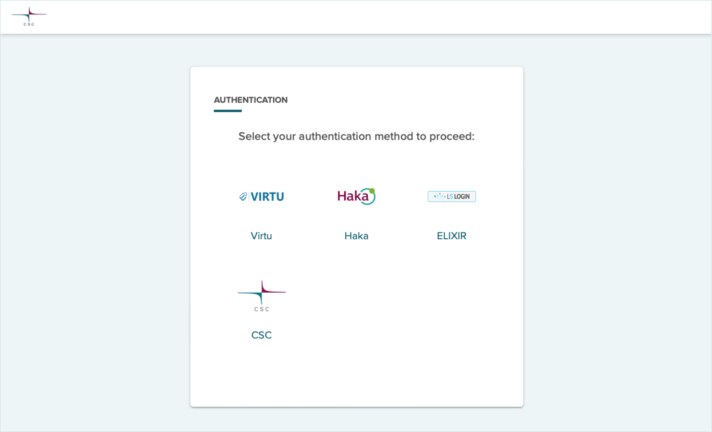
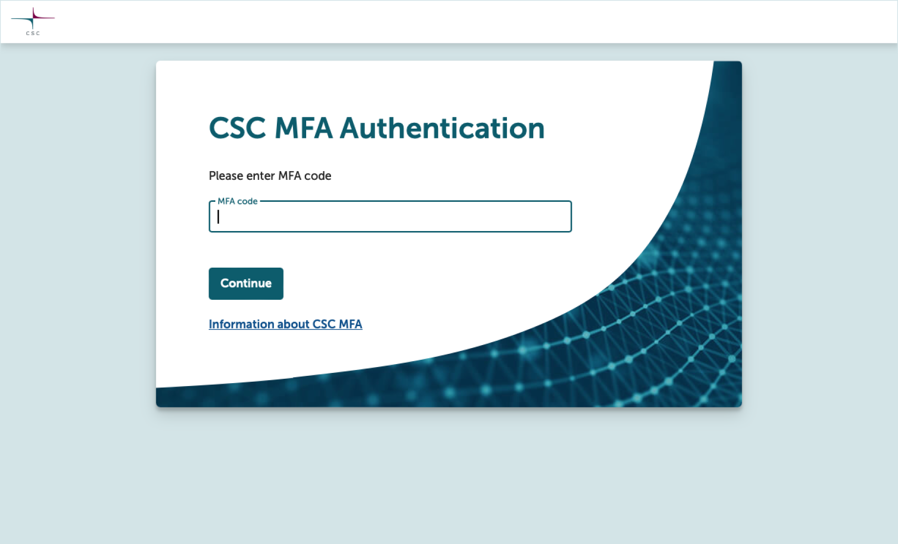

# Login to SD Desktop

[SD Dektop Login page](https://sd-desktop.csc.fi){ .md-button .md-button--primary target=_blank }

**Authentication:** Login to SD Desktop is possible with identity federation systems (Haka, Virtu, CSC Login or LS Login) at
[https://sd-desktop.csc.fi](https://sd-desktop.csc.fi){ target="_blank" } from any modern web-browser.

**MFA Authentication:** After entering your username and password, you need to verify your identity with a second verification step (i.e. Multi-factor Authentication, MFA). Enter the verification code provided via your MFA mobile application and press on _Continue_. For specific guidance, see the [MFA section](../../accounts/mfa.md).

=== "1. Login page"
    
=== "2. Authentincation"
    
=== "3. Multi-factor authentication"
    

*Please note that before logging into SD Desktop for the first time, you must create a CSC account, activate MFA, and be part of some CSC project. All this happens in MyCSC-portal. Read more from [Start here](./sd-access.md).*
