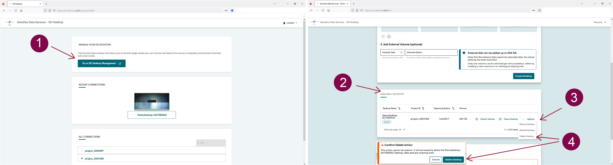

# Datan vienti virtuaalityöpöydältä {#data-export-from-virtual-desktop}

Virtuaalityöpöytäsi on täysin eristetty internetistä ja muista palveluista tietoturvasyistä. Myös datan vienti on rajoitettua: vain CSC voi viedä ei-arkaluonteiset tulokset turvatusta työtilasta toisen käyttötarkoituksen mukaista datan käsittelyä varten. Viedyt tulokset toimitetaan tarkastettavaksi data-lupaviranomaiselle, Findatalle.

Varmistathan, että varaat riittävästi aikaa vientiprosessiin. Voi kestää muutaman päivän, ennen kuin vastaamme pyyntöösi, ja kun tulokset on lähetetty tarkastukseen, tarkastusprosessi voi kestää enintään seitsemän arkipäivää.

**Jotta voit viedä tulokset analyysisi lopuksi, sinun tulee:**

1. Varmista, että tuloksesi **eivät sisällä arkaluonteisia tietoja**. Lue lisää anonyymien tulosten tuottamisesta [Findatan sivuilta](https://findata.fi/en/services-and-instructions/producing-anonymous-results/);
2. Kerää kaikki tulokset samaan kansioon ja nimeä se **Results**;
3. Sijoita **Results**-kansio **shared-directory**-kansioon työpöydälläsi;
4. Lataa ja täytä Findatan [yhteenvetolomake tulosten anonymiteetin varmistamiseksi](https://findata.fi/summary-form-verifying-anonymity-of-results);
5. **Lähetä pyyntö [CSC Service Deskille](../../support/contact.md)** tulostesi vientiä varten ja liitä täytetty Findatan yhteenvetolomake pyyntöön mukaan;
6. Kaikki “Results”-kansion sisältö viedään data-lupaviranomaiselle, ja se on käytettävissäsi tarkastuksen jälkeen. Vientiprosessin aikana et voi käyttää virtuaalityöpöytääsi. Kaikki projektin jäsenet täytyy poistaa CSC-projektista tietojen viennin ajaksi. Tämän jälkeen sinut lisätään takaisin CSC-projektiin, jos projektisi on edelleen käynnissä;
7. Saat ohjeet uuden CSC-projektin luomiseen SD Connectissa, minkä jälkeen Sensitive Data Support -tiimi jakaa tulokset sinulle SD Connectin kautta.

## Virtuaalityöpöydän poistaminen {#deleting-virtual-desktop}

### Työpöydän poistaminen {#deleting-a-desktop}

Analyysisi lopussa voit poistaa virtuaalityöpöytäsi, sisältäen ulkoisen aseman ja kaikki sille tallennetut tiedostot. Toimintoa ei voi perua:

 1. Mene [SD Desktopin etusivulle](https://sd-desktop.csc.fi) ja klikkaa **Go to SD Desktop management**.
 2. Valitse *Available desktops* -kohdasta oikea virtuaalityöpöytä. Oikealla puolella klikkaa **Options** ja **Delete Desktop**.

!!! Huomio
    Virtuaalityöpöytää **ei tulisi poistaa ennen kuin kaikki tulokset on viety**. Olethan yhteydessä kaikkiin projektin jäseniin ennen virtuaalityöpöydän poistamista. Tällä toiminnolla poistat koko työtilan, mukaan lukien kaikki virtuaalityöpöydälle tai ulkoiselle asemalle tallennetut tiedostot myös muiden projektin jäsenten osalta.

### Datan käyttöoikeuden päättyminen ja tietojen poistokäytännöt {#end-of-data-access-and-data-deletion-policies}

Pääsy dataan evätään, kun datalupa päättyy. Jos haluat jatkaa datan käyttöä alkuperäisen voimassaoloajan päätyttyä, sinun tulee lähettää *muutoshakemus* rekisterinpitäjälle luvan voimassaoloajan jatkamiseksi.

Kun dataluvan voimassaolo päättyy, CSC-projekti suljetaan, etkä voi enää käyttää virtuaalityöpöytääsi. Tämä tarkoittaa, että **kaikki tuloksesi täytyy viedä ennen voimassaoloajan päättymistä**. Sekä projekti että data poistetaan CSC:n tietojen säilytyskäytännön mukaisesti (katso [CSC:n palveluiden yleiset käyttöehdot tutkimukselle ja opetukselle](https://research.csc.fi/general-terms-of-use)) ja käyttäjien kanssa tehdyn sopimuksen perusteella. Oletusarvoisesti **epäaktiiviset projektit ja kaikki niihin liittyvät tiedot poistetaan 90 päivän kuluttua** määräysten mukaisesti.

Jos alkuperäisen luvan voimassaolon päättyessä odotat vielä päätöstä muutoshakemukseesi, ota yhteyttä [CSC Service Deskiin](../../support/contact.md) säilyttääksesi CSC-projektin ja datan myöhempää käyttöä varten. Emme voi myöntää pääsyä työpöydälle ilman voimassa olevaa datalupaa.