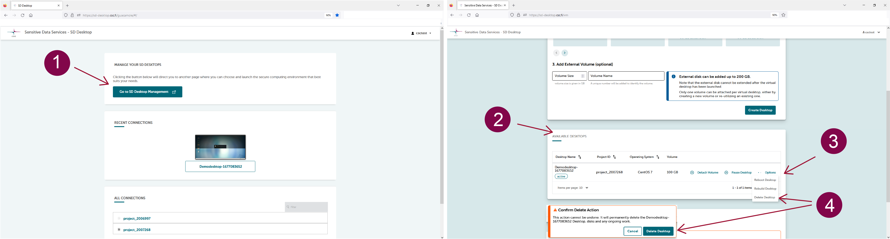

# Datan vienti virtuaalityöpöydältä {#data-export-from-virtual-desktop}

Virtuaalityöpöytäsi on täysin eristetty internetistä ja muista palveluista tietoturvasyistä. Myös datan vienti on rajoitettua: vain CSC voi viedä ei-sensitiivisiä tuloksia turvallisesta työtilasta, kun käsitellään toissijaista käyttöä varten tarkoitettua dataa. Viedyt tulokset lähetetään tietolupaviranomaiselle Findatalle tarkastettavaksi.

Varaathan riittävästi aikaa vientiprosessille. Voi kestää muutaman päivän ennen kuin vastaamme pyyntöösi, ja kun tulokset on lähetetty tarkastettavaksi, tarkastusprosessi voi kestää jopa seitsemän arkipäivää.

**Jotta voit viedä tulokset analyysin lopussa, sinun tulee:**

1. Varmista, että tuloksesi **eivät sisällä mitään sensitiivistä dataa**. Lue lisää anonyymien tulosten tuottamisesta [Findatan verkkosivuilta](https://findata.fi/palvelut-ja-ohjeet/anonyymien-tulosten-tuottaminen/);
2. Kerää kaikki tulokset samaan kansioon ja nimeä se **Results** (Tulokset);
3. Sijoita **Results**-kansio **shared-directory** (jaettu-hakemisto) työpöydällesi;
4. Lataa ja täytä Findatan [yhteenvetolomake tulosten anonymiteetin varmistamiseksi](https://findata.fi/yhteenvetolomake-tulosten-anonymiteetin-varmistamiseksi);
5. **Lähetä pyyntö [CSC:n Service Deskiin](../../support/contact.md)** tulosten viemiseksi ja liitä täytetty Findatan yhteenvetolomake pyyntöön;
6. Kaikki “Results”-kansion sisältö viedään tietolupaviranomaiselle, ja se on saatavilla sinulle tarkastuksen jälkeen. Vientiprosessin aikana et voi käyttää virtuaalityöpöytääsi. Kaikki projektin jäsenet on poistettava CSC-projektista datan viennin ajaksi. Tämän jälkeen sinut lisätään takaisin CSC-projektiin, jos projektisi on edelleen käynnissä;
7. Saat ohjeet uuden CSC-projektin luomiseen SD Connectissa, minkä jälkeen Sensitive Data Support -tiimi jakaa tulokset sinulle SD Connectin kautta.

## Virtuaalityöpöydän poisto {#deleting-virtual-desktop}

### Työpöydän poistaminen {#deleting-a-desktop}

Analyysin lopussa voit poistaa virtuaalityöpöytäsi, mukaan lukien ulkoinen asema ja kaikki siihen tallennetut tiedostot. Tätä toimintoa ei voi perua:

1. [SD Desktop -kotisivulla](https://sd-desktop.csc.fi), klikkaa **Siirry SD Desktop -hallintaan**.
2. Kohdassa *Saatavilla olevat työpöydät* valitse oikea virtuaalityöpöytä. Oikealla puolella, klikkaa **Asetukset** ja **Poista työpöytä**.

!!! Huomio
    Virtuaalityöpöytää **ei tule poistaa ennen kuin kaikki tulokset on viety.** Ota yhteyttä kaikkiin projektin jäseniin ennen virtuaalityöpöydän poistamista. Tällä toiminnolla poistat koko työtilan, mukaan lukien kaikki virtuaalityöpöydälle tai muille projektin jäsenille ulkoiselle levylle tallennetut tiedostot.

### Datan käyttöoikeuksien ja datan poistosäännöt {#end-of-data-access-and-data-deletion-policies}

Käyttöoikeus dataan estetään, kun datalupa umpeutuu. Jos haluat jatkaa datan käyttöä alkuperäisen voimassaoloajan päätyttyä, sinun on lähetettävä *muutoshakemus* datan käsittelijälle luvan voimassaoloajan pidentämiseksi.

Kun datalupa umpeutuu, CSC-projekti suljetaan, etkä voi enää käyttää virtuaalityöpöytääsi. Tämä tarkoittaa, että **kaikki tulokset on vietävä ennen voimassaoloajan päättymistä**. Sekä projekti että data poistetaan CSC:n tietojen säilyttämiskäytännön mukaisesti (katso [CSC:n palveluiden yleiset käyttöehdot tutkimukselle ja koulutukselle](https://research.csc.fi/yleiset-kayttoehdot)) ja käyttäjien kanssa tehdyn sopimuksen mukaisesti. Oletuksena **passiiviset projektit ja kaikki niiden data poistetaan 90 päivän kuluttua** säännöksen mukaisesti.

Jos odotat päätöstä muutoshakemuksestasi alkuperäisen luvan umpeutuessa, ota yhteyttä [CSC:n Service Deskiin](../../support/contact.md) tallentaaksesi CSC-projektisi ja datasi myöhempää käyttöä varten. Emme voi myöntää käyttöoikeutta työpöydälle ilman voimassaolevaa datalupaa.

