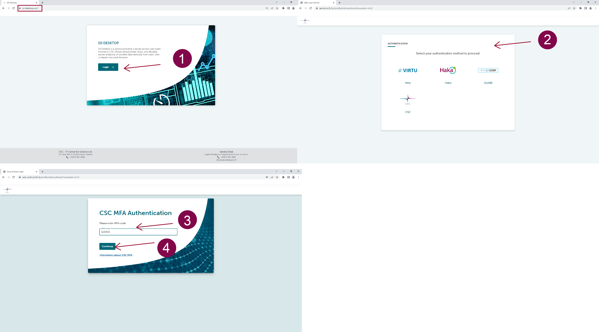

[Käyttöoppaan sisällysluettelo :material-arrow-right:](sd-services-toc.md)

# Kirjaudu SD Desktopiin { #log-into-sd-desktop }

## Edellytykset { #prerequisites }

* [Toisiokäyttöön tarkoitetun terveys- tai sosiaalidatan käyttö Sensitive Data -palveluiden kautta](secondarydata-access.md)

## Vaihe vaiheelta { #step-by-step }
    
1. Siirry kirjautumissivulle: **[https://sd-desktop.csc.fi](https://sd-desktop.csc.fi){ target="_blank" }**.
2. Kirjaudu MyCSC-tunnuksilla tai Haka-tunnistautumisella. Anna käyttäjätunnuksesi ja salasanasi.
3. Sinun tulee vahvistaa henkilöllisyytesi toisella vahvistusvaiheella (eli monivaiheinen tunnistautuminen, MFA). Syötä vahvistuskoodi MFA-mobiilisovelluksestasi (esim. Google Authenticator).
4. Paina *Continue*.

* [Luo virtuaalityöpöytä](sd-desktop-secondary-create.md)
* [Tuo dataa analysoitavaksi Data gatewayn avulla](sd-desktop-secondary-access.md)
* [Työskentely työpöydälläsi: vinkit, perusasiat, ohjelmistot](sd-desktop-secondary-working.md)
* [Hallinnoi virtuaalityöpöytää](sd-desktop-secondary-manage.md)