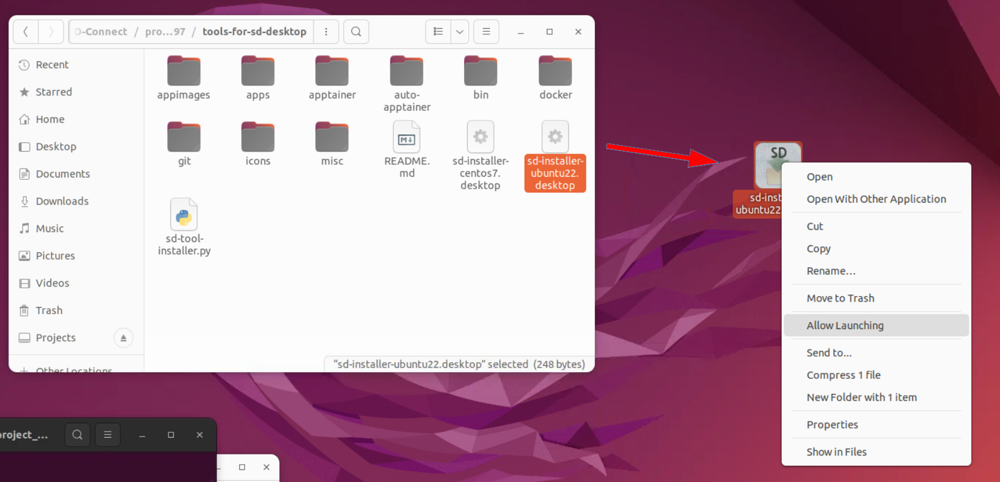

# Virtuaalisen työpöydän mukauttaminen ohjelmistojen ja työkalujen lisäämisellä analyysia varten {#customising-virtual-desktop-by-adding-software-tools-for-analysis}

## Edellytykset {#prerequisites}
* [Luo virtuaalinen työpöytä](sd-desktop-create.md)
* [Pääsy virtuaaliseen työpöytään](sd-desktop-access-vm.md)

## Virtuaalisen työpöydän ohjelmisto {#software-in-virtual-desktop}

Virtuaaliseen työpöytään on esiasennettu perustyökaluja tai ohjelmistoja, joita voit käyttää välittömästi (lueteltu alla). Tämä alkuperäinen työkalupaketti tarjoaa kuitenkin melko rajatun valikoiman avoimen lähdekoodin ohjelmistoja. Muuntaaksesi virtuaalisen työpöydän monipuoliseksi tutkimustyötilaksi, joka on räätälöity erityistarpeisiisi, voit käyttää yksinkertaista sovellusta nimeltä SD Software Installer, joka auttaa ohjelmistojen lisäämisessä ja virtuaalisen työpöydän mukauttamisessa. Teknistä asiantuntemusta omaaville käyttäjille on myös mahdollista luoda muokattuja kontteja Apptainerin tai Podmanin avulla.

Alta löydät:

- [Ohjelmiston lisäys: taustatiedot ja rajoitukset](sd-desktop-software.md#adding-software-background-information-and-limitations)
- [Mukauttaminen SD Software Installerin kautta](sd-desktop-software.md#customisation-via-sd-software-installer) (ei vaadi aikaisempaa kokemusta)
- [Mukauttaminen Apptainerin ja Podmanin kautta](sd-desktop-software.md#customisation-via-apptainer-and-podman) (edistynyt; teknistä asiantuntemusta tarvitaan).

Älä epäröi [ottaa yhteyttä CSC Service Deskiin](../../support/contact.md) (aihe: SD Services), jos sinulla on kysyttävää ohjelmiston valinnasta. Voimme tukea sinua työpöydän mukauttamisessa.

## Ohjelmiston lisäys: taustatiedot ja rajoitukset {#adding-software-background-information-and-limitations}

- Virtuaaliset työpöydät (tai virtuaalikoneet) on tarkoituksellisesti eristetty internetistä turvallisuussyistä. Näin ollen lisäohjelmistojen ja -kirjastojen lisääminen ei ole suoraviivaista.
- SD Desktop tukee vain avoimen lähdekoodin ohjelmistoja; lisensoituja ohjelmistoja ei tueta.
- Verkkoyhteyden puuttuminen estää perinteisten asennustyökalujen, kuten _git_, _coda_, _cpan_ tai _pip_, käytön tavallisella tavalla, sillä nämä työkalut tukeutuvat ulkoisiin tietovarantoihin. Lisäksi SD Desktopin käyttäjillä ei ole tarvittavia superuser-oikeuksia suoritettavien toimintojen vaatimiin kohotetuille oikeuksille.
- SD Desktopiin voidaan lisätä ylimääräisiä ohjelmistoja, mutta se edellyttää asennusvaiheiden muuntamista erityistiedostoiksi. Nämä tiedostot ladataan sitten SD Connectiin ja kopioidaan SD Desktopiin asennettavaksi. Tässä prosessissa suosittelemme käyttämään Apptainer-kontteja tarvitsemasi ohjelmiston tuomiseen, mutta Apptainer ei ole ainoa vaihtoehto. Voit myös tuoda ohjelmistoa esimerkiksi Appimage-tiedostoina, Ubuntu 22.04 -yhteensopivina lausuatiedostoina tai lähdekoodina.

## Mukauttaminen SD Software Installerin kautta {#customisation-via-sd-software-installer}

SD Software Installer tarjoaa helppokäyttöisen työkalun joitakin usein käytettyjä ohjelmistoja varten SD Desktopissa. Esimerkiksi Rstudio 4.2.2, Whisper, VSCode ja GATK ovat saatavilla. SD Software Installer on CSC:n tarjoama sovellus. Käyttäjät eivät voi lisätä omia työkalujaan SD Software Installeriin, mutta voit lähettää pyyntöjä uusien työkalujen lisäämisestä [ottamalla yhteyttä CSC Service Deskiin](../../support/contact.md) (aihe: SD Desktop). Sovellukseen pääsemiseksi, noudata alla olevaa vaiheittaista opasta.

<iframe width="280" height="155" srcdoc="https://www.youtube.com/embed/S4hpjPy-TDQ" title="How to install software on SD Desktop" frameborder="0" allow="accelerometer; autoplay; clipboard-write; encrypted-media; gyroscope; picture-in-picture; web-share" allowfullscreen></iframe>

### Ohjelmisto saatavilla SD Software Installerin kautta {#software-available-via-sd-software-installer}

| **Kategoria**         | **Työkalu**                                                                                                                                                                                                                     |
|-----------------------|------------------------------------------------------------------------------------------------------------------------------------------------------------------------------------------------------------------------------|
| **Tilastotiede**      | [RStudio 4.4.2](r-in-sd-desktop.md) - R-tilastotyökalu graafisella käyttöliittymällä ja apuvälineillä kirjastojen lisäämiseen.   *Asennuksen jälkeen napsauta hiiren oikealla painikkeella RStudion työpöytäkuvaketta ja valitse: Salli käynnistäminen.* |
|                       | [PSPP](https://www.gnu.org/software/pspp/) - Avoimen lähdekoodin vaihtoehto SPSS-tilastotyökalulle.   *Asennuksen jälkeen napsauta hiiren oikealla painikkeella PSPP:n työpöytäkuvaketta ja valitse: Salli käynnistäminen.*                                                    |
|                       | [Octave](https://octave.org/) - Matlab-yhteensopiva tieteellinen ohjelmointikieli graafisella käyttöliittymällä   *Asennuksen jälkeen napsauta hiiren oikealla btnimglella Octave:n työpöytäkuvaketta ja valitse: Salli käynnistäminen.*                 |
| **Kuvantaminen ja videot**| [Audacity](https://www.audacityteam.org/) - Äänieditori.   *Asennuksen jälkeen napsauta hiiren oikealla painikkeella Audacity:n työpöytäkuvaketta ja valitse: Salli käynnistäminen.*                                                                      |
|                       | [ELAN 6.7](https://archive.mpi.nl/tla/elan/) - Annotaatiotyökalu ääni- ja videotallenteille.   *Asennuksen jälkeen napsauta hiiren oikealla painikkeella ELAN:n työpöytäkuvaketta ja valitse: Salli käynnistäminen.*                                       |
|                       | [OpenShot 3.1.1](https://www.openshot.org/) - Videoeditori.   *Tämä työkalu toimii vain Ubuntu 22-pohjaisissa virtuaalipöytäkoneissa. Asennuksen jälkeen napsauta hiiren oikealla painikkeella OpenShot-työpöytäkuvaketta ja valitse: Suorita ohjelmana.*        |
|                       | [Praat](https://www.fon.hum.uva.nl/praat/) - Työkalupakki puheen ja äänen analysointiin.                                                                                                                                     |  
|                       | [QuPath 0.4.2](https://github.com/qupath/qupath/) - Ohjelmisto bioimage-analyysia varten.                                                                                                                                     |
|                       | [Whisper](./tutorials/whisper.md) - Automaattinen puheen tunnistus.                                                                                                                                                                         |
| **Geotieteet**        | [QGIS 3.1.1](https://qgis.org/en/site/) - Ilmainen ja avoimen lähdekoodin Maantieteellinen Tietojärjestelmä.   *[QGIS CSC palvelimilla](../../apps/qgis.md)*                                                                         |
| **Bioscience**        | [GATK](https://gatk.broadinstitute.org/hc/en-us) - Genomianalyysiohjelmisto, joka keskittyy varianttilöydöksiin.                                                                                                               |
|                       | [GCTA 1.94.1](https://yanglab.westlake.edu.cn/software/gcta/#Overview) - Työkalu genomilaajuisten monimutkaisten piirteiden analysointiin.                                                                                                     |
|                       | [GCTB 2.05b](https://cnsgenomics.com/software/gctb/#Overview) - Genomilaajuinen monimutkaisten piirteiden bayesilainen analyysi.                                                                                                               |
|                       | [IGV 2.16.2](https://igv.org/doc/desktop/) - Integroitu Genomiakatsoja.   *Asennuksen jälkeen napsauta hiiren oikealla painikkeella IGV:n työpöytäkuvaketta ja valitse: Salli käynnistäminen.*                                                           |
|                       | [MultiQC 1.10](https://multiqc.info/) - NGS-lukeman laatutarkistustyökalu.                                                                                                                                                    |
|                       | [PRSice 2.0](https://choishingwan.github.io/PRSice/) - Polygeeniselle riskisummalle tarkoitettu ohjelmisto polygeenisten riskisummien laskemiseen, soveltamiseen, arviointiin ja tulosten esittämiseen (PRS-analyyseissä).                              |
|                       | [Regenie 3.3](https://rgcgithub.github.io/regenie/) - Ohjelma genomilaajuisten assosiaatiotutkimusten koko genomin regressiomallinnukseen.                                                                                 |
|                       | [Salmon 1.9.0](https://combine-lab.github.io/salmon/) - Ohjelma RNA-sequence datan aikaansaamiseksi transkriptitasoisista kvantifiointiarvioista.   *[Salmon 1.9.0 CSC palvelimilla](../../apps/salmon.md)*                     |
| **Muut**              | **CSC työkalut** mukaan lukien:  [auto-apptainer](./tutorials/auto-apptainer.md) - Työkalu komentorivisovelluksien lisäämiseksi CSC:n tarjoaman Apptainer-konttikirjaston avulla.  [Varmuuskopiotyökalu](./tutorials/backup_sd_desktop.md) - Apuväline varmuuskopioiden automatisointiin ja vientiin SD Desktopissa.                                                            
|                       | [add-python-lib](./tutorials/sd-pythonlibs.md) - Apuväline Python-kirjastojen lisäämiseen.    |  
|                       | [ARX](https://arx.deidentifier.org/) - Tietosuojaustyökalu |
|                       | [OpenRefine](https://openrefine.org/) - Tietojen esiprosessoinnin ja muunnosten työkalu eri tietomuodoille. |                                                                                                                                        |
|                       | [VS Code 1.90.2](./tutorials/vscode.md) - Koodi-editori.   *Asennuksen jälkeen napsauta hiiren oikealla painikkeella VS Code:n työpöytäkuvaketta ja valitse: Salli käynnistäminen.*    |                                                                               |
|                       | [WEKA 3-8-6](https://ml.cms.waikato.ac.nz/weka/index.html) - Tietojen louhintaohjelmisto.                                                                                                                                         |

### Vaihe 1: Lähetä pyyntö {#step-1-send-a-request}

- Kirjaudu [SD Connect -palveluun](https://sd-connect.csc.fi) ja jos et ole käyttänyt palvelua aiemmin, lataa ensin pieni testi-tiedosto kansioon. Tällä hetkellä on tekninen ongelma, joka vaikuttaa käyttäjiin, jotka eivät ole vielä ladanneet tiedostoja.
- SD Connect käyttöliittymässä tarkista mikä on CSC-projektisi Share ID. Share ID on ainutlaatuinen 32-numeroinen koodi liitettynä CSC-projektiin käyttöliittymän vasemmassa yläkulmassa. Lähetä se sähköpostitse [CSC Service Deskiin](../../support/contact.md) (aihe: SD Services) ja ilmoita, että haluat, että SD-ohjelmistoinstaller tehdään saataville projektiisi.

   

### Vaihe 2: SD-ohjelmistoinstalleri virtuaalisessa työpöydässäsi {#step-2-sd-software-installer-on-your-virtual-desktop}

- Kirjaudu [SD Desktop -palveluun](https://sd-desktop.csc.fi) ja asenna virtuaaliseen työpöydälle. Avaa **Data Gateway** -sovellus, valitse SD Connect ja syötä CSC-tunnuksesi ja salasanasi. Napsauta sitten Avaa. Älä sulje Data Gateway -sovellusta.
- Jos ohjelmistoasennuksen apuvälineet on aktivoitu projektille, sinun tulisi sisällyttää `tools-for-sd-desktop` -kansio, jonka Data Gateway on luonut (kansiossa `Projects/SD-Connect/your-project-name`).
- Avaa `tools-for-sd-desktop`-kansio ja sieltä, kopioi `sd-installer-centos7.desktop` tai `sd-installer-ubuntu22.desktop` työpöydällesi. Valitse versio, joka vastaa SD Desktop -käyttöjärjestelmääsi (esim. Ubuntu).

     
   **Kuva 1.** Kopioidaan `sd-installer.desktop`-tiedosto SD-työpöydälle.

- Kaksoisnapsauta työpöydän installer-työkalun kopiota, jonka avulla voit käynnistää ohjelmistoasennustyökalun. Ubuntu-pohjaisissa virtuaalityöpöydissä sinun on napsautettava hiiren oikealla ja valittava _Salli käynnistäminen_, ennen kuin voit käyttää installeria.

     
   **Kuva 2.** SD-ohjelmistoinstaller

### Vaihe 3: käyttö {#step-3-usage}

- Asentajan käyttö edellyttää, että sinulla on aktiivinen Data Gateway -yhteys käynnissä
ja SD Connect -datan liittäminen tulisi tehdä oletuspaikassa tiedostojärjestelmässä
(_Projects_ kansio käyttäjän kotihakemistossa).
- Asentaja näyttää painikepaneelin, jonka avulla voit asentaa ohjelman vain painiketta napsauttamalla.
Saatavilla oleva ohjelmisto sisältää graafisia ja komentorivityökaluja. Graafisten sovellusten kohdalla työpöydälle lisätään käynnistyskuvake. Kaikki ohjelmistot asennetaan hakemistoon `/shared-directory/sd-tools/`, missä asennukset ovat kaikkien virtuaalisen työpöydän käyttäjien saatavilla.
- Joissain sovelluksissa osa asennusprosessista tapahtuu vasta, kun sovellus käynnistetään ensimmäisen kerran.
Sinun on siis aloitettava ohjelma kerran asennuksen jälkeen, varmistaaksesi prosessin päättämisen. Tämän jälkeen
asennettu ohjelmisto tulisi toimia myös ilman Data Gateway -yhteyden avaamista.

## Mukauttaminen Apptainerin ja Podmanin kautta {#customisation-via-apptainer-and-podman}

Jos haluat lisätä uutta ohjelmistoa virtuaalikoneellesi itsenäisesti, kätevin tapa on rakentaa Apptainer-säiliö SD Desktopin ulkopuolella ja sitten tuoda säiliö SD Connectin kautta SD Desktopiin. Alla olevat kaksi asiakirjaa kuvaavat kahta esimerkkitapausta, joissa ohjelmistoa lisätään säiliöiden kanssa.

   1. [Valmiiden Apptainer-konttien tuonti julkisesta tietovarastosta SD Desktopiin](./sd-desktop-singularity.md)
   2. [Oman Apptainer-säiliön luominen ja sen tuominen SD Desktopiin](./creating_containers.md)

Ubuntu22-pohjaisissa virtuaalikoneissa voit myös käyttää Podman-säiliönhallintaohjelmaa. Yksi Podmanin eduista on, että se voi hyödyntää Docker-kontteja.

- [Podmanin käyttö SD Desktopissa](./tutorials/podman-in-sd-desktop.md)

!!! Huomio
    Älä epäröi ottaa yhteyttä [CSC Service Deskiin](../../support/contact.md) (aihe: Sensitive Data). Voimme tukea sinua työpöytäsi mukauttamisessa.

## Seuraavat askeleet oppaassa {#your-next-steps-in-this-guide}

* [Tietojen tuonti](./sd-desktop-access.md)
* [Tietojen vienti käyttäjäliittymän kautta](./sd-desktop-export.md)
* [Tietojen vienti ohjelmallisesti](./sd-desktop-export-commandline.md)
* [Vianmääritys](./sd-desktop-troubleshooting.md)

