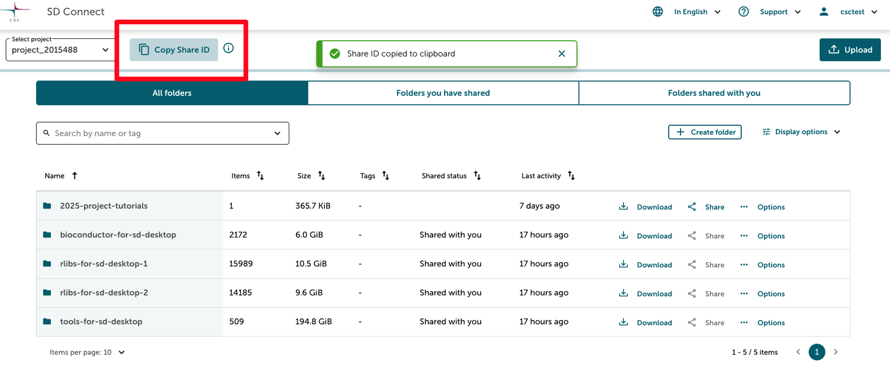
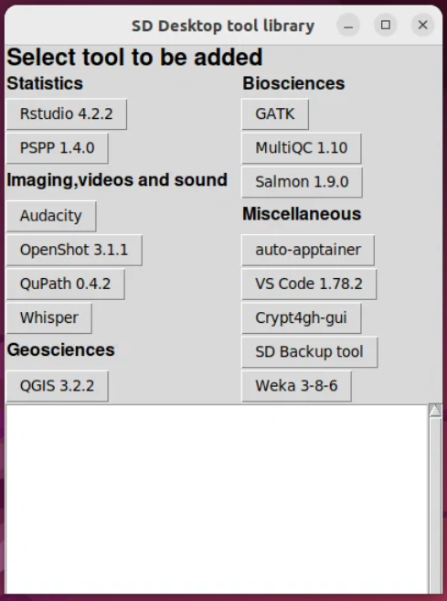

# Customising virtual desktop by adding software & tools for analysis

## Prerequisites

* [Create virtual desktop](sd-desktop-create.md)
* [Access virtual desktop](sd-desktop-access-vm.md)

## Software in virtual desktop

The virtual desktop comes pre-installed with a set of basic tools or software that you can use immediately (listed below). However, this initial toolkit offers a somewhat limited selection of open-source software. To transform the virtual desktop into a versatile research workspace tailored to your specific needs, you can use a simple application called SD Software Installer, this tool assists you in adding software and customizing your virtual desktop. For users with technical expertise, it is also possible to create customised containers using Apptainer or Podman.

Below you can find:

* [Adding software: background information and limitations](sd-desktop-software.md#adding-software-background-information-and-limitations)
* [Customisation via SD Software Installer](sd-desktop-software.md#customisation-via-sd-software-installer) (no previous experience required)
* [Customisation via Apptainer and Podman](sd-desktop-software.md#customisation-via-apptainer-and-podman) (advanced; technical expertise required).

Please don't hesitate to [contact CSC Service Desk](../../support/contact.md) (subject: SD Services) if you have any questions about the software selection. We can support you in your desktop customisation.

## Adding software: background information and limitations

* The virtual desktops (or virtual machines) are intentionally isolated from the internet for security reasons. Consequently, the process of adding supplementary software and libraries is not straightforward.
* SD Desktop supports only open-source software; licensed software is not supported.
* The absence of a network connection precludes the use of conventional installation tools such as *git*, *coda*, *cpan* or *pip* in their typical fashion, as these tools rely on external repositories. Furthermore, users on the SD Desktop do not possess the necessary superuser access to execute operations requiring elevated permissions.
* Adding extra software to SD Desktop is possible, but it involves converting the installation steps into special files. These files are then uploaded to SD Connect and copied to your SD Desktop for installation. For this process, we recommend using Apptainer containers for importing the software you need, but Apptainer is not the only option. You can also import software for example as Appimage files, Ubuntu 22.04 compatible binaries or as source code.

## Customisation via SD Software Installer

SD Software installer provides an easy-to-use tool to add some commonly used software to SD Desktop (Eg. Rstudio 4.5.1, Whisper, VSCode and GATK). SD Software installer is an application provided by CSC. Users can't add their own tools to the SD Software installer, but you can send requests for new tools to be added by [contacting CSC Service Desk](../../support/contact.md) (subject: SD Desktop). To access the application, please follow the step-by-step tutorial below.  

<iframe width="280" height="155" srcdoc="https://www.youtube.com/embed/r--dx6Mgtug" title="How to install software on SD Desktop" frameborder="0" allow="accelerometer; autoplay; clipboard-write; encrypted-media; gyroscope; picture-in-picture; web-share" allowfullscreen></iframe>

### Software available via SD Software Installer

| **Category**           | **Tool** |
|------------------------|----------|
| **Statistics**         | [RStudio 4.5.1](r-in-sd-desktop.md) - R statistics tool with a graphical user interface and help tools for adding libraries.   *After installation, right-click the RStudio desktop icon and select: Allow launching.*|
|                        | [PSPP 2.0.1 ](https://www.gnu.org/software/pspp/) - Open Source alternative for SPSS statistics tool.   *After installation, right-click the PSPP desktop icon and select: Allow launching.*|
|                        | [Octave 9.3.0](https://octave.org/) - Matlab compatible scientific programming language with graphical user interface   *After installation, right-click the Octave desktop icon and select: Allow launching.*|
| **Imaging and Videos** | [Audacity](https://www.audacityteam.org/) - Sound editor.   *After installation, right-click the Audacity desktop icon and select: Allow launching.*|
|                        | [ELAN 6.7](https://archive.mpi.nl/tla/elan/) - Annotation tool for audio and video recordings.   *After installation, right-click the ELAN desktop icon and select: Allow launching.*|
|                        | [OpenShot 3.1.1](https://www.openshot.org/) - Video editor.   *This tool works only in Ubuntu 22-based virtual desktops. After installation, right-click the OpenShot desktop icon and select: Run as a program.*|
|                        | [Praat](https://www.fon.hum.uva.nl/praat/) - Toolkit for speech and sound analysis.|
|                        | [QuPath 0.6.0](https://github.com/qupath/qupath/) - Software for bioimage analysis.|
|                        | [Whisper](./tutorials/whisper.md) - Automatic speech recognition.|
| **Geosciences**        | [QGIS 3.1.1](https://qgis.org/en/site/) - A Free and Open Source Geographic Information System.   *[QGIS at CSC servers](../../apps/qgis.md)*|
| **Biosciences**        | [GATK](https://gatk.broadinstitute.org/hc/en-us) - A genomic analysis toolkit focused on variant discovery.|
|                        | [GCTA 1.94.1](https://yanglab.westlake.edu.cn/software/gcta/#Overview) - A tool for Genome-wide Complex Trait Analysis.|
|                        | [GCTB 2.05b](https://cnsgenomics.com/software/gctb/#Overview) - Genome-wide Complex Trait Bayesian analysis.|
|                        | [IGV 2.16.2](https://igv.org/doc/desktop/) - Integrated Genomics Viewer.   *After installation, right-click the IGV desktop icon and select: Allow launching.*|
|                        | [MultiQC 1.10](https://multiqc.info/) - NGS Read quality checking tool.|
|                        | [PLINK2](https://www.cog-genomics.org/plink/2.0/) - whole genome association analysis toolset.|                   
|                        | [PRSice 2.0](https://choishingwan.github.io/PRSice/) - Polygenic Risk Score software for calculating, applying, evaluating, and plotting the results of polygenic risk scores (PRS) analyses.|
|                        | [Regenie 3.3](https://rgcgithub.github.io/regenie/) - Program for whole genome regression modelling of large genome-wide association studies.|
|                        | [Salmon 1.9.0](https://combine-lab.github.io/salmon/) - Program to produce transcript-level quantification estimates from RNA-seq data.   *[Salmon 1.9.0 at CSC servers](../../apps/salmon.md)*|
| **Miscellaneous**      | **CSC Tools**, includes:  [auto-apptainer](./tutorials/auto-apptainer.md) - Tool to add command line applications using the Apptainer container library provided by CSC.  [backup tool](./tutorials/backup_sd_desktop.md) - Help tool to automate backup and export in SD Desktop.|
|                        | [add-python-lib](./tutorials/sd-pythonlibs.md) - Help tool to add Python libraries.|
|                        | [ARX](https://arx.deidentifier.org/) - Data anonymization tool|
|                        | [Etherpad](https://etherpad.org/) - tool for collaborative editing (requires Podman compatible virtual machine) | 
|                        | [OpenRefine](https://openrefine.org/) - Data pre-prosessing and conversion tool for various data formats.|
|                        | [VS Code 1.90.2](./tutorials/vscode.md) - Code editor.   *After installation, right-click the VS Code desktop icon and select: Allow launching.*|
|                        | [WEKA 3-8-6](https://ml.cms.waikato.ac.nz/weka/index.html) - Data mining software.|

### Step 1: send a request

* Log in to the [SD Connect service](https://sd-connect.csc.fi) and if you haven't used the service before, please upload a small test file to a folder first. Currently, there is a technical issue that affects users who have not yet uploaded any files.
* On the homepage, look for the “Copy Share ID” icon next to the project selection menu. By clicking on it you can  copy your project’s Share ID. This is a unique code of 32 letters and numbers that we’ll use to share the installer application with your project.
      * Example Share ID: 71bbe38a3cd398b48b1f2582dc00297p
* Next, please send an email to [CSC Service Desk](../../support/contact.md) (subject: SD Desktop)  letting  them know you would like access to the Software Installer and including the project  Share ID by pastinng it in the message. Once the Service Desk confirms access, the installer will be available via the SD Desktop service.

    

### Step 2: bring the SD Software Installer on your virtual desktop

* Log in to [SD Desktop service](https://sd-desktop.csc.fi) and access your virtual desktop. Here open the **Data Gateway** application, select SD Connect and enter your CSC username and password. Next click on Open. Do not close the Data Gateway application.
* If the software installation help tools are enabled for your project, then you should have folder `tools-for-sd-desktop` included in the directory that Data Gateway created (in `Projects/SD-Connect/your-project-name`).
* Open `tools-for-sd-desktop` folder and from there, drag/copy file `sd-installer-centos7.desktop` or `sd-installer-ubuntu22.desktop` to your desktop.
Select the version that matches the operating system of your SD Desktop (e.g. Ubuntu).

      
    **Figure 1.** Copying `sd-installer.desktop` file to SD desktop.

* Double-click the copy of the installer tool in your desktop to start the software installation tool. In Ubuntu based virtual desktops you
need to right-click the and select *Allow Launching* before you can use the installer.

      
    **Figure 2.** SD Software installer

### Step 3: install new tools

* In order to use the installer, you must have an active Data Gateway connection running and
mounting of the SD Connect data should be done through the default location in the file system
(*Projects* directory in the users home directory).
* The installer shows a panel of buttons that allow you to install a software by just clicking the button.
The available software include graphical and command line applications. For graphical applications, a launching icon is added
to the desktop. All software is installed to directory `/shared-directory/sd-tools/` where the installation is available for all the
users of the virtual desktop.
* In case of some applications, part of the installation process occurs only when the application is started for the first time.
Thus, you should start the application once after the installation, to make sure that the process is completed. After that
the installed software should work also when Data Gateway connection has not been opened.

### Step 4: installation for project members

All installed tools are stored in the Shared Directory, inside a folder called sd-tools, which is accessible to all project members. However, they don’t automatically appear on each user’s desktop. To make it accessible, project members need to do one quick step — choosing between two options:

#### 4.1 Using the Software Installer

The project member can follow the steps shown earlier: open the Data Gateway, copy the installer to the desktop, launch it, and select the tool needed. The installer will detect the tool in the shared folder, skip setup, and automatically create a desktop icon and update the  terminal.

#### 4.2 Using a terminal command

In this case the Data Gateway connection is not needed.

* Right-click on the desktop and select “Open Terminal”
* Press Ctrl + Alt + Shift to activate copy-paste function
* Choose Text Input
* Copy the command `/shared-directory/sd-dash-tools/bin/use-sd-tools`
* And paste it into the input bar in the lower part of the screen and press Enter

In this case as well, the icon will be added to the desktop and the terminal environment will be updated.

## Customisation via Apptainer and Podman

If you want to add new software to your virtual machine independently, the most convenient way is to build an Apptainer container outside SD Desktop and then import the container through SD Connect to SD Desktop. The two documents below describe two sample cases on adding software with containers.

   1. [Importing ready-made Apptainer containers from a public repository to SD Desktop](./sd-desktop-singularity.md)
   2. [Creating your own Apptainer container and importing it to SD Desktop](./creating_containers.md)

In Ubuntu22-based virtual machines you can use also Podman container manager. One of the benefits of Podman is that it can utilize Docker containers too.

* [Using Podman in SD Desktop](./tutorials/podman-in-sd-desktop.md)

!!! Note
    Please don't hesitate to contact [CSC Service Desk](../../support/contact.md) (subject: Sensitive Data). We can support you in your Desktop customisation.

## Your next steps in this guide

* [Importing data](./sd-desktop-access.md)
* [Exporting data via user interface](./sd-desktop-export.md)
* [Export data programmatically](./sd-desktop-export-commandline.md)
* [Troubleshooting](./sd-desktop-troubleshooting.md)
