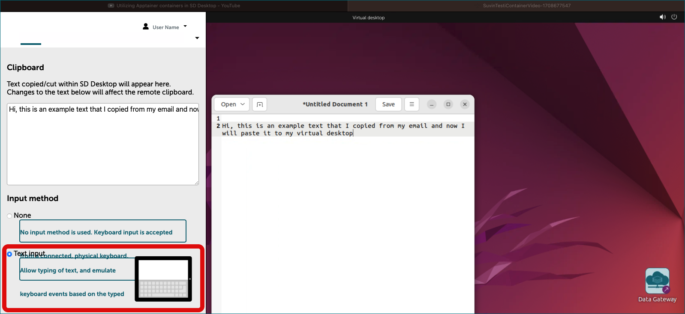

# Työskentely työpöydälläsi: vinkkejä ja perustietoja {#working-with-your-desktop-tips-and-essentials}

## Esivaatimukset {#prerequisites}
* [Luo virtuaalityöpöytä](sd-desktop-create.md)
* [Pääsy virtuaalityöpöydälle](sd-desktop-access-vm.md)

## Työskentely ja yhteistyö virtuaalityöpöydällä {#work-and-collaborate-in-a-virtual-desktop}

Kun virtuaalityöpöytä on luotu, kaikki CSC-projektisi jäsenet voivat käyttää sitä. Kun kirjaudut sisään, siirryt virtuaalitietokoneelle, jossa toimii Linux-käyttöjärjestelmä. Jos olet uusi Linuxin käyttäjä, se voi tuntua hieman erilaiselta kuin muut järjestelmät, kuten Windows tai macOS.

Teknistä kokemusta ei tarvita työskentelyyn, mutta vaikka Windows on suunniteltu heti käyttäjäystävälliseksi, Linuxin käyttö voi vaatia opettelua, erityisesti komentorivin käytön osalta.

Alla oleva opas antaa selkeitä ohjeita, joiden avulla voit tutustua sekä Linuxiin että SD Desktopin tietoturva-asetuksiin:

- [Tietoturvaan liittyvät ominaisuudet ja rajoitukset](sd-desktop-working.md#security-related-features-and-limitations)
- [Johdatus Linuxiin ja virtuaalityöpöytään](sd-desktop-working.md#introduction-to-linux-and-virtual-desktop)
- [Kopioi ja liitä tietokoneeltasi virtuaalityöpöydälle](sd-desktop-working.md#copy-paste-from-your-laptop-to-virtual-desktop)
- [SD Desktopin oletusohjelmat](sd-desktop-working.md#default-software-available-in-sd-desktop)
- [RStudiolle siirtyminen virtuaalityöpöydällä](sd-desktop-working.md#accessing-rstudio-from-virtual-desktop)

## Tietoturvaan liittyvät ominaisuudet ja rajoitukset {#security-related-features-and-limitations}

SD Desktop on turvallinen ympäristö, joka on suunniteltu erityisesti arkaluonteisten tietojen analysointiin, ja jotkin ominaisuudet voivat toimia eri tavalla kuin tavallisessa tietokoneessa. Jokaiselle näistä ominaisuuksista löytyy erillinen vaiheittainen opastus. Jos käytät palvelua ensimmäistä kertaa, oppaiden tarkastelu auttaa sinua ymmärtämään, miten kaikki toimii.

!!! Huom

    - **Eristetty internetistä**: Virtuaalityöpöytäsi on täysin eristetty internetistä. Tämä tarkoittaa, että voit kyllä avata selaimen, kuten Firefoxin, mutta et pääse verkkosivustoille tai verkkovarastoihin suoraan. Tämä ominaisuus auttaa pitämään tietosi turvassa pienentämällä verkon uhkia.

    - **Vain salatut tiedostot**: Ainoastaan salattuihin tiedostoihin pääsee käsiksi virtuaalityöpöydältäsi. Salaamattomat tiedostot eivät näy virtuaalityöpöydällä, ja ne täytyy ensin salata SD Connectilla. Kaikki virtuaalityöpöydältä vietävät tiedostot on myös salattava. Tämä tuo tietojesi suojaukseen ylimääräisen kerroksen.

    - **Valvottu tiedostojen siirto ja vienti Data Gatewayn kautta**: Jokainen projektin jäsen voi tuoda tiedostoja virtuaalityöpöydälle analyysia varten käyttämällä turvallista sovellusta nimeltä [Data Gateway](./sd-desktop-access.md). Tiedostoja voi tuoda vain SD Connectin (suoralla latauksella) tai SD Apply -palvelun kautta (uudelleenkäyttöön hyväksynnän jälkeen). Tietojen vienti on kuitenkin rajoitettu CSC-projektipäällikölle lisäturvan vuoksi.

    - **Rajoitettu tallennustila**: Virtuaalityöpöytä on suunniteltu ensisijaisesti data-analyysiin ja siinä on rajallinen tallennustila. Voit laajentaa tallennustilaa lisäämällä ulkoisen levyn (esim. ulkoinen kovalevy) työpöydän käyttöönoton yhteydessä. Ulkoinen levy on kaikkien projektin jäsenten käytettävissä, ja toimii myös varmuuskopiona tuodulle datalle.

    - **Vain avoimen lähdekoodin ohjelmistot**: Vain avoimen lähdekoodin ohjelmia voi asentaa virtuaalityöpöydälle, koska tällä hetkellä lisensoitujen tai kaupallisten ohjelmistojen asennus ei ole tuettu. Jokaisella virtuaalityöpöydällä on joukko oletusohjelmia valmiiksi asennettuna, mutta voit räätälöidä työpöytää helposti ohjelman kautta tai kehittyneille käyttäjille Apptainerin avulla. Jos tarvitsemaasi ohjelmaa ei ole listattuna alla, [ota yhteyttä CSC Service Deskiin](../../support/contact.md) (aihe: SD Desktop).

    - **Kopioi ja liitä -rajoitukset**: Tietoturvasyistä kopiointi- ja liittämistoiminto omalta tietokoneeltasi SD Desktopille on rajoitettu. Tekstin siirtäminen onnistuu kuitenkin muutamilla lisävaiheilla; ohjeet löydät jäljempää. Nämä rajoitukset varmistavat, ettei luvattomia tietoja siirry tai viedä turvallisesta ympäristöstä.

    - **Jaettu tiedostojen käyttö tiimin jäsenille**: Kaikki tiedostot, jotka on tallennettu jaettuun kansioon tai ulkoiselle levylle, ovat muiden virtuaalityöpöydällä työskentelevien projektijäsenten saatavilla, mikä mahdollistaa turvallisen yhteistyön.

## Johdatus Linuxiin ja virtuaalityöpöytään {#introduction-to-linux-and-virtual-desktop}

<iframe width="280" height="155" srcdoc="https://www.youtube.com/embed/r0S1NNN2eQs" title="YouTube video player" frameborder="0" allow="accelerometer; autoplay; clipboard-write; encrypted-media; gyroscope; picture-in-picture" allowfullscreen></iframe>

Linux on avoimen lähdekoodin käyttöjärjestelmä, mikä tarkoittaa, että sen käyttö on maksutonta ja lähdekoodi on vapaasti tarkasteltavissa ja muokattavissa. Linuxia käytetään usein tutkimuskäytössä sen vakauden, tietoturvan ja joustavuuden ansiosta.

- **Ulkoasu ja käyttö**: Linux voi näyttää hieman erilaiselta kuin Windows, riippuen siitä mikä "työpöytäympäristö" on käytössä. Ei kuitenkaan huolta – se sisältää silti tutut elementit kuten ikkunat, kansiot ja valikot. Päävalikon löydät vasemmasta yläkulmasta, ja sen kautta saat kaikki ohjelmat käyttöösi.

- **Tiedostorakenne**: Linuxissa tiedostojen järjestäminen poikkeaa Windowsin "Omat tiedostot" tai C:/D:-levyjen periaatteesta. Päävalikkopolku alkaa / -merkillä ja omat tiedostot ovat kansiossa /home.

- **Hyödyt**: Linux on erittäin vakaa ja kaatuu harvemmin, joten se sopii erityisen hyvin pitkiin tai raskaisiin laskentatehtäviin.

Alla olevassa kuvassa on esitetty virtuaalityöpöydän perustoiminnot. Klikkaa kuvaa avataksesi se uuteen ikkunaan.

[](https://a3s.fi/docs-files/sensitive-data/SD_Desktop/Desktop_Overview.png){ target="_blank" }

## Kopioi ja liitä tietokoneeltasi virtuaalityöpöydälle {#copy-paste-from-your-laptop-to-virtual-desktop}

Tietokoneesi/läppärisi kopioi ja liitä -toiminto virtuaalityöpöydälle on rajoitettu tietoturvasyistä. Tekstin kopiointi/leikkaaminen onnistuu kuitenkin Clipboard-toiminnon avulla. Kopiointi mahdollista vain yhteen suuntaan: omalta koneeltasi virtuaalityöpöydälle.

### Vaiheittaiset ohjeet {#step-by-step}

1. Mene virtuaalityöpöydälle ja avaa Clipboard näppäinyhdistelmällä **Ctrl+Alt+Shift** ja paina *Paste*.
2. Aktivoi kopioi ja liitä -toiminto valitsemalla syöttötavaksi ***Text input*** (Clipboard-paneeli sulkeutuu automaattisesti valinnan jälkeen).
3. Nyt voit kopioida tekstiä normaalisti tietokoneeltasi (Ctrl+C tai hiiren oikealla).
4. Liitä teksti virtuaalityöpöydän sisälle (Ctrl+V).

    Huom: Älä sulje Clipboard-paneelia komennolla **Cntrl+Alt+Shift**, sillä tämä voi poistaa kopioi ja liitä -toiminnon käytöstä. Huomaa, että kopioi ja liitä -toiminto täytyy aktivoida uudelleen joka kerta, kun käytät virtuaalityöpöytää.

      
    *Clipboardin (Guacamole-työkalut) ulkoasu voi poiketa hieman selaimesta ja käyttöjärjestelmästä riippuen.*

## SD Desktopin oletusohjelmat {#default-software-available-in-sd-desktop}

**Voit käyttää virtuaalityöpöytääsi samalla tavoin kuin tavallista tietokonetta**, pääset valmiiksi asennettuihin ohjelmiin sovellusvalikkopalkista (vasen yläkulma). Esimerkkejä ovat Open Office, kuvankatseluohjelmat, video- ja musiikkisoittimet, Jupyter Notebookit jne. Voit myös avata terminaalin ja käyttää Linuxia komentoriviltä. Lisätietoa R-Studioon siirtymisestä löytyy [alemmalta tältä sivulta](#accessing-rstudio-from-virtual-desktop).

Alla on lueteltu yleisimmin käytettyjä ohjelmia, jotka ovat esiasennettuna virtuaalityöpöydällä. Lista ei ole kattava, ja vaihtoehdoissa on pieniä eroja eri työpöytävalintojen välillä.

| **Kategoria**             | **Ohjelmat**                                                                                                                                                                       |
|---------------------------|------------------------------------------------------------------------------------------------------------------------------------------------------------------------------------|
| **Toimisto-ohjelmat**     | [LibreOffice](https://en.wikipedia.org/wiki/LibreOffice)                                                                                                                           |
| **Ohjelmointi**           | [Go](https://go.dev/) <br> [Python 3](./tutorials/sd-pythonlibs.md) mukaan lukien paketit: tensorflow, nltk, spacy, scikit-learn, seaborn, plotly, bokeh, pydot, xgboost, lightgbm, catboost, eli5, torch, keras, dist-keras, elephas, gensim, scrapy, beautifulsoup4, numpy, scipy, pandas, statsmodels, matplotlib, pyfuse3, crypt4gh, trio, httpx, qrcode |
| **R & RStudio**           | [R / RStudio Server](sd-desktop-working.md#accessing-rstudio-from-virtual-desktop) <br> - Vastaa Puhtin r-env-singularity/4.0.5 -moduulia (R 4.0.5 + RStudio Server 1.4.1106, Bioconductor 3.12) <br> - Yli 1000 esiasennettua R-pakettia (versiot 20.4.2021) <br> - Intel® oneAPI Math Kernel Library (oneMKL) <br> - Paikkatieto-ohjelmat (PROJ, GDAL, SAGA) <br> - CUDA-ajurit <br> - TensorFlow (R TensorFlow backendille) <br> - R + RStudio Server on yhteensopivia Puhti r-env-singularity -moduulin kanssa (R 4.0.5 + RStudio Server 1.4.1106, MRAN, Bioconductor 3.12)                 |
| **Työnkulun moottorit**   | - [Nextflow](https://www.nextflow.io/) <br> - [Snakemake](https://snakemake.readthedocs.io/en/stable/)                                                                                                            |
| **Ohjelmakontit**         | - [Apptainer](https://apptainer.org/) <br> - [Podman](https://podman.io/) (vain Ubuntu-koneilla)                                                                                       |
| **Tieteellinen ohjelmisto** | - [Plink 1.9](https://www.cog-genomics.org/plink/) <br> - [Samtools 1.8](http://www.htslib.org/) <br> - [Minimap2 2.26](https://github.com/lh3/minimap2)                                                    |
| **Terminaalit & käyttöliittymät** | - [Byobu](https://www.byobu.org/) (vain Ubuntu-koneissa.) <br> - [Jupyter](https://jupyter.org/)                                                      |

## RStudiolle siirtyminen virtuaalityöpöydällä {#accessing-rstudio-from-virtual-desktop}

Laskentaympäristö eli virtuaalityöpöytä (näkyvissä selaimessa) on eristetty internetistä. Esimerkiksi voit avata Firefox-selaimen virtuaalityöpöydälläsi, mutta et pääse millekään verkkosivulle. Tällä hetkellä et myöskään pääse suoraan ohjelmistovarastoihin. R Studion avaamiseen analyysiä varten toimi seuraavasti:

1. Avaa terminaali.

2. Käynnistä RStudio komennolla:

    ```text
    start-rstudio-server
    ```


* Tämä palauttaa URL-osoitteen ja palvelukohtaisen salasanan:

    ```text
    RStudio Server - Sensitive Data Desktop Edition
    ---------------------------------------------------------------------------------------
    Copy/Paste this URL into Firefox:

    http://localhost:8787/

    -----------------------------------------------------------------------------------------
    Enter these at the RStudio Server sign-in screen
    ----------------------------------------------------------------------------------------
    Username: accountname  Password: Example23241232
    ----------------------------------------------------------------------------------------
    To stop RStudio Server: Ctrl+C
    ```

3.  Kopioi URL ja liitä se Firefoxiin avataksesi R-Studio-kirjautumissivun.
4. Kirjaudu sisään käyttäjätunnuksellasi ja salasanallasi.

!!! Huom
    Vain ulkoiselle levylle tallennetut tiedostot ovat muiden RStudioa käyttävien projektin jäsenten saatavilla.


## Seuraavat askeleesi tässä oppaassa {#your-next-steps-in-this-guide}

* [Räätälöinti – ohjelmistot ja työkalut](./sd-desktop-software.md)
* [Datan tuonti](./sd-desktop-access.md)
* [Datan vienti käyttöliittymän kautta](./sd-desktop-export.md)
* [Datan vienti ohjelmallisesti](./sd-desktop-export-commandline.md)
* [Vianetsintä](./sd-desktop-troubleshooting.md)