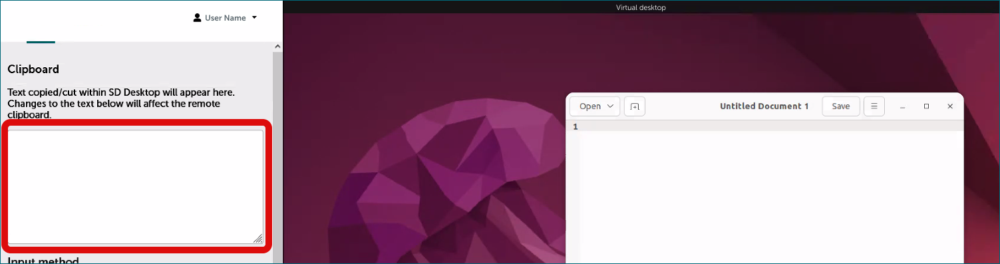

[Table of contents of user guide :material-arrow-right:](sd-services-toc.md)

# Working with your Desktop: tips and essentials

## Prerequisites
* [Create virtual desktop](sd-desktop-create.md)
* [Access virtual desktop](sd-desktop-access-vm.md)

## Work and collaborate in a virtual desktop

Once a virtual desktop has been created, all members of your CSC project can access it. When you log in, you will enter a virtual computer running on a Linux operating system. If you are new to Linux, it might feel a little different from other systems like Windows or macOS.

No technical experience is required to work with it, but while Windows is designed to be user-friendly from the start, Linux can have a learning curve, especially if you need to use the command line. 

The guide below provides clear instructions to help you get comfortable with both Linux and the SD Desktop’s security setup:

- [Security-related features and limitations](sd-desktop-working.md#security-related-features-and-limitations)
- [Introduction to Linux and virtual desktop](sd-desktop-working.md#introduction-to-linux-and-virtual-desktop)
- [Copy-paste from your laptop to virtual desktop](sd-desktop-working.md#copy-paste-from-your-laptop-to-virtual-desktop)
- [Default software available in SD Desktop](sd-desktop-working.md#default-software-available-in-sd-desktop)

## Security-related features and limitations

SD Desktop is a secure environment designed specifically for analysing sensitive data and some features may work differently than a regular computer. For each of these features, a specific step-by-step guide is available. If you are using the service for the first time, reviewing these guides will help you become familiar with how everything works.

!!! Note

    - **Isolated from the internet**: your virtual desktop is completely isolated from the internet. This means that although you can open a web browser like Firefox, you will not be able to access websites or online repositories directly. This feature helps keep your data safe by reducing the risk of online threats.

    - **Encrypted file only**: Only encrypted files are accessible from your virtual desktop. This means unencrypted files will not appear in your virtual desktop and you will first need to encrypt them using SD Connect. All files exported from the virtual desktop also need to be encrypted. This adds an extra layer of protection for your data.
    
    - **Controlled file access and export with Data Gateway**: Each project member can import files to the virtual desktop for analysis by using a  secure application called [Data Gateway](./sd-desktop-access.md). Files can be imported only via the SD Connect (directly, by upload) or SD Apply service (upon approval for reuse). Data export, however, is limited to the CSC Project Manager for additional security.
  
    - **Limited storage space**: The virtual desktop is designed primarily for data analysis and has limited storage space. To expand storage, you can add an external volume (such as an external hard drive) during the desktop setup. This external volume is accessible to all project members and also serves as a backup for imported data.
  
    - **Open source software only**: Only open-source software can be installed in the virtual desktop, as it does not currently support licensed or proprietary software. Each virtual desktop comes with a default set of pre-installed software, but you can customise it further using an easy-to-use application or, for advanced users, through Apptainer. If the software you need is not listed below, please [contact CSC Service Desk](../../support/contact.md) for support (subject: SD Desktop).
  
    - **Copy-paste restrictions**: For security reasons, copy-pasting from your own computer to SD Desktop is limited. You can still transfer text with a few extra steps, as explained in the copy-paste instructions below. These restrictions ensure that no unauthorized data is copied or exported from the secure environment.
  
    - **Shared file access for team members**: Any files saved in the shared-directory or on the external volume can be accessed by other project members working in the virtual desktop, allowing safe collaboration.

## Introduction to Linux and virtual desktop

<iframe width="280" height="155" srcdoc="https://www.youtube.com/embed/r0S1NNN2eQs" title="YouTube video player" frameborder="0" allow="accelerometer; autoplay; clipboard-write; encrypted-media; gyroscope; picture-in-picture" allowfullscreen></iframe>

Linux is an open-source operating system, meaning it is free to use, and its code is openly available for people to view and modify. It's commonly used in many research applications due to its stability, security, and flexibility.

- **Look and feel**: Linux may look slightly different from Windows, depending on the “desktop environment” used. But don’t worry – it still has familiar elements like windows folders and menus. You will find the main menu at the top left corner, where you can access all available software.
  
- **File structure**: Instead of “My Documents” or drives labeled C: or D:, Linux has a different way of organising files. The main directory starts with /, and you’ll see folders like /home for your personal files.
  
- **Benefits**: Linux is very stable and less likely to crash, making it ideal for long or intensive computing tasks.

Below is an image showing the basic functions of a virtual desktop. Click the image to open it in a new window.

{ target="_blank" }

## Copy-paste from your laptop to virtual desktop

The copy-paste function from your computer/laptop to your virtual desktop is limited for security reasons. However it is possible to copy-paste text with Clipboard. Copy-paste works only in one direction: from your computer to virtual desktop.

### Step by step

1. Go to virtual desktop and open the Clipboard with a key combination **Ctrl+Alt+Shift** and click *Paste*.
2. Activate the copy-paste function by selecting input method ***Text input*** (the Clipboard panel will close automatically after the selection).
3. Now you can copy text normally from your computer (Ctrl+C or mouse right click).
4. Paste the text inside your virtual desktop (Ctrl+V).

    Note: Don't close Clipboard panel with **Cntrl+Alt+Shift**, this might disable the copy-paste function. Please note you have to activate the copy-paste function again every time you use your virtual desktop.

      
    *Appearance of the Clipboard (Guacamole tools) may vary a bit depending on browser and local operating system.*

## Default software available in SD Desktop

**You can work with your virtual desktop like with a standard computer**, accessing several pre-installed programs from the applications menu bar (top left corner). Examples include Open Office, image-viewing applications, video and audio players, Jupyter Notebooks etc. You can also open a terminal and use Linux from the command line. 

Below we list some of the most commonly used tools that are by default installed in the virtual desktop. The list is not complete and there are small differences between different desktop options. 

If you want to install software that is not included by default (for example, RStudio), you can use the SD-Software Installer. This simple application provides a list of additional software and guides you through the installation process, no technical expertise required. To learn how, please follow the next guide: [Customisation - software & tools](./sd-desktop-software.md) For more advanced users, it's also possible to install other tools using containerized applications with Aptainer or Podman.

| **Category**              | **Software**                                                                                                                                                                       |
|---------------------------|------------------------------------------------------------------------------------------------------------------------------------------------------------------------------------|
| **Office Tools**          | [LibreOffice](https://en.wikipedia.org/wiki/LibreOffice)                                                                                                                         |
| **Programming**           | [Go](https://go.dev/)   [Python 3](./tutorials/sd-pythonlibs.md) including packages: tensorflow, nltk, spacy, scikit-learn, seaborn, plotly, bokeh, pydot, xgboost, lightgbm, catboost, eli5, torch, keras, dist-keras, elephas, gensim, scrapy, beautifulsoup4, numpy, scipy, pandas, statsmodels, matplotlib, pyfuse3, crypt4gh, trio, httpx, qrcode |
| **R & RStudio**           | [R / RStudio Server](sd-desktop-working.md#accessing-rstudio-from-virtual-desktop)   - Matching the r-env-singularity/4.0.5 module on Puhti (R 4.0.5 + RStudio Server 1.4.1106, Bioconductor 3.12)   - 1000+ pre-installed R packages (versions available on Apr 20, 2021)   - Intel® oneAPI Math Kernel Library (oneMKL)   - GIS software (PROJ, GDAL, SAGA)   - CUDA drivers   - TensorFlow (used with R TensorFlow back-end)   - R + RStudio Server versions matched with Puhti r-env-singularity module (R 4.0.5 + RStudio Server 1.4.1106, MRAN, Bioconductor 3.12)                 |
| **Workflow Engines**      | - [Nextflow](https://www.nextflow.io/)   - [Snakemake](https://snakemake.readthedocs.io/en/stable/)                                                                                                                                                |
| **Software Containers**    | - [Apptainer](https://apptainer.org/)   - [Podman](https://podman.io/) (Only in Ubuntu machines)                                                                                                                             |
| **Scientific Software**    | - [Plink 1.9](https://www.cog-genomics.org/plink/)   - [Samtools 1.8](http://www.htslib.org/)   - [Minimap2 2.26](https://github.com/lh3/minimap2)                                                                                                                          |
| **Terminals & Interfaces** | - [Byobu](https://www.byobu.org/) (Only in Ubuntu machines.)   - [Jupyter](https://jupyter.org/)                                                                                                                         |

## Accessing RStudio from virtual desktop

For a step by step guide, see: [Installing RStudio via SD-Software Installer](.sensitive-data/r-in-sd-desktop)

## Your next steps in this guide

* [Customisation - software & tools](./sd-desktop-software.md)
* [Importing data ](./sd-desktop-access.md)
* [Exporting data  via user interface](./sd-desktop-export.md)
* [Export data programmatically](./sd-desktop-export-commandline.md)
* [Troubleshooting](./sd-desktop-troubleshooting.md)

