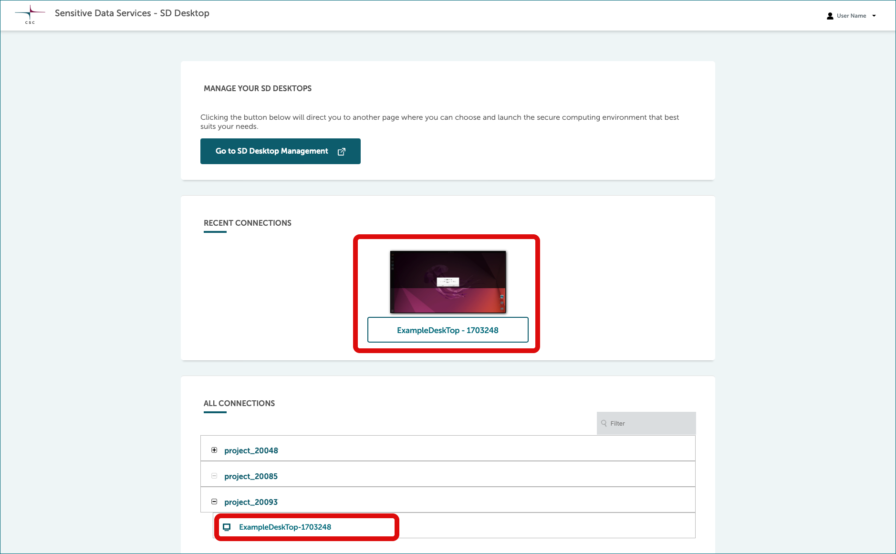

# Working with your Desktop: tips and essentials

Once a virtual desktop has been created, each CSC project member can access it through their browser. When you log in, you will enter a virtual computer running
on a Linux operating system. If you’re new to Linux, it might feel a little different from other systems like Windows or macOS.

No technical experience is required to work with it, but while Windows is designed to be user-friendly from the start, Linux can have a learning curve, especially if you need to use the command line. In addition, SD Desktop has extra security features that you’ll need to familiarize yourself with for smooth use.

The guide below provides clear instructions to help you get comfortable with both Linux and the SD Desktop’s security setup:

- [Introduction to Linux](sd-desktop-working.md#introduction-to-linux)
- [Security-related features](sd-desktop-working.md#security-related-features)
- [Accessing the secure environment](sd-desktop-working.md#accessing-the-secure-environment)
- [Copy-paste from your laptop to virtual desktop](sd-desktop-working.md#copy-paste-from-your-laptop-to-virtual-desktop)
- [Default software available in SD Desktop](sd-desktop-working.md#default-software-available-in-sd-desktop)
- [Accessing RStudio](sd-desktop-working.md#accessing-rstudio)

## Introduction to Linux

Linux is an open-source operating system, meaning it’s free to use, and its code is openly available for people to view and modify.
It's commonly used in many research applications due to its stability, security, and flexibility.

- **Look and feel**: Linux may look slightly different from Windows, depending on the “desktop environment” used. But don’t worry – it still has familiar elements like windows folders and menus. You will find the main menu at the top left corner, where you can access all available software.
- **File structure**: Instead of “My Documents” or drives labeled C: or D:, Linux has a different way of organizing files. The main directory starts with /, and you’ll see folders like /home for your personal files.
- **Benefits**: Linux is built with security in mind, helping to keep your work safe and private. It is very stable and less likely to crash, making it ideal for long or intensive computing tasks.

## Security-related features

SD Desktop is a secure environment designed specifically for analysing sensitive data. To protect this data, SD Desktop has certain features that may work differently than a regular computer. These security features ensure that your data stays safe, even when working with sensitive information. Here’s what you need to know about these features and how they affect your workflow.

For each of these features, a specific step-by-step guide is available. If you are using the service for the first time, reviewing these guides will help you become familiar with how everything works.

- **Isolated from the internet**: your virtual desktop is completely isolated from the internet. This means that although you can open a web browser like Firefox, you will not be able to access websites or online repositories directly. This feature helps keep your data safe by reducing the risk of online threats.
- **Encrypted file only**: Only encrypted files are accessible from your virtual desktop. This means unencrypted files will not appear in your virtual desktop and you will first need to encrypt them using SD Connect. All files exported from the virtual desktop also need to be encrypted. This adds an extra layer of protection for your data.
- **Controlled file access and export with Data Gateway**: Each project member can import files to the virtual desktop for analysis by using a  secure application called [Data Gateway](./sd-desktop-access.md). Files can be imported only via the SD Connect (directly, by upload) or SD Apply service (upon approval for reuse). Data export, however, is limited to the CSC Project Manager for additional security.
- **Limited storage space**: The virtual desktop is designed primarily for data analysis and has limited storage space. To expand storage, you can add an external volume (such as an external hard drive) during the desktop setup. This external volume is accessible to all project members and also serves as a backup for imported data.
- **Open source software only**: Only open-source software can be installed in the virtual desktop, as it does not currently support licensed or proprietary software. Each virtual desktop comes with a default set of pre-installed software, but you can customise it further using an easy-to-use application or, for advanced users, through Apptainer. If the software you need is not listed below, please [contact CSC Service Desk](../../support/contact.md) for support (subject: SD Desktop).
- **Copy-paste restrictions**: For security reasons, copy-pasting from your own computer to SD Desktop is limited. You can still transfer text with a few extra steps, as explained in the copy-paste instructions below. These restrictions ensure that no unauthorized data is copied or exported from the secure environment.
- **Shared file access for team members**: Any files saved in the shared-directory or on the external volume can be accessed by other project members working in
the virtual desktop, allowing safe collaboration.

## Accessing the secure environment

### Connecting to your desktop

1. After [login](./sd-desktop-login.md), you will see all your virtual desktops listed at the front page, under *All connections*.

2. Select project (e.g. `project_NNNNN`) and click the plus-sign.
  
3. Now you can see all desktops that belongs to this project (`desktopname-NNNNNNNNNN`). Access virtual desktop by clicking the name.

When you open the connection, a virtual computing environment will open in your browser. If you are accessing the virtual desktop for the first time, you will see the panel getting started, from which you can, for example, adjust the screen resolution.

### Disconnecting from the virtual desktop

1. In the workspace view, top right corner of the browser, select your *username* and *log out*.
2. In the new window, click on *Home*.
    - This will close all applications and disconnect the work session. You can access the same desktop anytime after logging in to the services.
3. **Reconnecting to an analysis session**:
    - Closing the browser window: If you started the analysis programmatically (e.g., by running a script), you can safely close the browser window without interrupting the ongoing processes. Your tools and interfaces will remain open when you reconnect to your desktop, allowing you to continue working.
    - Reconnecting to an old session: You can reconnect to a previous session only if the browser window is exactly the same size as when the original session was in use. This is typically only possible if you're using the SD Desktop in full-screen mode on the same machine. If the window size has changed, you will most likely be unable to reconnect to the old session.

        

## Copy-paste from your laptop to virtual desktop

The copy-paste function from your computer/laptop to your virtual desktop is limited for security reasons. However it is possible to copy-paste text with Clipboard. Copy-paste works only in one direction: from your computer to virtual desktop.

### Step by step

1. Go to virtual desktop and open the Clipboard with a key combination **Ctrl+Alt+Shift** and click *Paste*.
2. Activate the copy-paste function by selecting input method ***Text input*** (the Clipboard panel will close automatically after the selection).
3. Now you can copy text normally from your computer (Ctrl+C or mouse right click).
4. Paste the text inside your virtual desktop (Ctrl+V).

    Note: Don't close Clipboard panel with **Cntrl+Alt+Shift**, this might disable the copy-paste function. Please note you have to activate the copy-paste function again every time you use your virtual desktop.

      
    *Appearance of the Clipboard (Guacamole tools) may vary a bit depending on browser and local operating system.*

## Default software available in SD Desktop

**You can work with your virtual desktop like with a standard computer**, accessing several pre-installed programs from the applications menu bar (top left corner). Examples include Open Office, image-viewing applications, video and audio players, Jupyter Notebooks etc. You can also open a terminal and use Linux from the command line. For more information on accessing R-Studio, please [check the paragraph below](#accessing-rstudio).

Below we list some of the most commonly used tools that are by default installed in the virtual desktop. The list is not complete and there are small differences between different desktop options.

| **Category**              | **Software**                                                                                                                                                                       |
|---------------------------|------------------------------------------------------------------------------------------------------------------------------------------------------------------------------------|
| **Office Tools**          | [LibreOffice](https://en.wikipedia.org/wiki/LibreOffice)                                                                                                                         |
| **Programming**           | [Go](https://go.dev/) <br> [Python 3](./tutorials/sd-pythonlibs.md) including packages: tensorflow, nltk, spacy, scikit-learn, seaborn, plotly, bokeh, pydot, xgboost, lightgbm, catboost, eli5, torch, keras, dist-keras, elephas, gensim, scrapy, beautifulsoup4, numpy, scipy, pandas, statsmodels, matplotlib, pyfuse3, crypt4gh, trio, httpx, qrcode |
| **R & RStudio**           | [R / RStudio Server](sd-desktop-working.md#accessing-rstudio) <br> - Matching the r-env-singularity/4.0.5 module on Puhti (R 4.0.5 + RStudio Server 1.4.1106, Bioconductor 3.12) <br> - 1000+ pre-installed R packages (versions available on Apr 20, 2021) <br> - Intel® oneAPI Math Kernel Library (oneMKL) <br> - GIS software (PROJ, GDAL, SAGA) <br> - CUDA drivers <br> - TensorFlow (used with R TensorFlow back-end) <br> - R + RStudio Server versions matched with Puhti r-env-singularity module (R 4.0.5 + RStudio Server 1.4.1106, MRAN, Bioconductor 3.12)                 |
| **Workflow Engines**      | - [Nextflow](https://www.nextflow.io/) <br> - [Snakemake](https://snakemake.readthedocs.io/en/stable/)                                                                                                                                                |
| **Software Containers**    | - [Apptainer](https://apptainer.org/) <br> - [Podman](https://podman.io/) (Only in Ubuntu machines)                                                                                                                             |
| **Scientific Software**    | - [Plink 1.9](https://www.cog-genomics.org/plink/) <br> - [Samtools 1.8](http://www.htslib.org/) <br> - [Minimap2 2.26](https://github.com/lh3/minimap2)                                                                                                                          |
| **Terminals & Interfaces** | - [Byobu](https://www.byobu.org/) (Only in Ubuntu machines.) <br> - [Jupyter](https://jupyter.org/)                                                                                                                         |

### Accessing RStudio

The computing environment i.e. virtual desktop (visible from your browser) is isolated from the internet. For example, you can open a Firefox web browser in your virtual desktop but not access any site online. At this moment, you will also not be able to access any repositories directly. To open R Studio for data analysis the following steps are required:

1. Open the terminal and launch RStudio with:

    ```text
    start-rstudio-server
    ```

2. This will return a URL and a service-specific password:

    ```text
    RStudio Server - Sensitive Data Desktop Edition
    ---------------------------------------------------------------------------------------
    Copy/Paste this URL into Firefox:

    http://localhost:8787/

    -----------------------------------------------------------------------------------------
    Enter these at the RStudio Server sign-in screen
    ----------------------------------------------------------------------------------------
    Username: accountname  Password: Example23241232
    ----------------------------------------------------------------------------------------
    To stop RStudio Server: Ctrl+C
    ```

3. Next:
    - paste the URL in Firefox
    - after a few seconds, you can input the username and password (service-specific) and access the server.

!!! Note
    Only files saved in the external volume are accessible to other project members using RStudio.

[](images/desktop/desktop-rstudio.png)

Read next:

- [How to import data for analysis in your desktop](./sd-desktop-access.md)
- [Customisation: adding software](./sd-desktop-software.md)
- [How to manage your virtual desktop (delete, pause, detach volume etc.)](./sd-desktop-manage.md)
