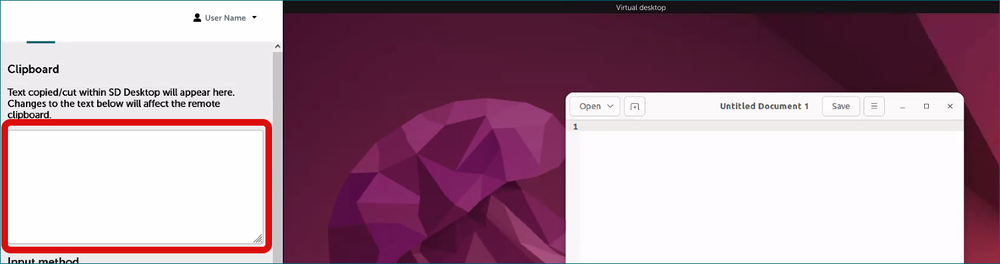

[Table of contents of user guide :material-arrow-right:](sd-services-toc.md)

# Working with your Desktop: tips and essentials

## Prerequisites
* [Create virtual desktop](sd-desktop-create.md)
* [Access virtual desktop](sd-desktop-access-vm.md)

## Work and collaborate in a virtual desktop

Once a virtual desktop has been created, all members of your CSC project can access it. When you log in, you will enter a virtual computer running on a Linux operating system. If you are new to Linux, it might feel a little different from other systems like Windows or macOS.

No technical experience is required to work with it, but while Windows is designed to be user-friendly from the start, Linux can have a learning curve, especially if you need to use the command line. 

The guide below provides clear instructions to help you get comfortable with both Linux and the SD Desktop’s security setup:

- [Introduction to Linux and virtual desktop](sd-desktop-working.md#introduction-to-linux-and-virtual-desktop)
- [Storage locations in SD Desktop (Important!)](sd-desktop-working.md#storage-locations-in-sd-desktop-important)
- [Virtual desktop resolution](sd-desktop-working.md#virtual-desktop-resolution)
- [Copy-paste from your laptop to virtual desktop](sd-desktop-working.md#copy-paste-from-your-laptop-to-virtual-desktop)
- [Security-related features and limitations](sd-desktop-working.md#security-related-features-and-limitations)
- [Default software available in SD Desktop](sd-desktop-working.md#default-software-available-in-sd-desktop)

## Introduction to Linux and virtual desktop

<iframe width="280" height="155" srcdoc="https://www.youtube.com/embed/r0S1NNN2eQs" title="YouTube video player" frameborder="0" allow="accelerometer; autoplay; clipboard-write; encrypted-media; gyroscope; picture-in-picture" allowfullscreen></iframe>

Linux is another type of operating system, similar to Windows or macOS, but often used in research because it is stable and secure.

Linux may look a bit different from Windows, but you will still find familiar things such as folders, files, and menus. In SD Desktop, the main menu is in the top-left corner, where you can open all available applications. Instead of drives like C: or D:, Linux uses a simple folder structure that starts with /. Linux is reliable and rarely crashes, making it a great choice for long‑running or data‑intensive tasks.

## Storage locations in SD Desktop (Important!)

When you log in to the virtual desktop (Linux Ubuntu operating system), you will see several icons on the left navigation bar, this include several storage locations. Each one works differently, so it’s important to know where to save your research data.

- **Files folder/ Home directory**: the file or Home folder is the internal storage of your virtual desktop—similar to the built‑in disk of a laptop. Only you can see and access files stored here. If the virtual desktop is deleted or crashes, everything in Home will be permanently lost. **Avoid saving large files here, as they can fill up the virtual desktop’s disk and make it unusable.**

- **Data Gateway application**: lets you import datasets into the virtual desktop, export results, or access tools to customize the environment.
For Secondary Use CSC projects, Data Gateway connects to data stored in SD Apply. For CSC Academic projects, it connects to SD Connect. When you copy data through Data Gateway into the virtual desktop, it creates a decrypted working copy. This copy should always be saved inside the external volume (see below).

- **Volume**: the Volume is an external storage space attached to the virtual desktop, similar to a removable drive (like a USB stick). It is shared with all members of your project. Use the Volume to store a copy of working copy of datasets you  are analysing, results, scripts and notebooks, any important files you don’t want to lose. If the virtual desktop crashes or runs out of disk space, your data in the volume remains safe. You can easily move the volume to a new virtual desktop after a service upgrade or if the virtual desktop becomes unusable.

- **Shared directory**: small shared folder visible to all project members. It should be used only for temporary transfers or exchanging small files.

Below is an image showing the basic functions of a virtual desktop. Click the image to open it in a new window.

## Virtual desktop resolution

If you switch between different laptops or use external monitors, the virtual desktop may not always display correctly. In those cases, adjusting the screen resolution can quickly restore a usable view.

Open the system menu in the top‑right corner.
Click the gear icon to open Settings.
In the left sidebar, select Displays.
Under Resolution, open the dropdown menu.
Choose the resolution you prefer.
Click Apply.
Select Keep Changes, or simply wait for the system to revert automatically if the setting is not supported.

If you switch between different laptops or use external monitors, the virtual desktop may not always display correctly. In those cases, adjusting the screen resolution can quickly restore a usable view:

1. Open the system menu in the top‑right corner.

2. Click the gear icon to open Settings.

3. In the left sidebar, select Displays.

4. Under Resolution, open the dropdown menu and choose the resolution you prefer.

5. Click Apply and select Keep Changes, or simply wait for the system to revert automatically if the setting is not supported.

## Copy-paste from your laptop to virtual desktop

The copy-paste function from your computer/laptop to your virtual desktop is limited for security reasons. However it is possible to copy-paste text with Clipboard. Copy-paste works only in one direction: from your computer to virtual desktop.

### Step by step

1. Open the virtual desktop and press **Ctrl + Alt + Shift** to open the **Clipboard panel.** 
2. Select **Text input** to enable copy-paste. Clipboard panel will close automatically. Do not close the Clipboard panel with Ctrl + Alt + Shift, as this may disable copy-paste.
3. You can now copy text from your computer (**Ctrl + C or right-click)** and paste it in the virtual desktop (**Ctrl + V or right click**). 

!!! Note
    You need to enable the copy-paste function each time you start a virtual desktop session.

  
*Appearance of the Clipboard (Guacamole tools) may vary a bit depending on browser and local operating system.*

## Security-related features and limitations

SD Desktop is a secure environment designed specifically for analysing sensitive data and some features may work differently than a regular computer. For each of these features, a specific step-by-step guide is available. If you are using the service for the first time, reviewing these guides will help you become familiar with how everything works.

!!! Note

    - **Isolated from the internet**: your virtual desktop is completely isolated from the internet. This means that although you can open a web browser like Firefox, you will not be able to access websites or online repositories directly. This feature helps keep your data safe by reducing the risk of online threats.

    - **Encrypted file only**: Only encrypted files are accessible from your virtual desktop. This means unencrypted files will not appear in your virtual desktop and you will first need to encrypt them using SD Connect. All files exported from the virtual desktop also need to be encrypted. This adds an extra layer of protection for your data.
    
    - **Controlled file access and export with Data Gateway**: Each project member can import files to the virtual desktop for analysis by using a secure application called [Data Gateway](./sd-desktop-access.md). Files can be imported only via the SD Connect (directly, by upload) or SD Apply service (upon approval for reuse). Data export, however, is limited to the CSC Project Manager for additional security.
  
    - **Limited storage space**: The virtual desktop is designed primarily for data analysis and has limited storage space. To expand storage, you can add an external volume (you can compare this to an USB stick) during the desktop setup. This external volume is accessible to all project members and also serves as a backup for imported data.
  
    - **Open source software only**: Only open-source software can be installed in the virtual desktop, as it does not currently support licensed or proprietary software. Each virtual desktop comes with a default set of pre-installed software, but you can customise it further using an easy-to-use application or, for advanced users, through Apptainer. If the software you need is not listed below, please [contact CSC Service Desk](../../support/contact.md) for support (subject: SD Desktop).
  
    - **Copy-paste restrictions**: For security reasons, copy-pasting from your own computer to SD Desktop is limited. You can still transfer text with a few extra steps, as explained in the copy-paste instructions below. These restrictions ensure that no unauthorized data is copied or exported from the secure environment.
  
    - **Shared file access for team members**: Any files saved in the shared-directory or on the external volume can be accessed by other project members working in the virtual desktop, allowing safe collaboration.

## Default software available in SD Desktop

You can use the virtual desktop like a regular computer, with access to pre‑installed tools such as office apps, image viewers, media players, and Jupyter Notebooks. A terminal is also available for command‑line work. Below is a selection of the most commonly included tools (the exact list may vary by desktop option).

To install additional software (for example, RStudio) you can use the SD‑Software Installer, a simple application that provides a list of additional software and guides you through the installation process, no technical expertise required.To learn how, please follow the next guide: [Customisation - software & tools](./sd-desktop-software.md) 

Users who prefer command‑line installation can also install software using containerized applications with Aptainer or Podman.

| **Category**              | **Software**                                                                                                                                                                       |
|---------------------------|------------------------------------------------------------------------------------------------------------------------------------------------------------------------------------|
| **Office Tools**          | [LibreOffice](https://en.wikipedia.org/wiki/LibreOffice)                                                                                                                         |
| **Programming**           | [Go](https://go.dev/)   [Python 3](./tutorials/sd-pythonlibs.md) including packages: tensorflow, nltk, spacy, scikit-learn, seaborn, plotly, bokeh, pydot, xgboost, lightgbm, catboost, eli5, torch, keras, dist-keras, elephas, gensim, scrapy, beautifulsoup4, numpy, scipy, pandas, statsmodels, matplotlib, pyfuse3, crypt4gh, trio, httpx, qrcode |

| **Workflow Engines**      | - [Nextflow](https://www.nextflow.io/)   - [Snakemake](https://snakemake.readthedocs.io/en/stable/)                                                                                                                                                |
| **Software Containers**    | - [Apptainer](https://apptainer.org/)   - [Podman](https://podman.io/) (Only in Ubuntu machines)                                                                                                                             |
| **Scientific Software**    | - [Plink 1.9](https://www.cog-genomics.org/plink/)   - [Samtools 1.8](http://www.htslib.org/)   - [Minimap2 2.26](https://github.com/lh3/minimap2)                                                                                                                          |
| **Terminals & Interfaces** | - [Byobu](https://www.byobu.org/) (Only in Ubuntu machines.)   - [Jupyter](https://jupyter.org/)                                                                                                                         |

## Your next steps in this guide

* [Customisation - software & tools](./sd-desktop-software.md)
* [Importing data ](./sd-desktop-access.md)
* [Exporting data  via user interface](./sd-desktop-export.md)
* [Export data programmatically](./sd-desktop-export-commandline.md)
* [Troubleshooting](./sd-desktop-troubleshooting.md)

